# 📚 Data Structures & Algorithms (DSA) Master Wiki

> [!NOTE]
> คลังความรู้นี้ถูกจัดทำขึ้นสำหรับการศึกษาวิจัยและการเตรียมตัวสอบวิชา **Data Structures & Algorithms in Python** อย่างลึกซึ้ง อ้างอิงจากสไลด์การสอน โค้ดตัวอย่าง และแนวข้อสอบจริง ครอบคลุมตั้งแต่พื้นฐาน OOP, Linear Data Structures, Trees, Binary Search Trees, Heaps, Hashing, Sorting ไปจนถึง Graph Algorithms

---

## 🗺️ DSA Knowledge Map (แผนผังเชื่อมโยงเนื้อหา)

```mermaid
graph TD
    Root["📚 Data Structures & Algorithms (DSA)"] --> M1["01 - Foundations & Python OOP"]
    Root --> M2["02 - Linear Data Structures"]
    Root --> M3["03 - Hierarchical Structures (Trees)"]
    Root --> M4["04 - Priority Queues & Hashing"]
    Root --> M5["05 - Sorting & Graph Algorithms"]
    Root --> M6["06 - Exam Preparation & Coding"]

    M1 --> M1_1["[[01.1 - Introduction to Data Structures & Algorithm Analysis]]"]
    M1 --> M1_2["[[01.2 - Python Review & Object-Oriented Programming (OOP)]]"]

    M2 --> M2_1["[[02.1 - Linked Lists (Singly, Doubly, Circular)]]"]
    M2 --> M2_2["[[02.2 - Stacks & Applications (Infix, Postfix, Parentheses)]]"]
    M2 --> M2_3["[[02.3 - Queues & Circular Array Queues]]"]

    M3 --> M3_1["[[03.1 - Tree Terminology & Binary Trees]]"]
    M3 --> M3_2["[[03.2 - Binary Search Trees (BST) & Insertion]]"]
    M3 --> M3_3["[[03.3 - Binary Search Tree Removal (Node Deletion Cases)]]"]

    M4 --> M4_1["[[04.1 - Priority Queue & Binary Heaps (Min-Heap, Max-Heap)]]"]
    M4 --> M4_2["[[04.2 - Hash Tables & Collision Resolution Strategies]]"]

    M5 --> M5_1["[[05.1 - Sorting Algorithms (Bubble, Selection, Insertion, Merge, Quick)]]"]
    M5 --> M5_2["[[05.2 - Graph Fundamentals & Traversals (BFS, DFS, Topological Sort)]]"]
    M5 --> M5_3["[[05.3 - Shortest Path Algorithms (Dijkstra, Unweighted Shortest Path)]]"]

    M6 --> M6_1["[[06.1 - Comprehensive Exam Questions, Tracing & Python Solutions]]"]
```

---

## 📚 รายละเอียดโครงสร้างหมวดหมู่ใน Obsidian Wiki

### 🏛️ Module 01: Foundations & Python OOP (พื้นฐานและการเขียนโปรแกรมเชิงวัตถุ)
- [[01.1 - Introduction to Data Structures & Algorithm Analysis]]: ความหมายของ Data Structure, ADT, และการวิเคราะห์ความเร็ว Big-O ($O, \Omega, \Theta$)
- [[01.2 - Python Review & Object-Oriented Programming (OOP)]]: คลาส, วัตถุ, `__init__`, Special Methods, การอ้างอิงหน่วยความจำ (Memory References), และหลักการ OOP 4 ประการ

### 🔗 Module 02: Linear Data Structures (โครงสร้างข้อมูลแบบเชิงเส้น)
- [[02.1 - Linked Lists (Singly, Doubly, Circular)]]: Singly Linked List, Doubly Linked List, Circular Linked List, Pointer Transitions และโค้ด Python
- [[02.2 - Stacks & Applications (Infix, Postfix, Parentheses)]]: Stack ADT (LIFO), การเช็กวงเล็บสมดุล, อัลกอริทึมแปลง Infix เป็น Postfix และการประมวลผล Postfix
- [[02.3 - Queues & Circular Array Queues]]: Queue ADT (FIFO), Array Queue, Circular Array Queue (`(rear+1)%capacity`), และ Double-ended Queue (Deque)

### 🌲 Module 03: Hierarchical Data Structures (โครงสร้างข้อมูลแบบต้นไม้)
- [[03.1 - Tree Terminology & Binary Trees]]: คำศัพท์เกี่ยวกับต้นไม้ (Root, Leaf, Height, Depth), สถาปัตยกรรม Binary Tree, และ Tree Traversals (Preorder, Inorder, Postorder, Level-order)
- [[03.2 - Binary Search Trees (BST) & Insertion]]: BST Property ($L < Node < R$), อัลกอริทึมค้นหา, การแทรกโหนด (Insertion), และการหา Min/Max
- [[03.3 - Binary Search Tree Removal (Node Deletion Cases)]]: อัลกอริทึมการลบโหนดออกจาก BST แบบละเอียด 3 กรณี (Leaf, 1 Child, 2 Children / Inorder Successor)

### ⚡ Module 04: Priority Queues & Hashing (คิวอนุภาคและตารางแฮช)
- [[04.1 - Priority Queue & Binary Heaps (Min-Heap, Max-Heap)]]: Priority Queue ADT, Complete Binary Tree Array Indexing (`parent=i//2`, `left=2i`, `right=2i+1`), Percolate Up, Percolate Down, และ Heapify ($O(N)$)
- [[04.2 - Hash Tables & Collision Resolution Strategies]]: Hash Functions, Collision Handling (Linear Probing, Quadratic Probing, Double Hashing, Separate Chaining), Load Factor ($\lambda$), และ Rehashing

### 🔀 Module 05: Sorting & Graph Algorithms (การเรียงลำดับและอัลกอริทึมกราฟ)
- [[05.1 - Sorting Algorithms (Bubble, Selection, Insertion, Merge, Quick)]]: การเรียงลำดับ 6 อัลกอริทึม, เปรียบเทียบความเร็ว, Stability, In-place, และตาราง Trace State
- [[05.2 - Graph Fundamentals & Traversals (BFS, DFS, Topological Sort)]]: โครงสร้างกราฟ, Adjacency Matrix vs List, BFS, DFS, และ Topological Sorting (Indegree Array)
- [[05.3 - Shortest Path Algorithms (Dijkstra, Unweighted Shortest Path)]]: Unweighted Shortest Path (BFS) และ Dijkstra's Algorithm (Priority Queue) พร้อมตาราง Trace ทีละสเต็ป

### 📝 Module 06: Exam Preparation & Coding Practice (แนวข้อสอบและการเขียนโค้ด)
- [[06.1 - Comprehensive Exam Questions, Tracing & Python Solutions]]: **ตะลุยโจทย์ข้อสอบ 20 ข้อ** พร้อมตาราง Trace State, การวาดรูป Pointer, การวิเคราะห์ Big-O และเฉลยโค้ด Python แบบสมบูรณ์

---

> [!TIP]
> **คำแนะนำใน Obsidian**: คุณสามารถกด `Ctrl + Click` หรือ `Cmd + Click` ที่ลิงก์ `[[ชื่อหน้า]]` เพื่อเปิดหน้าโน้ตย่อยขึ้นมาอ่าน ทบทวน หรือดูโค้ดได้อย่างรวดเร็ว!
