# 📚 Data Structures & Algorithms (DSA) Master Wiki

> [!NOTE]
> คลังความรู้นี้ถูกจัดทำขึ้นสำหรับการศึกษาวิจัยและการเตรียมตัวสอบวิชา **Data Structures & Algorithms in Python** อย่างลึกซึ้ง อ้างอิงจากสไลด์การสอน โค้ดตัวอย่าง และแนวข้อสอบจริง ครอบคลุมตั้งแต่พื้นฐาน OOP, Linear Data Structures, Trees, Binary Search Trees, Heaps, Hashing, Sorting ไปจนถึง Graph Algorithms

---

## 🗺️ DSA Knowledge Map (แผนผังเชื่อมโยงเนื้อหาตามบทเรียน)

```mermaid
graph TD
    Root["📚 Data Structures & Algorithms (DSA)"] --> M1["01 - บทที่ 1 Introduction & Analysis"]
    Root --> M2["02 - บทที่ 2 Review Python & OOP"]
    Root --> M3["03 - บทที่ 3 Linked Lists"]
    Root --> M4["04 - บทที่ 4 Stacks & Queues"]
    Root --> M5["05 - บทที่ 5 Trees & BST"]
    Root --> M6["06 - บทที่ 6 Hashing"]
    Root --> M7["07 - บทที่ 7 Priority Queue & Heap"]
    Root --> M8["08 - บทที่ 8 Sorting"]
    Root --> M9["09 - บทที่ 9 Graph"]
    Root --> M10["10 - บทที่ 10 Shortest Path"]
    Root --> M11["11 - คลังข้อสอบ & Practice"]

    M1 --> M1_1["01.1 - Introduction to DSA & Big-O"]
    M2 --> M2_1["02.1 - Python Review & OOP"]
    M3 --> M3_1["03.1 - Linked Lists"]
    M4 --> M4_1["04.1 - Stacks & Infix-Postfix"]
    M4 --> M4_2["04.2 - Queues & Circular Array"]
    M5 --> M5_1["05.1 - Binary Trees"]
    M5 --> M5_2["05.2 - BST Search & Insertion"]
    M5 --> M5_3["05.3 - BST Deletion Cases"]
    M6 --> M6_1["06.1 - Hash Tables & Collisions"]
    M7 --> M7_1["07.1 - Priority Queue & Heaps"]
    M8 --> M8_1["08.1 - Sorting Algorithms"]
    M9 --> M9_1["09.1 - Graph BFS & DFS"]
    M10 --> M10_1["10.1 - Shortest Path (Dijkstra)"]
    M11 --> M11_1["11.1 - Midterm Real Exam Mock"]
    M11 --> M11_2["11.2 - Predicted Midterm 2026"]
    M11 --> M11_3["11.3 - Stack Practice Problems"]
    M11 --> M11_4["11.4 - Queue Practice Problems"]
    M11 --> M11_5["11.5 - Comprehensive Exam Questions"]
```

---

## 📚 รายละเอียดโครงสร้างหมวดหมู่ใน Obsidian Wiki

### 🏛️ บทที่ 1: Introduction & Algorithm Analysis (บทนำและการวิเคราะห์อัลกอริทึม)
- [[01.1 - Introduction to Data Structures & Algorithm Analysis]]: ความหมายของ Data Structure, ADT, และการวิเคราะห์ความเร็ว Big-O ($O, \Omega, \Theta$)

### 🐍 บทที่ 2: Review Python & OOP (ทบทวน Python และการเขียนโปรแกรมเชิงวัตถุ)
- [[02.1 - Python Review & Object-Oriented Programming (OOP)]]: คลาส, วัตถุ, `__init__`, Special Methods, การอ้างอิงหน่วยความจำ (Memory References), และหลักการ OOP 4 ประการ

### 🔗 บทที่ 3: Linked Lists (รายการโยง)
- [[03.1 - Linked Lists (Singly, Doubly, Circular)]]: Singly Linked List, Doubly Linked List, Circular Linked List, Pointer Transitions และโค้ด Python

### 🥞 บทที่ 4: Stacks & Queues (สแตกและคิว)
- [[04.1 - Stacks & Applications (Infix, Postfix, Parentheses)]]: Stack ADT (LIFO), การเช็กวงเล็บสมดุล, อัลกอริทึมแปลง Infix เป็น Postfix และการประมวลผล Postfix
- [[04.2 - Queues & Circular Array Queues]]: Queue ADT (FIFO), Array Queue, Circular Array Queue (`(rear+1)%capacity`), และ Double-ended Queue (Deque)

### 🌲 บทที่ 5: Trees & Binary Search Trees (ต้นไม้และต้นไม้ค้นหาทวิภาค)
- [[05.1 - Tree Terminology & Binary Trees]]: คำศัพท์เกี่ยวกับต้นไม้ (Root, Leaf, Height, Depth), สถาปัตยกรรม Binary Tree, และ Tree Traversals (Preorder, Inorder, Postorder, Level-order)
- [[05.2 - Binary Search Trees (BST) & Insertion]]: BST Property ($L < Node < R$), อัลกอริทึมค้นหา, การแทรกโหนด (Insertion), และการหา Min/Max
- [[05.3 - Binary Search Tree Removal (Node Deletion Cases)]]: อัลกอริทึมการลบโหนดออกจาก BST แบบละเอียด 3 กรณี (Leaf, 1 Child, 2 Children / Inorder Successor)

### #️⃣ บทที่ 6: Hashing & Hash Tables (ตารางแฮชและการจัดการการชน)
- [[06.1 - Hash Tables & Collision Resolution Strategies]]: Hash Functions, Collision Handling (Linear Probing, Quadratic Probing, Double Hashing, Separate Chaining), Load Factor ($\lambda$), และ Rehashing

### ⚡ บทที่ 7: Priority Queue & Binary Heap (คิวบุริมภาพและฮีป)
- [[07.1 - Priority Queue & Binary Heaps (Min-Heap, Max-Heap)]]: Priority Queue ADT, Complete Binary Tree Array Indexing (`parent=i//2`, `left=2i`, `right=2i+1`), Percolate Up, Percolate Down, และ Heapify ($O(N)$)

### 🔀 บทที่ 8: Sorting Algorithms (อัลกอริทึมการเรียงลำดับ)
- [[08.1 - Sorting Algorithms (Bubble, Selection, Insertion, Merge, Quick)]]: การเรียงลำดับ 6 อัลกอริทึม, เปรียบเทียบความเร็ว, Stability, In-place, และตาราง Trace State

### 🌐 บทที่ 9: Graph (โครงสร้างข้อมูลกราฟและการท่องกราฟ)
- [[09.1 - Graph Fundamentals & Traversals (BFS, DFS, Topological Sort)]]: โครงสร้างกราฟ, Adjacency Matrix vs List, BFS, DFS, และ Topological Sorting (Indegree Array)

### 🚀 บทที่ 10: Shortest Path Algorithms (วิถีสั้นสุด)
- [[10.1 - Shortest Path Algorithms (Dijkstra, Unweighted Shortest Path)]]: Unweighted Shortest Path (BFS) และ Dijkstra's Algorithm (Priority Queue) พร้อมตาราง Trace ทีละสเต็ป

### 🎯 โซนเตรียมสอบ: Exam Preparation & Practice (คลังข้อสอบและการจำลองสอบ)
- 🏁 **[[11.6 - Final Exam Real Classroom Prep & Solutions]]**: เจาะลึกแนวข้อสอบปลายภาค 2568 (Hashing, Binary Heap, Sorting, Graphs, Dijkstra และ 5 กับดักอาจารย์)
- [[11.1 - Midterm Real Exam Mock & Solutions]]: แนวข้อสอบจริงกลางภาค 20 ข้อ พร้อมเฉลยละเอียด
- [[11.2 - Predicted Midterm Exam 2026 Comprehensive]]: ข้อสอบเก็งกลางภาคปี 2026 ครบทุกเรื่อง
- [[11.3 - Stack Practice Exam Problems & Solutions]]: รวมโจทย์เจาะลึกเรื่อง Stack และ Infix/Postfix
- [[11.4 - Queue Practice Exam Problems & Solutions]]: รวมโจทย์เจาะลึกเรื่อง Queue และ Circular Queue
- [[11.5 - Comprehensive Exam Questions, Tracing & Python Solutions]]: ตะลุยโจทย์ข้อสอบใหญ่ พร้อมตาราง Trace State และโค้ด Python

---

> [!TIP]
> **คำแนะนำใน Obsidian**: คุณสามารถกด `Ctrl + Click` หรือ `Cmd + Click` ที่ลิงก์ `[[ชื่อหน้า]]` เพื่อเปิดหน้าโน้ตย่อยขึ้นมาอ่าน ทบทวน หรือดูโค้ดได้อย่างรวดเร็ว!
