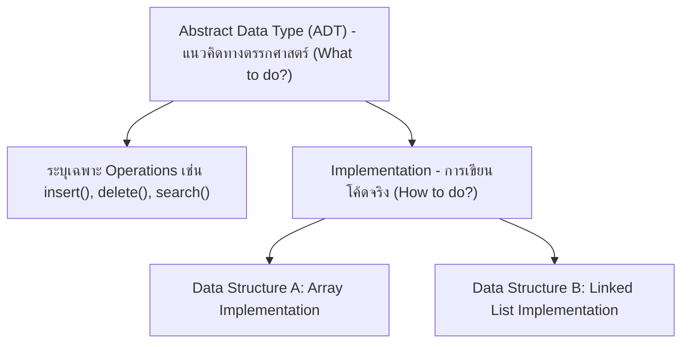
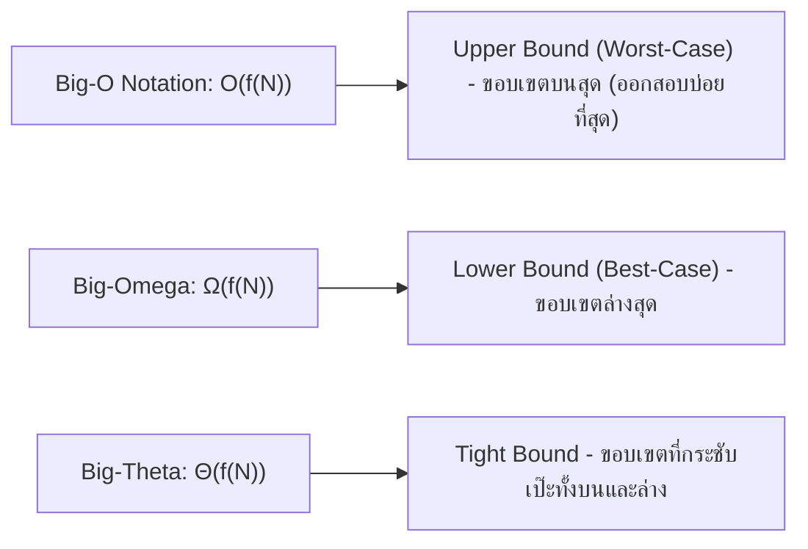
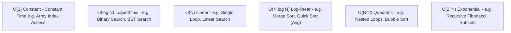

# 📜 01.1 - Introduction to Data Structures & Algorithm Analysis

> [!NOTE]
> **Data Structure (โครงสร้างข้อมูล)** คือวิธีการจัดเก็บและจัดระเบียบข้อมูลในหน่วยความจำของคอมพิวเตอร์อย่างมีประสิทธิภาพ ในขณะที่ **Algorithm (อัลกอริทึม)** คือลำดับขั้นตอนคำสั่งที่ชัดเจนในการแก้ปัญหา การวิเคราะห์ความเร็วของอัลกอริทึมใช้สัญลักษณ์ **Asymptotic Notation (Big-O)**

---

## 🏛️ 1. Abstract Data Type (ADT) vs Data Structure



- **ADT (ประเภทข้อมูลนามธรรม)**: นิยามพฤติกรรมเชิงตรรกะและเซตของออปชัน (เช่น Stack ADT นิยามพฤติกรรม LIFO โดยมีฟังก์ชัน `push` และ `pop`)
- **Data Structure (โครงสร้างข้อมูล)**: การนำ ADT ไปเขียนเป็นโปรแกรมจริงด้วยโครงสร้างหน่วยความจำ (เช่น สร้าง Stack โดยใช้ Python `list` หรือสร้างด้วย `Node` อ้างอิง Pointer)

---

## 📈 2. การวิเคราะห์ความซับซ้อน (Asymptotic Notation)

ในการวัดประสิทธิภาพของโปรแกรม เราไม่ใช้นาฬิกาจับเวลา (Execution Time ในหน่วยวินาที) เนื่องจากขึ้นอยู่กับสเปกเครื่องคอมพิวเตอร์และภาษาที่ใช้ แต่เราวัดจาก **อัตราการเติบโตของจำนวนคำสั่ง (Growth Rate) แปรผันตามขนาดของอินพุต ($N$)**



### 2.1 ลำดับอัตราการเติบโตจากเร็วที่สุดไปช้าที่สุด (Growth Rates Ranking)

$$O(1) < O(\log N) < O(N) < O(N \log N) < O(N^2) < O(N^3) < O(2^N) < O(N!)$$



---

## 🧮 3. ตัวอย่างการวิเคราะห์ Big-O จากโค้ด Python

### 3.1 Loop เดี่ยว $\implies O(N)$
```python
def find_max(arr):
    max_val = arr[0]  # O(1)
    for num in arr:   # วนลูป N ครั้ง -> O(N)
        if num > max_val:
            max_val = num
    return max_val    # O(1)
# Total Time Complexity = O(N)
```

### 3.2 Nested Loops (ลูปซ้อนกัน) $\implies O(N^2)$
```python
def print_pairs(arr):
    n = len(arr)
    for i in range(n):       # วน N ครั้ง
        for j in range(n):   # วน N ครั้ง
            print(arr[i], arr[j])  # O(1)
# Total = N * N = O(N^2)
```

### 3.3 Binary Search (ลดปัญหาลงครึ่งหนึ่งทุกสเต็ป) $\implies O(\log N)$
```python
def binary_search(arr, target):
    low = 0
    high = len(arr) - 1
    while low <= high:        # ตัดครึ่งข้อมูลทุกรอบ -> O(log N)
        mid = (low + high) // 2
        if arr[mid] == target:
            return mid
        elif arr[mid] < target:
            low = mid + 1
        else:
            high = mid - 1
    return -1
```

---

## 🔗 ลิงก์เชื่อมโยงใน Obsidian Wiki
- ถัดไป: [[01.2 - Python Review & Object-Oriented Programming (OOP)]]
- ตารางความเร็วรวม: [[Glossary & Complexity Cheat Sheet]]
- กลับหน้าหลัก: [[Index]]
