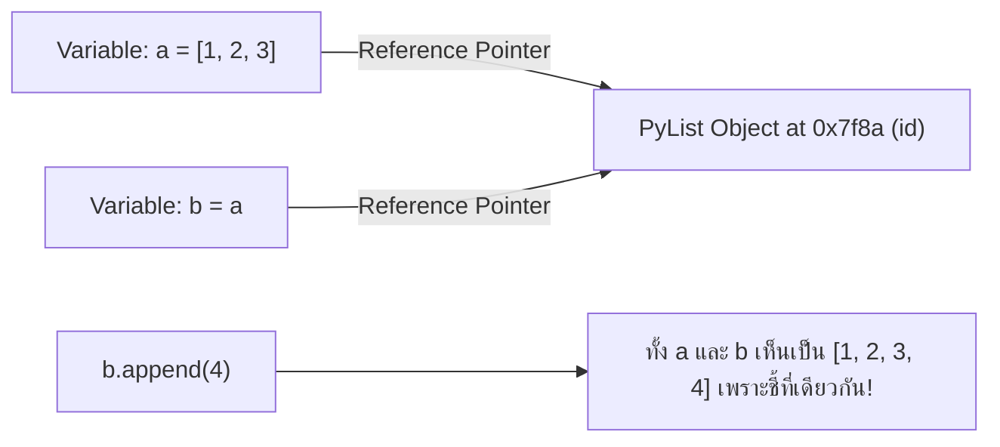
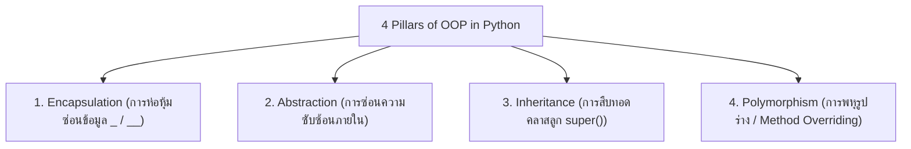

# 🐍 01.2 - Python Review & Object-Oriented Programming (OOP)

> [!NOTE]
> ในภาษา Python ทุกสิ่งทุกอย่างคือ **Object (วัตถุ)** การสร้าง Data Structures จำเป็นต้องเข้าใจหลักการเขียนโปรแกรมเชิงวัตถุ (OOP), การสืบทอด (Inheritance), การซ่อนข้อมูล (Encapsulation), และ Special Magic Methods (เช่น `__init__`, `__str__`, `__len__`)

---

## 🧩 1. ตัวแปรและการอ้างอิงหน่วยความจำใน Python (Memory Reference Model)

ในภาษา Python ตัวแปรไม่ได้เก็บค่าตัวเลขโดยตรง แต่เก็บ **Memory Address (Reference/Pointer)** ที่ชี้ไปยัง Object ใน RAM



>[!WARNING]
> **ข้อควรระวังในห้องสอบเรื่อง Shallow Copy vs Deep Copy**:
> - `b = a` : เพียงแค่สร้างตัวแปรอ้างอิงใหม่ ชี้ไปที่ Object เดียวกัน
> - `b = a.copy()` / `b = list(a)` : Shallow Copy สร้าง List ใหม่ แต่อย่างไรก็ตาม Element ภายในยังอ้างอิงตำแหน่งเดิม
> - `import copy; b = copy.deepcopy(a)` : Deep Copy คัดลอกสร้าง Object ใหม่ทั้งหมดทุกระดับชั้น

---

## 🏛️ 2. หลักการ OOP 4 ประการ (4 Pillars of OOP)



---

## 🛠️ 3. โครงสร้างคลาสและการใช้งาน Special Magic Methods

ในวิชา Data Structures คลาสสำหรับ Node และ Data Structure จะใช้ Magic Methods เหล่านี้อย่างแพร่หลาย:

```python
class Student:
    def __init__(self, student_id: str, name: str, gpa: float):
        """Constructor: เรียกใช้เมื่อสร้างวัตถุใหม่"""
        self.student_id = student_id
        self.name = name
        self.gpa = gpa
    
    def __str__(self) -> str:
        """แปลง Object เป็น String เมื่อสั่ง print()"""
        return f"Student({self.student_id}, {self.name}, GPA={self.gpa})"
    
    def __eq__(self, other) -> bool:
        """เปรียบเทียบความเท่ากันเมื่อใช้เครื่องหมาย =="""
        if isinstance(other, Student):
            return self.student_id == other.student_id
        return False
    
    def __lt__(self, other) -> bool:
        """เปรียบเทียบเรียงลำดับน้อยกว่าเมื่อใช้เครื่องหมาย < (ใช้ใน Sorting / Heap)"""
        return self.gpa < other.gpa

# ทดลองสร้าง Object
s1 = Student("6601001", "Alice", 3.85)
s2 = Student("6601002", "Bob", 3.50)
print(s1)         # Output: Student(6601001, Alice, GPA=3.85)
print(s1 > s2)    # Output: True (เปรียบเทียบผ่าน __lt__)
```

---

## 🔗 ลิงก์เชื่อมโยงใน Obsidian Wiki
- ก่อนหน้า: [[01.1 - Introduction to Data Structures & Algorithm Analysis]]
- ถัดไป (เข้าสู่ Module 02): [[02.1 - Linked Lists (Singly, Doubly, Circular)]]
- กลับหน้าหลัก: [[Index]]
