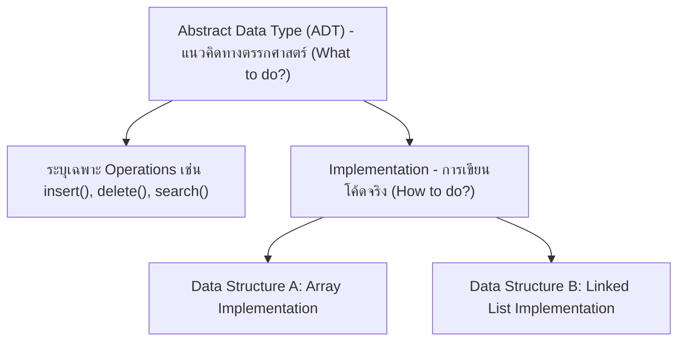
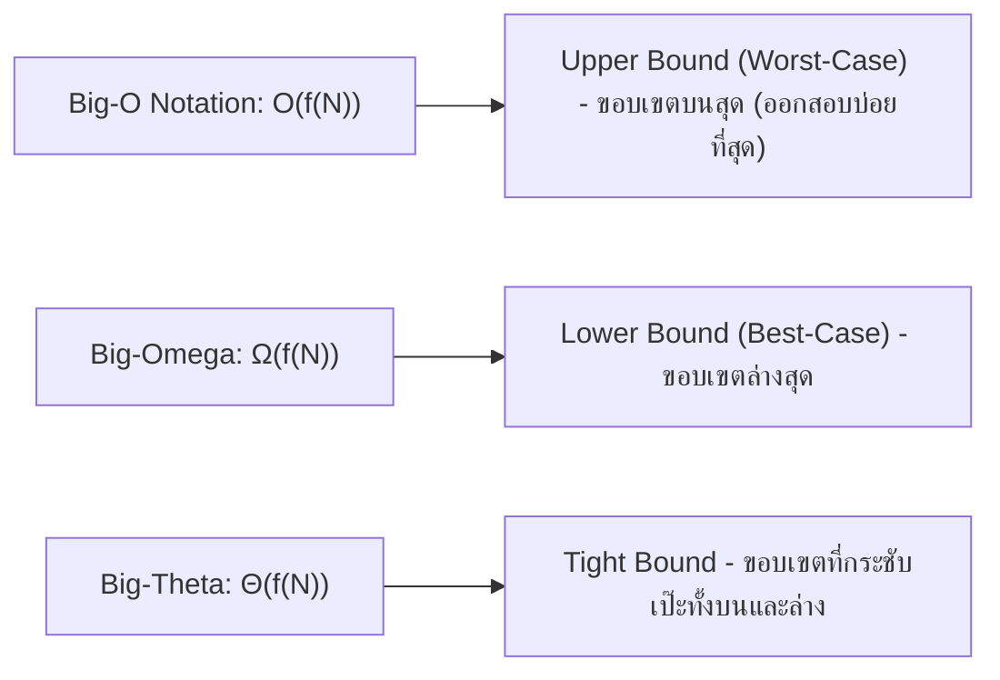
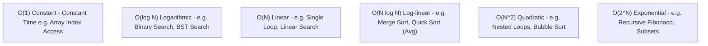

# 📜 01.1 - Introduction to Data Structures & Algorithm Analysis

> [!NOTE]
> **Data Structure (โครงสร้างข้อมูล)** คือวิธีการจัดเก็บและจัดระเบียบข้อมูลในหน่วยความจำของคอมพิวเตอร์อย่างมีประสิทธิภาพ ในขณะที่ **Algorithm (อัลกอริทึม)** คือลำดับขั้นตอนคำสั่งที่ชัดเจนในการแก้ปัญหา การวิเคราะห์ความเร็วของอัลกอริทึมใช้สัญลักษณ์ **Asymptotic Notation (Big-O)**

---

## 🏛️ 1. Abstract Data Type (ADT) vs Data Structure



- **ADT (ประเภทข้อมูลนามธรรม)**: นิยามพฤติกรรมเชิงตรรกะและเซตของออปชัน (เช่น Stack ADT นิยามพฤติกรรม LIFO โดยมีฟังก์ชัน `push` และ `pop`)
- **Data Structure (โครงสร้างข้อมูล)**: การนำ ADT ไปเขียนเป็นโปรแกรมจริงด้วยโครงสร้างหน่วยความจำ (เช่น สร้าง Stack โดยใช้ Python `list` หรือสร้างด้วย `Node` อ้างอิง Pointer)

---

## 📈 2. การวิเคราะห์ความซับซ้อน (Asymptotic Notation)

ในการวัดประสิทธิภาพของโปรแกรม เราไม่ใช้นาฬิกาจับเวลา (Execution Time ในหน่วยวินาที) เนื่องจากขึ้นอยู่กับสเปกเครื่องคอมพิวเตอร์และภาษาที่ใช้ แต่เราวัดจาก **อัตราการเติบโตของจำนวนคำสั่ง (Growth Rate) แปรผันตามขนาดของอินพุต ($N$)**



### 2.1 ลำดับอัตราการเติบโตจากเร็วที่สุดไปช้าที่สุด (Growth Rates Ranking)

$$O(1) < O(\log N) < O(N) < O(N \log N) < O(N^2) < O(N^3) < O(2^N) < O(N!)$$



---

## 🧮 3. ตัวอย่างการวิเคราะห์ Big-O จากโค้ด Python

### 3.1 Loop เดี่ยว $\implies O(N)$
```python
def find_max(arr):
    max_val = arr[0]  # O(1)
    for num in arr:   # วนลูป N ครั้ง -> O(N)
        if num > max_val:
            max_val = num
    return max_val    # O(1)
# Total Time Complexity = O(N)
```

### 3.2 Nested Loops (ลูปซ้อนกัน) $\implies O(N^2)$
```python
def print_pairs(arr):
    n = len(arr)
    for i in range(n):       # วน N ครั้ง
        for j in range(n):   # วน N ครั้ง
            print(arr[i], arr[j])  # O(1)
# Total = N * N = O(N^2)
```

### 3.3 Binary Search (ลดปัญหาลงครึ่งหนึ่งทุกสเต็ป) $\implies O(\log N)$
```python
def binary_search(arr, target):
    low = 0
    high = len(arr) - 1
    while low <= high:        # ตัดครึ่งข้อมูลทุกรอบ -> O(log N)
        mid = (low + high) // 2
        if arr[mid] == target:
            return mid
        elif arr[mid] < target:
            low = mid + 1
        else:
            high = mid - 1
    return -1
```

---

## 📝 4. คลังตัวอย่างข้อสอบ & แบบฝึกหัดในห้องเรียน (Classroom "For Example" & Worksheets)

### 🎯 4.1 โจทย์แบบฝึกหัดในห้องเรียน: การวิเคราะห์ลูปสะสมค่า (Accumulator Loop Tracing)
> [!INFO]
> **ที่มาของโจทย์**: จากเอกสารแบบฝึกหัดในห้องเรียน `Lectures/0Exercises/Note Exercises 00.png` และ `exercises-00.png` ซึ่งเป็นข้อสอบถามความเข้าใจเรื่องการทำงานของลูปและการวิเคราะห์ความเร็วของอัลกอริทึม

#### 📄 โจทย์คำถาม (Problem Statement)
จงวิเคราะห์การทำงานของฟังก์ชันต่อไปนี้เมื่อเรียกใช้งานคำสั่ง `Function(20)`:

```python
def Function(n):
    i = s = 1
    while s < n:
        i = i + 1
        s = s + i
        print("*")

Function(20)
```

**คำถาม 2 ข้อที่ต้องตอบ:**
1. **What is the result of this program?** (ผลลัพธ์ของโปรแกรมนี้คืออะไร?)
2. **How many times does the command "print" run?** (คำสั่ง `print` ถูกสั่งทำงานทั้งหมดกี่ครั้ง?)

---

#### 💻 เฉลยคำตอบที่ถูกต้องชัดเจน (Clear & Accurate Solution)

```text
คำตอบข้อ 1:
The result of this program is:
*
*
*
*
*

คำตอบข้อ 2:
The "print" command runs 5 times.
```

---

#### 📊 ตารางแสดงการ Trace ทีละบรรทัด (Step-by-Step Execution Trace Table)

| รอบที่ (Round) | ค่า $i$ ก่อนบวก | $i = i + 1$ | ค่า $s$ ก่อนบวก | $s = s + i$ | ตรวจเงื่อนไข `while s < 20` | ผลลัพธ์บรรทัด `print("*")` |
| :---: | :---: | :---: | :---: | :---: | :---: | :---: |
| **จุดเริ่มต้น** | `1` | - | `1` | - | $1 < 20$ เป็น **จริง** (เข้าลูป) | ยังไม่พิมพ์ |
| **รอบที่ 1** | 1 | $i = 1 + 1 = \mathbf{2}$ | 1 | $s = 1 + 2 = \mathbf{3}$ | ตรวจรอบถัดไป: $3 < 20$ (จริง) | พิมพ์ `*` ครั้งที่ 1 |
| **รอบที่ 2** | 2 | $i = 2 + 1 = \mathbf{3}$ | 3 | $s = 3 + 3 = \mathbf{6}$ | ตรวจรอบถัดไป: $6 < 20$ (จริง) | พิมพ์ `*` ครั้งที่ 2 |
| **รอบที่ 3** | 3 | $i = 3 + 1 = \mathbf{4}$ | 6 | $s = 6 + 4 = \mathbf{10}$ | ตรวจรอบถัดไป: $10 < 20$ (จริง) | พิมพ์ `*` ครั้งที่ 3 |
| **รอบที่ 4** | 4 | $i = 4 + 1 = \mathbf{5}$ | 10 | $s = 10 + 5 = \mathbf{15}$ | ตรวจรอบถัดไป: $15 < 20$ (จริง) | พิมพ์ `*` ครั้งที่ 4 |
| **รอบที่ 5** | 5 | $i = 5 + 1 = \mathbf{6}$ | 15 | $s = 15 + 6 = \mathbf{21}$ | ตรวจรอบถัดไป: $21 < 20$ เป็น **เท็จ (Break)** | พิมพ์ `*` ครั้งที่ 5 |

> [!WARNING]
> **กับดักที่นักศึกษามักตอบผิดในห้องสอบ (Common Trap)**:
> 1. ตอบว่าคำสั่ง `print` รัน 6 ครั้ง เพราะเห็นค่าสุดท้ายของ $i$ เป็น 6 $\implies$ **ผิด!** เพราะ $i=6$ เกิดขึ้นในรอบที่ 5 และพิมพ์เพียงครั้งที่ 5 เท่านั้น ก่อนที่เงื่อนไข $21 < 20$ จะปฏิเสธการเข้าลูปรอบที่ 6
> 2. สับสนระหว่างค่าที่เช็คในเงื่อนไข `while s < n` ว่าเช็คค่า $s$ ก่อนบวกหรือหลังบวก (ในโค้ดนี้ ลูปจะเช็คค่า $s$ ของรอบก่อนหน้าก่อนเข้าทำคำสั่งข้างใน)

---

#### 📐 การวิเคราะห์ความซับซ้อนเชิงคณิตศาสตร์ (Mathematical Big-O Derivation)
เหตุใดฟังก์ชันนี้จึงไม่ได้ทำงาน $O(n)$ ?
1. สังเกตการเพิ่มขึ้นของตัวแปร $s$:
   $$s_k = 1 + 2 + 3 + 4 + \dots + i_k = \sum_{j=1}^{k+1} j = \frac{(k+1)(k+2)}{2}$$
2. ลูปจะหยุดทำงานเมื่อ $s \ge n$:
   $$\frac{i^2}{2} \approx n \implies i^2 \approx 2n \implies i \approx \sqrt{2n}$$
3. ดังนั้น จำนวนรอบการทำงานของลูปจะแปรผันตาม $\sqrt{n}$ ส่งผลให้:
   $$\text{Time Complexity} = O(\sqrt{n})$$

---

#### 🖥️ ตัวอย่างหน้าจอ Interface การรันโปรแกรม (CLI Output Preview)
```console
============================================================
           ALGORITHM TRACE RUNNER: Function(n=20)           
============================================================
[Init]    i = 1, s = 1 | Target Condition: s < 20
[Iter 1]  i = 2, s = 3  | Condition: 3 < 20 (True)  -> Output: *
[Iter 2]  i = 3, s = 6  | Condition: 6 < 20 (True)  -> Output: *
[Iter 3]  i = 4, s = 10 | Condition: 10 < 20 (True) -> Output: *
[Iter 4]  i = 5, s = 15 | Condition: 15 < 20 (True) -> Output: *
[Iter 5]  i = 6, s = 21 | Condition: 21 < 20 (False)-> Output: *
------------------------------------------------------------
[Terminated] Loop stopped because s (21) >= n (20)
[Summary] Total print count: 5 times
[Complexity] Growth Rate: O(sqrt(n))
============================================================
```

---

## 🔗 ลิงก์เชื่อมโยงใน Obsidian Wiki
- ถัดไป: [[02.1 - Python Review & Object-Oriented Programming (OOP)]]
- ตารางความเร็วรวม: [[Glossary & Complexity Cheat Sheet]]
- กลับหน้าหลัก: [[Index]]

