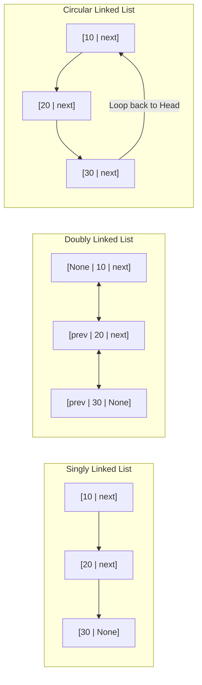
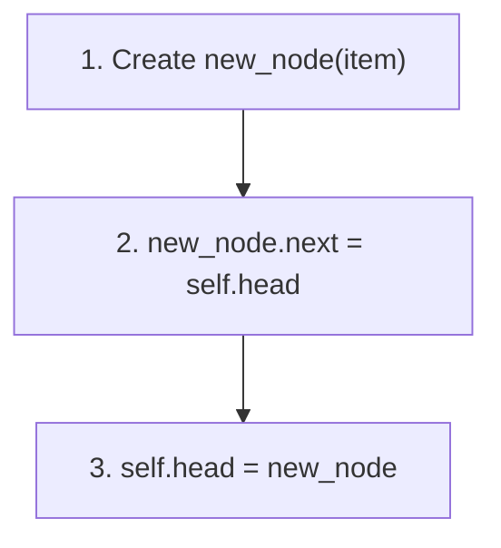
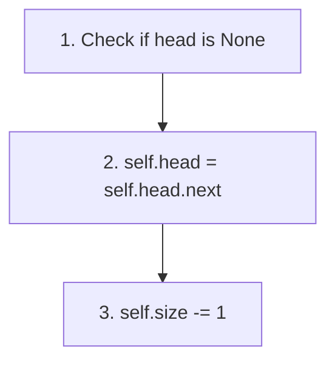

# 🔗 02.1 - Linked Lists (Singly, Doubly, Circular)

> [!NOTE]
> **Linked List (รายการเชื่อมโยง)** คือโครงสร้างข้อมูลแบบเชิงเส้นที่ประกอบด้วย **Nodes** แต่ละโหนดเก็บข้อมูล (Data) และการอ้างอิงตำแหน่ง (Pointer / Reference) ไปยังโหนดถัดไปในหน่วยความจำ ซึ่งไม่จำเป็นต้องจองพื้นที่ติดกันเหมือน Array

---

## 🏛️ 1. เปรียบเทียบ 3 รูปแบบ Linked List



| คุณลักษณะ | Singly Linked List | Doubly Linked List | Circular Linked List |
| :--- | :--- | :--- | :--- |
| **Pointer ต่อ 1 Node** | 1 (`next`) | 2 (`prev`, `next`) | 1 หรือ 2 (`next` ชี้วนรอบ) |
| **การท่องไปในโหนด** | ไปข้างหน้าได้อย่างเดียว | ไปข้างหน้าและถอยหลังได้ | ท่องเป็นวงกลมได้ไม่รู้จบ |
| **Memory Overhead** | ปานกลาง ($1 \times \text{pointer}$) | สูงสุด ($2 \times \text{pointers}$) | ปานกลาง |
| **Delete Tail Time** | $O(N)$ (แม้มี Tail Pointer) | $O(1)$ (ใช้ `tail.prev`) | $O(N)$ หรือ $O(1)$ ขึ้นอยู่กับ Pointer |

---

## ✂️ 2. ขั้นตอนการจัดการ Pointers (Pointer Transitions Step-by-Step)

### 2.1 การแทรกโหนดที่ตำแหน่งเริ่มต้น (Insert at Head) $\implies O(1)$



```python
def add_first(self, item):
    new_node = Node(item)
    new_node.next = self.head
    self.head = new_node
    self.size += 1
```

### 2.2 การลบโหนดที่ตำแหน่งเริ่มต้น (Remove First / Head) $\implies O(1)$



```python
def remove_first(self):
    if self.head is None:
        raise IndexError("Remove from empty list")
    removed_data = self.head.data
    self.head = self.head.next
    self.size -= 1
    return removed_data
```

---

## 💻 3. Complete Python Implementation (Singly Linked List)

```python
class Node:
    def __init__(self, data):
        self.data = data
        self.next = None

class SinglyLinkedList:
    def __init__(self):
        self.head = None
        self.size = 0

    def append(self, item):
        """เพิ่มข้อมูลต่อท้าย list -> O(N) หากไม่มี tail pointer"""
        new_node = Node(item)
        if self.head is None:
            self.head = new_node
        else:
            curr = self.head
            while curr.next:
                curr = curr.next
            curr.next = new_node
        self.size += 1

    def remove(self, item) -> bool:
        """ค้นหาและลบโหนดแรกที่มีข้อมูลตรงกับ item -> O(N)"""
        if self.head is None:
            return False
        if self.head.data == item:
            self.head = self.head.next
            self.size -= 1
            return True
        
        curr = self.head
        while curr.next and curr.next.data != item:
            curr = curr.next
        
        if curr.next:
            curr.next = curr.next.next
            self.size -= 1
            return True
        return False

    def insert(self, item, pos):
        """แทรกข้อมูล ณ ตำแหน่ง pos index"""
        if pos == 0:
            self.add_first(item)
            return
        curr = self.head
        prev = None
        for _ in range(pos):
            if curr is None:
                break
            prev = curr
            curr = curr.next
        temp = Node(item)
        temp.next = curr
        if prev:
            prev.next = temp
        self.size += 1

    def __str__(self):
        result = []
        curr = self.head
        while curr:
            result.append(str(curr.data))
            curr = curr.next
        return " -> ".join(result) + " -> None"
```

---

## 📝 4. สรุปแบบฝึกหัดและการทดลอง (Assignment 1 & 1.1 Summary)

> [!IMPORTANT]
> **ประเด็นสำคัญจาก Assignment 1 Linked List**:
> 1. **การค้นหาและแทรกตามดรรชนี (Insert at Pos Index)**:
>    - ต้องวนลูปเก็บตัวแปร `previous` และ `current` ควบคู่กันไป
>    - ถ้าแทรกที่ `pos = 0` ต้องอัปเดต `head` Pointer เสมอ
> 2. **กรณีลบโหนดเมื่อ List มีโหนดเดียว**:
>    - ต้องตรวจสอบว่า `head.next` เป็น `None` หรือไม่ หากลบโหนดนั้นแล้ว ต้องเซต `head = None` เพื่อป้องกัน Memory Leak หรือการชี้ค้าง (Dangling Pointer)

---

## 🔗 ลิงก์เชื่อมโยงใน Obsidian Wiki
- ก่อนหน้า: [[01.2 - Python Review & Object-Oriented Programming (OOP)]]
- ถัดไป (Stack): [[02.2 - Stacks & Applications (Infix, Postfix, Parentheses)]]
- ตารางความเร็วรวม: [[Glossary & Complexity Cheat Sheet]]
