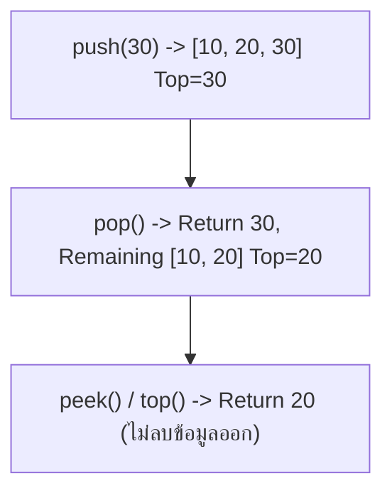
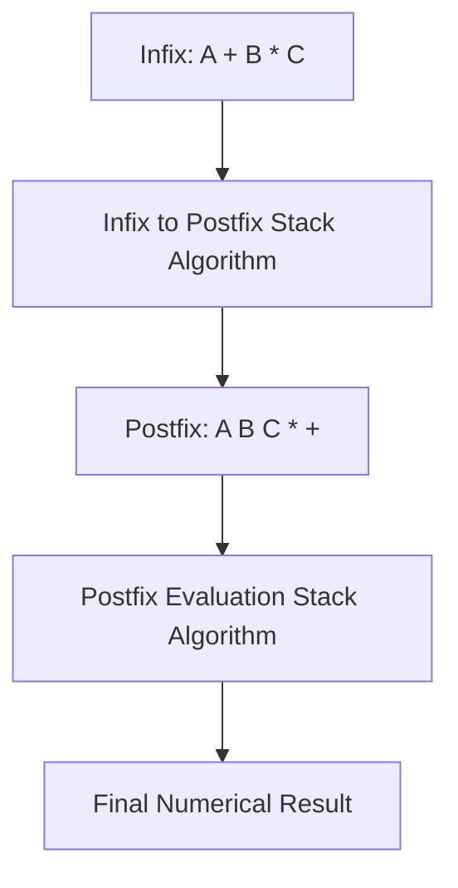

# 🥞 02.2 - Stacks & Applications (Infix, Postfix, Parentheses)

> [!NOTE]
> **Stack (สแตก)** คือโครงสร้างข้อมูลแบบเชิงเส้นประเภท **LIFO (Last-In, First-Out)** เข้าหลังสุดออกก่อน ออเปอเรชันหลักคือ `push()` ใส่ข้อมูลลงบนยอดสแตก และ `pop()` ดึงข้อมูลออกจากยอดสแตก

---

## 🏛️ 1. Stack ADT & Operations



- **`push(item)`**: $O(1)$ เพิ่มข้อมูลไว้ที่ Top
- **`pop()`**: $O(1)$ ลบและคืนค่าข้อมูลที่ Top
- **`peek()` / `top()`**: $O(1)$ ดูค่าที่ Top โดยไม่ลบออก
- **`is_empty()`**: $O(1)$ เช็กว่าสแตกว่างหรือไม่

---

## 🧮 2. การประยุกต์ใช้งาน Stack 1: Parentheses Matching (ตรวจวงเล็บสมดุล)

### 2.1 กฎการตรวจวงเล็บ
1. อ่านตัวอักษรทีละตัวจากซ้ายไปขวา
2. หากพบ **วงเล็บเปิด (`(`, `[`, `{`)** $\to$ ให้ `push` ลงสแตก
3. หากพบ **วงเล็บปิด (`)`, `]`, `}`)** $\to$ ให้ `pop` ออกจากสแตก แล้วเช็กว่าจับคู่กับวงเล็บปิดถูกต้องหรือไม่
4. หากอ่านจนจบประโยค สแตกต้อง **ว่างเปล่า ($len == 0$)** พอดี

```python
def is_parentheses_balanced(expr: str) -> bool:
    stack = []
    matching = {')': '(', ']': '[', '}': '{'}
    for char in expr:
        if char in "([{":
            stack.append(char)
        elif char in ")]}":
            if not stack or stack.pop() != matching[char]:
                return False
    return len(stack) == 0
```

---

## 🔀 3. การประยุกต์ใช้งาน Stack 2: Conversion of Infix to Postfix

ในการคำนวณของคอมพิวเตอร์ นิพจน์ **Infix** ($A + B * C$) มีความซับซ้อนเรื่องลำดับเครื่องหมาย คอมพิวเตอร์จึงนิยมเปลี่ยนเป็น **Postfix / Reverse Polish Notation** ($A B C * +$)



### 3.1 ตารางลำดับความสำคัญของเครื่องหมาย (Operator Precedence)

| เครื่องหมาย (Operators) | Precedence Score | Associativity |
| :--- | :--- | :--- |
| `^` (Exponentiation) | 3 | Right-to-Left |
| `*`, `/` (Multiply, Divide) | 2 | Left-to-Right |
| `+`, `-` (Add, Subtract) | 1 | Left-to-Right |
| `(` (Left Parenthesis) | 0 (Inside Stack) | N/A |

### 3.2 อัลกอริทึม Infix to Postfix (ออกสอบข้อเขียน 100%!)
1. วนลูปอ่าน Token ใน Infix จากซ้ายไปขวา:
   - ถ้าเป็น **Operand (ตัวเลข/ตัวอักษร)** $\to$ ส่งออกไปที่ Output ทันที
   - ถ้าเป็น **`(`** $\to$ `push` ลง Stack
   - ถ้าเป็น **`)`** $\to$ `pop` เครื่องหมายออกจาก Stack ไปยัง Output จนกว่าจะเจอ `(` (แล้วลบ `(` ทิ้ง)
   - ถ้าเป็น **Operator (`+`, `-`, `*`, `/`, `^`)** $\to$ ขณะที่ Top ของ Stack มี Precedence $\ge$ Operator ตัวปัจจุบัน ให้ `pop` ออกไปยัง Output เรื่อยๆ แล้วจึง `push` Operator ตัวปัจจุบันลง Stack
2. เมื่ออ่าน Infix จบ ให้ `pop` เครื่องหมายที่ค้างใน Stack ทั้งหมดไปยัง Output

>[!EXAMPLE]
> **ตาราง Trace Infix to Postfix ของนิพจน์: `A + B * ( C - D )`**
>
> | Symbol | Stack (Top on right) | Output Expression | Explanation |
> | :--- | :--- | :--- | :--- |
> | `A` | `[]` | `A` | Operand $\to$ Output |
> | `+` | `['+']` | `A` | Push `+` |
> | `B` | `['+']` | `A B` | Operand $\to$ Output |
> | `*` | `['+', '*']` | `A B` | `*` มี Precedence สูงกว่า `+` $\to$ Push |
> | `(` | `['+', '*', '(']` | `A B` | Push `(` |
> | `C` | `['+', '*', '(', 'C']` | `A B C` | Operand $\to$ Output |
> | `-` | `['+', '*', '(', '-']` | `A B C` | Push `-` หลัง `(` |
> | `D` | `['+', '*', '(', '-']` | `A B C D` | Operand $\to$ Output |
> | `)` | `['+', '*']` | `A B C D -` | Pop จนเจอ `(` |
> | End | `[]` | `A B C D - * +` | Pop All Remaining Operators |
>
> **ผลลัพธ์ Postfix**: `A B C D - * +`

---

## 🧮 4. การประเมินผลนิพจน์ Postfix (Postfix Evaluation)

อัลกอริทึม:
1. อ่าน Token จากซ้ายไปขวา:
   - ถ้าเจอ **ตัวเลข** $\to$ `push` ลง Stack
   - ถ้าเจอ **Operator** $\to$ `pop` ออกมา 2 ตัว: `operand2 = pop()`, `operand1 = pop()`
   - คำนวณ `result = operand1 <op> operand2` แล้ว `push(result)` กลับลง Stack
2. คืนค่าตัวเลขตัวสุดท้ายที่เหลือใน Stack

---

## 🔗 ลิงก์เชื่อมโยงใน Obsidian Wiki
- ก่อนหน้า: [[02.1 - Linked Lists (Singly, Doubly, Circular)]]
- ถัดไป (Queue): [[02.3 - Queues & Circular Array Queues]]
- กลับหน้าหลัก: [[Index]]
