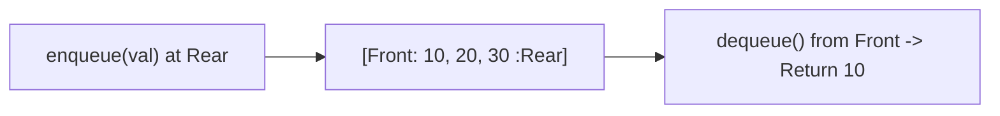
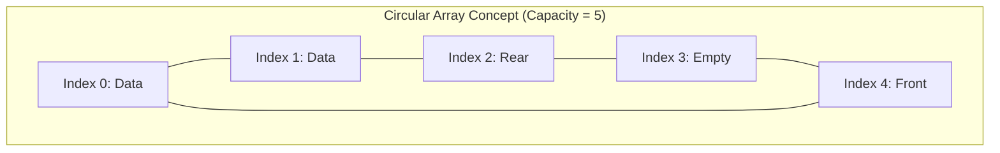

# 🚶‍♂️ 02.3 - Queues & Circular Array Queues

> [!NOTE]
> **Queue (คิว)** คือโครงสร้างข้อมูลแบบเชิงเส้นประเภท **FIFO (First-In, First-Out)** เข้าก่อนออกก่อน ออเปอเรชันหลักคือ `enqueue()` ใส่ข้อมูลที่ท้ายคิว (Rear) และ `dequeue()` ดึงข้อมูลออกจากหน้าคิว (Front)

---

## 🏛️ 1. Queue ADT & Operations



- **`enqueue(item)`**: $O(1)$ เพิ่มข้อมูลต่อท้ายคิว
- **`dequeue()`**: $O(1)$ ลบและคืนค่าข้อมูลที่อยู่หน้าสุดของคิว
- **`front()` / `first()`**: $O(1)$ ดูข้อมูลตัวหน้าสุดโดยไม่ลบออก
- **`is_empty()`**: $O(1)$ ตรวจสอบว่าคิวยังมีข้อมูลอยู่หรือไม่

---

## 🔄 2. Circular Array Queue (คิวแบบอาร์เรย์วงกลม)

หากสร้าง Queue ด้วย Array ดั้งเดิม เมื่อทำ `dequeue()` หน้าคิวจะขยับไปทางขวาเรื่อยๆ ทำให้เกิดพื้นที่ว่างทางซ้ายที่เสียเปล่า (False Overflow) **Circular Array Queue** แก้ปัญหานี้โดยการใช้ **Modulo Arithmetic Operator (`%`)** วน Index กลับมาที่ 0



### 2.1 สูตรการคำนวณ Index วนรอบ (Must-Know for Exams)
$$\text{rear} = (\text{rear} + 1) \pmod{\text{capacity}}$$
$$\text{front} = (\text{front} + 1) \pmod{\text{capacity}}$$

```python
class CircularQueue:
    def __init__(self, capacity: int):
        self.capacity = capacity
        self.queue = [None] * capacity
        self.front = 0
        self.rear = 0
        self.size = 0

    def enqueue(self, item) -> bool:
        if self.size == self.capacity:
            raise OverflowError("Queue is overflow")
        self.queue[self.rear] = item
        self.rear = (self.rear + 1) % self.capacity
        self.size += 1
        return True

    def dequeue(self):
        if self.size == 0:
            raise IndexError("Queue is underflow")
        item = self.queue[self.front]
        self.queue[self.front] = None
        self.front = (self.front + 1) % self.capacity
        self.size -= 1
        return item
```

---

## 🧪 3. สรุปผลทดลองและการทดสอบ (Test Program 1 Summary)

> [!IMPORTANT]
> **สรุปเนื้อหาจาก Test Program 1 Queue (`program.py`)**:
> 1. **Queue Overflow Handling**:
>    - เมื่อคิวเต็ม (`len(items) >= limit`) การสั่ง `enQueue()` เพิ่มจะพิมพ์แจ้งเตือนว่า `"Queue is overflow"` และจะไม่ยอมให้แทรกข้อมูลเพิ่มเข้าไป
> 2. **Queue Underflow Handling**:
>    - เมื่อคิวยังคงว่างเปล่า (`isEmpty() == True`) การสั่ง `deQueue()` ออกมาจะพิมพ์แจ้งเตือนว่า `"Queue is underflow"` และคืนค่าการทำงาน
> 3. **การสั่ง printqueue()**:
>    - วนลูปตามค่า `self.size` พิมพ์เฉพาะสมาชิกที่มีอยู่ในคิวปัจจุบันจาก `front` ถึง `rear`

---

## ↔️ 4. Double-Ended Queue (Deque)

**Deque (อ่านว่า Deck)** คือ คิวสองหน้า ที่อนุญาตให้สามารถ `add_first()`, `add_last()`, `remove_first()`, `remove_last()` ได้ที่ทั้งสองฝั่งในเวลา $O(1)$ (ใช้ในไลบรารี standard ของ Python `collections.deque`)

---

## 🔗 ลิงก์เชื่อมโยงใน Obsidian Wiki
- ก่อนหน้า: [[02.2 - Stacks & Applications (Infix, Postfix, Parentheses)]]
- เข้าสู่ Module 03 (Trees): [[03.1 - Tree Terminology & Binary Trees]]
- ประยุกต์ใช้ใน Graph BFS: [[05.2 - Graph Fundamentals & Traversals (BFS, DFS, Topological Sort)]]
