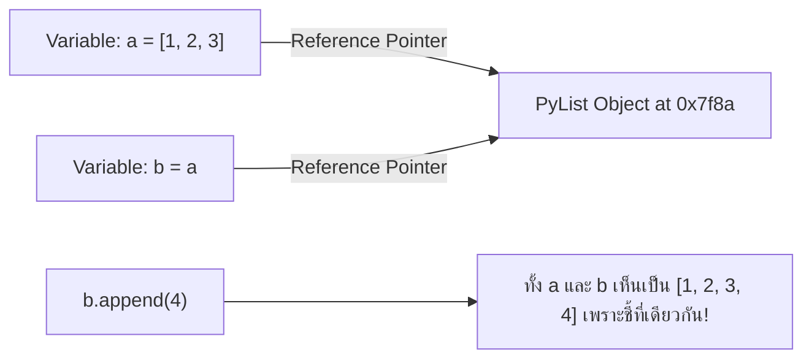
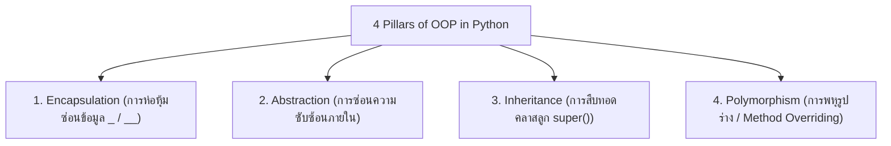
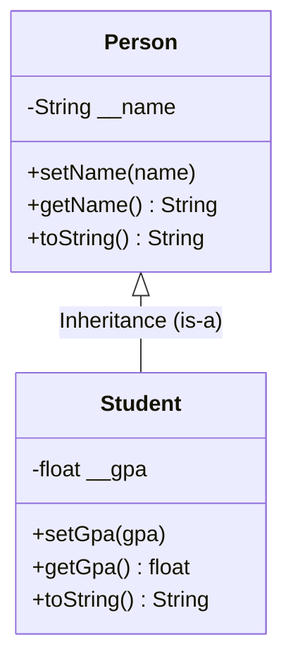

# 🐍 02.1 - Python Review & Object-Oriented Programming (OOP)

> [!NOTE]
> ในภาษา Python ทุกสิ่งทุกอย่างคือ **Object (วัตถุ)** การสร้าง Data Structures จำเป็นต้องเข้าใจหลักการเขียนโปรแกรมเชิงวัตถุ (OOP), การสืบทอด (Inheritance), การซ่อนข้อมูล (Encapsulation), และ Special Magic Methods (เช่น `__init__`, `__str__`, `__len__`)

---

## 🧩 1. ตัวแปรและการอ้างอิงหน่วยความจำใน Python (Memory Reference Model)

ในภาษา Python ตัวแปรไม่ได้เก็บค่าตัวเลขโดยตรง แต่เก็บ **Memory Address (Reference/Pointer)** ที่ชี้ไปยัง Object ใน RAM



>[!WARNING]
> **ข้อควรระวังในห้องสอบเรื่อง Shallow Copy vs Deep Copy**:
> - `b = a` : เพียงแค่สร้างตัวแปรอ้างอิงใหม่ ชี้ไปที่ Object เดียวกัน
> - `b = a.copy()` / `b = list(a)` : Shallow Copy สร้าง List ใหม่ แต่อย่างไรก็ตาม Element ภายในยังอ้างอิงตำแหน่งเดิม
> - `import copy; b = copy.deepcopy(a)` : Deep Copy คัดลอกสร้าง Object ใหม่ทั้งหมดทุกระดับชั้น

---

## 🏛️ 2. หลักการ OOP 4 ประการ (4 Pillars of OOP)



---

## 🛠️ 3. โครงสร้างคลาสและการใช้งาน Special Magic Methods

ในวิชา Data Structures คลาสสำหรับ Node และ Data Structure จะใช้ Magic Methods เหล่านี้อย่างแพร่หลาย:

```python
class Student:
    def __init__(self, student_id: str, name: str, gpa: float):
        """Constructor: เรียกใช้เมื่อสร้างวัตถุใหม่"""
        self.student_id = student_id
        self.name = name
        self.gpa = gpa
    
    def __str__(self) -> str:
        """แปลง Object เป็น String เมื่อสั่ง print()"""
        return f"Student({self.student_id}, {self.name}, GPA={self.gpa})"
    
    def __eq__(self, other) -> bool:
        """เปรียบเทียบความเท่ากันเมื่อใช้เครื่องหมาย =="""
        if isinstance(other, Student):
            return self.student_id == other.student_id
        return False
    
    def __lt__(self, other) -> bool:
        """เปรียบเทียบเรียงลำดับน้อยกว่าเมื่อใช้เครื่องหมาย < (ใช้ใน Sorting / Heap)"""
        return self.gpa < other.gpa

# ทดลองสร้าง Object
s1 = Student("6601001", "Alice", 3.85)
s2 = Student("6601002", "Bob", 3.50)
print(s1)         # Output: Student(6601001, Alice, GPA=3.85)
print(s1 > s2)    # Output: True (เปรียบเทียบผ่าน __lt__)
```

---

## 📝 4. คลังตัวอย่างข้อสอบ & แบบฝึกหัดในห้องเรียน (Classroom "For Example" & OOP Exam Code)

> [!INFO]
> **ที่มาของโจทย์**: รวบรวมจากเอกสารสไลด์ `Lecture 2 Review Python.pdf` และคลังโค้ดข้อสอบจริง `Exams/PythonOop.py`, `Exams/Student.py`, และ `Exams/Lecture 2.py` ซึ่งเป็นรูปแบบโจทย์เขียนโค้ดคลาสที่อาจารย์นิยมนำมาออกสอบข้อเขียน

---

### 🎯 4.1 ตัวอย่างที่ 1: การซ่อนข้อมูล (Encapsulation) 3 รูปแบบที่อาจารย์ชอบออกสอบ

อาจารย์มักจะให้เขียนคลาส `Person` โดยกำหนดให้ตัวแปร `name` และ `surname` เป็นตัวแปรส่วนบุคคล (Private) และให้นักศึกษาเขียนการเข้าถึงข้อมูลตามเงื่อนไข:

#### 1) แบบใช้ Getter & Setter ดั้งเดิม (Standard Accessor & Mutator)
```python
class Person:
    def __init__(self, name: str, surname: str) -> None:
        self.__name = name        # Private Attribute (ขึ้นต้นด้วย __)
        self.__surname = surname

    def setName(self, name: str) -> None:
        self.__name = name
    
    def getName(self) -> str:
        return self.__name
    
    def setSurname(self, surname: str) -> None:
        self.__surname = surname

    def getSurname(self) -> str:
        return self.__surname
    
    def toString(self) -> str:
        return f"{self.__name}, {self.__surname}"

# การเรียกใช้งานใน main program
if __name__ == "__main__":
    p = Person("Somchai", "Jaidee")
    print(p.toString())           # Output: Somchai, Jaidee
    p.setName("Somsak")
    p.setSurname("Rakchart")
    print(p.toString())           # Output: Somsak, Rakchart
```

#### 2) แบบใช้ Pythonic Property Decorator (`@property` และ `@setter`)
```python
class Person:
    def __init__(self, name: str, surname: str) -> None:
        self.__name = name
        self.__surname = surname

    @property
    def name(self) -> str:
        return self.__name

    @name.setter
    def name(self, name: str) -> None:
        self.__name = name
    
    @property
    def surname(self) -> str:
        return self.__surname
    
    @surname.setter
    def surname(self, surname: str) -> None:
        self.__surname = surname
    
    def toString(self) -> str:
        return f"{self.__name}, {self.__surname}"

# การเรียกใช้งานใน main program (ใช้งานเสมือน Public Attribute แต่ปลอดภัย)
if __name__ == "__main__":
    p = Person("Somchai", "Jaidee")
    p.name = "Somsak"             # เรียกทำงานผ่าน @name.setter อัตโนมัติ
    p.surname = "Rakchart"
    print(p.name, p.surname)      # Output: Somsak Rakchart
```

> [!WARNING]
> **กับดักอาจารย์เรื่อง Name Mangling (ออกสอบภาคทฤษฎี)**:
> ในภาษา Python เครื่องหมาย `__` ไม่ได้ซ่อนข้อมูลแบบ 100% แต่ Python จะแปลงชื่อตัวแปรเป็น `_ClassName__variable` (Name Mangling) 
> หากสั่ง `p._Person__name = "Hacker"` ตัวแปรจะถูกแก้ไขได้จริง แต่นี่คือ **การทำลายหลักการ Encapsulation ที่ไม่ควรทำอย่างยิ่ง**

---

### 🎯 4.2 ตัวอย่างที่ 2: คลาส Student และการคำนวณตัดเกรด (toGrade Method)

โจทย์บังคับเขียนคลาส `Student` ที่รับรหัสนักศึกษา ชื่อ และคะแนน (0 - 100) พร้อมแปลงคะแนนเป็นเกรดตามเกณฑ์:

```python
class Student:
    def __init__(self, id: str, name: str, score: float) -> None:
        self.__id = id
        self.__name = name
        self.__score = score

    # Getter / Setter ด้วย Property
    @property
    def id(self) -> str: return self.__id
    @id.setter
    def id(self, id: str): self.__id = id

    @property
    def name(self) -> str: return self.__name
    @name.setter
    def name(self, name: str): self.__name = name

    @property
    def score(self) -> float: return self.__score
    @score.setter
    def score(self, score: float): self.__score = score

    def toGrade(self) -> str:
        """เกณฑ์การตัดเกรดมาตรฐานของรายวิชา"""
        if self.__score >= 80: return "A"
        elif self.__score >= 75: return "B+"
        elif self.__score >= 70: return "B"
        elif self.__score >= 65: return "C+"
        elif self.__score >= 60: return "C"
        elif self.__score >= 55: return "D+"
        elif self.__score >= 50: return "D"
        else: return "F"

    def toString(self) -> str:
        return f"ID: {self.__id} | Name: {self.__name} | Score: {self.__score} | Grade: {self.toGrade()}"

# Main Program
if __name__ == "__main__":
    std1 = Student("6806021612037", "Paphavin Thitichunhakun", 85)
    print(std1.toString())   # Output: ... Score: 85 | Grade: A
    
    std1.score = 68
    print(std1.toString())   # Output: ... Score: 68 | Grade: C+
```

---

### 🎯 4.3 ตัวอย่างที่ 3: Static Member และการสืบทอด (Inheritance & Overriding)



```python
# 1. Static Variable: นับจำนวนออบเจกต์ที่ถูกสร้างขึ้นในโปรแกรม
class Employee:
    count = 0  # Static Variable (Class Attribute)

    def __init__(self, name: str, salary: int) -> None:
        self.name = name
        self.salary = salary
        Employee.count += 1   # ทุกครั้งที่สร้างออบเจกต์ ให้บวกตัวนับส่วนกลาง

    @staticmethod
    def getCount() -> int:
        return Employee.count

# 2. Inheritance & Method Overriding
class Person:
    def __init__(self, name: str) -> None:
        self.__name = name
    
    def toString(self) -> str:
        return f"Name: {self.__name}"

class Student(Person):
    def __init__(self, name: str, gpa: float) -> None:
        super().__init__(name)   # เรียก Constructor ของคลาสแม่
        self.__gpa = gpa
    
    def toString(self) -> str:
        # Overriding: นำฟังก์ชันแม่มาต่อยอดด้วย super().toString()
        return f"{super().toString()} | GPA: {self.__gpa:.2f}"

# Main Program
if __name__ == "__main__":
    e1 = Employee("Alice", 30000)
    e2 = Employee("Bob", 35000)
    print(f"Total Employees: {Employee.getCount()}")  # Output: 2

    s = Student("Somchai", 3.75)
    print(s.toString())  # Output: Name: Somchai | GPA: 3.75
```

---

#### 🖥️ ตัวอย่างหน้าจอ Interface การรันระบบ OOP และคำนวณตัดเกรด (Console Simulation)
```console
============================================================
              OOP SYSTEM SIMULATOR: PYTHON LAB              
============================================================
[Person Object Created]
 -> Initial: Name: Somchai, Surname: Jaidee
 -> After Update: Name: Somsak, Surname: Rakchart

[Student Grade Evaluation Engine]
------------------------------------------------------------
ID              Name                         Score   Grade  
------------------------------------------------------------
6806021612037   Paphavin Thitichunhakun      85.0    [ A  ] 
6806021611022   Thitichunhakun Paphavin      68.0    [ C+ ] 
------------------------------------------------------------
[Inheritance & Overriding Demo]
 -> Base Person Output : Name: Somchai
 -> Child Student Output: Name: Somchai | GPA: 3.75 (Inherited + Extended)
[Class Static Counter] Total instances created: 2
============================================================
```

---

## 🔗 ลิงก์เชื่อมโยงใน Obsidian Wiki
- ก่อนหน้า: [[01.1 - Introduction to Data Structures & Algorithm Analysis]]
- ถัดไป: [[03.1 - Linked Lists (Singly, Doubly, Circular)]]
- ตารางความเร็วรวม: [[Glossary & Complexity Cheat Sheet]]
- กลับหน้าหลัก: [[Index]]

