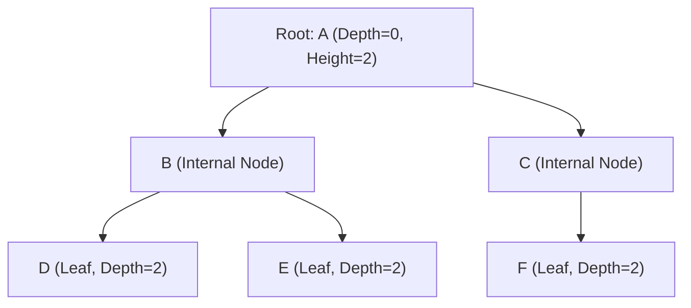
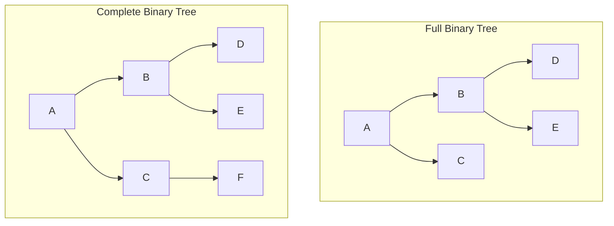
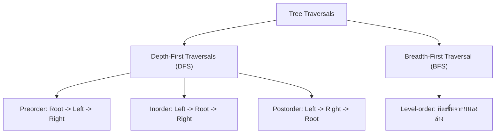

# 🌲 03.1 - Tree Terminology & Binary Trees

> [!NOTE]
> **Tree (ต้นไม้)** คือโครงสร้างข้อมูลแบบลำดับชั้น (Hierarchical Data Structure) ประกอบด้วยกลุ่มของ **Nodes** ที่เชื่อมต่อกันด้วย **Edges** โดยมีโหนดสูงสุดเรียกว่า **Root** และไม่มีวงวน (No Cycles)

---

## 🏛️ 1. คำศัพท์สำคัญเกี่ยวกับต้นไม้ (Tree Terminology for Exams)



- **Root (ราก)**: โหนดบนสุดเดี่ยวของต้นไม้ที่ไม่มี Parent (ในรูปคือ `A`)
- **Parent / Child**: `A` เป็น Parent ของ `B` และ `C`; `B` เป็น Child ของ `A`
- **Siblings (พี่น้อง)**: โหนดที่มี Parent เดียวกัน (`B` และ `C` เป็น Siblings กัน)
- **Leaf Node (ใบ)**: โหนดที่ไม่มี Child เลย (`D`, `E`, `F`)
- **Internal Node**: โหนดที่มี Child อย่างน้อย 1 ตัว
- **Depth (ความลึก)**: จำนวน Edge จาก Root ลงมายังโหนดนั้น (Root มี Depth = 0)
- **Height (ความสูง)**: จำนวน Edge ยาวที่สุดจากโหนดนั้นลงไปยัง Leaf (Leaf มี Height = 0)
- **Degree (ดีกรี)**: จำนวน Child ของโหนดนั้น

---

## 🌴 2. ประเภทของ Binary Tree

**Binary Tree** คือต้นไม้ที่แต่ละโหนดมี Child ได้ **ไม่เกิน 2 ตัว** (Left Child และ Right Child)



1. **Full Binary Tree**: ทุกโหนดมี Child 0 ตัว หรือ 2 ตัวเท่านั้น (ไม่มีโหนดที่มี Child 1 ตัว)
2. **Complete Binary Tree**: ทุก Level ถูกเติมเต็มครบทั้งหมด ยกเว้น Level สุดท้าย แต่ต้องเติมโหนดชิดซ้ายสุดเสมอ (**ใช้ใน Binary Heap**)
3. **Perfect Binary Tree**: ทุก Internal Node มี Child 2 ตัว และทุก Leaf อยู่ที่ Depth เดียวกันทั้งหมด ($N = 2^{h+1} - 1$)

---

## 🔄 3. การท่องไปในต้นไม้ 4 รูปแบบ (Tree Traversals)



>[!EXAMPLE]
> **ตัวอย่างการท่องไปในต้นไม้ (โจทย์ข้อสอบยอดฮิต!)**:
> พิจารณา Binary Tree:
> ```text
>        A
>      /   \
>     B     C
>    / \
>   D   E
> ```
> - **Preorder (Root-Left-Right)**: `A -> B -> D -> E -> C`
> - **Inorder (Left-Root-Right)**: `D -> B -> E -> A -> C` *(ใน BST จะได้ข้อมูลเรียงจากน้อยไปมาก!)*
> - **Postorder (Left-Right-Root)**: `D -> E -> B -> C -> A`
> - **Level-Order (ทีละ Level)**: `A -> B -> C -> D -> E`

---

## 📝 4. สรุปแบบฝึกหัดสร้างต้นไม้ (Assignment 2 Construct Binary Tree)

> [!IMPORTANT]
> **หลักการสร้าง Binary Tree จากลำดับ Traversals (Assignment 2)**:
> 1. **จาก Preorder + Inorder**:
>    - ตัวแรกของ Preorder คือ **Root** เสมอ!
>    - ค้นหา位置ของ Root นั้นใน Inorder $\to$ สมาชิกทางซ้ายของตำแหน่งนั้นคือ **Left Subtree** สมาชิกทางขวาคือ **Right Subtree**
>    - ทำการสร้างสร้างต้นไม้แบบ Recursive ต่อไป
> 2. **จาก Postorder + Inorder**:
>    - ตัวสุดท้ายของ Postorder คือ **Root** เสมอ!

```python
def build_tree_pre_in(preorder, inorder):
    if not preorder or not inorder:
        return None
    root_val = preorder[0]
    root = TreeNode(root_val)
    mid = inorder.index(root_val)
    
    root.left = build_tree_pre_in(preorder[1:mid+1], inorder[:mid])
    root.right = build_tree_pre_in(preorder[mid+1:], inorder[mid+1:])
    return root
```

---

## 🔗 ลิงก์เชื่อมโยงใน Obsidian Wiki
- ก่อนหน้า: [[02.3 - Queues & Circular Array Queues]]
- ถัดไป (BST): [[03.2 - Binary Search Trees (BST) & Insertion]]
- การประยุกต์ใช้ใน Heap: [[04.1 - Priority Queue & Binary Heaps (Min-Heap, Max-Heap)]]
