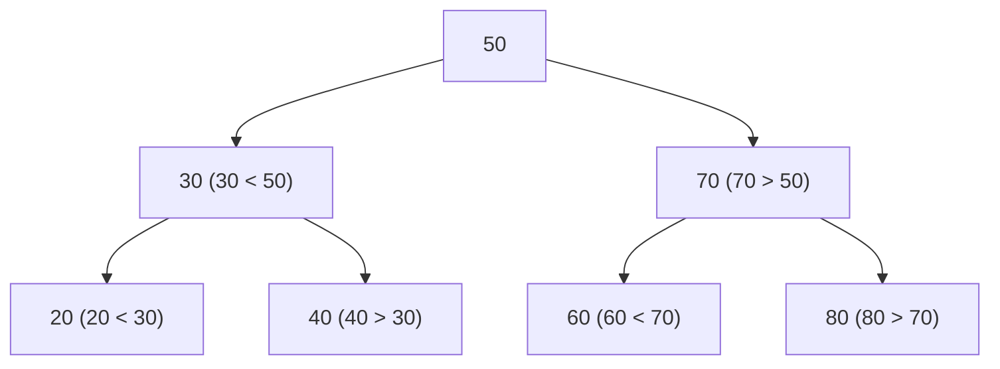
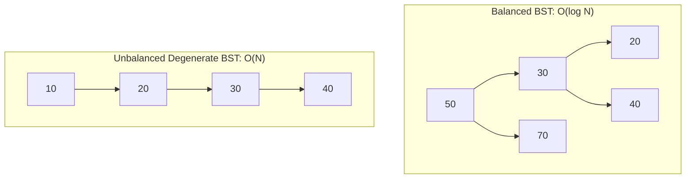

# 🌲 03.2 - Binary Search Trees (BST) & Insertion

> [!NOTE]
> **Binary Search Tree (BST - ต้นไม้ค้นหาแบบทวิภาค)** คือ Binary Tree ที่มีคุณสมบัติพิเศษช่วยให้การค้นหา ข้อมูลทำได้อย่างรวดเร็วในเวลาเฉลี่ย $O(\log N)$

---

## 🏛️ 1. BST Property (คุณสมบัติบังคับของ BST)

สำหรับทุกๆ โหนด $X$ ใน BST:
- ทุกโหนดใน **Subtree ฝั่งซ้าย (Left Subtree)** ต้องมีค่าน้อยกว่า $X$ ($L < X$)
- ทุกโหนดใน **Subtree ฝั่งขวา (Right Subtree)** ต้องมีค่ามากกว่า $X$ ($R > X$)



>[!IMPORTANT]
> **ข้อสังเกตออกสอบบ่อย**: หากนำ BST มาทำการท่องแบบ **Inorder Traversal (Left -> Root -> Right)** ผลลัพธ์ข้อมูลที่ได้ออกมาจะ **เรียงลำดับจากน้อยไปมาก (Sorted Order)** เสมอ!

---

## 🔍 2. อัลกอริทึมการค้นหาและการแทรก (Search & Insertion Algorithms)

### 2.1 Searching in BST $\implies O(h)$
1. เริ่มต้นที่ Root
2. ถ้า `key == root.val` $\to$ เจอแล้ว!
3. ถ้า `key < root.val` $\to$ วิ่งไปค้นใน Subtree ฝั่งซ้าย (`root.left`)
4. ถ้า `key > root.val` $\to$ วิ่งไปค้นใน Subtree ฝั่งขวา (`root.right`)

```python
def search(root, key):
    if root is None or root.val == key:
        return root
    if key < root.val:
        return search(root.left, key)
    return search(root.right, key)
```

### 2.2 Insertion in BST $\implies O(h)$
วิ่งเปรียบเทียบหาตำแหน่ง Leaf ที่เหมาะสมแล้วสร้าง Node ใหม่ไปแปะต่อที่ตำแหน่งนั้น

```python
def insert(root, key):
    if root is None:
        return TreeNode(key)
    if key < root.val:
        root.left = insert(root.left, key)
    elif key > root.val:
        root.right = insert(root.right, key)
    return root
```

---

## ⚖️ 3. การวิเคราะห์ความซับซ้อน (Balanced vs Unbalanced BST)



- **Average Case (Balanced Tree)**: ความสูง $h = \mathcal{O}(\log N)$ $\implies$ Operations Search/Insert/Delete ใช้เวลา $O(\log N)$
- **Worst Case (Degenerate Tree)**: หากใส่ข้อมูลที่เรียงลำดับมาอยู่แล้ว (เช่น `10, 20, 30, 40`) BST จะกลายสภาพเป็น **Linked List** ความสูง $h = \mathcal{O}(N)$ $\implies$ Operations กลายเป็น $O(N)$!

---

## 🔗 ลิงก์เชื่อมโยงใน Obsidian Wiki
- ก่อนหน้า: [[03.1 - Tree Terminology & Binary Trees]]
- ถัดไป (การลบโหนด): [[03.3 - Binary Search Tree Removal (Node Deletion Cases)]]
- ตารางความเร็วรวม: [[Glossary & Complexity Cheat Sheet]]
