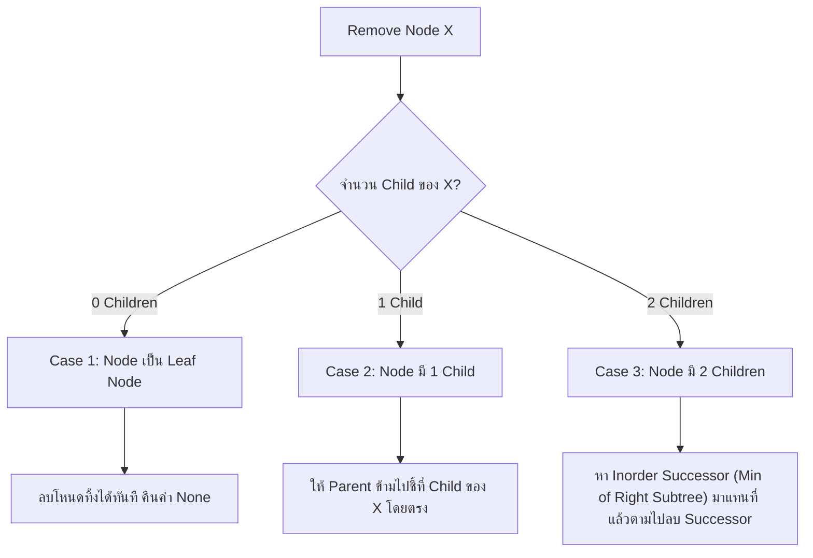
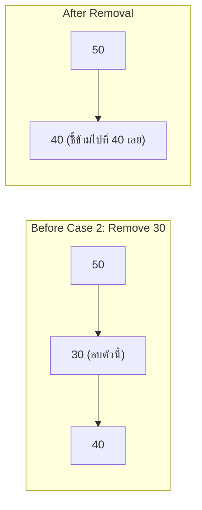
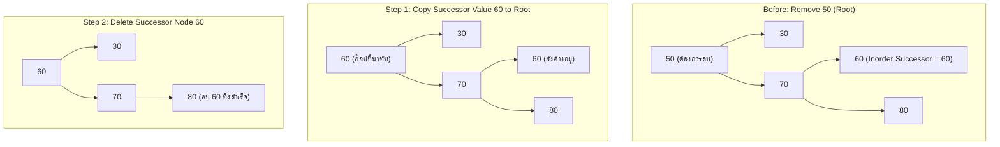

# ✂️ 03.3 - Binary Search Tree Removal (Node Deletion Cases)

> [!NOTE]
> การลบโหนดออกจาก **Binary Search Tree (BST)** เป็นหนึ่งในอัลกอริทึมที่ซับซ้อนที่สุดของ Data Structures เนื่องจากต้องรักษาคุณสมบัติ $L < Node < R$ ไว้เสมอ ออกสอบข้อเขียนและข้อสอบปฏิบัติตามจุดต่างๆ อย่างแน่นอน!

---

## 🏛️ 1. อัลกอริทึมแบ่งตาม 3 กรณี (3 Deletion Cases)

เมื่อต้องการลบโหนด $X$ ออกจาก BST มี 3 กรณีที่เป็นไปได้:



---

## 🔍 2. รายละเอียดและแผนผัง 3 กรณี (Step-by-Step Visual Tracing)

### Case 1: Node ที่ต้องการลบเป็น Leaf (0 Children)
- **การดำเนินการ**: ตัดโหนดนั้นทิ้งได้เลย โดยให้ Parent ชี้ไปที่ `None`

### Case 2: Node ที่ต้องการลบมี Child เพียง 1 ตัว (Single Child)
- **การดำเนินการ**: Bypass Pointer ให้ Parent ชี้ข้ามไปยัง Child ของโหนดนั้นโดยตรง



### Case 3: Node ที่ต้องการลบมี Child ครบทั้ง 2 ตัว (Two Children)
- **การดำเนินการ**:
  1. ค้นหา **Inorder Successor** (โหนดที่มีค่าน้อยที่สุดใน Subtree ฝั่งขวา `min_value_node(node.right)`) หรือ **Inorder Predecessor** (โหนดที่มีค่ามากที่สุดใน Subtree ฝั่งซ้าย)
  2. ก๊อปปี้ค่าของ Inorder Successor มาเขียนทับใส่โหนดที่จะลบ
  3. เรียกอัลกอริทึม `delete_node` ซ้ำเพื่อไปลบโหนด Inorder Successor ดั้งเดิม (ซึ่งจะตกเป็น Case 1 หรือ Case 2 เสมอ!)



---

## 💻 3. Complete Python Code for BST Removal

```python
class TreeNode:
    def __init__(self, val):
        self.val = val
        self.left = None
        self.right = None

def get_min_value_node(node):
    """หาโหนดที่มีค่าน้อยที่สุดใน Subtree (ไปทางซ้ายเรื่อยๆ)"""
    current = node
    while current.left is not None:
        current = current.left
    return current

def delete_node(root, key):
    if root is None:
        return root

    # 1. ท่องไปค้นหาโหนดที่จะลบ
    if key < root.val:
        root.left = delete_node(root.left, key)
    elif key > root.val:
        root.right = delete_node(root.right, key)
    else:
        # 2. เจอโหนดที่ต้องการลบแล้ว! (root.val == key)
        
        # Case 1 & Case 2: มี Child 0 หรือ 1 ตัว
        if root.left is None:
            temp = root.right
            root = None
            return temp
        elif root.right is None:
            temp = root.left
            root = None
            return temp

        # Case 3: มี Child ครบทั้ง 2 ตัว
        # หา Inorder Successor (ค่าน้อยสุดในฝั่งขวา)
        temp = get_min_value_node(root.right)
        
        # คัดลอกค่า Successor มาทับโหนดปัจจุบัน
        root.val = temp.val
        
        # ตามไปลบโหนด Successor ตัวเดิมออก
        root.right = delete_node(root.right, temp.val)

    return root
```

---

## 🔗 ลิงก์เชื่อมโยงใน Obsidian Wiki
- ก่อนหน้า: [[03.2 - Binary Search Trees (BST) & Insertion]]
- เข้าสู่ Module 04: [[04.1 - Priority Queue & Binary Heaps (Min-Heap, Max-Heap)]]
- ตะลุยโจทย์สอบ: [[06.1 - Comprehensive Exam Questions, Tracing & Python Solutions]]
