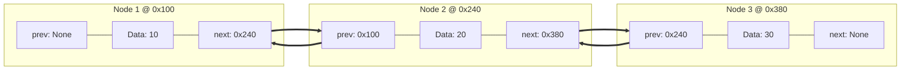
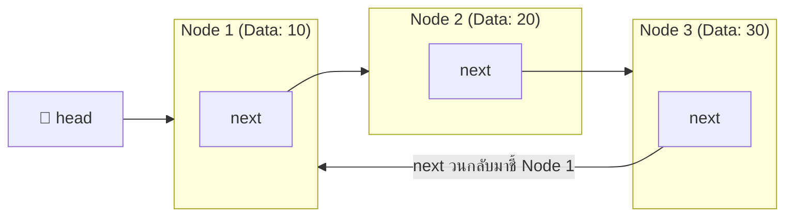
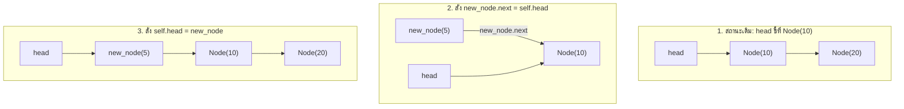
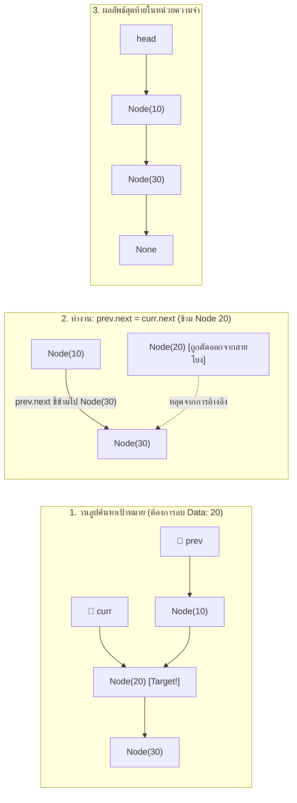
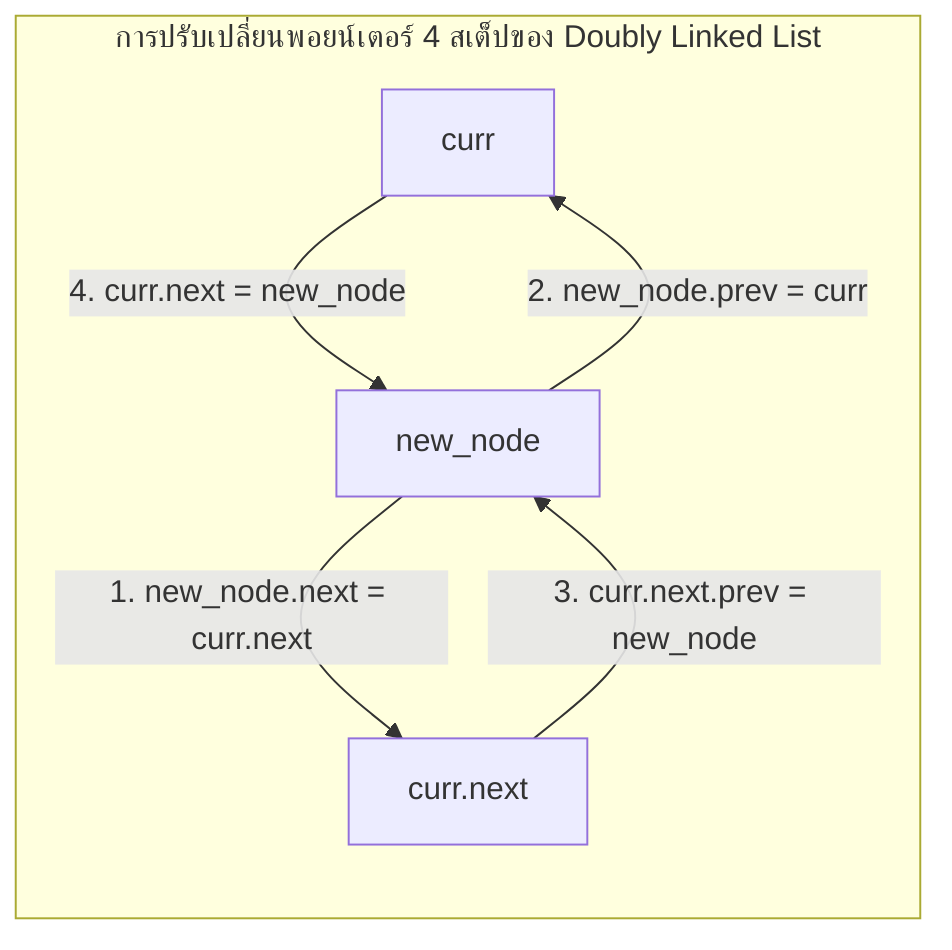
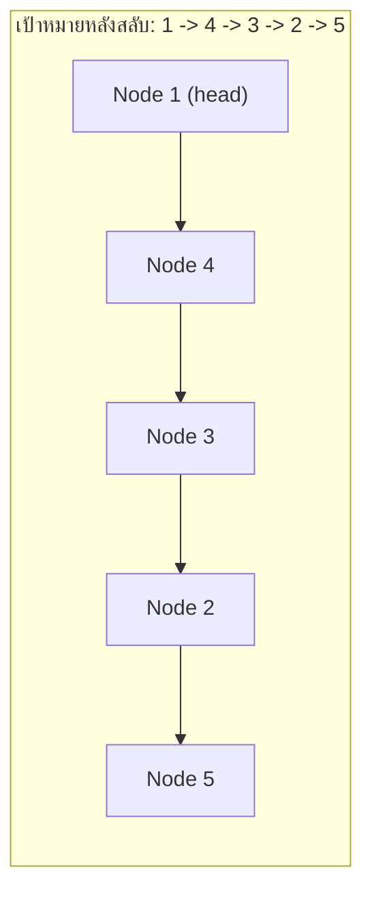

# 🔗 03.1 - Linked Lists (Singly, Doubly, Circular)

> [!NOTE]
> **Linked List (รายการเชื่อมโยง)** คือโครงสร้างข้อมูลเชิงเส้นที่แต่ละสมาชิกเรียกว่า **Node** เชื่อมต่อกันด้วย **Pointer (การอ้างอิงตำแหน่งในหน่วยความจำ)** โดยโหนดไม่จำเป็นต้องอยู่ติดกันใน Memory เหมือน Array แต่ละโหนดจะจองพื้นที่เมื่อต้องการใช้งานจริง ทำให้การแทรกและลบข้อมูลที่ส่วนหัวใช้เวลาเพียง $O(1)$ โดยไม่ต้องขยับเลื่อนข้อมูลทั้งแถว

---

## 🏛️ 1. กายวิภาคของ Node และการเชื่อมต่อ Pointer ในหน่วยความจำ

ในภาษา Python แต่ละ Node คือออบเจกต์ใน Heap Memory ที่มี Address เฉพาะตัว (เช่น `0x100`, `0x240`, `0x380`) การเชื่อมโยงเกิดจากตัวแปร `next` หรือ `prev` เก็บตำแหน่งอ้างอิงของโหนดถัดไป ไม่ใช่การนำค่า Data มาผูกกันโดยตรง

### 1.1 โครงสร้างภายในของ Singly Linked List Node


### 1.2 โครงสร้างภายในของ Doubly Linked List Node (มีทั้ง `prev` และ `next`)


### 1.3 โครงสร้าง Circular Linked List (โหนดสุดท้ายวนกลับมาชี้ Head)


---

## 📊 2. ตารางเปรียบเทียบคุณลักษณะและประสิทธิภาพ Big-O

| คุณลักษณะ | Singly Linked List | Doubly Linked List | Circular Linked List |
| :--- | :--- | :--- | :--- |
| **Pointer ต่อ 1 Node** | 1 ตัว (`next`) | 2 ตัว (`prev`, `next`) | 1 หรือ 2 ตัว (ชี้วนรอบ) |
| **ทิศทางการท่องข้อมูล** | ไปข้างหน้าได้อย่างเดียว (`curr = curr.next`) | ไปข้างหน้าและถอยหลังได้ (`curr.next`, `curr.prev`) | ท่องวนเป็น Loop รอบ List ได้เรื่อยๆ |
| **Memory Overhead** | ปานกลาง ($1 \times \text{pointer}$) | สูงสุด ($2 \times \text{pointers}$) | ปานกลาง |
| **Insert at Head** | $O(1)$ | $O(1)$ | $O(1)$ (หากมี Tail pointer) |
| **Delete at Head** | $O(1)$ | $O(1)$ | $O(1)$ (หากมี Tail pointer) |
| **Delete at Tail** | $O(N)$ (ต้องวนลูปหาตัวก่อน Tail) | $O(1)$ (ใช้ `tail.prev`) | $O(N)$ หรือ $O(1)$ |
| **Delete Node ปัจจุบัน** | $O(N)$ (ต้องหาโหนด `prev` ก่อนหน้า) | $O(1)$ (ปลดพอยน์เตอร์ด้วย `curr.prev` และ `curr.next`) | $O(N)$ |

---

## ✂️ 3. ขั้นตอนการจัดการ Pointer ทีละสเต็ป (Step-by-Step Pointer Transitions)

### 3.1 การแทรกโหนดที่ตำแหน่งหน้าสุด (Insert at Head) $\implies O(1)$
เมื่อต้องการแทรกโหนดใหม่ที่มีค่า `Data: 5` ไว้หน้าสุด:
1. สร้างโหนดใหม่: `new_node = Node(5)`
2. ชี้ `next` ของโหนดใหม่ไปยังโหนดที่ `head` ชี้อยู่: `new_node.next = self.head`
3. เลื่อนตัวแปร `head` ให้ชี้มาที่โหนดใหม่: `self.head = new_node`



---

### 3.2 การลบโหนดตรงกลางด้วยการตรวจสอบ `prev` และ `curr` (Remove Middle Node by Value) $\implies O(N)$

> [!IMPORTANT]
> **หัวใจสำคัญของการลบโหนดใน Singly Linked List**:
> เราต้องใช้พอยน์เตอร์ 2 ตัวคู่กันเสมอ คือ `curr` (โหนดที่กำลังตรวจสอบ) และ `prev` (โหนดก่อนหน้า)
> 1. หากพบโหนดเป้าหมายที่ `curr`: เราจะสั่ง **`prev.next = curr.next`** เพื่อให้พอยน์เตอร์ `next` ของโหนดก่อนหน้ากระโดดข้าม `curr` ไปยังโหนดถัดไปทันที
> 2. ตัวแปร `curr` จะหลุดออกจากสายโยง และ Python Garbage Collector จะเก็บกวาดหน่วยความจำให้อัตโนมัติ



---

### 3.3 การแทรกโหนดใน Doubly Linked List (อัปเดต 4 พอยน์เตอร์) $\implies O(1)$
เมื่อต้องการแทรกโหนด `new_node` ระหว่าง `curr` และ `curr.next`:
1. `new_node.next = curr.next` (โหนดใหม่ชี้ไปตัวถัดไป)
2. `new_node.prev = curr` (โหนดใหม่ชี้กลับมาที่ตัวปัจจุบัน)
3. `curr.next.prev = new_node` (ตัวถัดไปชี้ `prev` กลับมาหาโหนดใหม่)
4. `curr.next = new_node` (ตัวปัจจุบันชี้ `next` ไปหาโหนดใหม่)



---

## 💻 4. โค้ดภาษา Python ฉบับสมบูรณ์พร้อม Tracing ชัดเจน (Full Implementation)

ทดลองศึกษาและรันโค้ดด้านล่างนี้ได้โดยตรง:

```python
class Node:
    """โครงสร้าง Node สำหรับ Singly Linked List"""
    def __init__(self, data):
        self.data = data
        self.next = None

    def __repr__(self):
        return f"Node({self.data})"


class SinglyLinkedList:
    """คลาสจัดการ Singly Linked List พร้อมเมธอด Insert, Remove, Search"""
    def __init__(self):
        self.head = None
        self.size = 0

    def is_empty(self) -> bool:
        return self.head is None

    def add_first(self, item):
        """แทรกข้อมูลที่หน้าสุดของ List -> O(1)"""
        new_node = Node(item)
        new_node.next = self.head
        self.head = new_node
        self.size += 1
        print(f"[add_first] แทรก {item} ไว้ที่ Head เรียบร้อย (size = {self.size})")

    def append(self, item):
        """แทรกข้อมูลต่อท้าย List -> O(N)"""
        new_node = Node(item)
        if self.is_empty():
            self.head = new_node
        else:
            curr = self.head
            while curr.next is not None:
                curr = curr.next
            curr.next = new_node
        self.size += 1
        print(f"[append] เพิ่ม {item} ต่อท้าย List (size = {self.size})")

    def insert_at(self, index: int, item):
        """แทรกข้อมูล ณ ดรรชนี index ที่ระบุ -> O(N)"""
        if index <= 0 or self.is_empty():
            self.add_first(item)
            return

        if index >= self.size:
            self.append(item)
            return

        # วนลูปหาตำแหน่ง prev และ curr
        prev = None
        curr = self.head
        for _ in range(index):
            prev = curr
            curr = curr.next

        new_node = Node(item)
        new_node.next = curr
        prev.next = new_node
        self.size += 1
        print(f"[insert_at] แทรก {item} ที่ตำแหน่ง index={index} (prev={prev.data}, curr={curr.data})")

    def remove(self, target) -> bool:
        """ค้นหาและลบโหนดแรกที่มี data == target -> O(N)"""
        if self.is_empty():
            print(f"[remove] ล้มเหลว: List ว่างเปล่า ไม่สามารถลบ {target} ได้")
            return False

        # กรณีที่ 1: โหนดเป้าหมายอยู่ที่ Head
        if self.head.data == target:
            deleted_node = self.head
            self.head = self.head.next
            self.size -= 1
            print(f"[remove] ลบโหนด Head ({target}) สำเร็จ! head ขยับไปที่ {self.head}")
            return True

        # กรณีที่ 2: วนลูปค้นหาด้วยตัวชี้คู่ (prev และ curr)
        prev = self.head
        curr = self.head.next

        while curr is not None and curr.data != target:
            prev = curr
            curr = curr.next

        # ถ้า curr ไม่ใช่ None แสดงว่าพบโหนดเป้าหมาย
        if curr is not None:
            # หัวใจสำคัญ: เชื่อมข้ามโหนด curr
            prev.next = curr.next
            self.size -= 1
            print(f"[remove] ลบโหนด ({target}) สำเร็จ! โดยสั่ง prev({prev.data}).next = curr.next({curr.next})")
            return True

        print(f"[remove] ไม่พบข้อมูล {target} ใน List")
        return False

    def search(self, target) -> int:
        """ค้นหาตำแหน่ง index ของข้อมูล -> O(N)"""
        curr = self.head
        idx = 0
        while curr is not None:
            if curr.data == target:
                return idx
            curr = curr.next
            idx += 1
        return -1

    def print_diagram(self):
        """พิมพ์แผนผังจำลองโครงสร้างหน่วยความจำ"""
        nodes = []
        curr = self.head
        while curr:
            nodes.append(f"[{curr.data} | next]")
            curr = curr.next
        nodes.append("None")
        print("head -> " + " ---> ".join(nodes))


# --- ตัวอย่างการทดสอบใช้งานจริง (Test Drive) ---
if __name__ == "__main__":
    ll = SinglyLinkedList()
    
    # 1. ทดสอบการแทรก
    ll.append(10)
    ll.append(20)
    ll.append(30)
    ll.add_first(5)
    ll.insert_at(2, 15)
    ll.print_diagram()

    # 2. ทดสอบการค้นหา
    pos = ll.search(20)
    print(f"ค่า 20 อยู่ที่ index: {pos}")

    # 3. ทดสอบการลบโหนดตรงกลาง (ใช้ prev และ curr)
    ll.remove(20)
    ll.print_diagram()

    # 4. ทดสอบลบตัวหน้าสุด
    ll.remove(5)
    ll.print_diagram()
```

---

## 🎯 5. ตะลุยกรณีพิเศษที่พบบ่อยในข้อสอบ (Exam Edge Cases)

> [!CAUTION]
> **3 จุดผิดยอดฮิตที่ทำให้โค้ดเกิด `AttributeError: 'NoneType' object has no attribute 'next'`**:
> 1. **ลืมเช็ค List ว่าง (`self.head is None`)**: ก่อนจะเรียก `self.head.next` ต้องมั่นใจว่า `self.head` ไม่ใช่ `None` เสมอ
> 2. **ลืมอัปเดต `head` เมื่อลบโหนดแรก**: หากโหนดเป้าหมายอยู่ที่ตัวแรกสุด การสั่ง `prev.next = curr.next` จะ Error เพราะ `prev` ยังเป็น `None` ต้องแยกเคส `self.head = self.head.next` โดยเฉพาะ
> 3. **การหลุดขอบ (Out of Bounds) ใน While Loop**: เงื่อนไข `while curr and curr.next:` ใช้เมื่อต้องการหยุดที่โหนดสุดท้าย แต่ถ้าต้องการท่องครบทุกโหนด ต้องใช้ `while curr:`

---

## 📝 6. ข้อสอบจริง: การสลับ Pointer ขั้นสูง (Pointer Reconnection Exam Problem)

ข้อสอบข้อเขียนและภาคปฏิบัติจากโจทย์จริง (`Exams/LinkedList/612037.py`):

### 6.1 โจทย์ปัญหา
กำหนด Singly Linked List ที่มีข้อมูลเริ่มต้นเรียงจากน้อยไปมาก:
$$\text{head} \to [0] \to [1] \to [2] \to [3] \to [6] \to [7] \to \text{None}$$
ให้นักศึกษาอ้างอิง Pointer ไปยังโหนดต่างๆ ดังนี้:
- `node1` ชี้ที่ `[0]` (Head เดิม)
- `node2` ชี้ที่ `[1]`
- `node3` ชี้ที่ `[2]`
- `node4` ชี้ที่ `[3]`
- `node5` ชี้ที่ `[6]`
- `node6` ชี้ที่ `[7]`

จงหาผลลัพธ์ของ Linked List หลังจากสั่งคำสั่ง Pointer Reconnection ต่อไปนี้:
```python
node6.set_next(node2)  # [7] ชี้ข้ามไปหา [1]
node5.set_next(node1)  # [6] ชี้กลับไปหา [0]
node1.set_next(None)   # [0] ตัดสาย ให้เป็นตัวจบแถว (Tail)
mylist.head = node6    # ย้าย Head ให้มาเริ่มต้นที่ [7]
```

### 6.2 วิเคราะห์ Step-by-Step ด้วยกราฟ


ผลลัพธ์ที่พิมพ์ออกมาได้คือ:
$$\mathbf{7 \implies 1 \implies 2 \implies 3 \implies 6 \implies 0}$$

### 6.3 โค้ดทดสอบจริงรันได้ทันที

```python
class Node:
    def __init__(self, data):
        self.data = data
        self.next = None

    def get_next(self):
        return self.next

    def set_next(self, new_next):
        self.next = new_next


class LinkedList:
    def __init__(self):
        self.head = None

    def add(self, item):
        new_node = Node(item)
        new_node.set_next(self.head)
        self.head = new_node

    def insert(self, item, pos):
        if pos == 0:
            self.add(item)
            return
        curr = self.head
        for _ in range(pos - 1):
            curr = curr.get_next()
        new_node = Node(item)
        new_node.set_next(curr.get_next())
        curr.set_next(new_node)

    def print_list(self):
        curr = self.head
        res = []
        while curr is not None:
            res.append(str(curr.data))
            curr = curr.get_next()
        print(" -> ".join(res) + " -> None")


if __name__ == "__main__":
    mylist = LinkedList()
    # สร้าง List: 0, 1, 2, 3, 6, 7
    mylist.add(6)
    mylist.add(1)
    mylist.insert(2, 2)
    mylist.add(0)
    mylist.insert(3, 4)
    mylist.insert(7, 6)

    print("📋 ลิสต์ก่อนสลับ Pointer:")
    mylist.print_list()

    # ระบุตัวแปรชี้แต่ละโหนดตามโจทย์ข้อสอบ
    node1 = mylist.head                  # 0
    node2 = node1.get_next()             # 1
    node3 = node2.get_next()             # 2
    node4 = node3.get_next()             # 3
    node5 = node4.get_next()             # 6
    node6 = node5.get_next()             # 7

    # สลับ Pointer 4 ขั้นตอน
    node6.set_next(node2)
    node5.set_next(node1)
    node1.set_next(None)
    mylist.head = node6

    print("\n✅ ลิสต์หลังสลับ Pointer (ตรงตามเฉลยข้อสอบ):")
    mylist.print_list()
```

---

## 📝 7. แบบฝึกหัดในห้องเรียน 8 ข้อจริง & กฎเหล็ก 5 ข้อ (Classroom 8 Questions & Golden Rules)

> [!INFO]
> **ที่มาของเอกสารต้นฉบับ**: เอกสารใบงานในห้องเรียนจริง `New-Lectures/examp_linked_list_1.jpg`, `New-Lectures/examp_linked_list_2.jpg`, `Lectures/Lecture 3 Linked List/For example.pdf`, และ `New-Lectures/linklist ex169 Edit1.pdf`

---

### 🚨 กฎเหล็ก 5 ข้อสำหรับการเขียนคำตอบ Linked List ในห้องสอบ

1. 🚫 **ห้ามใช้ `insert(item, 0)` โดยเด็ดขาด** (การแทรกที่หัวแถวต้องใช้ `add(item)` เท่านั้น)
2. 🎯 **หากโจทย์สั่ง `remove` ต้องคำนึงถึงเงื่อนไขการลบโหนดแรกที่พบตาม Logic ที่เรียน**
3. ⏱️ **หากโจทย์ซับซ้อนเกินกว่าจะใช้คำสั่งเดียว ให้เขียนลำดับคำสั่ง (Sequence of Operations) ให้ถูกต้องตามลำดับ**
4. 🏗️ **กำหนดตอนเริ่มต้นให้ `mylist = LinkedList()`**
5. 🛡️ **ใช้เฉพาะ `class LinkedList`, `class Node` และ method ที่เรียนเท่านั้น** โดยห้ามพึ่งพาตัวแปรโครงสร้างอื่น เช่น Python List, Dict, หรือ Set

---

### 📸 ภาพใบงานต้นฉบับจากห้องเรียน (Original Classroom Worksheets)

<div style="display: grid; grid-template-columns: 1fr 1fr; gap: 16px; margin: 16px 0;">
  <div style="background: rgba(15, 23, 42, 0.6); padding: 12px; border-radius: 12px; border: 1px solid var(--border);">
    <div style="font-size: 12px; font-weight: 700; color: #38bdf8; margin-bottom: 8px;">📄 ใบงานข้อ 1 - 5 + กฎเหล็ก</div>
    
  </div>
  <div style="background: rgba(15, 23, 42, 0.6); padding: 12px; border-radius: 12px; border: 1px solid var(--border);">
    <div style="font-size: 12px; font-weight: 700; color: #38bdf8; margin-bottom: 8px;">📄 ใบงานข้อ 6 - 8 (Pointer Bypass)</div>
    
  </div>
</div>

---

### 🎯 เฉลยละเอียดและโค้ดคำตอบที่ถูกต้อง 100% (ข้อ 1 - 8)

| ข้อที่ | สถานะเริ่มต้น $\implies$ ผลลัพธ์เป้าหมาย | เงื่อนไขที่อาจารย์กำหนด | โค้ดคำตอบที่ถูกต้อง ชัดเจน (Python Statements) | คำอธิบายตรรกะเบื้องหลัง |
| :---: | :--- | :--- | :--- | :--- |
| **1** | `[]` $\implies$ `[10, 20, 30]` | เริ่มจาก LinkedList ว่าง ให้ใช้ `add` และ `insert` | ```python<br>mylist.add(10)<br>mylist.insert(20, 1)<br>mylist.insert(30, 2)<br>``` | หากใช้ `add` ทุกตัว จะได้ลิสต์กลับด้านเป็น `[30, 20, 10]` จึงต้องใช้ `add(10)` ที่ตำแหน่งหัว แล้วใช้ `insert` แทรกต่อท้ายตาม index |
| **2** | `[1, 2, 3, 4]` $\implies$ `[2, 3, 4]` | ลบโหนดที่ 1 (Index 0) | ```python<br>mylist.remove(1)<br>``` | เมธอด `remove(item)` รับค่า Data ของโหนดที่ต้องการลบ ในที่นี้คือลบค่า 1 ซึ่งอยู่ตำแหน่งแรก |
| **3** | `[A, B, C, D]` $\implies$ `[A, C, B, D]` | สลับตำแหน่ง B และ C โดย**ห้ามแก้ข้อมูลในโหนด** ให้ใช้ `remove` กับ `insert` | ```python<br>mylist.remove("B")<br>mylist.insert("B", 2)<br>``` | ลบ `"B"` ออกจากตำแหน่ง index 1 ทำให้ลิสต์เหลือ `[A, C, D]` จากนั้นแทรก `"B"` เข้าไปที่ index 2 กลายเป็น `[A, C, B, D]` |
| **4** | `[1, 2, 1, 3]` $\implies$ `[2, 1, 3]` | มีข้อมูลซ้ำซ้อน ต้องการลบ 1 ตัวแรก | ```python<br>mylist.remove(1)<br>``` | กลไก `remove()` จะหยุดค้นหาและลบโหนดทันทีที่เจอค่าตรงกันเป็นตัวแรก |
| **5** | `[1, 2, 1, 3]` $\implies$ `[1, 2, 3]` | ลบเลข 1 ทั้งสองตัว แล้วนำ 1 กลับไปไว้ที่หัว | ```python<br>mylist.remove(1)<br>mylist.remove(1)<br>mylist.add(1)<br>``` | ลบ 1 ครั้งแรกเหลือ `[2, 1, 3]` ลบ 1 ครั้งที่สองเหลือ `[2, 3]` จากนั้นสั่ง `add(1)` เพิ่ม 1 กลับเข้าหัวแถว |
| **6** | `[A, B, C]` $\implies$ `[A, C]` | ลบ B ออกโดย**การตัดต่อพอยน์เตอร์ ห้ามใช้ method remove** | ```python<br>mylist.head.set_next(mylist.head.get_next().get_next())<br># หรือ mylist.head.next = mylist.head.next.next<br>``` | ให้ `next` ของโหนด A ข้ามโหนด B ไปชี้ที่โหนด C โดยตรง ทำให้โหนด B หลุดออกจากเส้นทาง |
| **7** | `[A, B, C, D]` $\implies$ `[A, D]` | ลบ B และ C ออกโดย**การตัดต่อพอยน์เตอร์ ห้ามใช้ method remove** | ```python<br>node = mylist.head<br>node.set_next(node.get_next().get_next().get_next())<br># หรือ mylist.head.next = mylist.head.next.next.next<br>``` | ให้ `next` ของโหนดหัว (A) กระโดดข้ามไป 3 สเต็ปเพื่อไปชี้โหนด D โดยตรง |
| **8** | `[A, B, C]` $\implies$ `[A, X, B, C]` | เพิ่ม X เข้าไปถัดจาก A โดย**การเชื่อมต่อพอยน์เตอร์ ห้ามใช้ method insert** | ```python<br>node = Node("X")<br>node.set_next(mylist.head.get_next())<br>mylist.head.set_next(node)<br>``` | 1. ชี้ `next` ของโหนดใหม่ X ไปที่โหนด B (`head.get_next()`) ก่อน<br>2. เปลี่ยน `next` ของโหนด A ให้มาชี้ที่ X |

---

### ✂️ 7.2 การสลับโหนด (Node Pointer Swapping) สลับโหนด 2 และ 4 โดยไม่แตะ Data

> [!IMPORTANT]
> **โจทย์จากชีท `linklist ex169 Edit1.pdf` หน้า 2-3**:
> มีลิสต์เริ่มต้น: `mylist.head -> [1] -> [2] -> [3] -> [4] -> [5]`
> ต้องการให้ได้ผลลัพธ์: `mylist.head -> [1] -> [4] -> [3] -> [2] -> [5]`
> **กฎข้อสอบ**: ให้เปลี่ยนเฉพาะเส้นชี้ของ Node เท่านั้น **ห้ามสลับค่า `.data`**



#### 💻 ลำดับคำสั่ง 4 สเต็ปที่ถูกต้อง (The 4 Pointer Statements):
```python
# สมมติมีตัวแปร node1, node2, node3, node4, node5 ชี้แต่ละโหนด
node1 = mylist.head             # ชี้ Node 1
node2 = node1.get_next()        # ชี้ Node 2
node3 = node2.get_next()        # ชี้ Node 3
node4 = node3.get_next()        # ชี้ Node 4
node5 = node4.get_next()        # ชี้ Node 5

# ขั้นตอนการสลับพอยน์เตอร์:
node1.next = node4   # สเต็ป 1: Node 1 หันไปชี้ Node 4
node4.next = node3   # สเต็ป 2: Node 4 หันไปชี้ Node 3
node3.next = node2   # สเต็ป 3: Node 3 หันไปชี้ Node 2
node2.next = node5   # สเต็ป 4: Node 2 หันไปชี้ Node 5
```

---

### 🧠 7.3 เหตุผลในชีวิตจริง: ทำไมต้องตัดต่อพอยน์เตอร์? ทำไมห้ามสลับ `.data`?

นักศึกษามักสงสัยว่า ทำไมไม่เขียนง่ายๆ แบบนี้:
```python
# โค้ดมักง่าย (ห้ามทำในห้องสอบ!):
temp = node2.data
node2.data = node4.data
node4.data = temp
```

> [!CAUTION]
> **กับดักอาจารย์ (0 คะแนนทันที!)**:
> หากทำข้อสอบด้วยการสลับ `.data` อาจารย์ระบุชัดเจนว่าจะได้ **0 คะแนน** เนื่องจากผิดวัตถุประสงค์ของวิชา Data Structure!

#### เหตุผลทางวิศวกรรมคอมพิวเตอร์ 3 ข้อ:
1. **ขนาดของข้อมูล (Data Size ในหน่วยความจำ)**:
   - ในโจทย์เรียน ข้อมูลอาจเป็นตัวเลขสั้นๆ เช่น 1, 2, 3
   - แต่ในชีวิตจริง `.data` ของโหนดหนึ่งอาจเป็น **ประวัติลูกค้าทั้งคน** (รูปถ่าย, ประวัติการแพทย์, อาร์เรย์ซ้อนอาร์เรย์ขนาดหลายสิบ MB)
   - **ถ้าสลับพอยน์เตอร์ (`.next`)**: คอมพิวเตอร์เพียงแค่ย้าย Memory Address ขนาด 64 บิต (8 Bytes) ใช้เวลา $O(1)$ เท่ากันเสมอไม่ว่าข้อมูลจะใหญ่แค่ไหน
   - **ถ้าสลับข้อมูล (`.data`)**: คอมพิวเตอร์ต้องคัดลอกข้อมูลมหาศาลย้ายไปมาใน RAM ทำให้ระบบหน่วงและสิ้นเปลืองทรัพยากร
2. **วัตถุประสงค์ของโครงสร้าง Linked List**:
   - Linked List ถูกสร้างขึ้นมาเพื่อแก้จุดอ่อนของ Array (ที่เวลาแทรก/ลบต้องเลื่อนขยับข้อมูลทั้งแถว)
   - จุดเด่นของมันคือ **"ข้อมูลอยู่ที่เดิม แต่เปลี่ยนเส้นทางเดิน"**
3. **พื้นฐานสำหรับ Tree และ Graph**:
   - การฝึกสมองให้คิดแบบ Pointer Logic เป็นรากฐานสำคัญในการไปเรียนโครงสร้างต้นไม้และกราฟ ซึ่งไม่มีทางสลับข้อมูลข้ามกิ่งได้เลย ต้องจัดการเส้นเชื่อมเท่านั้น

---

#### 🖥️ ตัวอย่างหน้าจอ Interface การจำลองการทำงาน Linked List (Interactive Studio Preview)
```console
============================================================
           LINKED LIST POINTER DEBUGGER (STUDIO)            
============================================================
[State 0: Initial]  Head -> [1|0x100] -> [2|0x140] -> [3|0x180] -> [4|0x1C0] -> [5|0x200] -> None
[Action: Pointer Swap Node 2 <-> Node 4]
 Step 1: node1.next = node4 (0x1C0)  [1] points to [4]
 Step 2: node4.next = node3 (0x180)  [4] points to [3]
 Step 3: node3.next = node2 (0x140)  [3] points to [2]
 Step 4: node2.next = node5 (0x200)  [2] points to [5]
------------------------------------------------------------
[Final Result]      Head -> [1] -> [4] -> [3] -> [2] -> [5] -> None
[Validation]        Memory Data Preserved: 100% | Pointer Retargeting: Success!
============================================================
```

---

## 🔗 ลิงก์เชื่อมโยงใน Obsidian Wiki
- ก่อนหน้า: [[02.1 - Python Review & Object-Oriented Programming (OOP)]]
- ถัดไป (Stack): [[04.1 - Stacks & Applications (Infix, Postfix, Parentheses)]]
- คลังข้อสอบปฏิบัติการ: [[11.1 - Midterm Real Exam Mock & Solutions]]
- ตารางความเร็วรวม: [[Glossary & Complexity Cheat Sheet]]

