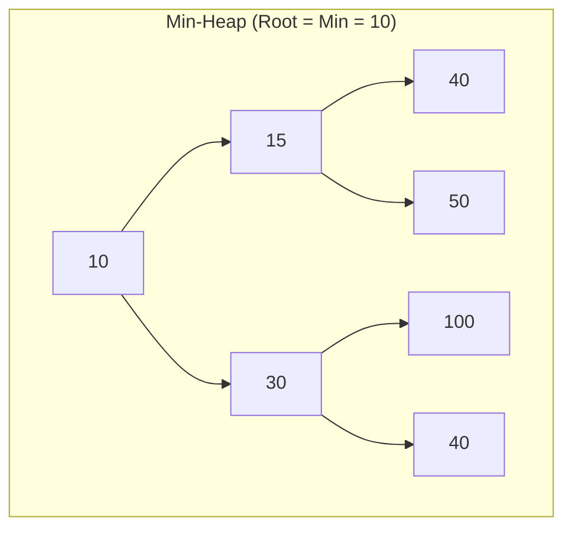
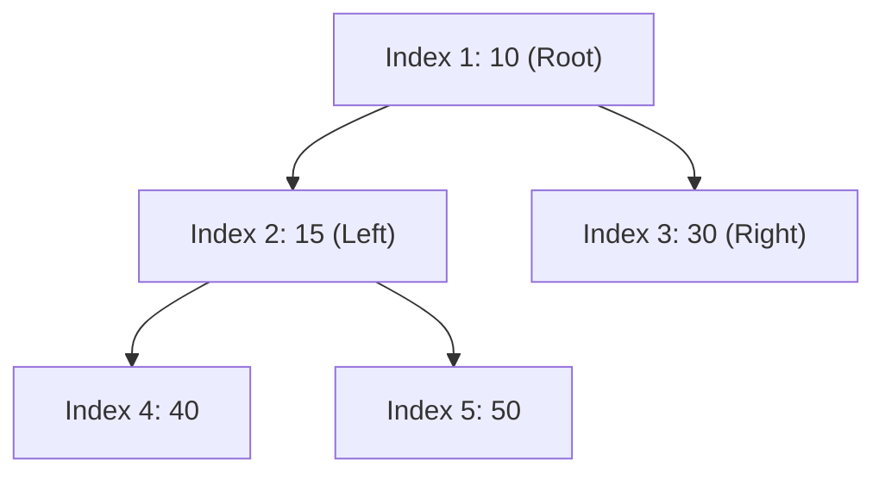
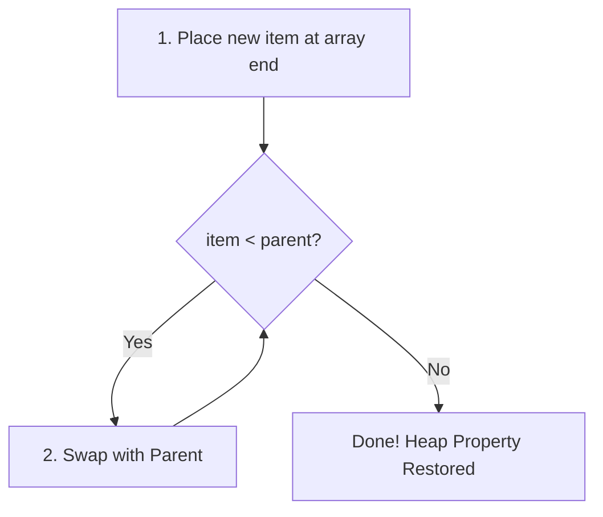

# ⚡ 04.1 - Priority Queue & Binary Heaps (Min-Heap, Max-Heap)

> [!NOTE]
> **Priority Queue (คิวลำดับความสำคัญ)** คือ ADT ที่คืนค่าตัวเลขที่มีความสำคัญสูงสุดก่อนเสมอ โดยนิยมสร้างด้วยโครงสร้างข้อมูล **Binary Heap** ซึ่งค้นหาค่าน้อยสุด/มากสุดได้ใน $O(1)$ และ Insert/DeleteMin ได้ใน $O(\log N)$

---

## 🏛️ 1. คุณสมบัติของ Binary Heap (Min-Heap vs Max-Heap)

Binary Heap ต้องมีคุณสมบัติสมบูรณ์ 2 ประการ:
1. **Structure Property**: ต้องเป็น **Complete Binary Tree** (โหนดถูกเติมเต็มครบทุกชั้น ยกเว้นชั้นสุดท้ายที่ต้องเติมชิดซ้ายเสมอ)
2. **Heap-Order Property**:
   - **Min-Heap**: Value ของ Parent ต้อง $\le$ Value ของ Children เสมอ (Root คือค่าน้อยที่สุด)
   - **Max-Heap**: Value ของ Parent ต้อง $\ge$ Value ของ Children เสมอ (Root คือค่ามากที่สุด)



---

## 📐 2. การจัดเก็บ Heap ด้วย Array (1-Based vs 0-Based Indexing)

เนื่องจาก Heap เป็น Complete Binary Tree เราสามารถจัดเก็บใน **Array** ได้อย่างสมบูรณ์แบบโดยไม่ต้องใช้ Pointer!



### 2.1 สูตรการคำนวณตำแหน่ง Index (ออกสอบแน่นอน!)

| ความสัมพันธ์ | 1-based Indexing (นิยมในวิชาเรียน) | 0-based Indexing (นิยมใน Python Code) |
| :--- | :--- | :--- |
| **Parent Index** ของโหนด $i$ | `parent(i) = i // 2` | `parent(i) = (i - 1) // 2` |
| **Left Child Index** ของโหนด $i$ | `left(i) = 2 * i` | `left(i) = 2 * i + 1` |
| **Right Child Index** ของโหนด $i$ | `right(i) = 2 * i + 1` | `right(i) = 2 * i + 2` |

---

## 🔄 3. อัลกอริทึม Heap Operations (Percolate Up & Percolate Down)

### 3.1 Insertion (Percolate Up / Swim) $\implies O(\log N)$
1. แปะ Element ใหม่ลงที่ **ตำแหน่งท้ายสุดของ Array** (เพื่อรักษา Complete Tree)
2. เปรียบเทียบกับ Parent: หากค่าน้อยกว่า Parent (สำหรับ Min-Heap) ให้ **สลับตำแหน่ง (Swap)** ขึ้นไปเรื่อยๆ จนกว่าจะถูกต้อง



### 3.2 DeleteMin (Percolate Down / Sink) $\implies O(\log N)$
1. เก็บค่า Root (Min) ไว้เพื่อคืนค่า
2. นำ **Element ตัวสุดท้ายของ Array มาสลับแทนที่ Root**
3. ลบตำแหน่งตัวสุดท้ายทิ้ง
4. เปรียบเทียบโหนดปัจจุบันกับ **Child ที่มีค่าน้อยที่สุด**: ถ้าโหนดปัจจุบันมีค่ามากกว่า ให้ **สลับตำแหน่ง (Swap)** ลงไปเรื่อยๆ จนกว่าจะถูกต้อง

---

## 💻 4. Python Implementation of Min-Heap

```python
class MinHeap:
    def __init__(self):
        self.heap = []

    def push(self, val):
        """Insert element and Percolate Up"""
        self.heap.append(val)
        self._percolate_up(len(self.heap) - 1)

    def pop(self):
        """DeleteMin element and Percolate Down"""
        if not self.heap:
            raise IndexError("Pop from empty heap")
        if len(self.heap) == 1:
            return self.heap.pop()
        
        root_val = self.heap[0]
        self.heap[0] = self.heap.pop()  # เอาตัวสุดท้ายมาไว้ Root
        self._percolate_down(0)
        return root_val

    def _percolate_up(self, idx):
        parent = (idx - 1) // 2
        while idx > 0 and self.heap[idx] < self.heap[parent]:
            self.heap[idx], self.heap[parent] = self.heap[parent], self.heap[idx]
            idx = parent
            parent = (idx - 1) // 2

    def _percolate_down(self, idx):
        n = len(self.heap)
        while 2 * idx + 1 < n:
            left = 2 * idx + 1
            right = 2 * idx + 2
            smallest = left
            
            if right < n and self.heap[right] < self.heap[left]:
                smallest = right
                
            if self.heap[idx] <= self.heap[smallest]:
                break
                
            self.heap[idx], self.heap[smallest] = self.heap[smallest], self.heap[idx]
            idx = smallest
```

---

## 📝 5. สรุปแบบฝึกหัด (Assignment 3 Binary Heap Summary)

> [!IMPORTANT]
> **ประเด็นสำคัญจาก Assignment 3 Binary Heap (In-class)**:
> 1. **การสร้าง Heap จากอาร์เรย์ (Build Heap / Heapify)**:
>    - การทำ `heapify()` จากอาร์เรย์เดิม ใช้เวลาเพียง **$O(N)$** ไม่ใช่ $O(N \log N)$ โดยเริ่มสั่ง `percolate_down` จากโหนด `i = N // 2` ย้อนกลับขึ้นมาหา Root (0)
> 2. **ข้อควรระวังในห้องสอบเรื่อง 1-based vs 0-based**:
>    - ในข้อสอบกระดาษ หากอาจารย์ใช้ 1-based indexing: `Root = Index 1`, `Left = 2i`, `Right = 2i+1`, `Parent = i//2`
>    - หากในโค้ด Python (0-based): `Root = Index 0`, `Left = 2i+1`, `Right = 2i+2`, `Parent = (i-1)//2`

---

## 🔗 ลิงก์เชื่อมโยงใน Obsidian Wiki
- ก่อนหน้า: [[03.3 - Binary Search Tree Removal (Node Deletion Cases)]]
- ถัดไป (Hashing): [[04.2 - Hash Tables & Collision Resolution Strategies]]
- การประยุกต์ใช้ใน Heap Sort: [[05.1 - Sorting Algorithms (Bubble, Selection, Insertion, Merge, Quick)]]
- การประยุกต์ใช้ใน Dijkstra: [[05.3 - Shortest Path Algorithms (Dijkstra, Unweighted Shortest Path)]]
