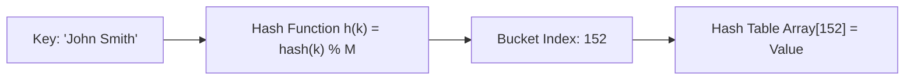
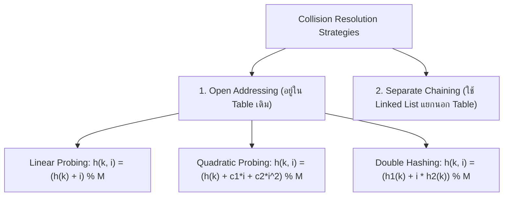

# 🔑 04.2 - Hash Tables & Collision Resolution Strategies

> [!NOTE]
> **Hash Table (ตารางแฮช)** คือโครงสร้างข้อมูลที่ให้ความเร็วในการค้นหา แทรก และลบข้อมูลได้ในเวลาเฉลี่ย **$O(1)$** ผ่านการแปลง Key เป็น Index ด้วย **Hash Function**

---

## 🏛️ 1. หลักการทำงานของ Hash Function & Collision

- **Collision (การชนกันของข้อมูล)**: เกิดขึ้นเมื่อ Key ต่างกัน 2 ตัว ถูกแฮชได้ตำแหน่ง Index ใน Hash Table ตรงกัน ($h(k_1) == h(k_2)$)

---

## ⚔️ 2. กลยุทธ์การแก้ปัญหาการชนกัน (Collision Resolution Strategies)

### 2.1 Open Addressing Techniques

1. **Linear Probing**: ขยับหาช่องว่างถัดไปทีละ 1 ช่อง ($+1, +2, +3, \dots$)
   - **ข้อเสียหลัก**: เกิดปัญหา **Primary Clustering** (การกระจุกตัวของข้อมูลเป็นก้อนยาวๆ ทำให้ค้นหาช้าลง)
2. **Quadratic Probing**: ขยับหาช่องว่างแบบยกกำลังสอง ($+1^2, +2^2, +3^2, \dots$)
   - **ข้อเสีย**: เกิดปัญหา **Secondary Clustering**
3. **Double Hashing**: ใช้ Hash Function ตัวที่สอง ($h_2(k)$) มาคำนวณระยะขยับ ($+h_2(k), +2 \cdot h_2(k), \dots$)
   - **ข้อดี**: ขจัดปัญหา Clustering ได้ดีที่สุด!

### 2.2 Separate Chaining
- แต่ละ Bucket ใน Hash Table เก็บ Pointer ชี้ไปยัง **Linked List**
- หากเกิด Collision จะเพิ่มโหนดใหม่เข้าไปใน Linked List ของ Bucket นั้นทันที
- **ข้อดี**: ไม่ต้องกังวลเรื่อง Hash Table เต็ม รองรับข้อมูลปริมาณมากได้ดี

---

## 🧮 3. Load Factor ($\lambda$) และการ Rehashing

$$\lambda = \frac{N}{M} = \frac{\text{จำนวนข้อมูลทั้งหมด}}{\text{ขนาดของ Hash Table}}$$

- **เกณฑ์การทำ Rehashing**:
  - สำหรับ Open Addressing: หาก $\lambda > 0.5$ หรือ $0.7$ ควรขยายขนาด Table ($M_{\text{new}} \approx 2 \times M_{\text{old}}$ โดยเลือกเลขจำนวนเฉพาะ - Prime Number) แล้วทำการ **Rehash ข้อมูลทั้งหมดลง Table ใหม่**
  - สำหรับ Separate Chaining: โดยทั่วไปรักษา $\lambda \approx 1.0$

>[!EXAMPLE]
> **โจทย์คำนวณ Linear Probing ในห้องสอบ**:
> กำหนด Hash Table ขนาด $M = 7$, ฟังก์ชัน $h(k) = k \pmod 7$
> ทำการแทรกข้อมูลตามลำดับ: `10, 3, 17, 24`
>
> 1. `10`: $h(10) = 10 \pmod 7 = 3 \implies$ **ลงช่อง 3**
> 2. `3`: $h(3) = 3 \pmod 7 = 3 \implies$ **ชนกับ 10!** ลอง $(3+1)\%7 = 4 \implies$ **ลงช่อง 4**
> 3. `17`: $h(17) = 17 \pmod 7 = 3 \implies$ **ชน!** ชน 3(มี 10), ชน 4(มี 3), $(3+2)\%7 = 5 \implies$ **ลงช่อง 5**
> 4. `24`: $h(24) = 24 \pmod 7 = 3 \implies$ **ชน!** ขยับหา $\implies$ **ลงช่อง 6**
>
> **สภาพ Hash Table Final**: `[None, None, None, 10, 3, 17, 24]`

---

## 🔗 ลิงก์เชื่อมโยงใน Obsidian Wiki
- ก่อนหน้า: [[04.1 - Priority Queue & Binary Heaps (Min-Heap, Max-Heap)]]
- เข้าสู่ Module 05 (Sorting): [[05.1 - Sorting Algorithms (Bubble, Selection, Insertion, Merge, Quick)]]
- ตารางความเร็วรวม: [[Glossary & Complexity Cheat Sheet]]
