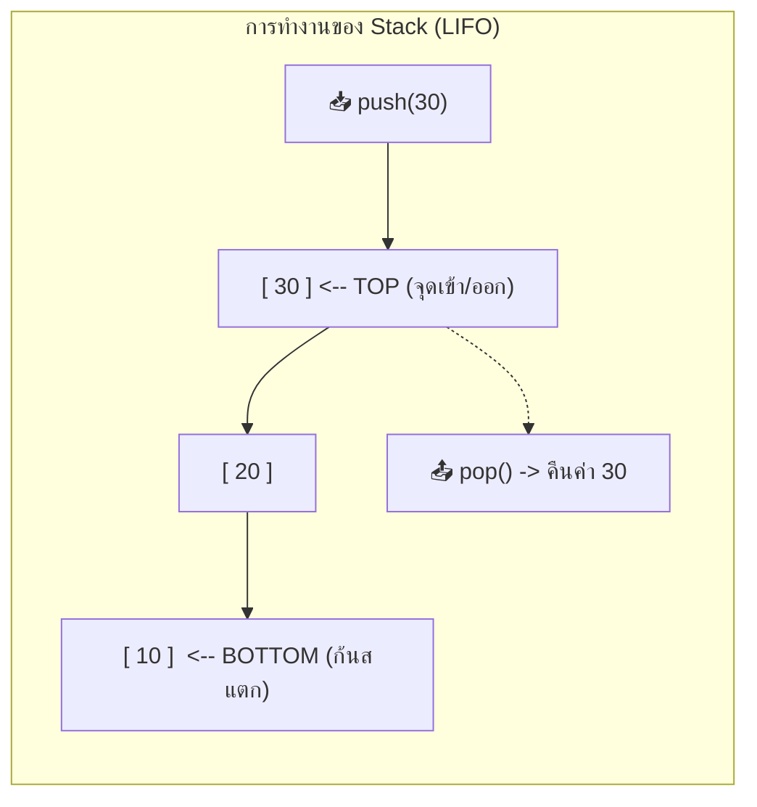

# 🥞 04.1 - Stacks & Applications (Infix, Postfix, Parentheses)

> [!NOTE]
> **Stack (สแตก)** คือโครงสร้างข้อมูลเชิงเส้นที่ทำงานตามหลักการ **LIFO (Last-In, First-Out)** แปลว่า *“ข้อมูลที่ใส่เข้าไปหลังสุด จะถูกนำออกมาใช้งานเป็นตัวแรกเสมอ”* เปรียบเสมือนกองจานที่ซ้อนกัน จานที่วางบนสุดจะถูกหยิบออกก่อนเสมอ

---

## 🥞 1. Stack ADT (Abstract Data Type) และ Operations พื้นฐาน

| Operation | ความหมาย | Time Complexity |
| :--- | :--- | :--- |
| **`push(item)`** | นำข้อมูลใหม่ใส่ลงบนยอดของ Stack (Top) | $O(1)$ |
| **`pop()`** | ดึงข้อมูลบนยอดของ Stack ออก และคืนค่าข้อมูลนั้น | $O(1)$ |
| **`top()` / `peek()`** | ส่องดูค่าข้อมูลบนยอดของ Stack โดยไม่ดึงข้อมูลออก | $O(1)$ |
| **`is_empty()`** | ตรวจสอบว่า Stack ว่างเปล่าหรือไม่ (`len == 0`) | $O(1)$ |
| **`size()`** | นับจำนวนข้อมูลทั้งหมดที่บรรจุอยู่ใน Stack ปัจจุบัน | $O(1)$ |



---

## 🎯 2. การแปลงนิพจน์ Infix เป็น Postfix (Shunting-Yard Algorithm)

ในชีวิตประจำวัน มนุษย์เราเขียนนิพจน์คณิตศาสตร์แบบ **Infix** เช่น $A + B \times C$ ซึ่งมีวงเล็บและลำดับความสำคัญของเครื่องหมาย (Operator Precedence) แต่คอมพิวเตอร์และ CPU ประมวลผลนิพจน์แบบ **Postfix (Reverse Polish Notation: RPN)** ได้เร็วกว่ามาก เพราะไม่ต้องใช้วงเล็บ และประมวลผลจากซ้ายไปขวาได้ทันที

### 2.1 ตารางลำดับความสำคัญของตัวดำเนินการ (Operator Precedence)

| ตัวดำเนินการ (Operator) | ความหมาย | ลำดับความสำคัญ (Precedence) | การจับกลุ่ม (Associativity) |
| :---: | :--- | :---: | :---: |
| **`^`** | ยกกำลัง (Exponentiation) | **3 (สูงสุด)** | ขวาไปซ้าย (Right-to-Left) |
| **`*` , `/`** | คูณ และ หาร | **2** | ซ้ายไปขวา (Left-to-Right) |
| **`+` , `-`** | บวก และ ลบ | **1** | ซ้ายไปขวา (Left-to-Right) |
| **`(`** | วงเล็บเปิด (เมื่ออยู่ใน Stack) | **0 (ต่ำสุด)** | จุดกั้นขอบเขตวงเล็บ |

---

### 2.2 กฎเหล็กของอัลกอริทึม Infix to Postfix

1. **ถ้าเจอ Operand (ตัวเลขหรือตัวอักษร เช่น A, B, 1, 2)**:
   - ส่งออกไปยังผลลัพธ์ (Output) ทันที!
2. **ถ้าเจอวงเล็บเปิด `(`**:
   - `push('(')` ลง Stack เสมอ เพื่อเป็นจุดอ้างอิงขอบเขตวงเล็บ
3. **ถ้าเจอวงเล็บปิด `)`**:
   - ทำการ `pop()` ตัวดำเนินการออกจาก Stack ไปยัง Output เรื่อยๆ **จนกว่าจะเจอวงเล็บเปิด `(`**
   - ดึงวงเล็บเปิด `(` ทิ้งจาก Stack (ไม่ส่งไปยัง Output)
4. **ถ้าเจอ Operator (`+`, `-`, `*`, `/`, `^`)**:
   - ตราบใดที่ Stack ไม่ว่าง และตัวบนสุดของ Stack มี Precedence **มากกว่าหรือเท่ากับ** Operator ปัจจุบัน:
     - ให้ `pop()` ตัวบนสุดของ Stack ไปยัง Output
   - จากนั้นจึง `push(operator ปัจจุบัน)` ลง Stack
5. **เมื่ออ่านนิพจน์จนหมดสตริง (End of Expression)**:
   - ทำการ `pop()` ตัวดำเนินการที่ยังค้างอยู่ใน Stack ทั้งหมดไปยัง Output

> [!CAUTION]
> **กับดักข้อสอบยอดฮิต: ทำไมต้องใช้ `while` loop แทน `if` หรือ `for`?**
> เมื่ออ่านเจอ Operator ใหม่ที่มีความสำคัญต่ำกว่า เช่น เจอ `+` ขณะที่ใน Stack มี `*` และ `/` ซ้อนกันอยู่:
> หากใช้คำสั่ง `if` จะ Pop ออกได้เพียงตัวเดียว ทำให้ตัวดำเนินการอีกตัวที่สำคัญกว่ายังค้างอยู่ใน Stack ส่งผลให้คำตอบผิดทันที!
> โค้ดที่ถูกต้องจึงต้องใช้:
> ```python
> while not stack.is_empty() and precedence(stack.top()) >= precedence(item):
>     result.append(stack.pop())
> stack.push(item)
> ```

---

## 📋 3. ตาราง Tracing ทีละสเต็ปอย่างละเอียด (Step-by-Step Execution Traces)

### ตัวอย่างที่ 1: การแปลงนิพจน์ `A + B * C - D / E`

| สเต็ป | Token ที่อ่าน | การกระทำ (Action & Reason) | สถานะ Stack (ก้น $\rightarrow$ ยอด) | ผลลัพธ์ Postfix Output |
| :---: | :---: | :--- | :--- | :--- |
| **0** | *(เริ่ม)* | เริ่มต้น Stack ว่าง | `[ ]` | *(ว่าง)* |
| **1** | `A` | เป็น Operand $\rightarrow$ ส่งออกทันที | `[ ]` | `A` |
| **2** | `+` | Stack ว่าง $\rightarrow$ Push `+` | `[ + ]` | `A` |
| **3** | `B` | เป็น Operand $\rightarrow$ ส่งออกทันที | `[ + ]` | `A B` |
| **4** | `*` | Prec(`*`)=2 > Prec(`+`)=1 $\rightarrow$ Push `*` | `[ + , * ]` | `A B` |
| **5** | `C` | เป็น Operand $\rightarrow$ ส่งออกทันที | `[ + , * ]` | `A B C` |
| **6** | `-` | Prec(`*`)=2 $\ge$ Prec(`-`)=1 $\rightarrow$ Pop `*`<br/>Prec(`+`)=1 $\ge$ Prec(`-`)=1 $\rightarrow$ Pop `+`<br/>Stack ว่าง $\rightarrow$ Push `-` | `[ - ]` | `A B C * +` |
| **7** | `D` | เป็น Operand $\rightarrow$ ส่งออกทันที | `[ - ]` | `A B C * + D` |
| **8** | `/` | Prec(`/`)=2 > Prec(`-`)=1 $\rightarrow$ Push `/` | `[ - , / ]` | `A B C * + D` |
| **9** | `E` | เป็น Operand $\rightarrow$ ส่งออกทันที | `[ - , / ]` | `A B C * + D E` |
| **10**| *(EOF)*| อ่านหมดแล้ว $\rightarrow$ Pop ที่ค้างทั้งหมด (`/` แล้ว `-`) | `[ ]` | `A B C * + D E / -` |

**ผลลัพธ์สุดท้าย:** `A B C * + D E / -`

---

### ตัวอย่างที่ 2: การแปลงนิพจน์มีวงเล็บ `(A + B) * (C - D)`

| สเต็ป | Token ที่อ่าน | การกระทำ (Action & Reason) | สถานะ Stack (ก้น $\rightarrow$ ยอด) | ผลลัพธ์ Postfix Output |
| :---: | :---: | :--- | :--- | :--- |
| **1** | `(` | วงเล็บเปิด $\rightarrow$ Push `(` ลง Stack | `[ ( ]` | *(ว่าง)* |
| **2** | `A` | Operand $\rightarrow$ ส่งออกทันที | `[ ( ]` | `A` |
| **3** | `+` | ในวงเล็บ: บนสุดคือ `(` (Prec=0) $\rightarrow$ Push `+` | `[ ( , + ]` | `A` |
| **4** | `B` | Operand $\rightarrow$ ส่งออกทันที | `[ ( , + ]` | `A B` |
| **5** | `)` | วงเล็บปิด $\rightarrow$ Pop จนเจอ `(` $\rightarrow$ Pop `+` ทิ้ง `(` | `[ ]` | `A B +` |
| **6** | `*` | Stack ว่าง $\rightarrow$ Push `*` | `[ * ]` | `A B +` |
| **7** | `(` | วงเล็บเปิด $\rightarrow$ Push `(` ลง Stack | `[ * , ( ]` | `A B +` |
| **8** | `C` | Operand $\rightarrow$ ส่งออกทันที | `[ * , ( ]` | `A B + C` |
| **9** | `-` | ในวงเล็บ: บนสุดคือ `(` (Prec=0) $\rightarrow$ Push `-` | `[ * , ( , - ]` | `A B + C` |
| **10**| `D` | Operand $\rightarrow$ ส่งออกทันที | `[ * , ( , - ]` | `A B + C D` |
| **11**| `)` | วงเล็บปิด $\rightarrow$ Pop จนเจอ `(` $\rightarrow$ Pop `-` ทิ้ง `(` | `[ * ]` | `A B + C D -` |
| **12**| *(EOF)*| ดึงตัวที่ค้างใน Stack ออกทั้งหมด $\rightarrow$ Pop `*` | `[ ]` | `A B + C D - *` |

**ผลลัพธ์สุดท้าย:** `A B + C D - *`

---

## 🧮 4. การคำนวณผลลัพธ์ของนิพจน์ Postfix (Postfix Evaluation)

เมื่อคอมพิวเตอร์แปลง Infix เป็น Postfix เรียบร้อยแล้ว การคำนวณผลลัพธ์จะใช้ Stack เก็บตัวเลข (Operand Stack) ดังนี้:
1. วนลูปอ่านโทเคนจากซ้ายไปขวา
2. **ถ้าเป็นตัวเลข**: ให้ `push(number)` ลง Stack
3. **ถ้าเป็นตัวดำเนินการ ($+, -, \times, /$)**:
   - `val2 = pop()` (ตัวกระทำตัวหลัง)
   - `val1 = pop()` (ตัวกระทำตัวหน้า)
   - คำนวณ `result = val1 (operator) val2`
   - นำผลลัพธ์ที่ได้ `push(result)` กลับลง Stack
4. เมื่ออ่านครบ ตัวเลขสุดท้ายที่เหลือใน Stack คือคำตอบ!

### ตัวอย่าง Tracing การคำนวณ: `4 5 + 7 2 - *` (ตรงกับ $(4 + 5) \times (7 - 2)$)

| สเต็ป | Token | การคำนวณ | สถานะ Operand Stack |
| :---: | :---: | :--- | :--- |
| 1 | `4` | Push 4 | `[ 4 ]` |
| 2 | `5` | Push 5 | `[ 4, 5 ]` |
| 3 | `+` | $val2=5, val1=4 \implies 4 + 5 = 9 \implies$ Push 9 | `[ 9 ]` |
| 4 | `7` | Push 7 | `[ 9, 7 ]` |
| 5 | `2` | Push 2 | `[ 9, 7, 2 ]` |
| 6 | `-` | $val2=2, val1=7 \implies 7 - 2 = 5 \implies$ Push 5 | `[ 9, 5 ]` |
| 7 | `*` | $val2=5, val1=9 \implies 9 \times 5 = 45 \implies$ Push 45 | `[ 45 ]` |

**คำตอบสุดท้ายคือ 45**

---

## 💻 5. Python Implementation สมบูรณ์ (ตรงตามไฟล์ข้อสอบ `Exams/InfixToPostFix.py`)

ทดลองศึกษาและกดรันโค้ดสดได้ทันที:

```python
class Stack:
    """โครงสร้างข้อมูล Stack มาตรฐาน"""
    def __init__(self, limit=100):
        self.items = []
        self.limit = limit

    def is_empty(self) -> bool:
        return len(self.items) == 0

    def size(self) -> int:
        return len(self.items)

    def top(self):
        if self.is_empty():
            return None
        return self.items[-1]

    def push(self, item):
        if self.size() >= self.limit:
            raise OverflowError(f"Stack Overflow: ไม่สามารถ push({item}) ได้")
        self.items.append(item)

    def pop(self):
        if self.is_empty():
            raise IndexError("Stack Underflow: Stack ว่างเปล่า")
        return self.items.pop()

    def __repr__(self):
        return f"Stack({self.items})"


class InfixToPostfixConverter:
    """คลาสแปลงนิพจน์ Infix เป็น Postfix พร้อม Tracing ละเอียด"""
    def __init__(self):
        self.stack = Stack()
        self.result = []

    @staticmethod
    def precedence(op: str) -> int:
        if op == "^":
            return 3
        if op in ("*", "/"):
            return 2
        if op in ("+", "-"):
            return 1
        return 0

    def convert(self, expression: str) -> str:
        self.stack = Stack()
        self.result = []
        clean_expr = expression.replace(" ", "")

        print(f"=== เริ่มต้นการแปลงนิพจน์: {expression} ===")

        for token in clean_expr:
            if token.isalnum():  # ตัวอักษรหรือตัวเลข (Operand)
                self.result.append(token)
                print(f"อ่าน '{token}' (Operand)   -> ส่งออก Output: {' '.join(self.result)}")
            elif token == "(":
                self.stack.push(token)
                print(f"อ่าน '{token}' (วงเล็บเปิด) -> Push ลง Stack: {self.stack.items}")
            elif token == ")":
                print(f"อ่าน '{token}' (วงเล็บปิด)  -> เริ่ม Pop ตัวดำเนินการจนกว่าจะเจอ '('")
                while not self.stack.is_empty() and self.stack.top() != "(":
                    popped = self.stack.pop()
                    self.result.append(popped)
                    print(f"   Pop '{popped}' -> Output: {' '.join(self.result)}")
                if not self.stack.is_empty() and self.stack.top() == "(":
                    self.stack.pop()  # ทิ้งวงเล็บเปิด
            elif token in "+-*/^":
                # สำคัญมาก: ใช้ while loop เพื่อปลดตัวที่มี precedence >= token ทั้งหมด
                while (
                    not self.stack.is_empty()
                    and self.stack.top() != "("
                    and self.precedence(self.stack.top()) >= self.precedence(token)
                ):
                    popped = self.stack.pop()
                    self.result.append(popped)
                    print(f"อ่าน '{token}': Pop '{popped}' (Prec >= '{token}') -> Output: {' '.join(self.result)}")

                self.stack.push(token)
                print(f"อ่าน '{token}': Push '{token}' ลง Stack: {self.stack.items}")

        # ดึงตัวที่ค้างใน Stack ออกทั้งหมด
        while not self.stack.is_empty():
            popped = self.stack.pop()
            self.result.append(popped)
            print(f"สิ้นสุดนิพจน์: Pop ตัวค้าง '{popped}' -> Output: {' '.join(self.result)}")

        final_postfix = " ".join(self.result)
        print(f"🎉 ผลลัพธ์ Postfix สำเร็จ: {final_postfix}\n")
        return final_postfix


if __name__ == "__main__":
    converter = InfixToPostfixConverter()
    
    # ทดสอบตัวอย่างที่ 1
    converter.convert("A + B * C - D / E")

    # ทดสอบตัวอย่างที่ 2 (มีวงเล็บ)
    converter.convert("(A + B) * (C - D)")
```

---

## 🔗 ลิงก์เชื่อมโยงใน Obsidian Wiki
- ก่อนหน้า (Linked Lists): [[03.1 - Linked Lists (Singly, Doubly, Circular)]]
- ถัดไป (Queues): [[04.2 - Queues & Circular Array Queues]]
- ข้อสอบเก่าและฝึกฝนโจทย์ Stack: [[11.3 - Stack Practice Exam Problems & Solutions]]
