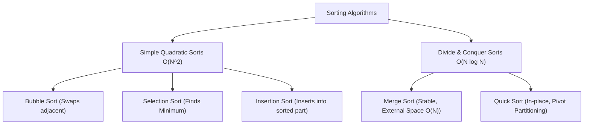

# 🔀 05.1 - Sorting Algorithms (Bubble, Selection, Insertion, Merge, Quick)

> [!NOTE]
> **Sorting Algorithm (อัลกอริทึมการเรียงลำดับ)** คือการจัดเรียงข้อมูลตามลำดับที่กำหนด (น้อยไปมาก หรือมากไปน้อย) เป็นหัวข้อพื้นฐานสำคัญที่นิยมออกสอบทั้งทฤษฎี ตาราง Trace State และการเขียนโค้ด

---

## 🏛️ 1. สรุปเปรียบเทียบ 5 Sorting Algorithms หลัก



---

## 🔍 2. รายละเอียดทีละอัลกอริทึมพร้อมโค้ด Python

### 2.1 Bubble Sort $\implies O(N^2)$
สลับตำแหน่งคู่ข้อมูลที่อยู่ติดกันหากเรียงผิดลำดับ ทำซ้ำจนกระทั่งค่าที่มากที่สุดลอยขึ้นไปอยู่ท้ายสุดทีละตัว (เหมือนฟองอากาศ)

```python
def bubble_sort(arr):
    n = len(arr)
    for i in range(n):
        swapped = False
        for j in range(0, n - i - 1):
            if arr[j] > arr[j + 1]:
                arr[j], arr[j + 1] = arr[j + 1], arr[j]
                swapped = True
        if not swapped:  # Early termination ถ้าไม่มีการสลับเลย -> O(N) Best Case
            break
    return arr
```

### 2.2 Selection Sort $\implies O(N^2)$
วนหาข้อมูลที่มีค่าน้อยที่สุดในฝั่งยังไม่เรียง แล้วนำมาสลับกับตำแหน่งแรกของฝั่งยังไม่เรียง

```python
def selection_sort(arr):
    n = len(arr)
    for i in range(n):
        min_idx = i
        for j in range(i + 1, n):
            if arr[j] < arr[min_idx]:
                min_idx = j
        arr[i], arr[min_idx] = arr[min_idx], arr[i]
    return arr
```

### 2.3 Insertion Sort $\implies O(N^2)$
ดึงข้อมูลทีละตัวแล้วแทรกเข้าในตำแหน่งที่ถูกต้องของส่วนที่เรียงลำดับแล้วทางด้านซ้าย (เหมือนการเรียงไพ่ในมือ)

```python
def insertion_sort(arr):
    for i in range(1, len(arr)):
        key = arr[i]
        j = i - 1
        while j >= 0 and arr[j] > key:
            arr[j + 1] = arr[j]
            j -= 1
        arr[j + 1] = key
    return arr
```

### 2.4 Merge Sort $\implies O(N \log N)$
ใช้หลักการ **Divide and Conquer** แบ่ง Array ออกเป็น 2 ครึ่งเท่าๆ กันแบบ Recursive แล้วทำการ **Merge** สองส่วนที่เรียงแล้วเข้าด้วยกัน

```python
def merge_sort(arr):
    if len(arr) <= 1:
        return arr
    mid = len(arr) // 2
    left = merge_sort(arr[:mid])
    right = merge_sort(arr[mid:])
    return merge(left, right)

def merge(left, right):
    result = []
    i = j = 0
    while i < len(left) and j < len(right):
        if left[i] <= right[j]:  # <= ป้องกันการสลับตำแหน่งข้อมูลเท่ากัน -> Stable
            result.append(left[i])
            i += 1
        else:
            result.append(right[j])
            j += 1
    result.extend(left[i:])
    result.extend(right[j:])
    return result
```

### 2.5 Quick Sort $\implies \text{Average } O(N \log N), \text{Worst } O(N^2)$
เลือก **Pivot** แล้วทำการ Partition ให้ฝั่งซ้ายของ Pivot $< \text{Pivot}$ และฝั่งขวา $> \text{Pivot}$ แล้วทำ Quick Sort ซ้ำทั้งสองฝั่ง

```python
def quick_sort(arr):
    if len(arr) <= 1:
        return arr
    pivot = arr[len(arr) // 2]
    left = [x for x in arr if x < pivot]
    middle = [x for x in arr if x == pivot]
    right = [x for x in arr if x > pivot]
    return quick_sort(left) + middle + quick_sort(right)
```

---

## 🧮 3. ตัวอย่างตาราง Trace State การทำงานของ Insertion Sort

>[!EXAMPLE]
> **เรียงลำดับ Array: `[5, 2, 4, 6, 1, 3]` ด้วย Insertion Sort**
>
> | Pass | Key | Array State หลังจบ Pass | Explanation |
> | :--- | :--- | :--- | :--- |
> | **Start**| - | `[5, 2, 4, 6, 1, 3]` | Initial Array |
> | **i = 1** | `2` | `[2, 5, 4, 6, 1, 3]` | แทรก 2 ไว้หน้า 5 |
> | **i = 2** | `4` | `[2, 4, 5, 6, 1, 3]` | แทรก 4 ระหว่าง 2 กับ 5 |
> | **i = 3** | `6` | `[2, 4, 5, 6, 1, 3]` | 6 อยู่ถูกตำแหน่งแล้ว |
> | **i = 4** | `1` | `[1, 2, 4, 5, 6, 3]` | แทรก 1 ไว้หน้าสุด |
> | **i = 5** | `3` | `[1, 2, 3, 4, 5, 6]` | แทรก 3 ระหว่าง 2 กับ 4 |

---

## 🧪 4. สรุปการทดสอบเรียงลำดับ (Test Program 2 Sorting Summary)

> [!IMPORTANT]
> **ประเด็นสำคัญจาก Test Program 2 Sorting**:
> 1. **การเปรียบเทียบจำนวนครั้งการ Swap / Comparison**:
>    - **Selection Sort**: มีจำนวนการ Swap น้อยที่สุด เพียง $O(N)$ ครั้ง เหมาะกับสถานการณ์ที่การเขียน/สลับข้อมูลใน memory มีต้นทุนสูง
>    - **Insertion Sort**: ทำงานได้เร็วที่สุดในกลุ่ม $O(N^2)$ เมื่อข้อมูลเกือบเรียงลำดับมาอยู่แล้ว (Nearly Sorted Data $\to O(N)$)
> 2. **In-place vs External Space**:
>    - Quick Sort, Bubble, Selection, Insertion เป็น **In-place ($O(1)$ หรือ $O(\log N)$ aux memory)**
>    - Merge Sort ต้องใช้พื้นที่สำรอง **$O(N)$** ในขั้นตอน Merge

---

## 🔗 ลิงก์เชื่อมโยงใน Obsidian Wiki
- ก่อนหน้า: [[04.2 - Hash Tables & Collision Resolution Strategies]]
- ถัดไป (Graphs): [[05.2 - Graph Fundamentals & Traversals (BFS, DFS, Topological Sort)]]
- ตารางเปรียบเทียบทั้งหมด: [[Glossary & Complexity Cheat Sheet]]
