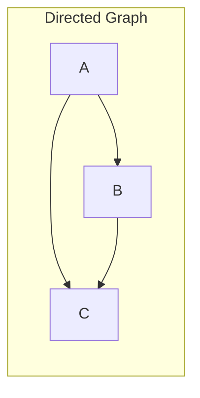
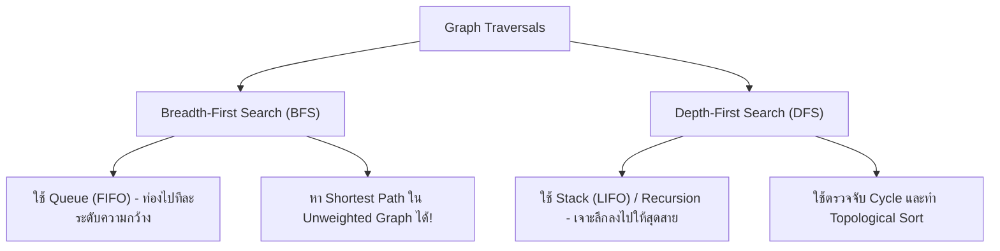
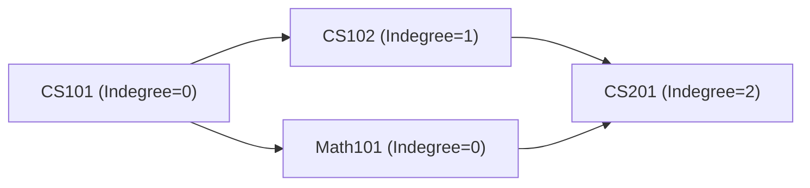

# 🕸️ 05.2 - Graph Fundamentals & Traversals (BFS, DFS, Topological Sort)

> [!NOTE]
> **Graph (กราฟ)** คือโครงสร้างข้อมูลที่ประกอบด้วยเซตของ **Vertices/Nodes ($V$)** และเซตของ **Edges ($E$)** นิยมใช้แทนเครือข่ายสังคม เครือข่ายการเดินทาง หรือลำดับขั้นตอนการทำงานที่มีการพึ่งพากัน (Dependencies)

---

## 🏛️ 1. โครงสร้างและการจัดเก็บกราฟ (Graph Representations)



| วิธีการจัดเก็บ | Adjacency Matrix (อาร์เรย์ 2 มิติ $V \times V$) | Adjacency List (รายการโหนดข้างเคียง) |
| :--- | :--- | :--- |
| **Memory Space** | $\Theta(V^2)$ (เปลือง memory หากกราฟเบาบาง) | $\Theta(V + E)$ (**ประหยัดที่สุด**) |
| **Check Edge (u, v)** | $O(1)$ | $O(\text{degree}(u))$ |
| **Find All Neighbors** | $O(V)$ | $O(\text{degree}(u))$ |

```python
# ตัวอย่าง Adjacency List ใน Python
graph = {
    'A': ['B', 'C'],
    'B': ['C', 'D'],
    'C': ['D'],
    'D': []
}
```

---

## 🔄 2. Graph Traversals: BFS vs DFS



### 2.1 Breadth-First Search (BFS) Code
```python
from collections import deque

def bfs(graph, start_vertex):
    visited = set([start_vertex])
    queue = deque([start_vertex])
    result = []
    
    while queue:
        vertex = queue.popleft()
        result.append(vertex)
        for neighbor in graph[vertex]:
            if neighbor not in visited:
                visited.add(neighbor)
                queue.append(neighbor)
    return result
```

### 2.2 Depth-First Search (DFS) Code
```python
def dfs_recursive(graph, vertex, visited=None):
    if visited is None:
        visited = set()
    visited.add(vertex)
    print(vertex, end=" ")
    
    for neighbor in graph[vertex]:
        if neighbor not in visited:
            dfs_recursive(graph, neighbor, visited)
```

---

## 🔀 3. Topological Sort (การเรียงลำดับตามเงื่อนไขก่อนหลัง)

ใช้กับ **DAG (Directed Acyclic Graph)** เพื่อจัดลำดับการทำงาน (เช่น การจัดตารางลงเรียนวิชาบังคับก่อน - Prerequisites)



### 3.1 Kahn's Algorithm (BFS-based Topological Sort)
1. คำนวณ **Indegree** (จำนวนเส้นเชื่อมที่วิ่งเข้ามายังโหนดนั้น) ของทุกโหนด
2. นำโหนดที่มี **$\text{Indegree} == 0$** ใส่ลงใน Queue
3. เมื่อ `popleft()` โหนดแกนกลางออกมา:
   - นำไปใส่ในผลลัพธ์ Topological List
   - ลดค่า Indegree ของโหนดเพื่อนบ้านทั้งหมดลง 1
   - หากโหนดเพื่อนบ้านตัวใดมี **$\text{Indegree} == 0$** ให้ `enqueue()` ลง Queue
4. หากผลลัพธ์ได้จำนวนโหนดไม่ครบเท่ากับ $V$ แสดงว่า **กราฟมี Cycle!**

---

## 🔗 ลิงก์เชื่อมโยงใน Obsidian Wiki
- ก่อนหน้า: [[05.1 - Sorting Algorithms (Bubble, Selection, Insertion, Merge, Quick)]]
- ถัดไป (Dijkstra): [[05.3 - Shortest Path Algorithms (Dijkstra, Unweighted Shortest Path)]]
- คิวใน BFS: [[02.3 - Queues & Circular Array Queues]]
