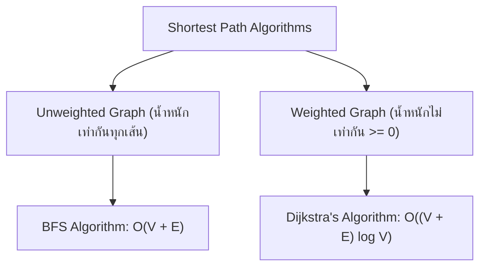
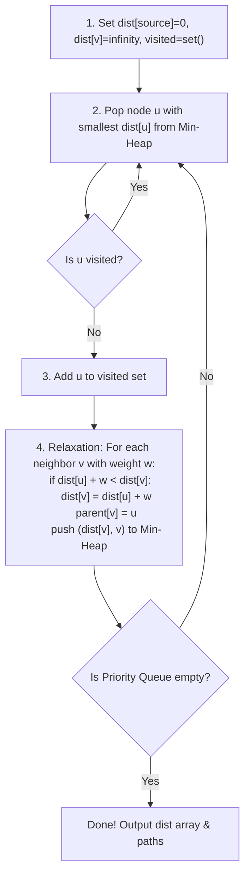

# 🗺️ 05.3 - Shortest Path Algorithms (Dijkstra, Unweighted Shortest Path)

> [!NOTE]
> ปัญหา **Shortest Path (เส้นทางที่สั้นที่สุด)** คือการคัดหาเส้นทางที่มีผลรวมน้ำหนักของ Edges น้อยที่สุดจากโหนดจุดเริ่มต้น (Source Vertex) ไปยังโหนดอื่นๆ

---

## 🏛️ 1. เปรียบเทียบ 2 อัลกอริทึม Shortest Path



---

## ⚡ 2. Dijkstra's Algorithm (สำหรับ Weighted Graph น้ำหนัก $\ge 0$)

เสนอโดย Edsger W. Dijkstra (1959) ใช้หลักการ **Greedy Choice** ร่วมกับ **Priority Queue (Min-Heap)**



---

## 🧮 3. ตาราง Trace Dijkstra Step-by-Step (ข้อสอบเน้นย้ำ!)

>[!EXAMPLE]
> **พิจารณากราฟแบบมีทิศทาง:**
> - $A \to B$ (w=4), $A \to C$ (w=2)
> - $C \to B$ (w=1), $C \to D$ (w=5)
> - $B \to D$ (w=2)
> 
> **หาเส้นทางสั้นที่สุดจากจุดเริ่มต้น $A$:**
>
> | Step | Visited | Priority Queue | Distance Array `[A, B, C, D]` | Explanation |
> | :--- | :--- | :--- | :--- | :--- |
> | **Init** | `{}` | `[(0, 'A')]` | `[0, ∞, ∞, ∞]` | ตั้งค่าเริ่มต้น `dist[A] = 0` |
> | **1** | `{'A'}` | `[(2, 'C'), (4, 'B')]` | `[0, 4, 2, ∞]` | Pop A $\to$ Relax B(4), C(2) |
> | **2** | `{'A', 'C'}` | `[(3, 'B'), (4, 'B'), (7, 'D')]` | `[0, 3, 2, 7]` | Pop C (dist=2) $\to$ Relax B ($2+1=3 < 4 \implies 3$), D ($2+5=7$) |
> | **3** | `{'A', 'C', 'B'}`| `[(5, 'D'), (7, 'D')]` | `[0, 3, 2, 5]` | Pop B (dist=3) $\to$ Relax D ($3+2=5 < 7 \implies 5$) |
> | **4** | `{'A', 'C', 'B', 'D'}`| `[(7, 'D')]` | `[0, 3, 2, 5]` | Pop D (dist=5) $\to$ ถึงจุดหมายแล้ว! |
>
> **สรุประยะทางสั้นที่สุดจาก A**: `A=0, B=3 (ผ่าน C), C=2, D=5 (ผ่าน A->C->B->D)`

---

## 📝 4. สรุปโจทย์ Assignment 4 Shortest Path

> [!IMPORTANT]
> **ประเด็นสำคัญจาก Assignment 4 Shortest Path**:
> 1. **การแกะย้อนกลับหาเส้นทางสั้นที่สุด (Path Reconstruction)**:
>    - นอกเหนือจากการเก็บบันทึกระยะทางสั้นที่สุด `dist[v]` ต้องมีเมทริกซ์/ดิฟชันนารี `parent[v]` เพื่อเก็บว่าโหนดก่อนหน้าคือใคร
>    - เมื่อต้องการแสดงเส้นทาง ให้เริ่มต้นที่จุดหมาย $V_{\text{target}}$ แล้วเดินย้อนผ่าน `parent` กลับมายังจุดเริ่มต้น $V_{\text{source}}$ แล้วทำการ Reverse สตริงคืนกลับมา!

---

## 💻 5. Complete Python Implementation of Dijkstra

```python
import heapq

def dijkstra(graph, start_vertex):
    # graph อยู่ในรูป { 'A': [('B', 4), ('C', 2)], ... }
    distances = {vertex: float('inf') for vertex in graph}
    distances[start_vertex] = 0
    parent = {vertex: None for vertex in graph}
    
    # Priority Queue เก็บ tuple: (distance, vertex)
    pq = [(0, start_vertex)]
    visited = set()
    
    while pq:
        current_dist, current_vertex = heapq.heappop(pq)
        
        if current_vertex in visited:
            continue
        visited.add(current_vertex)
        
        for neighbor, weight in graph[current_vertex]:
            distance = current_dist + weight
            
            # Relaxation step
            if distance < distances[neighbor]:
                distances[neighbor] = distance
                parent[neighbor] = current_vertex
                heapq.heappush(pq, (distance, neighbor))
                
    return distances, parent
```

---

## 🔗 ลิงก์เชื่อมโยงใน Obsidian Wiki
- ก่อนหน้า: [[05.2 - Graph Fundamentals & Traversals (BFS, DFS, Topological Sort)]]
- Priority Queue / Heap: [[04.1 - Priority Queue & Binary Heaps (Min-Heap, Max-Heap)]]
- เข้าสู่ Module 06 (ตะลุยโจทย์สอบ): [[06.1 - Comprehensive Exam Questions, Tracing & Python Solutions]]
