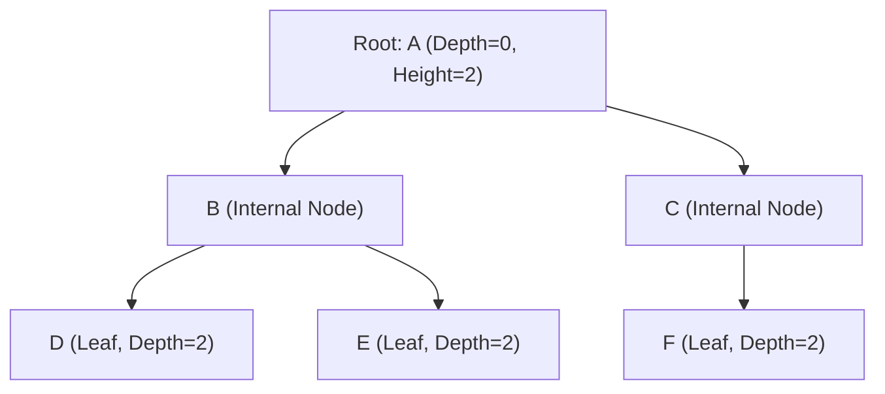
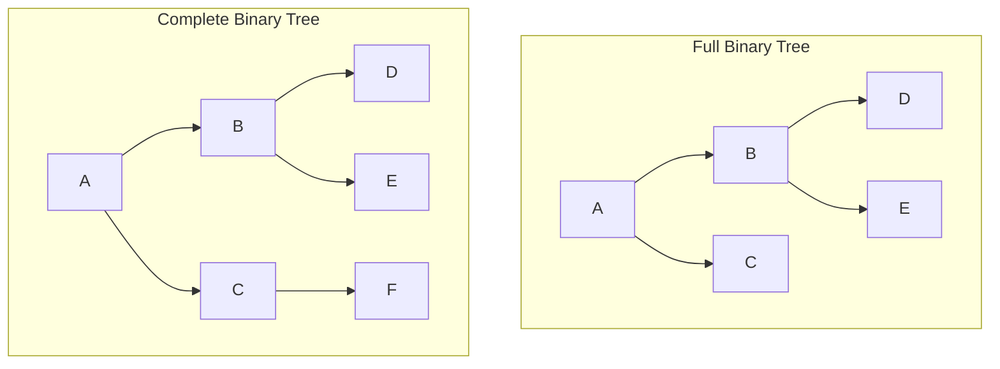
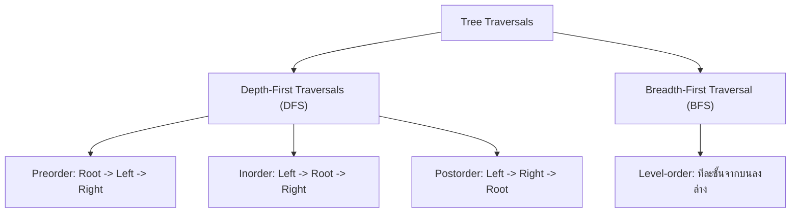
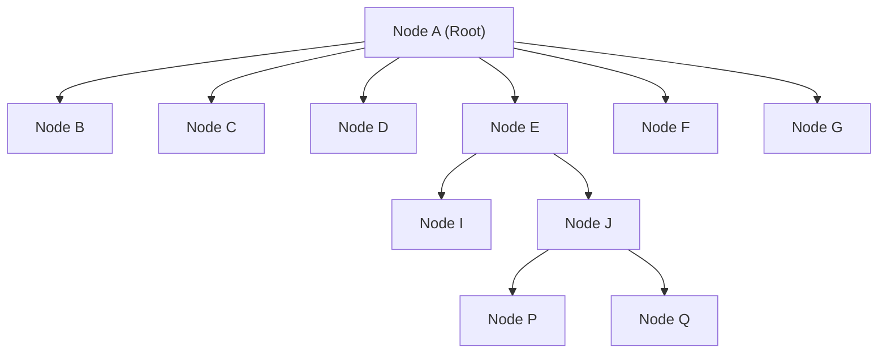
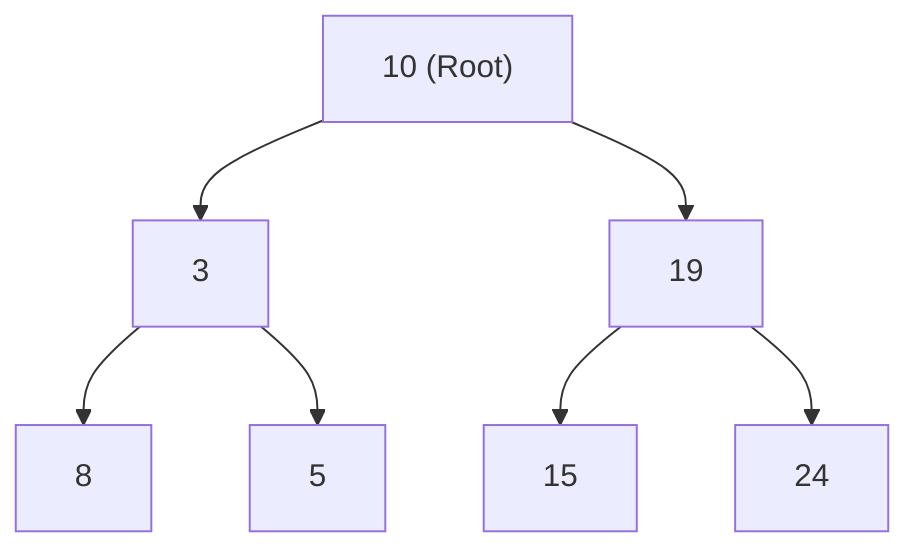
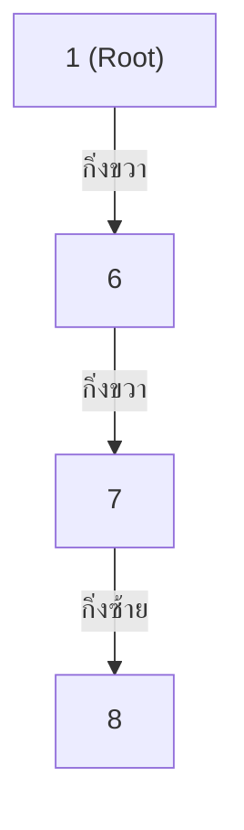
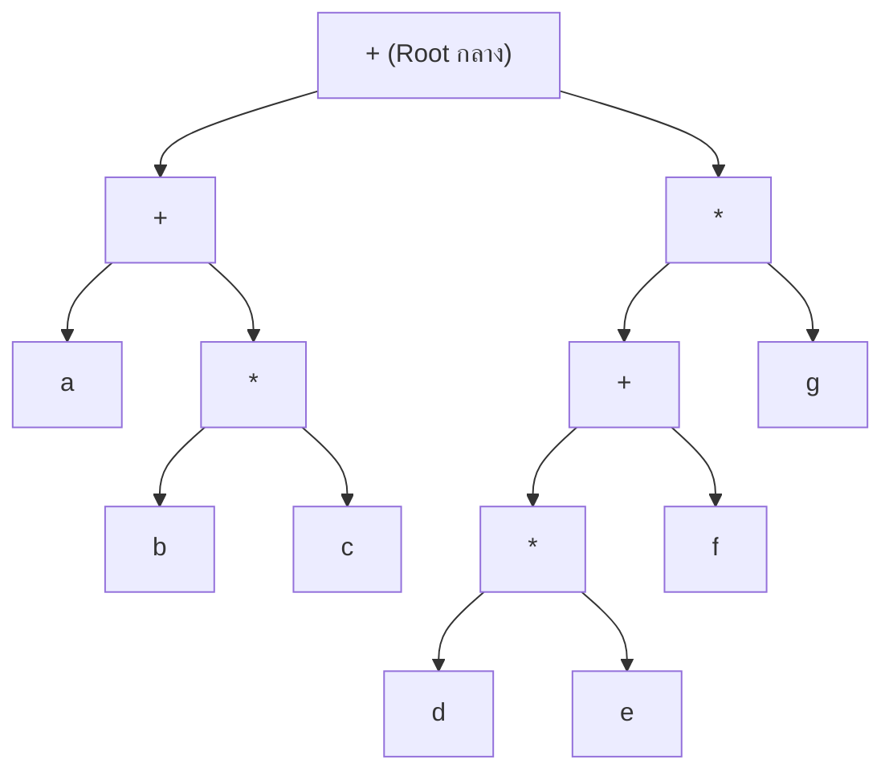
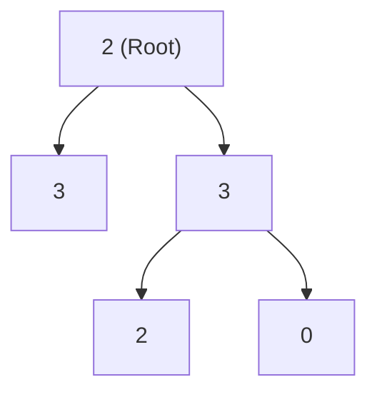

# 🌲 05.1 - Tree Terminology & Binary Trees

> [!NOTE]
> **Tree (ต้นไม้)** คือโครงสร้างข้อมูลแบบลำดับชั้น (Hierarchical Data Structure) ประกอบด้วยกลุ่มของ **Nodes** ที่เชื่อมต่อกันด้วย **Edges** โดยมีโหนดสูงสุดเรียกว่า **Root** และไม่มีวงวน (No Cycles)

---

## 🏛️ 1. คำศัพท์สำคัญเกี่ยวกับต้นไม้ (Tree Terminology for Exams)



- **Root (ราก)**: โหนดบนสุดเดี่ยวของต้นไม้ที่ไม่มี Parent (ในรูปคือ `A`)
- **Parent / Child**: `A` เป็น Parent ของ `B` และ `C`; `B` เป็น Child ของ `A`
- **Siblings (พี่น้อง)**: โหนดที่มี Parent เดียวกัน (`B` และ `C` เป็น Siblings กัน)
- **Leaf Node (ใบ)**: โหนดที่ไม่มี Child เลย (`D`, `E`, `F`)
- **Internal Node**: โหนดที่มี Child อย่างน้อย 1 ตัว
- **Depth (ความลึก)**: จำนวน Edge จาก Root ลงมายังโหนดนั้น (Root มี Depth = 0)
- **Height (ความสูง)**: จำนวน Edge ยาวที่สุดจากโหนดนั้นลงไปยัง Leaf (Leaf มี Height = 0)
- **Degree (ดีกรี)**: จำนวน Child ของโหนดนั้น

---

## 🌴 2. ประเภทของ Binary Tree

**Binary Tree** คือต้นไม้ที่แต่ละโหนดมี Child ได้ **ไม่เกิน 2 ตัว** (Left Child และ Right Child)



1. **Full Binary Tree**: ทุกโหนดมี Child 0 ตัว หรือ 2 ตัวเท่านั้น (ไม่มีโหนดที่มี Child 1 ตัว)
2. **Complete Binary Tree**: ทุก Level ถูกเติมเต็มครบทั้งหมด ยกเว้น Level สุดท้าย แต่ต้องเติมโหนดชิดซ้ายสุดเสมอ (**ใช้ใน Binary Heap**)
3. **Perfect Binary Tree**: ทุก Internal Node มี Child 2 ตัว และทุก Leaf อยู่ที่ Depth เดียวกันทั้งหมด ($N = 2^{h+1} - 1$)

---

## 🔄 3. การท่องไปในต้นไม้ 4 รูปแบบ (Tree Traversals)



>[!EXAMPLE]
> **ตัวอย่างการท่องไปในต้นไม้ (โจทย์ข้อสอบยอดฮิต!)**:
> พิจารณา Binary Tree:
> ```text
>        A
>      /   \
>     B     C
>    / \
>   D   E
> ```
> - **Preorder (Root-Left-Right)**: `A -> B -> D -> E -> C`
> - **Inorder (Left-Root-Right)**: `D -> B -> E -> A -> C` *(ใน BST จะได้ข้อมูลเรียงจากน้อยไปมาก!)*
> - **Postorder (Left-Right-Root)**: `D -> E -> B -> C -> A`
> - **Level-Order (ทีละ Level)**: `A -> B -> C -> D -> E`

---

## 📝 4. สรุปแบบฝึกหัดสร้างต้นไม้ (Assignment 2 Construct Binary Tree)

> [!IMPORTANT]
> **หลักการสร้าง Binary Tree จากลำดับ Traversals (Assignment 2)**:
> 1. **จาก Preorder + Inorder**:
>    - ตัวแรกของ Preorder คือ **Root** เสมอ!
>    - ค้นหา位置ของ Root นั้นใน Inorder $\to$ สมาชิกทางซ้ายของตำแหน่งนั้นคือ **Left Subtree** สมาชิกทางขวาคือ **Right Subtree**
>    - ทำการสร้างสร้างต้นไม้แบบ Recursive ต่อไป
> 2. **จาก Postorder + Inorder**:
>    - ตัวสุดท้ายของ Postorder คือ **Root** เสมอ!

```python
def build_tree_pre_in(preorder, inorder):
    if not preorder or not inorder:
        return None
    root_val = preorder[0]
    root = TreeNode(root_val)
    mid = inorder.index(root_val)
    
    root.left = build_tree_pre_in(preorder[1:mid+1], inorder[:mid])
    root.right = build_tree_pre_in(preorder[mid+1:], inorder[mid+1:])
    return root
```

---

---

## 📝 5. คลังตัวอย่างข้อสอบ & แบบฝึกหัดในห้องเรียน (Classroom "For Example" & Worksheets)

> [!INFO]
> **ที่มาของเอกสารต้นฉบับ**: เอกสารใบงานในห้องเรียนจริง `Lectures/Lecture 5 Tree/For example Binary Tree.pdf` และ `Lectures/Assignment 2 Construct Binary Tree/Assign 2 Binary Tree.pdf`

---

### 🎯 5.1 การระบุเส้นทางในต้นไม้ (Path Notation Questions)



#### 📄 โจทย์คำถามและคำตอบที่ถูกต้อง:
1. **Write the path from node A to node Q:**
   - คำตอบที่ถูกต้อง: `A, E, J, Q`
2. **Write the path from node Q to node A:**
   - คำตอบที่ถูกต้อง: `Q, J, E, A`

---

### 🎯 5.2 การท่องต้นไม้ (Tree Traversals) บนตัวอย่างสไลด์หน้า 2



#### 💻 ผลลัพธ์การท่องลำดับทั้ง 3 แบบ:
- **Pre-Order** (Root $\to$ Left $\to$ Right): `10, 3, 8, 5, 19, 15, 24`
- **In-Order** (Left $\to$ Root $\to$ Right): `8, 3, 5, 10, 15, 19, 24`
- **Post-Order** (Left $\to$ Right $\to$ Root): `8, 5, 3, 15, 24, 19, 10`

---

### 🎯 5.3 โจทย์ For Example 1: สร้างต้นไม้จาก Pre-order และ In-order

#### 📄 โจทย์คำถาม (Question):
> Construct a binary tree by using pre-order and in-order sequences given below. Write the output in post-order traversal:
> - **In-order:** `1, 6, 8, 7`
> - **Pre-order:** `1, 6, 7, 8`

#### 💻 ลำดับการวิเคราะห์และแผนผังต้นไม้:
1. จาก **Pre-order** ตัวแรกคือ `1` $\implies$ `1` คือ **Root**
2. ใน **In-order** พบ `1` อยู่ตัวแรกสุด แสดงว่า `1` **ไม่มีลูกซ้าย (Left Subtree เป็นว่าง)** และสมาชิกที่เหลือ `6, 8, 7` ทั้งหมดอยู่กิ่งขวา
3. พิจารณาตัวถัดไปใน Pre-order คือ `6` $\implies$ `6` คือลูกขวาของ `1`
4. พิจารณาตัวถัดไปคือ `7` และใน In-order พบ `8` อยู่ซ้ายของ `7` $\implies$ `8` เป็นลูกซ้ายของ `7`



#### 🎯 ผลลัพธ์ Post-order Traversal:
- **Post-order** (Left $\to$ Right $\to$ Root): **`8, 7, 6, 1`**

---

### 🎯 5.4 โจทย์ For Example 2: Expression Tree จากนิพจน์คณิตศาสตร์

#### 📄 โจทย์คำถาม:
> Create an Expression Tree from the following infix expression:
> `(a + (b * c)) + (((d * e) + f) * g)`



---

### 🎯 5.5 การบ้าน Assignment 2: Construct Binary Tree ด้วยรหัสนักศึกษา

#### 📄 โจทย์ Assignment 2:
> ให้นำเลขท้าย 5 ตัวของรหัสนักศึกษามาเป็นลำดับ **Post-order** (เช่น รหัส `6706021632032` เลขท้ายคือ `32032`) 
> จากนั้นสร้างลำดับ **In-order** โดยการย้ายตัวสุดท้ายมาไว้ตำแหน่งที่ 2 และสลับตัวที่ 4 กับ 5 $\implies$ ได้ In-order: `3, 2, 2, 3, 0`
> จงสร้างต้นไม้ทวิภาคและตอบผลลัพธ์เป็น **Pre-order Traversal**

#### 💻 ลำดับขั้นตอนการหาคำตอบ:
1. **Root Node** จากตัวสุดท้ายของ Post-order $\implies$ Root = `2`
2. แบ่ง In-order ตาม Root `2` $\to$ ฝั่งซ้ายคือ `3` และฝั่งขวาคือ `2, 3, 0`
3. โหนดรองสุดท้ายใน Post-order คือ `3` $\implies$ `2` เป็นลูกซ้ายของ `3` และ `0` เป็นลูกขวาของ `3`



- **ผลลัพธ์ Pre-order Traversal ที่ถูกต้อง**: `2, 3, 3, 2, 0`

---

#### 🖥️ ตัวอย่างหน้าจอ Interface การจำลองการสร้างต้นไม้ (Tree Studio Preview)
```console
============================================================
           BINARY TREE BUILDER & TRAVERSAL STUDIO           
============================================================
[Inputs] Pre-order: [1, 6, 7, 8] | In-order: [1, 6, 8, 7]
[Step 1] Identified Root: 1 (Pre-order index 0)
[Step 2] In-order Split: Left = [] | Right = [6, 8, 7]
[Step 3] Subtree Root: 6 (Pre-order index 1)
[Step 4] Subtree Root: 7 with left child: 8
------------------------------------------------------------
[Generated Tree Structure]
      1
       \
        6
         \
          7
         /
        8
[Traversals Output]
 -> Pre-order  : 1 -> 6 -> 7 -> 8
 -> In-order   : 1 -> 6 -> 8 -> 7
 -> Post-order : 8 -> 7 -> 6 -> 1  <-- Verified Solution!
============================================================
```

---

## 🔗 ลิงก์เชื่อมโยงใน Obsidian Wiki
- ก่อนหน้า: [[04.2 - Queues & Circular Array Queues]]
- ถัดไป (BST): [[05.2 - Binary Search Trees (BST) & Insertion]]
- การประยุกต์ใช้ใน Heap: [[07.1 - Priority Queue & Binary Heaps (Min-Heap, Max-Heap)]]
- ตารางความเร็วรวม: [[Glossary & Complexity Cheat Sheet]]

