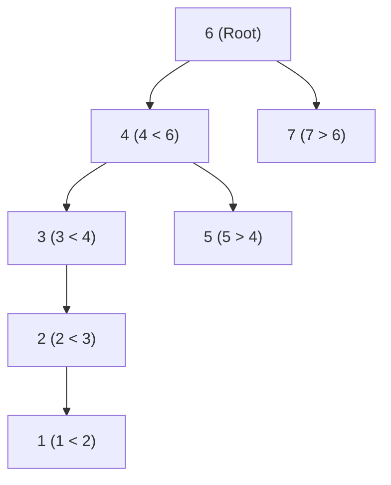

# 🌲 05.2 - Binary Search Trees (BST) & Insertion

> [!NOTE]
> **Binary Search Tree (BST - ต้นไม้ค้นหาแบบทวิภาค)** คือ Binary Tree ที่จัดระเบียบข้อมูลตามกฎ: **ซ้ายน้อยกว่า โตกว่าไปขวา ($L < \text{Root} < R$)** อย่างเคร่งครัด ทำให้สามารถค้นหา, แทรก, และลบข้อมูลได้เร็วในเวลาเฉลี่ย $O(\log N)$

---

## 🎮 Interactive BST Studio (สตูดิโอจำลองต้นไม้ค้นหาทวิภาค)
ทดลองพิมพ์ตัวเลข เช่น `6, 7, 4, 3, 5, 2, 1` แล้วกด **แทรก (Insert)**, **ค้นหา (Search)** หรือสังเกตผลการท่อง **Inorder Traversal** แบบเรียลไทม์:

<!-- dsa-studio: bst -->

---

## 🏛️ 1. คุณสมบัติของ BST (The Golden BST Rule)

สำหรับทุกๆ โหนด $X$ ใน BST:
1. **Left Subtree**: ทุกโหนดในฝั่งซ้ายของ $X$ ต้องมีค่าน้อยกว่า $X$ เสมอ ($\forall y \in \text{Left}(X), y < X$)
2. **Right Subtree**: ทุกโหนดในฝั่งขวาของ $X$ ต้องมีค่ามากกว่า $X$ เสมอ ($\forall z \in \text{Right}(X), z > X$)
3. ทั้ง Subtree ฝั่งซ้ายและฝั่งขวาต่างก็ต้องเป็น BST ด้วยเช่นกัน (Recursive Definition)



> [!IMPORTANT]
> **กฎเหล็กออกสอบ 100% (Inorder Traversal Magic)**:
> เมื่อท่อง BST ด้วยวิธี **Inorder Traversal (Left $\to$ Root $\to$ Right)** ผลลัพธ์ที่ได้จะ **เรียงลำดับจากน้อยไปมาก (Sorted Order)** เสมอ!
> - จากรูปด้านบน Inorder คือ: `1, 2, 3, 4, 5, 6, 7`

---

## 🔍 2. อัลกอริทึมการแทรกข้อมูล (Step-by-Step Insertion Tracing)

สมมติเราใส่ชุดข้อมูลตามข้อสอบจริงใน `Exams/BinarySearchTrees.py`: `[6, 7, 4, 3, 5, 2, 1]`

| ลำดับที่ | ค่าที่แทรก | เส้นทางที่เดินเปรียบเทียบ (Path Tracing) | ตำแหน่งที่ลงเกาะ |
| :---: | :---: | :--- | :--- |
| 1 | **6** | ต้นไม้ยังว่างอยู่ | กลายเป็น **Root** |
| 2 | **7** | เปรียบเทียบกับ 6 $\to 7 > 6 \implies$ ไปทางขวา | เกาะเป็น **Right Child ของ 6** |
| 3 | **4** | เปรียบเทียบกับ 6 $\to 4 < 6 \implies$ ไปทางซ้าย | เกาะเป็น **Left Child ของ 6** |
| 4 | **3** | เทียบกับ 6 (ไปซ้าย) $\to$ เทียบกับ 4 $\to 3 < 4$ (ไปซ้าย) | เกาะเป็น **Left Child ของ 4** |
| 5 | **5** | เทียบกับ 6 (ไปซ้าย) $\to$ เทียบกับ 4 $\to 5 > 4$ (ไปขวา) | เกาะเป็น **Right Child ของ 4** |
| 6 | **2** | เทียบ 6 (ซ้าย) $\to$ เทียบ 4 (ซ้าย) $\to$ เทียบ 3 $\to 2 < 3$ (ซ้าย) | เกาะเป็น **Left Child ของ 3** |
| 7 | **1** | เทียบ 6 (ซ้าย) $\to$ เทียบ 4 (ซ้าย) $\to$ เทียบ 3 (ซ้าย) $\to 1 < 2$ (ซ้าย) | เกาะเป็น **Left Child ของ 2** |

---

## 💻 3. โค้ดมาตรฐานระดับข้อสอบ (Runnable Python Implementation)

โค้ดนี้ถอดแบบมาจากชุดข้อสอบจริงใน `Exams/BinarySearchTrees.py`:

```python
class Node:
    def __init__(self, value: int):
        self.value = value
        self.left = None
        self.right = None

class BinarySearchTree:
    def __init__(self):
        self.root = None

    def insert(self, value: int):
        if self.root is None:
            self.root = Node(value)
        else:
            self._insert_recursive(self.root, value)

    def _insert_recursive(self, current_node: Node, value: int):
        if value < current_node.value:
            if current_node.left is None:
                current_node.left = Node(value)
            else:
                self._insert_recursive(current_node.left, value)
        elif value > current_node.value:
            if current_node.right is None:
                current_node.right = Node(value)
            else:
                self._insert_recursive(current_node.right, value)
        else:
            # กรณีเจอข้อมูลซ้ำ (Duplicate) ปกติในวิชาเรียนจะละเว้นไม่แทรกซ้ำ
            pass

    def search(self, value: int) -> bool:
        """ค้นหาข้อมูลในเวลา O(h)"""
        curr = self.root
        while curr is not None:
            if curr.value == value:
                return True
            elif value < curr.value:
                curr = curr.left
            else:
                curr = curr.right
        return False

    def inorder(self):
        """ท่องแบบ Inorder: Left -> Root -> Right (ได้ผลลัพธ์เรียงน้อยไปมาก)"""
        result = []
        def _inorder(node):
            if node:
                _inorder(node.left)
                result.append(node.value)
                _inorder(node.right)
        _inorder(self.root)
        return result

    def preorder(self):
        """ท่องแบบ Preorder: Root -> Left -> Right"""
        result = []
        def _preorder(node):
            if node:
                result.append(node.value)
                _preorder(node.left)
                _preorder(node.right)
        _preorder(self.root)
        return result


if __name__ == "__main__":
    bst = BinarySearchTree()
    # ข้อสอบจริง: แทรกชุดข้อมูล [6, 7, 4, 3, 5, 2, 1]
    keys = [6, 7, 4, 3, 5, 2, 1]
    for k in keys:
        bst.insert(k)

    print("🌳 ข้อมูลที่แทรก:", keys)
    print("📋 ผลการท่อง Inorder (เรียงน้อยไปมาก):", bst.inorder())
    print("📋 ผลการท่อง Preorder (ตามข้อสอบ):   ", bst.preorder())
    print("🔍 ค้นหาเลข 5 ในต้นไม้:", "เจอ! (True)" if bst.search(5) else "ไม่เจอ")
    print("🔍 ค้นหาเลข 99 ในต้นไม้:", "เจอ! (True)" if bst.search(99) else "ไม่เจอ (False)")
```

---

## ⏱️ 4. ประสิทธิภาพและความซับซ้อน (Time Complexity Analysis)

| สถานการณ์ (Case) | ความสูงของต้นไม้ ($h$) | Search / Insert Time | ลักษณะของต้นไม้ |
| :--- | :---: | :---: | :--- |
| **Best Case** | $O(\log N)$ | **$O(\log N)$** | สมดุลสมบูรณ์ (Perfectly Balanced) |
| **Average Case** | $O(\log N)$ | **$O(\log N)$** | สุ่มแทรกข้อมูลทั่วไป |
| **Worst Case (ข้อสอบชอบถาม!)** | $O(N)$ | **$O(N)$** | ข้อมูลใส่มาแบบเรียงลำดับอยู่แล้ว เช่น `1, 2, 3, 4, 5` ต้นไม้จะเบ้ข้างเดียวกลายเป็น Linked List (Degenerate Tree)! |
