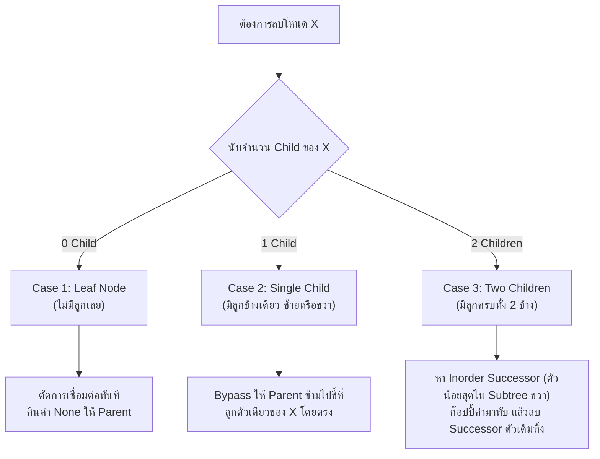
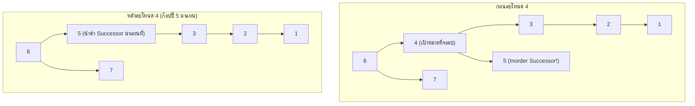

# ✂️ 05.3 - Binary Search Tree Removal (Node Deletion Cases)

> [!NOTE]
> การลบโหนดออกจาก **Binary Search Tree (BST)** เป็นหนึ่งในอัลกอริทึมที่มักออกสอบข้อเขียนและข้อสอบโค้ดบ่อยที่สุด เนื่องจากต้องจัดการ **3 กรณี (3 Cases)** เพื่อรักษาคุณสมบัติ $L < \text{Root} < R$ ให้ถูกต้องเสมอ

---

## 🎮 Interactive BST Studio (สตูดิโอทดลองลบโหนด)
ลองใส่ข้อมูลชุดข้อสอบ `6, 7, 4, 3, 5, 2, 1` แล้วกด **ลบ (Delete) เลข 4** เพื่อดูแอนิเมชันการดึง **Inorder Successor (5)** ขึ้นมาแทนที่:

<!-- dsa-studio: bst -->

---

## 🏛️ 1. เจาะลึก 3 กรณีการลบโหนด (The 3 Deletion Cases)

เมื่อค้นหาเจอโหนดเป้าหมาย $X$ ที่ต้องการลบ ให้จำแนกตามจำนวน Child ของ $X$:



---

## 🔍 2. แผนผังและวิเคราะห์ทีละกรณี (Visual Trace)

### Case 1: โหนดเป้าหมายเป็น Leaf (0 Child)
- **ตัวอย่าง**: ลบเลข `1` ออกจากต้นไม้
- **การทำงาน**: เมื่อโหนดไม่มีทั้ง `left` และ `right` ให้คืนค่า `None` กลับไปเชื่อมกับ Parent
```python
if current_node.left is None and current_node.right is None:
    return None
```

---

### Case 2: โหนดเป้าหมายมีลูกเพียงข้างเดียว (Single Child)
- **ตัวอย่าง**: ลบเลข `2` (ซึ่งมีลูกซ้ายคือ `1` เพียงตัวเดียว)
- **การทำงาน**: ส่ง Child ที่มีอยู่ตัวเดียวนั้น คืนกลับไปให้ Parent ชี้ข้ามแทนที่โหนดเดิม (Bypass Link)
```python
if current_node.left is None:
    return current_node.right
elif current_node.right is None:
    return current_node.left
```

---

### Case 3: โหนดเป้าหมายมีลูกครบทั้งสองข้าง (Two Children - พระเอกของข้อสอบ!)
- **ตัวอย่างข้อสอบจริง (`Exams/BinarySearchTrees.py`)**: ลบเลข **`4`**
  - ลูกซ้ายของ 4 คือ `3` (ซึ่งมีลูกต่อคือ `2`, `1`)
  - ลูกขวาของ 4 คือ `5`
- **ขั้นตอนการแก้ปัญหา**:
  1. ค้นหา **Inorder Successor** (โหนดที่มีค่าน้อยที่สุดใน Subtree ฝั่งขวา): เดินไปทางขวา 1 ก้าว (`node.right`) แล้วเลี้ยวซ้ายให้สุดทาง (`while curr.left: curr = curr.left`) $\to$ จะได้ค่า **`5`**
  2. **ก๊อปปี้ค่า** ของ Successor มาเขียนทับใส่ตำแหน่งของโหนด 4 (ทำให้ตำแหน่งเดิมมีค่าเป็น `5`)
  3. สั่ง Recursion ไปลบตัว Successor เดิมออกจาก Subtree ขวา: `node.right = delete(node.right, successor.value)` (ซึ่งตัว Successor จะตกเป็น Case 1 หรือ Case 2 เสมอ จึงลบออกได้ง่ายมาก!)



---

## 💻 3. โค้ดมาตรฐานระดับข้อสอบ (Runnable Python Implementation)

ทดลองกด **▶ รันโค้ดทันที** เพื่อดูการทำงานของ Recursion และผลลัพธ์ Preorder ตรงตามเฉลยข้อสอบ:

```python
class Node:
    def __init__(self, value: int):
        self.value = value
        self.left = None
        self.right = None

class BinarySearchTree:
    def __init__(self):
        self.root = None

    def insert(self, value: int):
        if self.root is None:
            self.root = Node(value)
        else:
            self._insert_recursive(self.root, value)

    def _insert_recursive(self, current_node: Node, value: int):
        if value < current_node.value:
            if current_node.left is None:
                current_node.left = Node(value)
            else:
                self._insert_recursive(current_node.left, value)
        elif value > current_node.value:
            if current_node.right is None:
                current_node.right = Node(value)
            else:
                self._insert_recursive(current_node.right, value)

    def delete(self, value: int):
        self.root = self._delete_recursive(self.root, value)

    def _delete_recursive(self, current_node: Node, value: int):
        if current_node is None:
            return None

        # 1. วิ่งค้นหาโหนดเป้าหมาย
        if value < current_node.value:
            current_node.left = self._delete_recursive(current_node.left, value)
        elif value > current_node.value:
            current_node.right = self._delete_recursive(current_node.right, value)
        else:
            # 2. เจอโหนดที่ต้องการลบแล้ว! ตรวจสอบ 3 กรณี:
            # Case 1 & Case 2: มีลูกไม่เกิน 1 ข้าง
            if current_node.left is None:
                return current_node.right
            elif current_node.right is None:
                return current_node.left

            # Case 3: มีลูกครบ 2 ข้าง -> หา Inorder Successor (ค่าน้อยสุดใน Subtree ขวา)
            temp = self._min_node_value(current_node.right)
            current_node.value = temp.value  # ก๊อปปี้ค่ามาทับ
            # ตามไปลบตัว Successor เดิมใน Subtree ขวา
            current_node.right = self._delete_recursive(current_node.right, temp.value)

        return current_node

    def _min_node_value(self, node: Node) -> Node:
        """เดินซ้ายสุดเพื่อหาค่าน้อยที่สุดใน Subtree"""
        current = node
        while current.left is not None:
            current = current.left
        return current

    def inorder(self):
        result = []
        def _in(n):
            if n:
                _in(n.left)
                result.append(n.value)
                _in(n.right)
        _in(self.root)
        return result

    def preorder(self):
        result = []
        def _pre(n):
            if n:
                result.append(n.value)
                _pre(n.left)
                _pre(n.right)
        _pre(self.root)
        return result


if __name__ == "__main__":
    tree = BinarySearchTree()
    # ข้อสอบจริง: แทรก 6, 7, 4, 3, 5, 2, 1
    for x in [6, 7, 4, 3, 5, 2, 1]:
        tree.insert(x)

    print("🌳 ต้นไม้ก่อนลบ:")
    print("   Inorder: ", tree.inorder())
    print("   Preorder:", tree.preorder())

    print("\n✂️ กำลังลบโหนด 4 (Case 3: Two Children)...")
    tree.delete(4)

    print("\n✅ ต้นไม้หลังลบโหนด 4 สำเร็จ:")
    print("   Inorder :", tree.inorder())
    print("   Preorder:", tree.preorder())
    print("   (ตรงตามผลเฉลยในข้อสอบ Exams/BinarySearchTrees.py: 6, 7, 5, 3, 2, 1)")
```

---

## 🎯 4. จุดผิดบ่อยในห้องสอบ (Exam Traps)

> [!WARNING]
> 1. **ลืมอัปเดต Pointer ย้อนกลับ (`current_node.left = ...`)**:
>    - ในฟังก์ชัน recursive ถ้าเขียนแค่ `self._delete_recursive(current_node.left, value)` โดยไม่เอาผลลัพธ์มา assign คืนให้ `current_node.left` โหนด parent จะยังคงชี้ไปที่โหนดเดิม ต้นไม้จะไม่ถูกตัดสาย!
> 2. **เลือก Successor ผิดฝั่ง**:
>    - **Inorder Successor** คือ ตัวที่น้อยที่สุดของฝั่งขวา (`min(right)`)
>    - หรือจะใช้ **Inorder Predecessor** คือ ตัวที่มากที่สุดของฝั่งซ้าย (`max(left)`) ก็ได้
>    - ห้ามสลับเป็นมากสุดของขวา หรือน้อยสุดของซ้ายเด็ดขาด!
