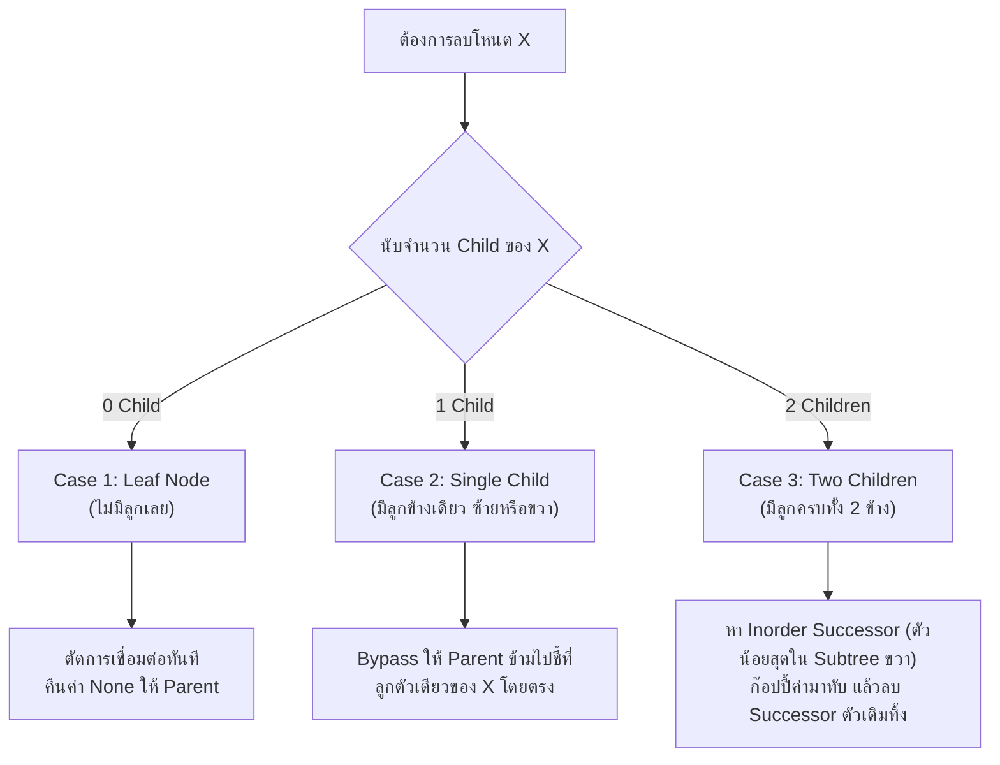
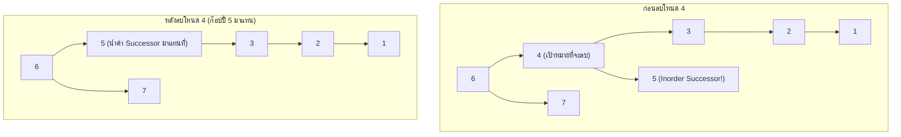
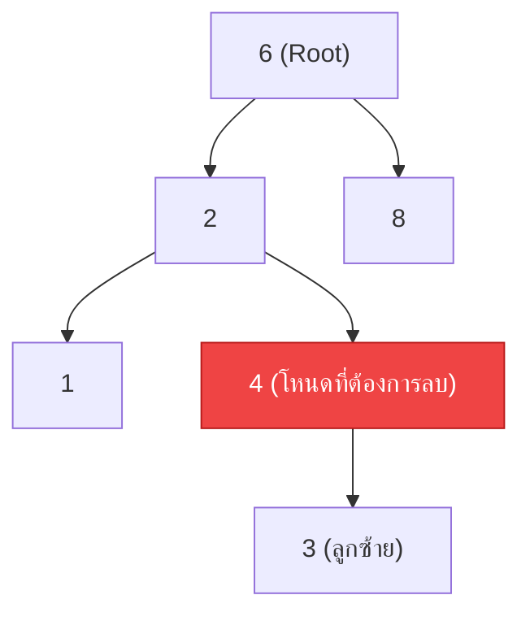
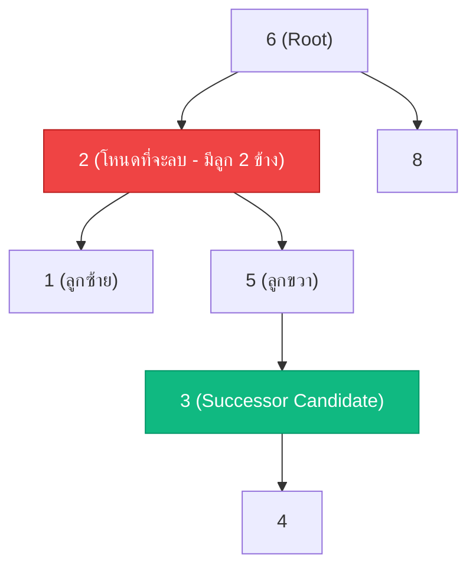
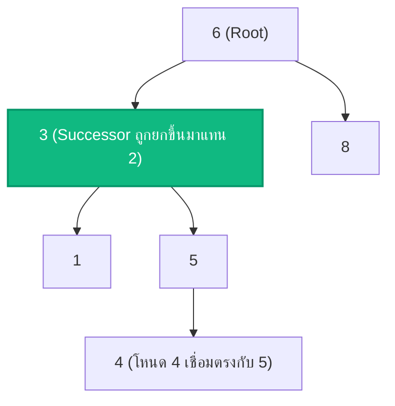

# ✂️ 05.3 - Binary Search Tree Removal (Node Deletion Cases)

> [!NOTE]
> การลบโหนดออกจาก **Binary Search Tree (BST)** เป็นหนึ่งในอัลกอริทึมที่มักออกสอบข้อเขียนและข้อสอบโค้ดบ่อยที่สุด เนื่องจากต้องจัดการ **3 กรณี (3 Cases)** เพื่อรักษาคุณสมบัติ $L < \text{Root} < R$ ให้ถูกต้องเสมอ

---

## 🎮 Interactive BST Studio (สตูดิโอทดลองลบโหนด)
ลองใส่ข้อมูลชุดข้อสอบ `6, 7, 4, 3, 5, 2, 1` แล้วกด **ลบ (Delete) เลข 4** เพื่อดูแอนิเมชันการดึง **Inorder Successor (5)** ขึ้นมาแทนที่:

<!-- dsa-studio: bst -->

---

## 🏛️ 1. เจาะลึก 3 กรณีการลบโหนด (The 3 Deletion Cases)

เมื่อค้นหาเจอโหนดเป้าหมาย $X$ ที่ต้องการลบ ให้จำแนกตามจำนวน Child ของ $X$:



---

## 🔍 2. แผนผังและวิเคราะห์ทีละกรณี (Visual Trace)

### Case 1: โหนดเป้าหมายเป็น Leaf (0 Child)
- **ตัวอย่าง**: ลบเลข `1` ออกจากต้นไม้
- **การทำงาน**: เมื่อโหนดไม่มีทั้ง `left` และ `right` ให้คืนค่า `None` กลับไปเชื่อมกับ Parent
```python
if current_node.left is None and current_node.right is None:
    return None
```

---

### Case 2: โหนดเป้าหมายมีลูกเพียงข้างเดียว (Single Child)
- **ตัวอย่าง**: ลบเลข `2` (ซึ่งมีลูกซ้ายคือ `1` เพียงตัวเดียว)
- **การทำงาน**: ส่ง Child ที่มีอยู่ตัวเดียวนั้น คืนกลับไปให้ Parent ชี้ข้ามแทนที่โหนดเดิม (Bypass Link)
```python
if current_node.left is None:
    return current_node.right
elif current_node.right is None:
    return current_node.left
```

---

### Case 3: โหนดเป้าหมายมีลูกครบทั้งสองข้าง (Two Children - พระเอกของข้อสอบ!)
- **ตัวอย่างข้อสอบจริง (`Exams/BinarySearchTrees.py`)**: ลบเลข **`4`**
  - ลูกซ้ายของ 4 คือ `3` (ซึ่งมีลูกต่อคือ `2`, `1`)
  - ลูกขวาของ 4 คือ `5`
- **ขั้นตอนการแก้ปัญหา**:
  1. ค้นหา **Inorder Successor** (โหนดที่มีค่าน้อยที่สุดใน Subtree ฝั่งขวา): เดินไปทางขวา 1 ก้าว (`node.right`) แล้วเลี้ยวซ้ายให้สุดทาง (`while curr.left: curr = curr.left`) $\to$ จะได้ค่า **`5`**
  2. **ก๊อปปี้ค่า** ของ Successor มาเขียนทับใส่ตำแหน่งของโหนด 4 (ทำให้ตำแหน่งเดิมมีค่าเป็น `5`)
  3. สั่ง Recursion ไปลบตัว Successor เดิมออกจาก Subtree ขวา: `node.right = delete(node.right, successor.value)` (ซึ่งตัว Successor จะตกเป็น Case 1 หรือ Case 2 เสมอ จึงลบออกได้ง่ายมาก!)



---

## 💻 3. โค้ดมาตรฐานระดับข้อสอบ (Runnable Python Implementation)

ทดลองกด **▶ รันโค้ดทันที** เพื่อดูการทำงานของ Recursion และผลลัพธ์ Preorder ตรงตามเฉลยข้อสอบ:

```python
class Node:
    def __init__(self, value: int):
        self.value = value
        self.left = None
        self.right = None

class BinarySearchTree:
    def __init__(self):
        self.root = None

    def insert(self, value: int):
        if self.root is None:
            self.root = Node(value)
        else:
            self._insert_recursive(self.root, value)

    def _insert_recursive(self, current_node: Node, value: int):
        if value < current_node.value:
            if current_node.left is None:
                current_node.left = Node(value)
            else:
                self._insert_recursive(current_node.left, value)
        elif value > current_node.value:
            if current_node.right is None:
                current_node.right = Node(value)
            else:
                self._insert_recursive(current_node.right, value)

    def delete(self, value: int):
        self.root = self._delete_recursive(self.root, value)

    def _delete_recursive(self, current_node: Node, value: int):
        if current_node is None:
            return None

        # 1. วิ่งค้นหาโหนดเป้าหมาย
        if value < current_node.value:
            current_node.left = self._delete_recursive(current_node.left, value)
        elif value > current_node.value:
            current_node.right = self._delete_recursive(current_node.right, value)
        else:
            # 2. เจอโหนดที่ต้องการลบแล้ว! ตรวจสอบ 3 กรณี:
            # Case 1 & Case 2: มีลูกไม่เกิน 1 ข้าง
            if current_node.left is None:
                return current_node.right
            elif current_node.right is None:
                return current_node.left

            # Case 3: มีลูกครบ 2 ข้าง -> หา Inorder Successor (ค่าน้อยสุดใน Subtree ขวา)
            temp = self._min_node_value(current_node.right)
            current_node.value = temp.value  # ก๊อปปี้ค่ามาทับ
            # ตามไปลบตัว Successor เดิมใน Subtree ขวา
            current_node.right = self._delete_recursive(current_node.right, temp.value)

        return current_node

    def _min_node_value(self, node: Node) -> Node:
        """เดินซ้ายสุดเพื่อหาค่าน้อยที่สุดใน Subtree"""
        current = node
        while current.left is not None:
            current = current.left
        return current

    def inorder(self):
        result = []
        def _in(n):
            if n:
                _in(n.left)
                result.append(n.value)
                _in(n.right)
        _in(self.root)
        return result

    def preorder(self):
        result = []
        def _pre(n):
            if n:
                result.append(n.value)
                _pre(n.left)
                _pre(n.right)
        _pre(self.root)
        return result


if __name__ == "__main__":
    tree = BinarySearchTree()
    # ข้อสอบจริง: แทรก 6, 7, 4, 3, 5, 2, 1
    for x in [6, 7, 4, 3, 5, 2, 1]:
        tree.insert(x)

    print("🌳 ต้นไม้ก่อนลบ:")
    print("   Inorder: ", tree.inorder())
    print("   Preorder:", tree.preorder())

    print("\n✂️ กำลังลบโหนด 4 (Case 3: Two Children)...")
    tree.delete(4)

    print("\n✅ ต้นไม้หลังลบโหนด 4 สำเร็จ:")
    print("   Inorder :", tree.inorder())
    print("   Preorder:", tree.preorder())
    print("   (ตรงตามผลเฉลยในข้อสอบ Exams/BinarySearchTrees.py: 6, 7, 5, 3, 2, 1)")
```

---

---

## 📝 5. คลังตัวอย่างข้อสอบ & แบบฝึกหัดในห้องเรียน (Classroom "For Example 5.2 & 5.3" Tracing)

> [!INFO]
> **ที่มาของเอกสารต้นฉบับ**: เอกสารสไลด์และใบงานจริง `Lectures/Lecture 5.1 Binary Search Tree/For example Binary Search Tree std delete round 4 in insert_s step.pdf` (หน้า 4-5) และ `Lectures/Lecture 5.2 Binary Search Tree Remove/Example for Binary Search Tree remove 2 std.pdf`

---

### 🎯 5.1 โจทย์ For Example 5.2: การลบโหนดที่มีลูก 1 ข้าง (Remove 4 - One Child Case)

#### 📄 โจทย์คำถาม:
> If there is an existing `BinarySearchTree`'s instance variable `bst` containing the numbers `[1, 2, 3, 4, 6, 8]` (Root is 6, 4 has left child 3).
> Write the steps for the `_delete_recursive()` function when removing `4` from `bst`. In each round, specify:
> 1. Values of parameters `value` and `current_node`
> 2. What statements are executed under the condition evaluated as True?



#### 💻 เฉลยคำตอบทีละรอบ (Step-by-Step Answer):

| รอบที่ (Round) | พารามิเตอร์ (`value`, `current_node`) | เงื่อนไขที่ประเมินเป็นจริง (True) | คำสั่งที่ถูกประมวลผล (Executed Statement) |
| :---: | :--- | :--- | :--- |
| **Round 1** | `value = 4`, `current_node = 6` | `value < current_node.val` ($4 < 6$ จริง) | `current_node.left = _delete_recursive(current_node.left, value)` |
| **Round 2** | `value = 4`, `current_node = 2` | `value > current_node.val` ($4 > 2$ จริง) | `current_node.right = _delete_recursive(current_node.right, value)` |
| **Round 3** | `value = 4`, `current_node = 4` | `elif current_node.right is None:` เป็น **True** | `return current_node.left` (ส่งโหนด 3 กลับไปให้ `node2.right`) |

---

### 🎯 5.2 โจทย์ For Example 5.3: การลบโหนดที่มีลูก 2 ข้าง (Remove 2 - Two Children Case)

#### 📄 โจทย์คำถาม:
> If there is an existing `BinarySearchTree`'s instance variable `bst` containing elements as shown below (Node 2 has left child 1 and right subtree with root 5).
> Write the steps for `_delete_recursive()` when removing `2` from `bst`.



#### 💻 ลำดับขั้นตอนการหาคำตอบที่ละเอียดและถูกต้อง:

##### ขั้นตอนที่ 1: วิ่งค้นหาโหนดที่จะลบ
- **Round 1**: `value = 2, current_node = 6`
  - $2 < 6 \implies$ `current_node.left = _delete_recursive(current_node.left, value)`
- **Round 2**: `value = 2, current_node = 2`
  - เจอโหนดค่า 2 แล้ว! เนื่องจากมีลูกครบทั้งสองข้าง (`left` และ `right` ไม่เป็น None) จึงต้องเข้าสู่ Case 3:
  - เรียก `temp_node = _min_value_node(current_node.right)` เพื่อหาค่าต่ำสุดในกิ่งขวา

##### ขั้นตอนที่ 2: การทำงานในฟังก์ชัน `_min_value_node(node)`
- ส่งโหนด `5` เข้าไป: `current = 5`
- `while current.left is not None:`
  - ก้าวไปทางซ้าย: `current = 3`
  - ตรวจสอบโหนด `3` พบว่า `3.left is None` $\implies$ หลุดลูป
  - คืนค่าโหนด `3` เป็น **In-order Successor**!
- แทนที่ค่า: `current_node.value = temp_node.value` (เปลี่ยนค่าของโหนด 2 เป็น 3)

##### ขั้นตอนที่ 3: Recursive ไปลบตัว Successor เดิม
- เรียก `current_node.right = _delete_recursive(current_node.right, temp_node.value)`
- **Round 3**: `value = 3, current_node = 5`
  - $3 < 5 \implies$ `current_node.left = _delete_recursive(current_node.left, 3)`
- **Round 4**: `value = 3, current_node = 3`
  - โหนด 3 มีลูกขวาเพียงตัวเดียวคือ 4 (`left is None`)
  - คืนค่า `current_node.right` (ส่งโหนด 4 กลับไปให้โหนด 5 ต่อทางซ้ายแทน 3)



---

#### 🖥️ ตัวอย่างหน้าจอ Interface การจำลองการลบโหนดใน BST (Deletion Studio Preview)
```console
============================================================
              BST NODE DELETION STEP TRACER                 
============================================================
[Target to Delete] Node 2 (Two Children Case)
[Step 1] Traverse from Root(6) -> Branch LEFT -> At Node 2
[Step 2] Detected Two Children (Left: 1, Right: 5)
[Step 3] Invoke _min_value_node(Subtree: 5)
         -> Step into 5.left -> Found Node 3
         -> 3 has no left child -> Identified Successor = 3
[Step 4] Copy value 3 into target node 2 (Node becomes 3)
[Step 5] Invoke _delete_recursive(Subtree: 5, target: 3)
         -> At Node 5: Branch LEFT
         -> At Node 3: One-child case -> Splice with right child 4
[Final Tree In-order] [ 1, 3, 4, 5, 6, 8 ] (Integrity Preserved!)
============================================================
```

---

## 🔗 ลิงก์เชื่อมโยงใน Obsidian Wiki
- ก่อนหน้า: [[05.2 - Binary Search Trees (BST) & Insertion]]
- ถัดไป (Hashing): [[06.1 - Hash Tables & Collision Resolution Strategies]]
- ตารางความเร็วรวม: [[Glossary & Complexity Cheat Sheet]]
- กลับหน้าหลัก: [[Index]]

