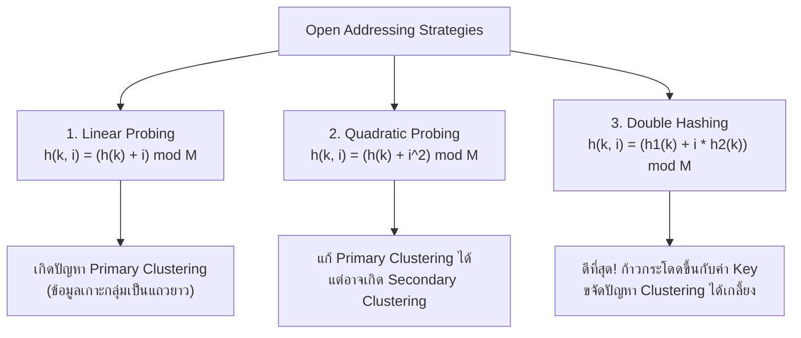

# 🔑 06.1 - Hash Tables & Collision Resolution Strategies

> [!NOTE]
> **Hash Table (ตารางแฮช)** คือโครงสร้างข้อมูลที่ให้ความเร็วในการค้นหา, แทรก, และลบข้อมูลได้ในเวลาเฉลี่ย **$O(1)$** ผ่านการแปลง Key เป็นตำแหน่ง Index ด้วย **Hash Function** เหมาะสำหรับงาน Cache, Compiler Symbol Tables, และ Database Indexing

---

## 🎮 Interactive Hash Studio (สตูดิโอจำลองตารางแฮช)
ทดลองเลือกกลยุทธ์ **Linear Probing**, **Quadratic Probing**, หรือ **Double Hashing** แล้วใส่ค่า Key เพื่อดูการชน (Collision) และสเต็ปการหาช่องว่างทีละช่อง:

<!-- dsa-studio: hash -->

---

## 🏛️ 1. หลักการของ Hash Function (ASCII Sum & Modulo)

Hash Function ที่ดีต้องมีคุณสมบัติ:
1. **Deterministic**: Input เดียวกัน ต้องได้ Hash Value ตัวเดิมเสมอ
2. **Uniform Distribution**: กระจายข้อมูลลงทุก Index ได้สม่ำเสมอ ลดการเกิดกลุ่มก้อน (Clustering)
3. **Fast Computation**: คำนวณได้เร็วในเวลา $O(1)$ หรือตามความยาวของสตริง $O(L)$

### 1.1 ตัวอย่างฟังก์ชันจากข้อสอบ (`Exams/Hash.py`)
การคำนวณ Hash สำหรับข้อความสตริง โดยบวกค่ารหัส ASCII ของตัวอักษรทุกตัวแล้ว Modulo ด้วยขนาดตาราง $M$:
- กำหนดขนาดตาราง $M = 10$, คำนวณ `hash("AB", 10)`:
  - ตัว `'A'` มีรหัส ASCII = **65**
  - ตัว `'B'` มีรหัส ASCII = **66**
  - ผลรวม $\text{sum} = 65 + 66 = 131$
  - ตำแหน่ง Index = $131 \pmod{10} = \mathbf{1}$

---

## ⚔️ 2. กลยุทธ์การแก้ปัญหาการชนกัน (Collision Resolution)

เมื่อ Key ต่างกันคำนวณได้ Index ซ้ำกัน ($h(k_1) = h(k_2)$) เรียกว่าเกิด **Collision** ซึ่งมี 2 หมวดหมู่หลัก:

### 2.1 Separate Chaining (ใช้ Linked List ในแต่ละช่อง)
- แต่ละ Slot ใน Table จะเป็น Head ของ Linked List
- เมื่อชนกัน ก็นำโหนดใหม่ไปต่อท้าย (หรือแทรกหัว) ใน List ช่องนั้น
- **ข้อดี**: ไม่ต้องกังวลเรื่องตารางเต็ม, Load Factor $\lambda$ สามารถเกิน $1.0$ ได้

---

### 2.2 Open Addressing (การหาช่องว่างในตารางเดิม)
ข้อมูลทุกตัวต้องอยู่ใน Table ขนาด $M$ ดังนั้น Load Factor $\lambda \le 1.0$ เสมอ



---

## 📊 3. ตารางเปรียบเทียบการชนแบบละเอียด (Step-by-Step Collision Tracing)

กำหนดขนาดตาราง $M = 11$, มีข้อมูลเดิมอยู่ในตารางแล้ว ได้แก่:
- `25` ($25 \bmod 11 = 3$) $\to$ ช่อง 3
- `42` ($42 \bmod 11 = 9$) $\to$ ช่อง 9
- `96` ($96 \bmod 11 = 8$) $\to$ ช่อง 8
- `77` ($77 \bmod 11 = 0$) $\to$ ช่อง 0
- `32` ($32 \bmod 11 = 10$) $\to$ ช่อง 10

**โจทย์ข้อสอบ**: ต้องการแทรกคีย์ **$k = 43$** ลงในตาราง ซึ่งคำนวณแฮชแรกได้ $h_1(43) = 43 \pmod{11} = \mathbf{10}$ (เกิด Collision ชนกับเลข 32 ที่ช่อง 10!)

| ครั้งที่ Probe ($i$) | Linear Probing: $(10 + i) \bmod 11$ | Quadratic Probing: $(10 + i^2) \bmod 11$ | Double Hashing: $(10 + i \times h_2(43)) \bmod 11$<br/>โดย $h_2(k) = 7 - (k \bmod 7) = 7 - 1 = 6$ |
| :---: | :--- | :--- | :--- |
| **$i = 0$** | $(10 + 0) = 10$ $\implies$ **ชน 32** | $(10 + 0) = 10$ $\implies$ **ชน 32** | $(10 + 0) = 10$ $\implies$ **ชน 32** |
| **$i = 1$** | $(10 + 1) \bmod 11 = 0$ $\implies$ **ชน 77** | $(10 + 1) \bmod 11 = 0$ $\implies$ **ชน 77** | $(10 + 1 \times 6) \bmod 11 = 16 \bmod 11 = \mathbf{5}$ $\implies$ **ว่าง! เจอช่องลงทันที!** |
| **$i = 2$** | $(10 + 2) \bmod 11 = \mathbf{1}$ $\implies$ **ว่าง! ลงช่อง 1** | $(10 + 4) \bmod 11 = 3$ $\implies$ **ชน 25** | *(ไม่ต้องทำต่อ เพราะลงช่อง 5 สำเร็จแล้ว)* |
| **$i = 3$** | - | $(10 + 9) \bmod 11 = 8$ $\implies$ **ชน 96** | - |
| **$i = 4$** | - | $(10 + 16) \bmod 11 = \mathbf{4}$ $\implies$ **ว่าง! ลงช่อง 4** | - |

> [!TIP]
> **สรุปผลการเปรียบเทียบในข้อสอบ**:
> - **Linear Probing**: ใช้ 2 Probes (ลงช่อง 1)
> - **Quadratic Probing**: ใช้ 4 Probes (ลงช่อง 4)
> - **Double Hashing**: ใช้เพียง **1 Probe** (ลงช่อง 5) รวดเร็วและกระจายข้อมูลได้ดีที่สุด!

---

## 💻 4. โค้ดมาตรฐานระดับข้อสอบ (Runnable Python Implementation)

ทดลองกด **▶ รันโค้ดทันที** เพื่อดูการคำนวณ ASCII Hash และการแก้ปัญหา Collision:

```python
def string_hash(key: str, table_size: int) -> int:
    """คำนวณ Hash จากผลรวมรหัส ASCII ตามข้อสอบ Exams/Hash.py"""
    hash_val = 0
    print(f"--- คำนวณ Hash สำหรับ Key: '{key}' ---")
    for char in key:
        code = ord(char)
        hash_val += code
        print(f"  ตัวอักษร '{char}' -> ASCII code: {code}")
    result = hash_val % table_size
    print(f"  ผลรวม = {hash_val} | Index = {hash_val} % {table_size} = {result}")
    return result


class HashTableOpenAddressing:
    def __init__(self, size: int = 11):
        self.size = size
        self.table = [None] * size

    def _h1(self, k: int) -> int:
        return k % self.size

    def _h2(self, k: int) -> int:
        return 7 - (k % 7)

    def insert_double_hashing(self, k: int):
        h1 = self._h1(k)
        step = self._h2(k)
        print(f"\n📥 แทรก Key: {k} (h1={h1}, step={step})")

        for i in range(self.size):
            slot = (h1 + i * step) % self.size
            if self.table[slot] is None:
                self.table[slot] = k
                print(f"  ✅ Probe #{i}: เจอช่องว่างที่ Index {slot} -> บันทึกสำเร็จ!")
                return True
            else:
                print(f"  ⚠️ Probe #{i}: ชนกับ {self.table[slot]} ที่ Index {slot}")
        print("  ❌ ตารางเต็ม! ไม่สามารถแทรกได้")
        return False


if __name__ == "__main__":
    # 1. ทดสอบฟังก์ชัน ASCII Hash ตามข้อสอบจริง
    string_hash("AB", 10)

    # 2. ทดสอบจำลองการชนของชุดตัวเลขตามโจทย์ทฤษฎี
    ht = HashTableOpenAddressing(size=11)
    # แทรกข้อมูลตั้งต้น
    initial_keys = [25, 42, 96, 77, 32]
    for k in initial_keys:
        ht.insert_double_hashing(k)

    print("\nสภาพตารางก่อนแทรก 43:", ht.table)
    # แทรก 43 ที่เกิดการชนกับ 32
    ht.insert_double_hashing(43)
    print("สภาพตารางหลังแทรก 43 สำเร็จ:", ht.table)
```

---

## 🧮 5. Load Factor ($\lambda$) และ Rehashing

$$\lambda = \frac{N}{M} = \frac{\text{จำนวนสมาชิกปัจจุบัน}}{\text{ขนาดของตารางทั้งหมด}}$$

- สำหรับ **Open Addressing**: แนะนำให้ทำ **Rehashing** เมื่อ $\lambda > 0.5$ (หรือ $0.7$)
- **การ Rehashing**:
  1. สร้างตารางใหม่ที่มีขนาดเป็น **เลขจำนวนเฉพาะ (Prime Number)** ที่มีขนาดอย่างน้อย $2 \times M_{\text{เดิม}}$
  2. ดึงข้อมูลทุกตัวจากตารางเก่ามาคำนวณค่า $h_{\text{new}}(k) = k \pmod{M_{\text{ใหม่}}}$ แล้วแทรกลงตารางใหม่ทั้งหมด
