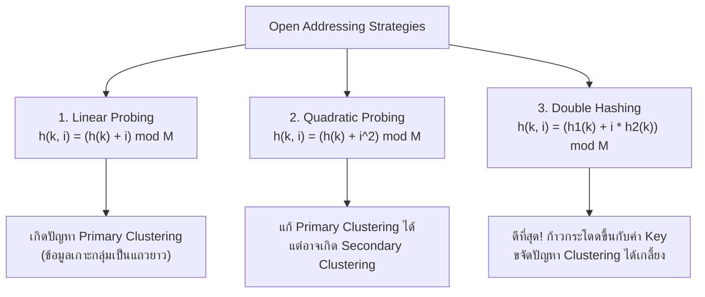

# 🔑 06.1 - Hash Tables & Collision Resolution Strategies

> [!NOTE]
> **Hash Table (ตารางแฮช)** คือโครงสร้างข้อมูลที่ให้ความเร็วในการค้นหา, แทรก, และลบข้อมูลได้ในเวลาเฉลี่ย **$O(1)$** ผ่านการแปลง Key เป็นตำแหน่ง Index ด้วย **Hash Function** เหมาะสำหรับงาน Cache, Compiler Symbol Tables, และ Database Indexing

---

## 🎮 Interactive Hash Studio (สตูดิโอจำลองตารางแฮช)
ทดลองเลือกกลยุทธ์ **Linear Probing**, **Quadratic Probing**, หรือ **Double Hashing** แล้วใส่ค่า Key เพื่อดูการชน (Collision) และสเต็ปการหาช่องว่างทีละช่อง:

<!-- dsa-studio: hash -->

---

## 🏛️ 1. หลักการของ Hash Function (ASCII Sum & Modulo)

Hash Function ที่ดีต้องมีคุณสมบัติ:
1. **Deterministic**: Input เดียวกัน ต้องได้ Hash Value ตัวเดิมเสมอ
2. **Uniform Distribution**: กระจายข้อมูลลงทุก Index ได้สม่ำเสมอ ลดการเกิดกลุ่มก้อน (Clustering)
3. **Fast Computation**: คำนวณได้เร็วในเวลา $O(1)$ หรือตามความยาวของสตริง $O(L)$

### 1.1 ตัวอย่างฟังก์ชันจากข้อสอบ (`Exams/Hash.py`)
การคำนวณ Hash สำหรับข้อความสตริง โดยบวกค่ารหัส ASCII ของตัวอักษรทุกตัวแล้ว Modulo ด้วยขนาดตาราง $M$:
- กำหนดขนาดตาราง $M = 10$, คำนวณ `hash("AB", 10)`:
  - ตัว `'A'` มีรหัส ASCII = **65**
  - ตัว `'B'` มีรหัส ASCII = **66**
  - ผลรวม $\text{sum} = 65 + 66 = 131$
  - ตำแหน่ง Index = $131 \pmod{10} = \mathbf{1}$

---

## ⚔️ 2. กลยุทธ์การแก้ปัญหาการชนกัน (Collision Resolution)

เมื่อ Key ต่างกันคำนวณได้ Index ซ้ำกัน ($h(k_1) = h(k_2)$) เรียกว่าเกิด **Collision** ซึ่งมี 2 หมวดหมู่หลัก:

### 2.1 Separate Chaining (ใช้ Linked List ในแต่ละช่อง)
- แต่ละ Slot ใน Table จะเป็น Head ของ Linked List
- เมื่อชนกัน ก็นำโหนดใหม่ไปต่อท้าย (หรือแทรกหัว) ใน List ช่องนั้น
- **ข้อดี**: ไม่ต้องกังวลเรื่องตารางเต็ม, Load Factor $\lambda$ สามารถเกิน $1.0$ ได้

---

### 2.2 Open Addressing (การหาช่องว่างในตารางเดิม)
ข้อมูลทุกตัวต้องอยู่ใน Table ขนาด $M$ ดังนั้น Load Factor $\lambda \le 1.0$ เสมอ



---

## 📊 3. ตารางเปรียบเทียบการชนแบบละเอียด (Step-by-Step Collision Tracing)

กำหนดขนาดตาราง $M = 11$, มีข้อมูลเดิมอยู่ในตารางแล้ว ได้แก่:
- `25` ($25 \bmod 11 = 3$) $\to$ ช่อง 3
- `42` ($42 \bmod 11 = 9$) $\to$ ช่อง 9
- `96` ($96 \bmod 11 = 8$) $\to$ ช่อง 8
- `77` ($77 \bmod 11 = 0$) $\to$ ช่อง 0
- `32` ($32 \bmod 11 = 10$) $\to$ ช่อง 10

**โจทย์ข้อสอบ**: ต้องการแทรกคีย์ **$k = 43$** ลงในตาราง ซึ่งคำนวณแฮชแรกได้ $h_1(43) = 43 \pmod{11} = \mathbf{10}$ (เกิด Collision ชนกับเลข 32 ที่ช่อง 10!)

| ครั้งที่ Probe ($i$) | Linear Probing: $(10 + i) \bmod 11$ | Quadratic Probing: $(10 + i^2) \bmod 11$ | Double Hashing: $(10 + i \times h_2(43)) \bmod 11$<br/>โดย $h_2(k) = 7 - (k \bmod 7) = 7 - 1 = 6$ |
| :---: | :--- | :--- | :--- |
| **$i = 0$** | $(10 + 0) = 10$ $\implies$ **ชน 32** | $(10 + 0) = 10$ $\implies$ **ชน 32** | $(10 + 0) = 10$ $\implies$ **ชน 32** |
| **$i = 1$** | $(10 + 1) \bmod 11 = 0$ $\implies$ **ชน 77** | $(10 + 1) \bmod 11 = 0$ $\implies$ **ชน 77** | $(10 + 1 \times 6) \bmod 11 = 16 \bmod 11 = \mathbf{5}$ $\implies$ **ว่าง! เจอช่องลงทันที!** |
| **$i = 2$** | $(10 + 2) \bmod 11 = \mathbf{1}$ $\implies$ **ว่าง! ลงช่อง 1** | $(10 + 4) \bmod 11 = 3$ $\implies$ **ชน 25** | *(ไม่ต้องทำต่อ เพราะลงช่อง 5 สำเร็จแล้ว)* |
| **$i = 3$** | - | $(10 + 9) \bmod 11 = 8$ $\implies$ **ชน 96** | - |
| **$i = 4$** | - | $(10 + 16) \bmod 11 = \mathbf{4}$ $\implies$ **ว่าง! ลงช่อง 4** | - |

> [!TIP]
> **สรุปผลการเปรียบเทียบในข้อสอบ**:
> - **Linear Probing**: ใช้ 2 Probes (ลงช่อง 1)
> - **Quadratic Probing**: ใช้ 4 Probes (ลงช่อง 4)
> - **Double Hashing**: ใช้เพียง **1 Probe** (ลงช่อง 5) รวดเร็วและกระจายข้อมูลได้ดีที่สุด!

---

## 💻 4. โค้ดมาตรฐานระดับข้อสอบ (Runnable Python Implementation)

ทดลองกด **▶ รันโค้ดทันที** เพื่อดูการคำนวณ ASCII Hash และการแก้ปัญหา Collision:

```python
def string_hash(key: str, table_size: int) -> int:
    """คำนวณ Hash จากผลรวมรหัส ASCII ตามข้อสอบ Exams/Hash.py"""
    hash_val = 0
    print(f"--- คำนวณ Hash สำหรับ Key: '{key}' ---")
    for char in key:
        code = ord(char)
        hash_val += code
        print(f"  ตัวอักษร '{char}' -> ASCII code: {code}")
    result = hash_val % table_size
    print(f"  ผลรวม = {hash_val} | Index = {hash_val} % {table_size} = {result}")
    return result


class HashTableOpenAddressing:
    def __init__(self, size: int = 11):
        self.size = size
        self.table = [None] * size

    def _h1(self, k: int) -> int:
        return k % self.size

    def _h2(self, k: int) -> int:
        return 7 - (k % 7)

    def insert_double_hashing(self, k: int):
        h1 = self._h1(k)
        step = self._h2(k)
        print(f"\n📥 แทรก Key: {k} (h1={h1}, step={step})")

        for i in range(self.size):
            slot = (h1 + i * step) % self.size
            if self.table[slot] is None:
                self.table[slot] = k
                print(f"  ✅ Probe #{i}: เจอช่องว่างที่ Index {slot} -> บันทึกสำเร็จ!")
                return True
            else:
                print(f"  ⚠️ Probe #{i}: ชนกับ {self.table[slot]} ที่ Index {slot}")
        print("  ❌ ตารางเต็ม! ไม่สามารถแทรกได้")
        return False


if __name__ == "__main__":
    # 1. ทดสอบฟังก์ชัน ASCII Hash ตามข้อสอบจริง
    string_hash("AB", 10)

    # 2. ทดสอบจำลองการชนของชุดตัวเลขตามโจทย์ทฤษฎี
    ht = HashTableOpenAddressing(size=11)
    # แทรกข้อมูลตั้งต้น
    initial_keys = [25, 42, 96, 77, 32]
    for k in initial_keys:
        ht.insert_double_hashing(k)

    print("\nสภาพตารางก่อนแทรก 43:", ht.table)
    # แทรก 43 ที่เกิดการชนกับ 32
    ht.insert_double_hashing(43)
    print("สภาพตารางหลังแทรก 43 สำเร็จ:", ht.table)
```

---

---

## 📝 6. คลังตัวอย่างข้อสอบ & แบบฝึกหัดในห้องเรียน (Classroom "For Example" & Worksheets)

> [!INFO]
> **ที่มาของเอกสารต้นฉบับ**: เอกสารสไลด์การสอนจริง `Lectures/Lecture 7 Hashing/Lecture 7 Hashing.pdf` (หน้า 10, 13, 17, 19, 20) และไฟล์ทดสอบ `Exams/Hash.py`

---

### 🎯 6.1 โจทย์ For Example: การเปรียบเทียบ Open Addressing 3 กลยุทธ์

#### 📄 กำหนดข้อมูล:
- ขนาดตารางเริ่มต้น: `TableSize = 10` (ดัชนี 0 ถึง 9)
- ฟังก์ชันแฮชหลัก: $h_0(k) = k \bmod 10$
- ลำดับของคีย์ที่ต้องการแทรก: `{89, 18, 49, 58, 69}`

---

#### 1) การแทรกด้วย Linear Probing ($F(i) = i$)
- **แทรก 89**: $89 \bmod 10 = 9$ (ว่าง) $\implies$ ลง **Index 9**
- **แทรก 18**: $18 \bmod 10 = 8$ (ว่าง) $\implies$ ลง **Index 8**
- **แทรก 49**: $49 \bmod 10 = 9$ (ชนกับ 89!) $\to$ ถัดไป $(9 + 1) \bmod 10 = 0$ (ว่าง) $\implies$ ลง **Index 0**
- **แทรก 58**: $58 \bmod 10 = 8$ (ชนกับ 18!) $\to$ สเต็ป 1: ช่อง 9 (ชน 89) $\to$ สเต็ป 2: ช่อง 0 (ชน 49) $\to$ สเต็ป 3: ช่อง 1 (ว่าง) $\implies$ ลง **Index 1**
- **แทรก 69**: $69 \bmod 10 = 9$ (ชน!) $\to$ ไล่ตรวจ 9, 0, 1, 2 (ว่าง) $\implies$ ลง **Index 2**

##### ตารางแสดงสถานะหลังแทรกแต่ละตัว (จากสไลด์หน้า 10):
| Index | ว่างเปล่า | After 89 | After 18 | After 49 | After 58 | After 69 |
| :---: | :---: | :---: | :---: | :---: | :---: | :---: |
| **0** | | | | **49** | 49 | 49 |
| **1** | | | | | **58** | 58 |
| **2** | | | | | | **69** |
| **8** | | | **18** | 18 | 18 | 18 |
| **9** | | **89** | 89 | 89 | 89 | 89 |

> [!WARNING]
> **ปัญหาที่อาจารย์เน้นย้ำ**: เกิดปรากฏการณ์ **Primary Clustering (การเกาะกลุ่มของข้อมูล)** ยิ่งมีข้อมูลชนกัน กลุ่มก้อนจะยิ่งยาวขึ้น ทำให้การค้นหาครั้งต่อไปต้องวนลูปตรวจสอบหลายรอบ ช้าลงใกล้เคียง $O(N)$

---

#### 2) การแทรกด้วย Quadratic Probing ($F(i) = i^2$)
- **แทรก 89**: ลง Index 9
- **แทรก 18**: ลง Index 8
- **แทรก 49**: $49 \bmod 10 = 9$ (ชน) $\to (9 + 1^2) \bmod 10 = 0$ (ว่าง) $\implies$ ลง **Index 0**
- **แทรก 58**: $58 \bmod 10 = 8$ (ชน) $\to$ ลอง $(8 + 1^2) \bmod 10 = 9$ (ชน) $\to$ ลอง $(8 + 2^2) \bmod 10 = 12 \bmod 10 = 2$ (ว่าง) $\implies$ ลง **Index 2**
- **แทรก 69**: $69 \bmod 10 = 9$ (ชน) $\to$ ลอง $(9 + 1^2) \bmod 10 = 0$ (ชน) $\to$ ลอง $(9 + 2^2) \bmod 10 = 13 \bmod 10 = 3$ (ว่าง) $\implies$ ลง **Index 3**

##### ผลลัพธ์ในตาราง Quadratic Probing (จากสไลด์หน้า 13):
- Index 0: `49`
- Index 2: `58` (กระโดดข้ามกลุ่มก้อนมาลงช่อง 2 ทันที แก้ปัญหา Primary Clustering ได้สำเร็จ!)
- Index 3: `69`
- Index 8: `18`
- Index 9: `89`

---

#### 3) การแทรกด้วย Double Hashing ($F(i) = i \times \text{hash}_2(x)$)
- อาจารย์กำหนดสูตร: $\text{hash}_2(x) = R - (x \bmod R)$ โดยเลือก $R = 7$ (Prime $< \text{TableSize}$)
- **แทรก 49**: $\text{hash}_2(49) = 7 - (49 \bmod 7) = 7 - 0 = 7 \implies (9 + 1 \times 7) \bmod 10 = 16 \bmod 10 = \mathbf{6}$
- **แทรก 58**: $\text{hash}_2(58) = 7 - (58 \bmod 7) = 7 - 2 = 5 \implies (8 + 1 \times 5) \bmod 10 = 13 \bmod 10 = \mathbf{3}$
- **แทรก 69**: $\text{hash}_2(69) = 7 - (69 \bmod 7) = 7 - 6 = 1 \implies (9 + 1 \times 1) \bmod 10 = 10 \bmod 10 = \mathbf{0}$

##### ผลลัพธ์ในตาราง Double Hashing (จากสไลด์หน้า 17):
- Index 0: `69`
- Index 3: `58`
- Index 6: `49`
- Index 8: `18`
- Index 9: `89`

---

### 🎯 6.2 ตัวอย่าง Rehashing (สไลด์หน้า 19 - 20)

#### 📄 โจทย์คำถาม:
> เริ่มต้นมี Hash Table ขนาด 7 แทรกลิสต์ `{13, 15, 24, 6}` ด้วย $H(x) = x \bmod 7$:
> - 13: $13 \bmod 7 = 6$
> - 15: $15 \bmod 7 = 1$
> - 24: $24 \bmod 7 = 3$
> - 6: $6 \bmod 7 = 6$ (ชนกับ 13) $\implies (6 + 1) \bmod 7 = 0$
> 
> หากสั่งแทรก `23` เพิ่มเข้ามา ตารางจะเต็มเกิน 70% ($\lambda = 5/7 \approx 0.71$) จึงต้องทำ **Rehashing**:
> 1. จงหาขนาดตารางใหม่
> 2. จงแสดงตำแหน่งของข้อมูลทุกตัวในตารางใหม่

#### 💻 เฉลยคำตอบที่ถูกต้อง:
1. **ขนาดของตารางใหม่ ($M_{\text{new}}$)**:
   - สองเท่าของขนาดเดิม: $2 \times 7 = 14$
   - จำนวนเฉพาะ (Prime Number) ตัวแรกที่มากกว่า 14 คือ **$\mathbf{17}$** (สไลด์ระบุชัดเจน: *"17 is the first prime twice as large as the old one"*)
2. **การ Rehash สมาชิกเข้าตารางใหม่ ($H_{\text{new}}(x) = x \bmod 17$)**:
   - $6 \bmod 17 = \mathbf{6}$
   - $23 \bmod 17 = 6$ (ชนกับ 6) $\implies$ ขยับไป **Index 7**
   - $24 \bmod 17 = 7$ (ชนกับ 23) $\implies$ ขยับไป **Index 8**
   - $13 \bmod 17 = \mathbf{13}$
   - $15 \bmod 17 = \mathbf{15}$

---

#### 🖥️ ตัวอย่างหน้าจอ Interface การจำลองการทำงาน Hash Table (Interactive Studio Preview)
```console
============================================================
             HASH TABLE COLLISION RESOLVER (STUDIO)         
============================================================
[Config] TableSize: 10 | Hash: key % 10
[Input Keys] [ 89, 18, 49, 58, 69 ]
------------------------------------------------------------
[Strategy 1: Linear Probing]
 -> Key 49: Collision at 9 -> Placed at [0]
 -> Key 58: Collision at 8, 9, 0 -> Placed at [1]
 -> Key 69: Collision at 9, 0, 1 -> Placed at [2]
 Status: Bucket [0:49, 1:58, 2:69, 8:18, 9:89] (Primary Clustering Detected!)

[Strategy 2: Quadratic Probing]
 -> Key 58: Collision at 8, 9 -> Jump 2^2=4 -> Placed at [2]
 Status: Bucket [0:49, 2:58, 3:69, 8:18, 9:89] (Clustering Avoided!)

[Strategy 3: Double Hashing (R=7)]
 -> Key 49: Step = 7 - (49%7) = 7 -> Placed at [6]
 -> Key 58: Step = 7 - (58%7) = 5 -> Placed at [3]
 Status: Bucket [0:69, 3:58, 6:49, 8:18, 9:89] (Optimal Distribution!)
============================================================
```

---

## 🔗 ลิงก์เชื่อมโยงใน Obsidian Wiki
- ก่อนหน้า: [[05.3 - Binary Search Tree Removal (Node Deletion Cases)]]
- ถัดไป (Heaps): [[07.1 - Priority Queue & Binary Heaps (Min-Heap, Max-Heap)]]
- ตารางความเร็วรวม: [[Glossary & Complexity Cheat Sheet]]
- กลับหน้าหลัก: [[Index]]

