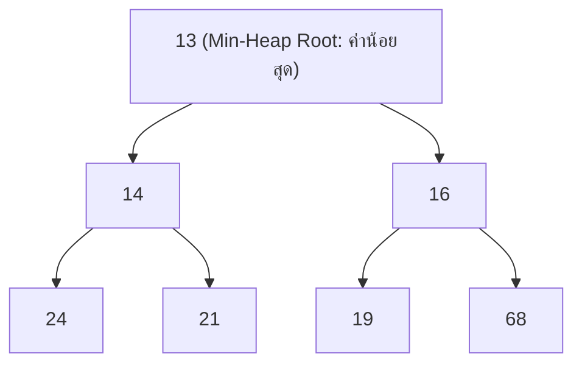

# ⚡ 07.1 - Priority Queue & Binary Heaps (Min-Heap, Max-Heap)

> [!NOTE]
> **Priority Queue (คิวลำดับความสำคัญ)** คือ ADT ที่ให้บริการดึงสมาชิกที่มีความสำคัญสูงสุด (ค่าน้อยที่สุดสำหรับ Min-Heap หรือค่ามากที่สุดสำหรับ Max-Heap) ออกมาก่อนเสมอ นิยมสร้างด้วย **Binary Heap** ซึ่งค้นหาค่า Extreme ได้ใน **$O(1)$** และแทรก/ลบข้อมูลได้ใน **$O(\log N)$**

---

## 🎮 Interactive Binary Heap Studio (สตูดิโอจำลองฮีป 2 มุมมอง)
ทดลองพิมพ์ตัวเลข เช่น `13, 21, 16, 24, 31, 19, 68, 65, 26, 32` แล้วกด **แทรก (Insert 14)** หรือกด **ลบหัวคิว (Delete Min)** พร้อมดูภาพ Complete Binary Tree สอดคล้องกับ 1-Indexed Array ด้านล่างแบบเรียลไทม์:

<!-- dsa-studio: heap -->

---

## 🏛️ 1. คุณสมบัติ 2 ประการของ Binary Heap (The Two Golden Rules)

Binary Heap ต้องคงคุณสมบัติบังคับครบทั้ง 2 ข้อตลอดเวลา:

1. **Structure Property (คุณสมบัติเชิงโครงสร้าง)**:
   - ต้องเป็น **Complete Binary Tree** เท่านั้น
   - ทุกระดับชั้น (Level) ต้องเต็มสมบูรณ์ ยกเว้นระดับชั้นล่างสุดที่ต้องเติมข้อมูลจาก **ซ้ายไปขวา (Left to Right)** เสมอ ห้ามมีช่องโหว่เด็ดขาด
2. **Heap-Order Property (คุณสมบัติลำดับของฮีป)**:
   - **Min-Heap**: สำหรับทุกโหนด $X$ ค่าของ Parent ต้อง $\le$ ค่าของ Children ทุกตัว ($P \le C$) $\implies$ ค่าที่น้อยที่สุดในระบบจะอยู่ที่ **Root (Index 1) เสมอ!**
   - **Max-Heap**: ค่าของ Parent ต้อง $\ge$ ค่าของ Children ทุกตัว ($P \ge C$) $\implies$ ค่าที่มากที่สุดในระบบจะอยู่ที่ **Root เสมอ!**



---

## 📐 2. การเก็บข้อมูลด้วย Array (1-Based Indexing Standard)

เนื่องจาก Complete Binary Tree ถูกเติมเต็มจากซ้ายไปขวาเสมอ เราจึงสามารถนำข้อมูลมาเรียงใน **Array 1 มิติ** ได้อย่างไร้รอยต่อโดยไม่ต้องใช้ Pointer เลย!

```
Array Index: [ 0 ] [ 1 ] [ 2 ] [ 3 ] [ 4 ] [ 5 ] [ 6 ] [ 7 ]
Array Value: [ - ] [ 13] [ 14] [ 16] [ 24] [ 21] [ 19] [ 68]
                      ^     ^     ^
                     Root  Left  Right
```

### สูตรคำนวณตำแหน่ง Index (ท่องจำเข้าห้องสอบ 100%)
สำหรับโหนดที่อยู่ที่ตำแหน่ง `hole` (ในระบบ 1-Based Indexing ซึ่ง Index 0 ปล่อยว่างไว้):
- **โหนดพ่อ (Parent)**: $\text{parent}(i) = \lfloor i / 2 \rfloor$ (`hole // 2`)
- **ลูกซ้าย (Left Child)**: $\text{left}(i) = 2 \times i$ (`2 * hole`)
- **ลูกขวา (Right Child)**: $\text{right}(i) = 2 \times i + 1$ (`2 * hole + 1`)

---

## 🔄 3. เจาะลึกอัลกอริทึม Percolate Up & Percolate Down

### 3.1 การแทรกข้อมูล (Insertion & Percolate Up / Swim)
เมื่อต้องการแทรกเลข `14` ลงใน Min-Heap ที่มีสมาชิก `[13, 21, 16, 24, 31, 19, 68, 65, 26, 32]`:
1. จองพื้นที่ใหม่ที่ท้ายอาร์เรย์ (`hole = currentSize + 1 = 11`)
2. เปรียบเทียบกับ Parent ที่ตำแหน่ง `hole // 2`:
   - Parent ของ 11 คือช่อง 5 (`array[5] = 31`) $\implies 14 < 31$ ดึง 31 ลงมาที่ช่อง 11, ขยับ `hole = 5`
   - Parent ของ 5 คือช่อง 2 (`array[2] = 21`) $\implies 14 < 21$ ดึง 21 ลงมาที่ช่อง 5, ขยับ `hole = 2`
   - Parent ของ 2 คือช่อง 1 (`array[1] = 13`) $\implies 14 > 13$ **หยุดการลอยขึ้น!**
3. วางเลข `14` ลงในตำแหน่ง `hole = 2` สำเร็จ!

| รอบเปรียบเทียบ | ตำแหน่ง `hole` | Parent Index (`hole // 2`) | ค่าของ Parent | การตัดสินใจ |
| :---: | :---: | :---: | :---: | :--- |
| เริ่มต้น | 11 | 5 | 31 | $14 < 31 \implies$ เลื่อน 31 ลงช่อง 11, hole = 5 |
| รอบที่ 1 | 5 | 2 | 21 | $14 < 21 \implies$ เลื่อน 21 ลงช่อง 5, hole = 2 |
| รอบที่ 2 | 2 | 1 | 13 | $14 > 13 \implies$ ถูกต้องตาม Heap-order! สิ้นสุดการวนรอบ |
| **บทสรุป** | **2** | - | - | **นำค่า 14 มาใส่ที่ช่อง Index 2** |

---

### 3.2 การลบค่าหัวคิว (Delete Min & Percolate Down / Sink)
1. ดึงค่าน้อยสุดที่ `array[1]` ออกมาเก็บไว้เป็น Return Value
2. นำข้อมูลตัวสุดท้ายของอาร์เรย์ (`array[currentSize]`) มาใส่ไว้ชั่วคราวที่ Root (`hole = 1`) แล้วลดขนาด `currentSize -= 1`
3. เปรียบเทียบกับ **ลูกตัวที่น้อยกว่า** ระหว่างลูกซ้าย (`2 * hole`) กับลูกขวา (`2 * hole + 1`):
   - หากลูกตัวที่น้อยกว่า มีค่าน้อยกว่าตัวที่กำลังลอยลงมา ให้ดึงลูกตัวนั้นขึ้นมาแทนที่ `array[hole]`
   - ขยับ `hole` ลงไปยังตำแหน่งลูกตัวนั้น แล้วทำซ้ำจนกว่าจะถึงจุดที่ถูกต้องหรือสุดใบไม้ (Leaf)

---

## 💻 4. โค้ดมาตรฐานระดับข้อสอบ (Runnable Python Implementation)

โค้ดนี้ถอดแบบตรงตามเอกสารและโจทย์ใน `Exams/Heap.py`:

```python
class BinaryHeap:
    def __init__(self, capacity: int = 100):
        # สร้าง List ขนาด capacity + 1 โดย index 0 ไม่ถูกใช้งาน (1-based indexing)
        self.array = [None] * (capacity + 1)
        self.currentSize = 0

    def is_empty(self) -> bool:
        return self.currentSize == 0

    def is_full(self) -> bool:
        return self.currentSize == len(self.array) - 1

    def find_min(self):
        """ค้นหาค่าน้อยที่สุดใน O(1)"""
        if self.is_empty():
            print("Heap is empty")
            return None
        return self.array[1]

    def insert(self, x: int):
        """แทรกข้อมูลพร้อมทำ Percolate Up ใน O(log N)"""
        if self.is_full():
            print("Heap is full")
            return

        self.currentSize += 1
        hole = self.currentSize

        # Percolate Up: ลอยตัวขึ้นไปเปรียบเทียบกับ parent (hole // 2)
        while hole > 1 and x < self.array[hole // 2]:
            self.array[hole] = self.array[hole // 2]
            hole //= 2

        self.array[hole] = x
        print(f"📥 Inserted {x:2d} -> Current Array (1..{self.currentSize}): {self.array[1:self.currentSize+1]}")

    def delete_min(self):
        """ลบและคืนค่าน้อยสุด พร้อมทำ Percolate Down ใน O(log N)"""
        if self.is_empty():
            print("Heap is empty")
            return None

        min_item = self.array[1]
        # นำสมาชิกตัวสุดท้ายมาเริ่มร่อนลงจากตำแหน่ง Root (hole = 1)
        self.array[1] = self.array[self.currentSize]
        self.currentSize -= 1
        self._percolate_down(1)
        print(f"📤 DeleteMin: คืนค่า {min_item:2d} -> Remaining: {self.array[1:self.currentSize+1]}")
        return min_item

    def _percolate_down(self, hole: int):
        temp = self.array[hole]
        while hole * 2 <= self.currentSize:
            child = hole * 2
            # เลือกลูกตัวที่น้อยกว่าระหว่างลูกซ้ายและลูกขวา
            if child != self.currentSize and self.array[child + 1] < self.array[child]:
                child += 1
            # ถ้าลูกตัวที่น้อยกว่า มีค่าน้อยกว่า temp ให้ดึงลูกขึ้นมา
            if self.array[child] < temp:
                self.array[hole] = self.array[child]
            else:
                break
            hole = child
        self.array[hole] = temp


if __name__ == "__main__":
    heap = BinaryHeap(capacity=20)
    print("--- 1. แทรกข้อมูลชุดทดสอบตามข้อสอบ ---")
    initial_values = [13, 21, 16, 24, 31, 19, 68, 65, 26, 32]
    for v in initial_values:
        heap.insert(v)

    print("\n--- 2. แทรกเลข 14 เพื่อทดสอบ Percolate Up (ขยับขึ้น 2 ชั้น) ---")
    heap.insert(14)

    print(f"\n🔍 ค่าน้อยที่สุดปัจจุบัน (Root): {heap.find_min()}")

    print("\n--- 3. ทำ Delete Min ต่อเนื่อง 3 ครั้ง ---")
    heap.delete_min()
    heap.delete_min()
    heap.delete_min()
```

---

---

## 📝 6. คลังตัวอย่างข้อสอบ & แบบฝึกหัดในห้องเรียน (Classroom "For Example" & Assignment 3)

> [!INFO]
> **ที่มาของเอกสารต้นฉบับ**: เอกสารใบงานและสไลด์การสอนจริง `Lectures/Lecture 8.1 Priority Queue (Insert and deleteMin)/For example Binary Heap.pdf` และ `Lectures/Assignment 3 Binary Heap/Assignment 3 Inclass.pdf`

---

### 🎯 6.1 โจทย์ For Example: การวิเคราะห์ลูป Percolate Up เมื่อแทรก 14

#### 📄 โจทย์คำถาม (Problem Statement):
> สมมติมีออบเจกต์ Min-Heap ชื่อ `myheap` มีสมาชิกตั้งต้น 10 ตัว ดังโครงสร้างต้นไม้และอะเรย์ด้านล่าง:
> - `array = [None, 13, 21, 16, 24, 31, 19, 68, 65, 26, 32]` (ดัชนี 1 ถึง 10)
> 
> จงเขียนขั้นตอนการทำงานในฟังก์ชัน `insert(14)` เมื่อแทรกค่า `14` เข้าไป:
> ในแต่ละรอบของ `while loop` ให้นักศึกษาตอบ 2 สิ่ง:
> 1. ตัวแปร `hole` มีค่าเท่าไร?
> 2. ประโยคเปรียบเทียบในเงื่อนไข `while` เป็นจริงหรือไม่ พร้อมระบุค่าตัวเลขที่นำมาเปรียบเทียบกัน?
> และตอบว่า ออกจาก while loop แล้ว `hole` มีค่าเท่าใด และลูปทำงานทั้งหมดกี่รอบ?

```mermaid
graph TD
    H13["[1] 13 (Root)"] --> H21["[2] 21"]
    H13 --> H16["[3] 16"]
    H21 --> H24["[4] 24"]
    H21 --> H31["[5] 31"]
    H16 --> H19["[6] 19"]
    H16 --> H68["[7] 68"]
    H24 --> H65["[8] 65"]
    H24 --> H26["[9] 26"]
    H31 --> H32["[10] 32"]
    H31 -.->|ตำแหน่งใหม่ [11]| Hole["[11] hole = 14?"]
    
    style Hole fill:#f59e0b,stroke:#d97706,color:#fff
```

---

#### 💻 เฉลยคำตอบทีละรอบแบบชัดเจน 100% (ตามเกณฑ์ของอาจารย์)

```python
# ฟังก์ชัน insert ของอาจารย์
def insert(self, x):
    self.currentSize += 1
    hole = self.currentSize
    # หา Parent ด้วย: hole // 2
    while hole > 1 and x < self.array[hole // 2]:
        self.array[hole] = self.array[hole // 2]
        hole //= 2
    self.array[hole] = x
```

##### ตาราง Trace การทำงานของ while loop:
- **เริ่มต้นก่อนเข้าลูป**: `currentSize` เพิ่มจาก 10 เป็น 11 $\implies \mathbf{hole = 11}$

| รอบที่ (Round) | ค่า `hole` ในรอบนั้น | ตรวจ `hole > 1` | การเปรียบเทียบ $x < \text{array}[\text{hole} // 2]$ | ผลลัพธ์เงื่อนไข | การเลื่อนตำแหน่ง |
| :---: | :---: | :---: | :---: | :---: | :--- |
| **รอบที่ 1** | `hole = 11` | $11 > 1$ **จริง** | $14 < \text{array}[5] \implies \mathbf{14 < 31}$ | **จริง (True)** | `array[11] = 31`<br>`hole = 11 // 2 = 5` |
| **รอบที่ 2** | `hole = 5` | $5 > 1$ **จริง** | $14 < \text{array}[2] \implies \mathbf{14 < 21}$ | **จริง (True)** | `array[5] = 21`<br>`hole = 5 // 2 = 2` |
| **รอบที่ 3 (เช็คก่อนเข้า)** | `hole = 2` | $2 > 1$ **จริง** | $14 < \text{array}[1] \implies \mathbf{14 < 13}$ | **เท็จ (False!)** | หลุดออกจากลูปทันที! |

##### 🎯 สรุปคำตอบสุดท้ายที่ต้องเขียนลงกระดาษคำตอบ:
1. **while loop ทำงานกี่รอบ?** $\implies$ **ตอบ: 2 รอบ** (ดูที่คำสั่งภายในลูปทำงาน 2 ครั้ง)
2. **ออกจาก while loop ตัวแปร `hole` มีค่าเท่ากับเท่าไร?** $\implies$ **ตอบ: 2**
3. **คำสั่งสุดท้าย**: `self.array[2] = 14` นำ 14 ไปวางที่ดัชนี 2!

##### อาร์เรย์ของ Heap หลังแทรกเสร็จสิ้น:
`[None, 13, 14, 16, 24, 21, 19, 68, 65, 26, 32, 31]`

---

### 🎯 6.2 การบ้าน Assignment 3 Inclass: แทรกข้อมูล 15 ค่าลงใน Min-Heap

> [!IMPORTANT]
> **โจทย์จากหนังสือ Mark Allen Weiss (p. 283)**:
> แทรกข้อมูลทีละตัวลงใน Empty Min-Heap:
> `10, 12, 1, 14, 6, 5, 8, 15, 3, 9, 7, 4, 11, 13, 2`

#### ลำดับการ Percolate Up ที่สำคัญ:
- **Insert 1**: เสียบที่ตำแหน่ง 3 $\to$ สลับกับ 10 $\to$ 1 กลายเป็น Root ใหม่
- **Insert 6 แล้ว 5**:
  - เสียบ 6 ที่ตำแหน่ง 5 $\to$ สลับกับ 12
  - เสียบ 5 ที่ตำแหน่ง 6 $\to$ สลับกับ 10
- **Insert 3**: สลับข้าม 14 และ 6 ขึ้นไปอยู่ที่ชั้น 2
- **Insert 2 (ตัวสุดท้าย)**: ลอยขึ้นจากตำแหน่ง 15 $\to$ สลับ 15 $\to$ สลับ 8 $\to$ สลับ 5 ไปอยู่ที่ชั้น 2

---

#### 🖥️ ตัวอย่างหน้าจอ Interface การจำลองการทำงาน Binary Heap (Dual View Studio)
```console
============================================================
              BINARY MIN-HEAP DUAL-VIEW STUDIO              
============================================================
[Insert Action] Value: 14 into Heap of 10 items
------------------------------------------------------------
[Array Slot Tracing]
Initial: [ - | 13 | 21 | 16 | 24 | 31 | 19 | 68 | 65 | 26 | 32 ]
Step 1:  Hole at index 11. Parent at index 5 has 31 (31 > 14 -> Shift 31 down)
Step 2:  Hole at index 5.  Parent at index 2 has 21 (21 > 14 -> Shift 21 down)
Step 3:  Hole at index 2.  Parent at index 1 has 13 (13 < 14 -> Stop loop!)
Placed:  Array[2] = 14
Final:   [ - | 13 | 14 | 16 | 24 | 21 | 19 | 68 | 65 | 26 | 32 | 31 ]
------------------------------------------------------------
[Tree Hierarchy Preview]
               13
             /    \
           14      16
          /  \    /  \
        24   21  19  68
       / \   / \
      65 26 32 31
[Properties Verified] Complete Tree: OK | Min-Heap Order: OK
============================================================
```

---

## 🔗 ลิงก์เชื่อมโยงใน Obsidian Wiki
- ก่อนหน้า: [[06.1 - Hash Tables & Collision Resolution Strategies]]
- ถัดไป (Sorting): [[08.1 - Sorting Algorithms (Bubble, Selection, Insertion, Merge, Quick)]]
- ตารางความเร็วรวม: [[Glossary & Complexity Cheat Sheet]]
- กลับหน้าหลัก: [[Index]]

