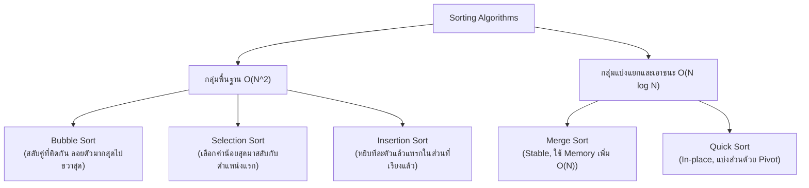

# 🔀 08.1 - Sorting Algorithms (Bubble, Selection, Insertion, Merge, Quick)

> [!NOTE]
> **Sorting Algorithm (อัลกอริทึมการเรียงลำดับ)** คือกระบวนการจัดระเบียบข้อมูลให้อยู่ในลำดับที่ต้องการ (จากน้อยไปมาก หรือจากมากไปน้อย) เป็นหัวใจสำคัญของวิชา Data Structures & Algorithms ที่ข้อสอบมักออกทั้งตาราง Trace การสลับค่า, จำนวนการเปรียบเทียบ (Comparisons & Swaps), และความซับซ้อน (Time Complexity)

---

## 🎮 Interactive Sorting Studio (สตูดิโอจำลองการเรียงลำดับ)
เลือกอัลกอริทึม **Bubble Sort** หรือ **Selection Sort** แล้วกด **เล่นอัตโนมัติ (Play)** หรือกด **ก้าวไปข้างหน้า (Step Next)** เพื่อดูการเปรียบเทียบแท่งข้อมูลและตัวนับการสลับค่าแบบสดๆ:

<!-- dsa-studio: sort -->

---

## 🏛️ 1. สรุปเปรียบเทียบ 5 Sorting Algorithms หลัก



---

## 🔍 2. เจาะลึกการ Trace แต่ละอัลกอริทึม (Step-by-Step Tracing)

สมมติชุดข้อมูลทดสอบ: `[29, 10, 14, 37, 13]`

### 2.1 Bubble Sort Tracing
- **หลักการ**: เปรียบเทียบคู่ติดกัน `arr[j] > arr[j+1]` ถ้าใช่ให้สลับ (Swap) ทำจนค่าที่มากที่สุดลอยไปอยู่ท้ายสุดในแต่ละ Pass

| Pass ที่ | การเปรียบเทียบและการสลับ | ผลลัพธ์หลังจบ Pass | สมาชิกที่เข้าที่แล้ว |
| :---: | :--- | :---: | :---: |
| เริ่มต้น | - | `[29, 10, 14, 37, 13]` | - |
| **Pass 1** | (29,10) สลับ $\to$ (29,14) สลับ $\to$ (29,37) ไม่สลับ $\to$ (37,13) สลับ | `[10, 14, 29, 13, 37]` | `37` (ท้ายสุด) |
| **Pass 2** | (10,14) ไม่สลับ $\to$ (14,29) ไม่สลับ $\to$ (29,13) สลับ | `[10, 14, 13, 29, 37]` | `29, 37` |
| **Pass 3** | (10,14) ไม่สลับ $\to$ (14,13) สลับ | `[10, 13, 14, 29, 37]` | `14, 29, 37` |
| **Pass 4** | (10,13) ไม่สลับ $\to$ ไม่มีการสลับเลย! Early Exit | `[10, 13, 14, 29, 37]` | **ครบทุกตัว!** |

---

### 2.2 Selection Sort Tracing
- **หลักการ**: วนหาค่าที่น้อยที่สุดในฝั่งที่ยังไม่ได้จัดเรียง แล้วนำมาสลับกับตำแหน่งเริ่มต้นของฝั่งนั้น

| รอบที่ ($i$) | ช่วงที่ค้นหาค่า Min | ค่า Min ที่พบ | การสลับ (Swap) | อาร์เรย์หลังสลับ |
| :---: | :--- | :---: | :--- | :--- |
| **$i = 0$** | `[29, 10, 14, 37, 13]` | **10** (index 1) | สลับ index 0 กับ 1 | `[10, 29, 14, 37, 13]` |
| **$i = 1$** | `[29, 14, 37, 13]` | **13** (index 4) | สลับ index 1 กับ 4 | `[10, 13, 14, 37, 29]` |
| **$i = 2$** | `[14, 37, 29]` | **14** (index 2) | สลับกับตัวเอง (ไม่เปลี่ยน) | `[10, 13, 14, 37, 29]` |
| **$i = 3$** | `[37, 29]` | **29** (index 4) | สลับ index 3 กับ 4 | `[10, 13, 14, 29, 37]` |

---

### 2.3 Insertion Sort Tracing
- **หลักการ**: หยิบสมาชิกตัวถัดไปมาเป็น `key` แล้วเลื่อนสมาชิกตัวที่มากกว่าไปทางขวา เพื่อเปิดช่องว่างแล้วแทรก `key` ลงไป

| รอบที่ ($i$) | ค่า `key` | การเลื่อนตำแหน่ง | ผลลัพธ์อาร์เรย์ |
| :---: | :---: | :--- | :--- |
| **$i = 1$** | **10** | 29 เลื่อนขวา $\implies$ แทรก 10 ที่ index 0 | `[10, 29, 14, 37, 13]` |
| **$i = 2$** | **14** | 29 เลื่อนขวา $\implies$ แทรก 14 ที่ index 1 | `[10, 14, 29, 37, 13]` |
| **$i = 3$** | **37** | ไม่มีการเลื่อน (37 > 29 อยู่แล้ว) | `[10, 14, 29, 37, 13]` |
| **$i = 4$** | **13** | 37, 29, 14 เลื่อนขวา $\implies$ แทรก 13 ที่ index 1 | `[10, 13, 14, 29, 37]` |

---

## 💻 3. โค้ดมาตรฐานระดับข้อสอบ (Runnable Python Implementation)

ทดลองกด **▶ รันโค้ดทันที** เพื่อดูผลลัพธ์การเรียงลำดับ:

```python
def bubble_sort(arr):
    """Bubble Sort พร้อม Early Termination (Best Case O(N))"""
    a = arr.copy()
    n = len(a)
    for i in range(n):
        swapped = False
        for j in range(0, n - i - 1):
            if a[j] > a[j + 1]:
                a[j], a[j + 1] = a[j + 1], a[j]
                swapped = True
        if not swapped:
            break
    return a

def selection_sort(arr):
    """Selection Sort: หาค่า min ในส่วนที่เหลือมาสลับ"""
    a = arr.copy()
    n = len(a)
    for i in range(n):
        min_idx = i
        for j in range(i + 1, n):
            if a[j] < a[min_idx]:
                min_idx = j
        a[i], a[min_idx] = a[min_idx], a[i]
    return a

def insertion_sort(arr):
    """Insertion Sort: แทรกเข้าส่วนที่เรียงแล้วทางซ้าย"""
    a = arr.copy()
    for i in range(1, len(a)):
        key = a[i]
        j = i - 1
        while j >= 0 and a[j] > key:
            a[j + 1] = a[j]
            j -= 1
        a[j + 1] = key
    return a

def quick_sort(arr):
    """Quick Sort: แบ่งพาร์ติชันด้วย Pivot"""
    if len(arr) <= 1:
        return arr
    pivot = arr[len(arr) // 2]
    left = [x for x in arr if x < pivot]
    middle = [x for x in arr if x == pivot]
    right = [x for x in arr if x > pivot]
    return quick_sort(left) + middle + quick_sort(right)


if __name__ == "__main__":
    raw_data = [29, 10, 14, 37, 13]
    print(f"📦 ข้อมูลตั้งต้น:      {raw_data}\n")
    print(f"🫧 Bubble Sort:     {bubble_sort(raw_data)}")
    print(f"🎯 Selection Sort:  {selection_sort(raw_data)}")
    print(f"📥 Insertion Sort:  {insertion_sort(raw_data)}")
    print(f"⚡ Quick Sort:      {quick_sort(raw_data)}")
```

---

## 📊 4. ตารางเปรียบเทียบ Time & Space Complexity (ออกข้อสอบกา 100%)

---

## 📝 5. คลังตัวอย่างข้อสอบ & แบบฝึกหัดในห้องเรียน (Classroom "For Example" & Worksheets)

> [!INFO]
> **ที่มาของเอกสารต้นฉบับ**: เอกสารสไลด์และชีทสรุปจริง `Lectures/Lecture 9 Sorting/For Example Bubble sort.pdf`, `For Example Selection sort.pdf`, `Short note Insertion sort.pdf`, และ `หมายเหตุ ในหัวข้อ insertion sort.pdf`

---

### 🎯 5.1 โจทย์ For Example 1: การ Trace ทีละคู่ของ Bubble Sort & ทฤษฎี Inversion

#### 📄 ตัวอย่างที่ 1: ลิสต์ `[5, 1, 4, 2, 8]`
- **รอบที่ 1**:
  - เปรียบเทียบ 5 กับ 1: เนื่องจาก $5 > 1$ สลับที่ $\implies$ `[1, 5, 4, 2, 8]`
  - เปรียบเทียบ 5 กับ 4: เนื่องจาก $5 > 4$ สลับที่ $\implies$ `[1, 4, 5, 2, 8]`
  - เปรียบเทียบ 5 กับ 2: เนื่องจาก $5 > 2$ สลับที่ $\implies$ `[1, 4, 2, 5, 8]`
  - เปรียบเทียบ 5 กับ 8: เนื่องจาก $5 < 8$ ไม่สลับ $\implies$ `[1, 4, 2, 5, 8]`
  - *สิ้นสุดรอบที่ 1*: ตัวเลขที่มากที่สุดคือ **8** ถูก "Bubble" ไปอยู่ตำแหน่งสุดท้ายเรียบร้อย
- **รอบที่ 2**:
  - เปรียบเทียบ 1 กับ 4: $1 < 4$ ไม่สลับ
  - เปรียบเทียบ 4 กับ 2: $4 > 2$ สลับที่ $\implies$ `[1, 2, 4, 5, 8]`
  - เปรียบเทียบ 4 กับ 5: $4 < 5$ ไม่สลับ
  - *สิ้นสุดรอบที่ 2*: ตัวเลข **5** ถูกจัดเข้าตำแหน่งถูกต้อง
- **รอบที่ 3**: ตรวจสอบพบไม่มีการสลับใดๆ เกิดขึ้น บ่งชี้ว่าลิสต์เรียงลำดับสมบูรณ์แล้ว!

> [!TIP]
> **สูตรลัดคำนวณจำนวนครั้งในการ Swap ด้วยทฤษฎี Inversions (ออกสอบบ่อย!):**
> - **Inversion** คือ คู่อันดับ $(i, j)$ ที่ $i < j$ แต่ $\text{arr}[i] > \text{arr}[j]$ (คู่อันดับที่วางผิดลำดับ)
> - ใน Bubble Sort การ Swap 1 ครั้งจะช่วยลด Inversion ไปได้ 1 คู่เสมอ
> - ดังนั้น **จำนวนครั้งในการ Swap ทั้งหมด = จำนวน Inversions ทั้งหมดในลิสต์เริ่มต้น**
> - ใน `[5, 1, 4, 2, 8]`: คู่ที่ผิดคือ (5,1), (5,4), (5,2) [3 คู่] และ (4,2) [1 คู่] $\implies$ รวม 4 คู่ จึงเกิดการ Swap แน่นอน **4 ครั้ง**

#### 📄 ตัวอย่างข้อสอบจริง (Official Exam Worksheet บน `[64, 34, 25, 12, 22, 11, 90]`):
- **จำนวน Passes (Outer loop):** $n - 1 = 7 - 1 = \mathbf{6\text{ passes}}$
- **จำนวน Total Swaps ทั้งหมด:** คำนวณจาก Inversions ได้ $5 + 4 + 3 + 1 + 1 = \mathbf{14\text{ swaps}}$
- **Pass 1 Step 4:** เปรียบเทียบ $(64, 22) \implies$ ได้ผลลัพธ์เป็น `[34, 25, 12, 22, 64, 11, 90]`
- **สภาพ Array หลังจบ Pass 1:** `[34, 25, 12, 22, 11, 64, 90]` (เกิดการสลับ 5 ครั้งในรอบนี้)

---

### 🎯 5.2 โจทย์ For Example 2: การ Trace ตารางของ Selection Sort

#### 📄 โจทย์: อาร์เรย์เริ่มต้น `[64, 25, 12, 22, 11]` (ขนาด $N=5$)
จงระบุค่าค่าน้อยที่สุด (Minimum) ตำแหน่งดัชนี และสถานะอาร์เรย์ในแต่ละรอบ:

| รอบที่ (Round) | ค่าน้อยที่สุดที่พบ (Minimum) | ตำแหน่งที่พบ (Index) | สลับกับตำแหน่งแรกของ Unsorted | อาร์เรย์หลังสลับเสร็จสิ้น | ส่วนที่ยังไม่ได้จัดเรียง (Unsorted) |
| :---: | :---: | :---: | :---: | :---: | :---: |
| **รอบที่ 1** | `11` | Index 4 | สลับ 11 กับ 64 | `[ 11, 25, 12, 22, 64 ]` | `[ 25, 12, 22, 64 ]` |
| **รอบที่ 2** | `12` | Index 2 | สลับ 12 กับ 25 | `[ 11, 12, 25, 22, 64 ]` | `[ 25, 22, 64 ]` |
| **รอบที่ 3** | `22` | Index 3 | สลับ 22 กับ 25 | `[ 11, 12, 22, 25, 64 ]` | `[ 25, 64 ]` |
| **รอบที่ 4** | `25` | Index 3 | สลับ 25 กับตัวเอง | `[ 11, 12, 22, 25, 64 ]` | `[ 64 ]` |
| **รอบที่ 5** | `64` | Index 4 | ตัวสุดท้ายเรียบร้อย | **`[ 11, 12, 22, 25, 64 ]`** | เรียงครบสมบูรณ์! |

---

### 🎯 5.3 โจทย์ For Example 3: หัวใจของ Insertion Sort (Short Note)

#### 📄 โค้ดมาตรฐานที่ออกสอบ:
```python
def insertion_sort(a):
    for p in range(1, len(a)):
        tmp = a[p]
        j = p
        # หัวใจของการแทรก: เลื่อนสมาชิกที่มากกว่า tmp ไปทางขวาทีละ 1 ช่อง
        while j > 0 and tmp < a[j - 1]:
            a[j] = a[j - 1]
            j -= 1
        a[j] = tmp
```

#### การวิเคราะห์ตัวแปรบนลิสต์ `[34, 8, 64, 51, 32, 21]`:
- **รอบ $p = 1$**: `tmp = 8`, $j = 1$
  - ตรวจสอบ: $j > 0$ และ $8 < a[0] (8 < 34)$ จริง!
  - เลื่อนขวา: $a[1] = a[0] \implies a[1] = 34$
  - ลดค่า $j \implies j = 0$ (หลุดลูป)
  - วางค่า: $a[0] = \text{tmp} = 8 \implies$ ได้ `[ 8, 34, 64, 51, 32, 21 ]`
- **รอบ $p = 2$**: `tmp = 64`, $j = 2$
  - $64 < a[1] (64 < 34)$ เป็นเท็จ ไม่มีการเลื่อน $\implies$ ได้ `[ 8, 34, 64, 51, 32, 21 ]`
- **รอบ $p = 4$**: `tmp = 32`, $j = 4 \implies$ เลื่อน 64, 51, 34 (เลื่อน 3 ครั้ง) $\implies a[1] = 32 \implies$ ได้ `[ 8, 32, 34, 51, 64, 21 ]`
- **รอบ $p = 5$**: `tmp = 21`, $j = 5 \implies$ เลื่อน 64, 51, 34, 32 (เลื่อน 4 ครั้ง) $\implies a[1] = 21 \implies$ ได้ `[ 8, 21, 32, 34, 51, 64 ]`

**🎯 รวม Position Moves ทั้งหมด:** $1 + 0 + 1 + 3 + 4 = \mathbf{9\text{ ครั้ง}}$ (Pass 1: 1, Pass 2: 0, Pass 3: 1, Pass 4: 3, Pass 5: 4)

> [!CAUTION]
> **ทำไมต้องมีเงื่อนไข `j > 0` ใน `while`?**  
> ในภาษา Python หากไม่มีเงื่อนไข `j > 0` เมื่อ $j=0$ แล้วไปตรวจสอบ `a[j - 1]` จะกลายเป็น `a[-1]` ซึ่ง Python จะไปดึง **สมาชิกตัวสุดท้ายของลิสต์** มาเปรียบเทียบ ทำให้การเลื่อนข้อมูลผิดตำแหน่งทันที!

> [!TIP]
> **หมายเหตุข้อสอบ (ความแตกต่างระหว่าง `range(1, 5)` กับ `range(5)`):**
> - `for p in range(1, 5):` เริ่มต้นที่ 1 สิ้นสุดที่ 4 (วนซ้ำ 4 ครั้ง: 1, 2, 3, 4) เหมาะสำหรับ Insertion Sort เพราะตัวที่ 0 ถือว่าเรียงแล้ว
> - `for p in range(5):` เริ่มต้นที่ 0 สิ้นสุดที่ 4 (วนซ้ำ 5 ครั้ง: 0, 1, 2, 3, 4)
> - `range(0)` ไม่ใช่ `None` และไม่ใช่ `[0]` แต่เป็น **Empty Range Object** ที่มีสมาชิก 0 ตัว ข้ามลูป `for` ทันทีเช่นเดียวกับ `[]` แต่ไม่จองหน่วยความจำแบบ List Object

---

#### 🖥️ ตัวอย่างหน้าจอ Interface การจำลองการทำงาน Sorting (Race Visualizer Preview)
```console
============================================================
              SORTING COMPARISON SUITE (STUDIO)             
============================================================
[Dataset: 5 elements] [ 64, 25, 12, 22, 11 ]
------------------------------------------------------------
Bubble Sort    : 10 comparisons, 4 swaps | Sorted: [11, 12, 22, 25, 64]
Selection Sort : 10 comparisons, 3 swaps | Sorted: [11, 12, 22, 25, 64]
Insertion Sort :  4 comparisons, 4 shifts| Sorted: [11, 12, 22, 25, 64]
------------------------------------------------------------
[Winner on Partially Sorted Data] Insertion Sort (Near O(N)!)
============================================================
```

---

## 🔗 ลิงก์เชื่อมโยงใน Obsidian Wiki
- ก่อนหน้า: [[07.1 - Priority Queue & Binary Heaps (Min-Heap, Max-Heap)]]
- ถัดไป (Graph): [[09.1 - Graph Fundamentals & Traversals (BFS, DFS, Topological Sort)]]
- ตารางความเร็วรวม: [[Glossary & Complexity Cheat Sheet]]
- กลับหน้าหลัก: [[Index]]

