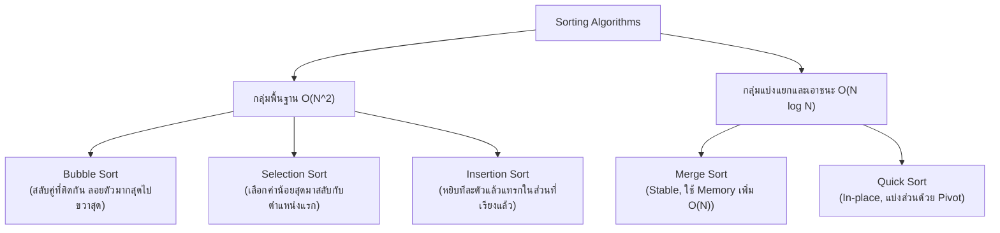

# 🔀 08.1 - Sorting Algorithms (Bubble, Selection, Insertion, Merge, Quick)

> [!NOTE]
> **Sorting Algorithm (อัลกอริทึมการเรียงลำดับ)** คือกระบวนการจัดระเบียบข้อมูลให้อยู่ในลำดับที่ต้องการ (จากน้อยไปมาก หรือจากมากไปน้อย) เป็นหัวใจสำคัญของวิชา Data Structures & Algorithms ที่ข้อสอบมักออกทั้งตาราง Trace การสลับค่า, จำนวนการเปรียบเทียบ (Comparisons & Swaps), และความซับซ้อน (Time Complexity)

---

## 🎮 Interactive Sorting Studio (สตูดิโอจำลองการเรียงลำดับ)
เลือกอัลกอริทึม **Bubble Sort** หรือ **Selection Sort** แล้วกด **เล่นอัตโนมัติ (Play)** หรือกด **ก้าวไปข้างหน้า (Step Next)** เพื่อดูการเปรียบเทียบแท่งข้อมูลและตัวนับการสลับค่าแบบสดๆ:

<!-- dsa-studio: sort -->

---

## 🏛️ 1. สรุปเปรียบเทียบ 5 Sorting Algorithms หลัก



---

## 🔍 2. เจาะลึกการ Trace แต่ละอัลกอริทึม (Step-by-Step Tracing)

สมมติชุดข้อมูลทดสอบ: `[29, 10, 14, 37, 13]`

### 2.1 Bubble Sort Tracing
- **หลักการ**: เปรียบเทียบคู่ติดกัน `arr[j] > arr[j+1]` ถ้าใช่ให้สลับ (Swap) ทำจนค่าที่มากที่สุดลอยไปอยู่ท้ายสุดในแต่ละ Pass

| Pass ที่ | การเปรียบเทียบและการสลับ | ผลลัพธ์หลังจบ Pass | สมาชิกที่เข้าที่แล้ว |
| :---: | :--- | :---: | :---: |
| เริ่มต้น | - | `[29, 10, 14, 37, 13]` | - |
| **Pass 1** | (29,10) สลับ $\to$ (29,14) สลับ $\to$ (29,37) ไม่สลับ $\to$ (37,13) สลับ | `[10, 14, 29, 13, 37]` | `37` (ท้ายสุด) |
| **Pass 2** | (10,14) ไม่สลับ $\to$ (14,29) ไม่สลับ $\to$ (29,13) สลับ | `[10, 14, 13, 29, 37]` | `29, 37` |
| **Pass 3** | (10,14) ไม่สลับ $\to$ (14,13) สลับ | `[10, 13, 14, 29, 37]` | `14, 29, 37` |
| **Pass 4** | (10,13) ไม่สลับ $\to$ ไม่มีการสลับเลย! Early Exit | `[10, 13, 14, 29, 37]` | **ครบทุกตัว!** |

---

### 2.2 Selection Sort Tracing
- **หลักการ**: วนหาค่าที่น้อยที่สุดในฝั่งที่ยังไม่ได้จัดเรียง แล้วนำมาสลับกับตำแหน่งเริ่มต้นของฝั่งนั้น

| รอบที่ ($i$) | ช่วงที่ค้นหาค่า Min | ค่า Min ที่พบ | การสลับ (Swap) | อาร์เรย์หลังสลับ |
| :---: | :--- | :---: | :--- | :--- |
| **$i = 0$** | `[29, 10, 14, 37, 13]` | **10** (index 1) | สลับ index 0 กับ 1 | `[10, 29, 14, 37, 13]` |
| **$i = 1$** | `[29, 14, 37, 13]` | **13** (index 4) | สลับ index 1 กับ 4 | `[10, 13, 14, 37, 29]` |
| **$i = 2$** | `[14, 37, 29]` | **14** (index 2) | สลับกับตัวเอง (ไม่เปลี่ยน) | `[10, 13, 14, 37, 29]` |
| **$i = 3$** | `[37, 29]` | **29** (index 4) | สลับ index 3 กับ 4 | `[10, 13, 14, 29, 37]` |

---

### 2.3 Insertion Sort Tracing
- **หลักการ**: หยิบสมาชิกตัวถัดไปมาเป็น `key` แล้วเลื่อนสมาชิกตัวที่มากกว่าไปทางขวา เพื่อเปิดช่องว่างแล้วแทรก `key` ลงไป

| รอบที่ ($i$) | ค่า `key` | การเลื่อนตำแหน่ง | ผลลัพธ์อาร์เรย์ |
| :---: | :---: | :--- | :--- |
| **$i = 1$** | **10** | 29 เลื่อนขวา $\implies$ แทรก 10 ที่ index 0 | `[10, 29, 14, 37, 13]` |
| **$i = 2$** | **14** | 29 เลื่อนขวา $\implies$ แทรก 14 ที่ index 1 | `[10, 14, 29, 37, 13]` |
| **$i = 3$** | **37** | ไม่มีการเลื่อน (37 > 29 อยู่แล้ว) | `[10, 14, 29, 37, 13]` |
| **$i = 4$** | **13** | 37, 29, 14 เลื่อนขวา $\implies$ แทรก 13 ที่ index 1 | `[10, 13, 14, 29, 37]` |

---

## 💻 3. โค้ดมาตรฐานระดับข้อสอบ (Runnable Python Implementation)

ทดลองกด **▶ รันโค้ดทันที** เพื่อดูผลลัพธ์การเรียงลำดับ:

```python
def bubble_sort(arr):
    """Bubble Sort พร้อม Early Termination (Best Case O(N))"""
    a = arr.copy()
    n = len(a)
    for i in range(n):
        swapped = False
        for j in range(0, n - i - 1):
            if a[j] > a[j + 1]:
                a[j], a[j + 1] = a[j + 1], a[j]
                swapped = True
        if not swapped:
            break
    return a

def selection_sort(arr):
    """Selection Sort: หาค่า min ในส่วนที่เหลือมาสลับ"""
    a = arr.copy()
    n = len(a)
    for i in range(n):
        min_idx = i
        for j in range(i + 1, n):
            if a[j] < a[min_idx]:
                min_idx = j
        a[i], a[min_idx] = a[min_idx], a[i]
    return a

def insertion_sort(arr):
    """Insertion Sort: แทรกเข้าส่วนที่เรียงแล้วทางซ้าย"""
    a = arr.copy()
    for i in range(1, len(a)):
        key = a[i]
        j = i - 1
        while j >= 0 and a[j] > key:
            a[j + 1] = a[j]
            j -= 1
        a[j + 1] = key
    return a

def quick_sort(arr):
    """Quick Sort: แบ่งพาร์ติชันด้วย Pivot"""
    if len(arr) <= 1:
        return arr
    pivot = arr[len(arr) // 2]
    left = [x for x in arr if x < pivot]
    middle = [x for x in arr if x == pivot]
    right = [x for x in arr if x > pivot]
    return quick_sort(left) + middle + quick_sort(right)


if __name__ == "__main__":
    raw_data = [29, 10, 14, 37, 13]
    print(f"📦 ข้อมูลตั้งต้น:      {raw_data}\n")
    print(f"🫧 Bubble Sort:     {bubble_sort(raw_data)}")
    print(f"🎯 Selection Sort:  {selection_sort(raw_data)}")
    print(f"📥 Insertion Sort:  {insertion_sort(raw_data)}")
    print(f"⚡ Quick Sort:      {quick_sort(raw_data)}")
```

---

## 📊 4. ตารางเปรียบเทียบ Time & Space Complexity (ออกข้อสอบกา 100%)

| อัลกอริทึม | Best Case | Average Case | Worst Case | Space Complexity | Stability (คงลำดับเดิม) |
| :--- | :---: | :---: | :---: | :---: | :---: |
| **Bubble Sort** | $O(N)$ | $O(N^2)$ | $O(N^2)$ | $O(1)$ | **Stable** |
| **Selection Sort** | $O(N^2)$ | $O(N^2)$ | $O(N^2)$ | $O(1)$ | Unstable |
| **Insertion Sort** | $O(N)$ | $O(N^2)$ | $O(N^2)$ | $O(1)$ | **Stable** |
| **Merge Sort** | $O(N \log N)$ | $O(N \log N)$ | $O(N \log N)$ | $O(N)$ | **Stable** |
| **Quick Sort** | $O(N \log N)$ | $O(N \log N)$ | $O(N^2)$ | $O(\log N)$ | Unstable |
