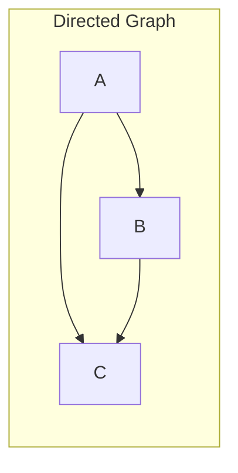
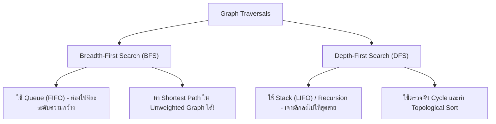
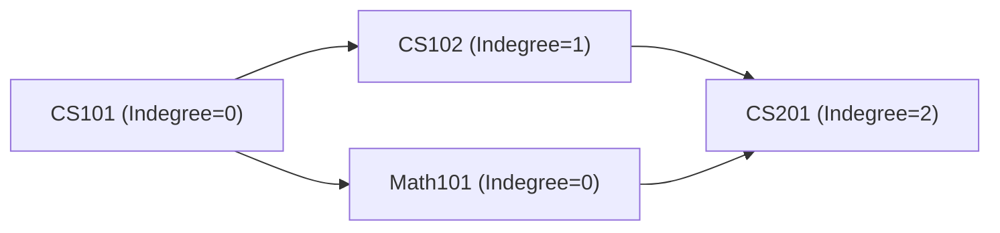
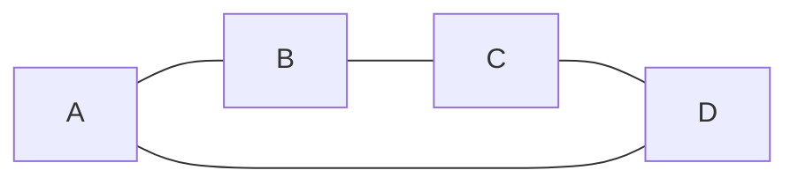
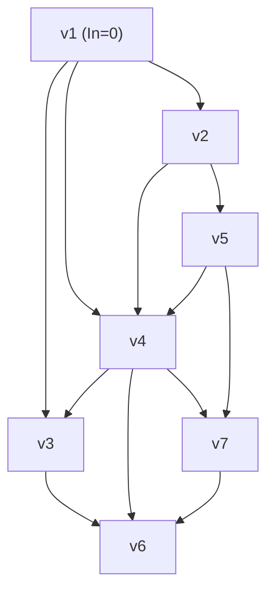

# 🕸️ 09.1 - Graph Fundamentals & Traversals (BFS, DFS, Topological Sort)

> [!NOTE]
> **Graph (กราฟ)** คือโครงสร้างข้อมูลที่ประกอบด้วยเซตของ **Vertices/Nodes ($V$)** และเซตของ **Edges ($E$)** นิยมใช้แทนเครือข่ายสังคม เครือข่ายการเดินทาง หรือลำดับขั้นตอนการทำงานที่มีการพึ่งพากัน (Dependencies)

---

## 🏛️ 1. โครงสร้างและการจัดเก็บกราฟ (Graph Representations)



| วิธีการจัดเก็บ | Adjacency Matrix (อาร์เรย์ 2 มิติ $V \times V$) | Adjacency List (รายการโหนดข้างเคียง) |
| :--- | :--- | :--- |
| **Memory Space** | $\Theta(V^2)$ (เปลือง memory หากกราฟเบาบาง) | $\Theta(V + E)$ (**ประหยัดที่สุด**) |
| **Check Edge (u, v)** | $O(1)$ | $O(\text{degree}(u))$ |
| **Find All Neighbors** | $O(V)$ | $O(\text{degree}(u))$ |

```python
# ตัวอย่าง Adjacency List ใน Python
graph = {
    'A': ['B', 'C'],
    'B': ['C', 'D'],
    'C': ['D'],
    'D': []
}
```

---

## 🔄 2. Graph Traversals: BFS vs DFS



### 2.1 Breadth-First Search (BFS) Code
```python
from collections import deque

def bfs(graph, start_vertex):
    visited = set([start_vertex])
    queue = deque([start_vertex])
    result = []
    
    while queue:
        vertex = queue.popleft()
        result.append(vertex)
        for neighbor in graph[vertex]:
            if neighbor not in visited:
                visited.add(neighbor)
                queue.append(neighbor)
    return result
```

### 2.2 Depth-First Search (DFS) Code
```python
def dfs_recursive(graph, vertex, visited=None):
    if visited is None:
        visited = set()
    visited.add(vertex)
    print(vertex, end=" ")
    
    for neighbor in graph[vertex]:
        if neighbor not in visited:
            dfs_recursive(graph, neighbor, visited)
```

---

## 🔀 3. Topological Sort (การเรียงลำดับตามเงื่อนไขก่อนหลัง)

ใช้กับ **DAG (Directed Acyclic Graph)** เพื่อจัดลำดับการทำงาน (เช่น การจัดตารางลงเรียนวิชาบังคับก่อน - Prerequisites)



### 3.1 Kahn's Algorithm (BFS-based Topological Sort)
1. คำนวณ **Indegree** (จำนวนเส้นเชื่อมที่วิ่งเข้ามายังโหนดนั้น) ของทุกโหนด
2. นำโหนดที่มี **$\text{Indegree} == 0$** ใส่ลงใน Queue
3. เมื่อ `popleft()` โหนดแกนกลางออกมา:
   - นำไปใส่ในผลลัพธ์ Topological List
   - ลดค่า Indegree ของโหนดเพื่อนบ้านทั้งหมดลง 1
   - หากโหนดเพื่อนบ้านตัวใดมี **$\text{Indegree} == 0$** ให้ `enqueue()` ลง Queue
4. หากผลลัพธ์ได้จำนวนโหนดไม่ครบเท่ากับ $V$ แสดงว่า **กราฟมี Cycle!**

---

## 📝 4. คลังตัวอย่างข้อสอบ & แบบฝึกหัดในห้องเรียน (Classroom "For Example" & Worksheets)

> [!INFO]
> **ที่มาของเอกสารต้นฉบับ**: เอกสารชีทลายมือและสไลด์สอนจริง `Lectures/Lecture 10 Graph/Topological sort.pdf` (หน้า 1 - 6)

---

### 🎯 4.1 กราฟระบุทิศทาง & กับดักอาจารย์ 0 คะแนน (Graph Notation Traps)

#### 1) กราฟไม่มีทิศทาง (Undirected Graph):
- $V = \{A, B, C, D\}$
- $E = \{(A, B), (B, C), (C, D), (D, A)\}$



> [!CAUTION]
> **กับดักอาจารย์ 0 คะแนน (Teacher Trap #1 - เขียนเครื่องหมายลูกศร)**:
> - **โจทย์**: จงเขียน path จาก vertex $A$ ไป vertex $D$
> - ✅ **คำตอบที่ถูกต้อง ได้คะแนนเต็ม**: `A, B, C, D` (หรือ `A, D`)
> - ❌ **คำตอบที่ได้ 0 คะแนนทันที**: `A -> B -> C -> D` 
> *(ชีทของอาจารย์เขียนตัวโตๆ ดอกจันสีแดง: **"อย่าเขียน A -> B -> C -> D ได้ 0 คะแนน"** เพราะตามนิยามสากล Path คือ Sequence ของจุดยอด คั่นด้วยจุลภาคเท่านั้น)*

---

#### 2) กราฟมีทิศทาง (Directed Graph) และนิยาม Adjacent:
- $V = \{E, F, G, H\}$
- $E = \{(E, F), (F, G), (G, H), (H, E)\}$
- **นิยาม**: $F$ adjacent to $E$ เพราะมีคู่อันดับ $(E, F)$ พุ่งเข้าหา $F$ แต่ $E$ **ไม่ได้** adjacent กับ $F$ เพราะไม่มีเส้น $(F, E)$ พุ่งกลับ
- **จงเขียนเส้นทาง (path) จากจุด $E$ ไป $G$**:
  - ✅ คำตอบที่ถูกต้อง: `E, F, G`
  - ❌ คำตอบที่ได้ 0 คะแนน: `E -> F -> G`

---

### 🎯 4.2 สูตรคำนวณ Complete Graph (ออกข้อสอบกา 100%)

Complete Graph คือกราฟที่ทุกจุดยอดเชื่อมต่อถึงกันหมดทุกคู่:
$$\text{จำนวน Edge ทั้งหมด} = \frac{N(N - 1)}{2}$$

| จำนวน Vertex ($N$) | การคำนวณ $\frac{N(N-1)}{2}$ | จำนวนเส้นเชื่อม (Edges) |
| :---: | :---: | :---: |
| **2 Vertices** | $2(1) / 2$ | **1 เส้น** |
| **3 Vertices** | $3(2) / 2$ | **3 เส้น** |
| **4 Vertices** | $4(3) / 2$ | **6 เส้น** |
| **5 Vertices** | $5(4) / 2$ | **10 เส้น** |
| **10 Vertices (โจทย์ในชีท)** | $10(9) / 2$ | **$\mathbf{45}$ เส้น** |

---

### 🎯 4.3 การคำนวณ Memory Space: Adjacency Matrix vs List

> [!IMPORTANT]
> **โจทย์จากชีทหน้า 4**: ทำไม Adjacency Matrix จึงไม่นิยมใช้สำหรับ Sparse Graph?
> - สำหรับกราฟ 7 จุดยอด ($v_1$ ถึง $v_7$) ตาราง Matrix ขนาด $7 \times 7 = \mathbf{49}$ ช่อง
> - ในกราฟตัวอย่าง มีเส้นเชื่อมจริง (ค่าเป็น 1) อยู่เพียง **12 ช่อง**
> - **สัดส่วนพื้นที่ใช้งานจริง**: $\frac{12}{49} \times 100\% = \mathbf{24.48\%}$
> - **สัดส่วนพื้นที่ว่างสูญเปล่าใน RAM (ค่าเป็น 0)**: $\frac{37}{49} \times 100\% = \mathbf{75.52\%}$
> $\implies$ สิ้นเปลืองหน่วยความจำอย่างมหาศาล จึงนิยมใช้ **Adjacency List** แทน

---

### 🎯 4.4 ตาราง Trace Topological Sort ด้วย Indegree Array & Queue



#### ตารางบันทึกค่า Indegree Array ทีละรอบ (Tracing Table):

| Vertex ($v$) | Indegree เริ่มต้น | รอบที่ 1 (Dequeue $v_1$) | รอบที่ 2 (Dequeue $v_2$) | รอบที่ 3 (Dequeue $v_5$) | รอบที่ 4 (Dequeue $v_4$) | รอบที่ 5 (Dequeue $v_3$) | รอบที่ 6 (Dequeue $v_7$) | รอบที่ 7 (Dequeue $v_6$) |
| :---: | :---: | :---: | :---: | :---: | :---: | :---: | :---: | :---: |
| **$v_1$** | **0** | ออก | - | - | - | - | - | - |
| **$v_2$** | 1 | **0** | ออก | - | - | - | - | - |
| **$v_3$** | 2 | 1 | 1 | 1 | **0** | ออก | - | - |
| **$v_4$** | 3 | 2 | 1 | **0** | ออก | - | - | - |
| **$v_5$** | 1 | 1 | **0** | ออก | - | - | - | - |
| **$v_6$** | 3 | 3 | 3 | 3 | 2 | 1 | **0** | ออก |
| **$v_7$** | 2 | 2 | 2 | 1 | **0** | 0 | ออก | - |
| **สถานะ Queue** | `[ v1 ]` | `[ v2 ]` | `[ v5 ]` | `[ v4 ]` | `[ v3, v7 ]` | `[ v7 ]` | `[ v6 ]` | `[ ]` |

#### 🎯 ผลลัพธ์ Topological Sort ที่ถูกต้อง:
$$v_1, v_2, v_5, v_4, v_3, v_7, v_6$$
*(หรือ $v_1, v_2, v_5, v_4, v_7, v_3, v_6$ ขึ้นอยู่กับลำดับการ Dequeue ระหว่าง $v_3$ และ $v_7$)*

---

#### 🖥️ ตัวอย่างหน้าจอ Interface การจำลอง Topological Sort (Studio Preview)
```console
============================================================
              TOPOLOGICAL SORT INDEGREE TRACER              
============================================================
[Graph Loaded] 7 Vertices, 12 Directed Edges
[Step 0] Initial Indegrees: {v1:0, v2:1, v3:2, v4:3, v5:1, v6:3, v7:2}
         Enqueue: [v1]
[Step 1] Pop v1 -> Decrement edges to v2, v3, v4 -> Enqueue: [v2]
[Step 2] Pop v2 -> Decrement edges to v4, v5     -> Enqueue: [v5]
[Step 3] Pop v5 -> Decrement edges to v4, v7     -> Enqueue: [v4]
[Step 4] Pop v4 -> Decrement edges to v3, v6, v7 -> Enqueue: [v3, v7]
[Step 5] Pop v3 -> Decrement edge to v6
[Step 6] Pop v7 -> Decrement edge to v6          -> Enqueue: [v6]
[Step 7] Pop v6 -> All vertices processed!
------------------------------------------------------------
[Topological Ordering] v1, v2, v5, v4, v3, v7, v6
[Validation] Verified DAG: No Directed Cycles Detected!
============================================================
```

---

## 🔗 ลิงก์เชื่อมโยงใน Obsidian Wiki
- ก่อนหน้า: [[08.1 - Sorting Algorithms (Bubble, Selection, Insertion, Merge, Quick)]]
- ถัดไป (Dijkstra): [[10.1 - Shortest Path Algorithms (Dijkstra, Unweighted Shortest Path)]]
- ตารางความเร็วรวม: [[Glossary & Complexity Cheat Sheet]]
- กลับหน้าหลัก: [[Index]]

