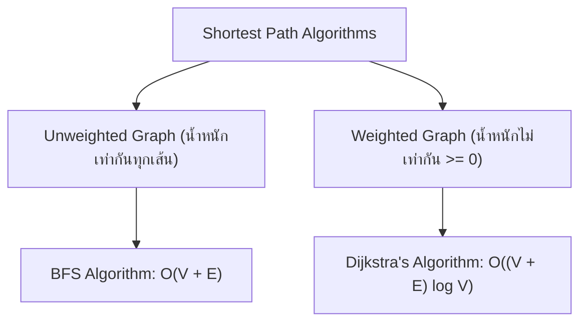
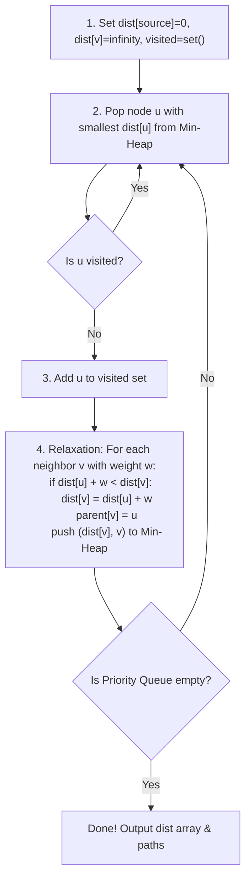
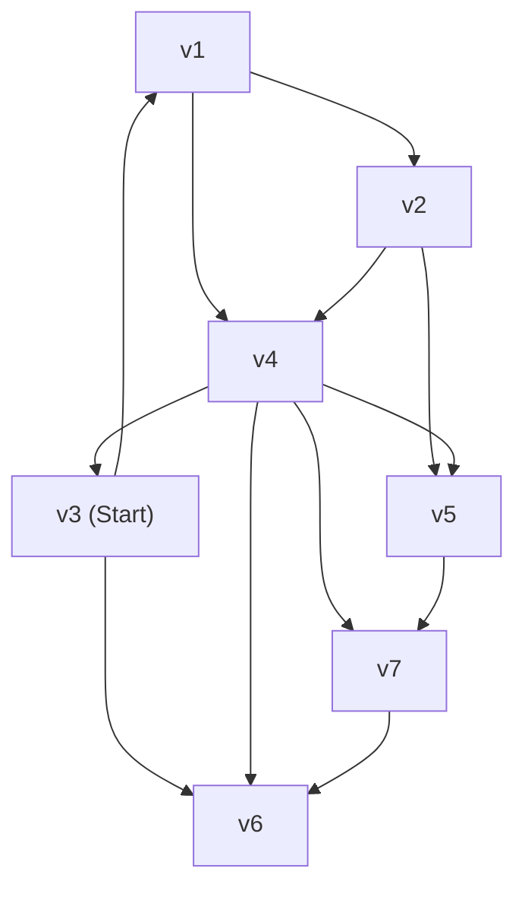

# 🗺️ 10.1 - Shortest Path Algorithms (Dijkstra, Unweighted Shortest Path)

> [!NOTE]
> ปัญหา **Shortest Path (เส้นทางที่สั้นที่สุด)** คือการคัดหาเส้นทางที่มีผลรวมน้ำหนักของ Edges น้อยที่สุดจากโหนดจุดเริ่มต้น (Source Vertex) ไปยังโหนดอื่นๆ

---

## 🏛️ 1. เปรียบเทียบ 2 อัลกอริทึม Shortest Path



---

## ⚡ 2. Dijkstra's Algorithm (สำหรับ Weighted Graph น้ำหนัก $\ge 0$)

เสนอโดย Edsger W. Dijkstra (1959) ใช้หลักการ **Greedy Choice** ร่วมกับ **Priority Queue (Min-Heap)**



---

## 🧮 3. ตาราง Trace Dijkstra Step-by-Step (ข้อสอบเน้นย้ำ!)

>[!EXAMPLE]
> **พิจารณากราฟแบบมีทิศทาง:**
> - $A \to B$ (w=4), $A \to C$ (w=2)
> - $C \to B$ (w=1), $C \to D$ (w=5)
> - $B \to D$ (w=2)
> 
> **หาเส้นทางสั้นที่สุดจากจุดเริ่มต้น $A$:**
>
> | Step | Visited | Priority Queue | Distance Array `[A, B, C, D]` | Explanation |
> | :--- | :--- | :--- | :--- | :--- |
> | **Init** | `{}` | `[(0, 'A')]` | `[0, ∞, ∞, ∞]` | ตั้งค่าเริ่มต้น `dist[A] = 0` |
> | **1** | `{'A'}` | `[(2, 'C'), (4, 'B')]` | `[0, 4, 2, ∞]` | Pop A $\to$ Relax B(4), C(2) |
> | **2** | `{'A', 'C'}` | `[(3, 'B'), (4, 'B'), (7, 'D')]` | `[0, 3, 2, 7]` | Pop C (dist=2) $\to$ Relax B ($2+1=3 < 4 \implies 3$), D ($2+5=7$) |
> | **3** | `{'A', 'C', 'B'}`| `[(5, 'D'), (7, 'D')]` | `[0, 3, 2, 5]` | Pop B (dist=3) $\to$ Relax D ($3+2=5 < 7 \implies 5$) |
> | **4** | `{'A', 'C', 'B', 'D'}`| `[(7, 'D')]` | `[0, 3, 2, 5]` | Pop D (dist=5) $\to$ ถึงจุดหมายแล้ว! |
>
> **สรุประยะทางสั้นที่สุดจาก A**: `A=0, B=3 (ผ่าน C), C=2, D=5 (ผ่าน A->C->B->D)`

---

## 📝 4. สรุปโจทย์ Assignment 4 Shortest Path

> [!IMPORTANT]
> **ประเด็นสำคัญจาก Assignment 4 Shortest Path**:
> 1. **การแกะย้อนกลับหาเส้นทางสั้นที่สุด (Path Reconstruction)**:
>    - นอกเหนือจากการเก็บบันทึกระยะทางสั้นที่สุด `dist[v]` ต้องมีเมทริกซ์/ดิฟชันนารี `parent[v]` เพื่อเก็บว่าโหนดก่อนหน้าคือใคร
>    - เมื่อต้องการแสดงเส้นทาง ให้เริ่มต้นที่จุดหมาย $V_{\text{target}}$ แล้วเดินย้อนผ่าน `parent` กลับมายังจุดเริ่มต้น $V_{\text{source}}$ แล้วทำการ Reverse สตริงคืนกลับมา!

---

## 💻 5. Complete Python Implementation of Dijkstra

```python
import heapq

def dijkstra(graph, start_vertex):
    # graph อยู่ในรูป { 'A': [('B', 4), ('C', 2)], ... }
    distances = {vertex: float('inf') for vertex in graph}
    distances[start_vertex] = 0
    parent = {vertex: None for vertex in graph}
    
    # Priority Queue เก็บ tuple: (distance, vertex)
    pq = [(0, start_vertex)]
    visited = set()
    
    while pq:
        current_dist, current_vertex = heapq.heappop(pq)
        
        if current_vertex in visited:
            continue
        visited.add(current_vertex)
        
        for neighbor, weight in graph[current_vertex]:
            distance = current_dist + weight
            
            # Relaxation step
            if distance < distances[neighbor]:
                distances[neighbor] = distance
                parent[neighbor] = current_vertex
                heapq.heappush(pq, (distance, neighbor))
                
    return distances, parent

if __name__ == "__main__":
    # กราฟตัวอย่างตามตาราง Trace ข้อสอบ
    graph = {
        'A': [('B', 4), ('C', 2)],
        'B': [('D', 2)],
        'C': [('B', 1), ('D', 5)],
        'D': []
    }
    start = 'A'
    distances, parent = dijkstra(graph, start)
    print(f"🎯 เส้นทางสั้นที่สุดเริ่มต้นจากโหนด: '{start}'")
    for node, dist in distances.items():
        # สร้างเส้นทางย้อนกลับ
        curr = node
        path = []
        while curr is not None:
            path.append(curr)
            curr = parent[curr]
        path.reverse()
        path_str = " -> ".join(path)
        print(f"  ไปยังโหนด '{node}': ระยะทางสั้นที่สุด = {dist:2d} | เส้นทาง: {path_str}")
```

---

## 📝 5. คลังตัวอย่างข้อสอบ & แบบฝึกหัดในห้องเรียน (Classroom "For Example Shortest Path")

> [!INFO]
> **ที่มาของเอกสารต้นฉบับ**: เอกสารใบงานและสไลด์การสอนจริง `Lectures/Lecture 11 Shortest path/For Example Graph.pdf` และ `Lectures/Assignment 4 Shortest Path/`

---

### 🎯 5.1 การแปลงภาพกราฟเป็น Adjacency List (จุดยอด $v_1$ ถึง $v_7$)



#### ตาราง Adjacency List ของกราฟ:
- **$v_1$**: เชื่อมไป $\to [v_2, v_4]$
- **$v_2$**: เชื่อมไป $\to [v_4, v_5]$
- **$v_3$**: เชื่อมไป $\to [v_1, v_6]$
- **$v_4$**: เชื่อมไป $\to [v_3, v_6, v_5, v_7]$
- **$v_5$**: เชื่อมไป $\to [v_7]$
- **$v_6$**: ไม่มีเส้นพุ่งออก $\to \emptyset$
- **$v_7$**: เชื่อมไป $\to [v_6]$

---

### 🎯 5.2 ตารางประมวลผล Unweighted Shortest Path (เริ่มต้นจาก $v_3$)

#### กฎการคำนวณ:
```python
# เมื่อสำรวจเพื่อนบ้าน w จากจุดยอด v ปัจจุบัน:
if w.dist == INFINITY:
    w.dist = v.dist + 1
    w.path = v
    q.enqueue(w)
```

#### ตาราง Trace ค่า Known, Dist ($d_v$), Path ($p_v$) และคิว ($q$):

| จุดยอด ($v$) | Known (ประมวลผลแล้ว) | $d_v$ (ระยะทางสั้นสุด) | $p_v$ (โหนดก่อนหน้า) | ลำดับการประมวลผลผ่าน Queue |
| :---: | :---: | :---: | :---: | :--- |
| **$v_1$** | **True** | `1` | $v_3$ | Dequeue ลำดับที่ 2 |
| **$v_2$** | **True** | `2` | $v_1$ | Dequeue ลำดับที่ 4 |
| **$v_3$ (Start)** | **True** | `0` | $0$ (จุดเริ่ม) | Dequeue ลำดับแรกสุด |
| **$v_4$** | **True** | `2` | $v_1$ | Dequeue ลำดับที่ 5 |
| **$v_5$** | **True** | `3` | $v_2$ หรือ $v_4$ | Dequeue ลำดับที่ 6 |
| **$v_6$** | **True** | `1` | $v_3$ | Dequeue ลำดับที่ 3 |
| **$v_7$** | **True** | `3` | $v_4$ | Dequeue ลำดับที่ 7 |

---

### 🎯 5.3 คำตอบข้อสอบปลายภาค (จากสไลด์หน้า 5)

#### คำถามที่ 1: จงหาเส้นทางที่สั้นที่สุดจาก $v_3$ ไป $v_5$
- **ความยาวของเส้นทาง (Length of shortest path):** $\mathbf{3}$
- **เส้นทางที่สั้นที่สุด (Shortest path):** $v_3, v_1, v_2, v_5$ *(หรือ $v_3, v_1, v_4, v_5$)*

#### คำถามที่ 2: จงหาเส้นทางที่สั้นที่สุดจาก $v_3$ ไป $v_7$
- **ความยาวของเส้นทาง (Length of shortest path):** $\mathbf{3}$
- **เส้นทางที่สั้นที่สุด (Shortest path):** $v_3, v_1, v_4, v_7$

---

#### 🖥️ ตัวอย่างหน้าจอ Interface การจำลองการคำนวณ Shortest Path (Dijkstra & BFS Studio)
```console
============================================================
           UNWEIGHTED SHORTEST PATH TRACE ENGINE            
============================================================
[Source Vertex] v3 (d=0)
------------------------------------------------------------
Iter 1: Visit v3 -> Enqueue neighbors: v1 (d=1), v6 (d=1)
Iter 2: Visit v1 -> Enqueue neighbors: v2 (d=2), v4 (d=2)
Iter 3: Visit v6 -> No outgoing edges
Iter 4: Visit v2 -> Enqueue neighbor : v5 (d=3)
Iter 5: Visit v4 -> Enqueue neighbor : v7 (d=3)
Iter 6: Visit v5 -> All neighbors known
Iter 7: Visit v7 -> Finished!
------------------------------------------------------------
[Query Results]
 -> Path v3 to v5: v3 -> v1 -> v4 -> v5 (Distance: 3)
 -> Path v3 to v7: v3 -> v1 -> v4 -> v7 (Distance: 3)
============================================================
```

---

## 🔗 ลิงก์เชื่อมโยงใน Obsidian Wiki
- ก่อนหน้า: [[09.1 - Graph Fundamentals & Traversals (BFS, DFS, Topological Sort)]]
- ข้อสอบจริงปลายภาค 2568: [[11.6 - Final Exam Real Classroom Prep & Solutions]]
- ตารางความเร็วรวม: [[Glossary & Complexity Cheat Sheet]]
- กลับหน้าหลัก: [[Index]]

