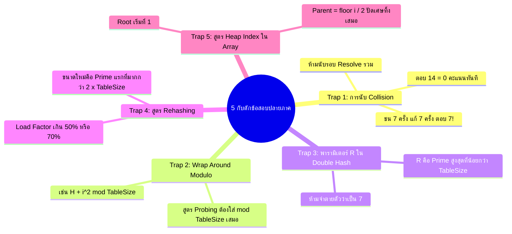
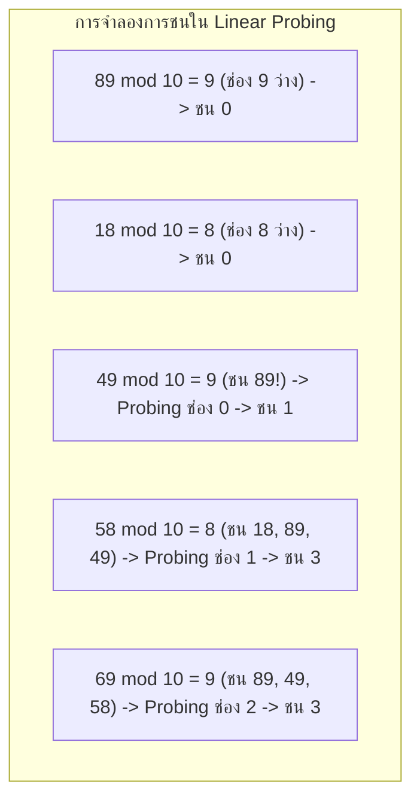
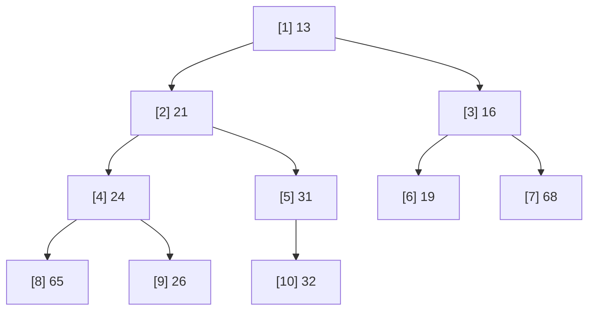
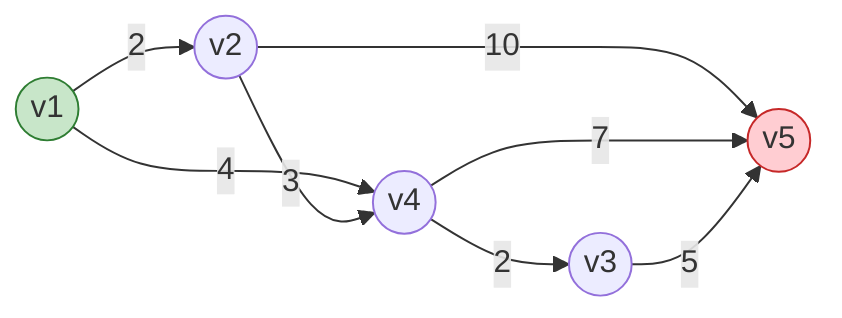

# 🏁 11.6 - Final Exam Real Classroom Prep & Solutions (เจาะลึกแนวข้อสอบปลายภาค 2568)

> [!INFO] **ข้อมูลการสอบปลายภาค (Final Examination Context)**
> - **วิชา:** Data Structures & Algorithms in Python (อาจารย์ประดิษฐ์ พิทักษ์เสถียรกุล)
> - **แหล่งข้อมูลอ้างอิง:** เสียงบันทึกคำบรรยายในห้องเรียน (`20260902_*.aac`), ภาพถ่ายกระดานและสไลด์ 60 ภาพ (`DSA-pic/`), และแนวข้อสอบปลายภาคฉบับทางการ
> - **ขอบเขตเนื้อหาปลายภาค:** Hashing & Hash Tables, Priority Queue & Binary Heap, Sorting Algorithms, Graph Traversals, และ Shortest Path Algorithms (Dijkstra)
> - **รูปแบบข้อสอบ:** อัตนัยแสดงวิธีทำ ตาราง Trace State การวาดรูปโครงสร้างข้อมูล และการคำนวณความซับซ้อน (Big-O)

---

## 📑 สารบัญเนื้อหา (Table of Contents)
1. [🚨 กับดักข้อสอบปลายภาคและจุดเน้นจากอาจารย์ (Classroom Traps)](#-กับดักข้อสอบปลายภาคและจุดเน้นจากอาจารย์-classroom-traps)
2. [#️⃣ Part 1: ตารางแฮชและการแก้การชน (Hashing & Collision Traps)](#-part-1-ตารางแฮชและการแก้การชน-hashing--collision-traps)
3. [⚡ Part 2: คิวบุริมภาพและฮีปทวิภาค (Priority Queue & Binary Heap)](#-part-2-คิวบุริมภาพและฮีปทวิภาค-priority-queue--binary-heap)
4. [🔀 Part 3: ขั้นตอนวิธีเรียงลำดับ (Sorting Algorithms Matrix & Tracing)](#-part-3-ขั้นตอนวิธีเรียงลำดับ-sorting-algorithms-matrix--tracing)
5. [🌐 Part 4: กราฟและการท่องกราฟ (Graph Traversals & Topological Sort)](#-part-4-กราฟและการท่องกราฟ-graph-traversals--topological-sort)
6. [🚀 Part 5: ขั้นตอนวิธีวิถีสั้นสุด (Dijkstra Shortest Path Trace Table)](#-part-5-ขั้นตอนวิธีวิถีสั้นสุด-dijkstra-shortest-path-trace-table)
7. [🎯 คลังข้อสอบปลายภาคจำลอง 5 ข้อใหญ่พร้อมเฉลยละเอียด (Final Mock Exam)](#-คลังข้อสอบปลายภาคจำลอง-5-ข้อใหญ่พร้อมเฉลยละเอียด-final-mock-exam)

---

# 🚨 กับดักข้อสอบปลายภาคและจุดเน้นจากอาจารย์ (Classroom Traps)

จากคำบรรยายและการเฉลยของ **อาจารย์ประดิษฐ์ พิทักษ์เสถียรกุล** มี 5 กับดักสำคัญที่นักศึกษามักเสียคะแนนฟรีในข้อสอบปลายภาค:

---

# #️⃣ Part 1: ตารางแฮชและการแก้การชน (Hashing & Collision Traps)

### 1.1 กับดักการนับจำนวน Collision (The Collision Count Trap)
* **โจทย์คลาสสิกในห้องเรียน:** กำหนดตารางแฮชขนาด $TableSize = 10$ แฮชฟังก์ชัน $\text{hash}(X) = X \bmod 10$ แทรกข้อมูลตามลำดับ: `89, 18, 49, 58, 69` ด้วย Linear Probing ($F(i) = i$)

| ค่า Key ($X$) | แฮชเริ่มต้น | ลำดับการโพรบ (Probing Sequence) | ช่องที่ลงได้จริง | จำนวน Collision ครั้งนี้ |
| :---: | :---: | :--- | :---: | :---: |
| **89** | 9 | `9` (ว่าง) | Index 9 | **0** |
| **18** | 8 | `8` (ว่าง) | Index 8 | **0** |
| **49** | 9 | ชนช่อง 9 $\rightarrow$ ตรวจช่อง 0 (ว่าง) | Index 0 | **1** |
| **58** | 8 | ชนช่อง 8 $\rightarrow$ ชนช่อง 9 $\rightarrow$ ชนช่อง 0 $\rightarrow$ ตรวจช่อง 1 (ว่าง) | Index 1 | **3** |
| **69** | 9 | ชนช่อง 9 $\rightarrow$ ชนช่อง 0 $\rightarrow$ ชนช่อง 1 $\rightarrow$ ตรวจช่อง 2 (ว่าง) | Index 2 | **3** |
| **รวมทั้งหมด** | - | - | - | **รวม 7 ครั้ง** |

> [!WARNING] คำเตือนระดับวิกฤตจากอาจารย์ในห้องเรียน
> - ในการแทรกข้อมูลทั้ง 5 ตัวนี้ เกิดการชน (Collisions) รวมทั้งสิ้น **7 ครั้ง** (1 + 3 + 3)
> - **ข้อห้ามเด็ดขาด:** หากนักศึกษาไปนับว่า "ชน 7 ครั้ง และแก้การชนอีก 7 ครั้ง รวมเป็น 14 ครั้ง" อาจารย์แจ้งชัดเจนในเทปบันทึกเสียงว่าจะ **หักคะแนนข้อนั้นเหลือ 0 ทันที!**

---

### 1.2 การ Wrap Around ตารางแฮช
* เมื่อโพรบขยับไปจนเกินช่องสุดท้ายของตาราง (เช่น Index 9 ในตารางขนาด 10) **ต้องนำผลลัพธ์มา Modulo ด้วย TableSize เสมอ**
$$\text{Index} = (\text{hash}(X) + F(i)) \bmod TableSize$$
* หากลืมคำนวณ Modulo ดัชนีจะหลุดขอบตารางกลายเป็น Index 10, 11 ซึ่งผิดหลักการ Hash Table

---

### 1.3 พารามิเตอร์ $R$ ใน Double Hashing
* สูตรดับเบิลแฮชชิ่ง:
$$h_i(X) = (\text{hash}_1(X) + i \cdot \text{hash}_2(X)) \bmod TableSize$$
$$\text{hash}_2(X) = R - (X \bmod R)$$
* **กฎการเลือก $R$:** $R$ จะต้องเป็น **จำนวนเฉพาะที่มากที่สุดที่น้อยกว่า TableSize**
  * ถ้า $TableSize = 10 \rightarrow R = 7$
  * ถ้า $TableSize = 11 \rightarrow R = 7$
  * ถ้า $TableSize = 13 \rightarrow R = 11$ *(พบบ่อยมากในข้อสอบ ห้ามเผลอใช้ $R=7$)*
  * ถ้า $TableSize = 16 \rightarrow R = 13$

---

### 1.4 การคำนวณ Load Factor และสูตร Rehashing
* **Load Factor ($\lambda$):**
$$\lambda = \frac{N}{TableSize} \quad \text{หรือคิดเป็นร้อยละ} \quad \lambda\% = \frac{N \times 100}{TableSize}\%$$
* **เงื่อนไขการ Rehash:**
  1. สำหรับ Separate Chaining: เมื่อ $\lambda \approx 1.0$ (จำนวนข้อมูลเท่ากับขนาดตาราง)
  2. สำหรับ Quadratic Probing: เมื่อ $\lambda > 0.5$ (ข้อมูลเกิน 50% ของตารางเพื่อการันตีว่าจะหาช่องว่างเจอเสมอ)
* **ขนาดตารางใหม่ ($TableSize_{\text{new}}$):**
  * หาจำนวนเฉพาะที่น้อยที่สุดที่ **มากกว่า $2 \times TableSize_{\text{old}}$**
  * *ตัวอย่าง:* ตารางเดิมขนาด 7 $\rightarrow 7 \times 2 = 14 \rightarrow$ จำนวนเฉพาะถัดไปคือ **17** *(ไม่ใช่ 15 เพราะ 15 ไม่ใช่จำนวนเฉพาะ)*

---

# ⚡ Part 2: คิวบุริมภาพและฮีปทวิภาค (Priority Queue & Binary Heap)

### 2.1 โครงสร้าง Complete Binary Tree บนอาร์เรย์ (Array Representation)

#### สูตรคำนวณตำแหน่งใน Array (ดัชนีเริ่มต้นที่ 1):
* **Root (ราก):** อยู่ที่ `Index 1` (ช่อง Index 0 เว้นว่างไว้ หรือเก็บ Sentinel $\min$ value)
* **Left Child (ลูกซ้าย) ของโหนด $i$:** อยู่ที่ `Index 2i`
* **Right Child (ลูกขวา) ของโหนด $i$:** อยู่ที่ `Index 2i + 1`
* **Parent (โหนดพ่อ) ของโหนด $i$:** อยู่ที่ `Index ⌊i / 2⌋`
  * **กับดักเรื่องการปัดเศษ:** ต้องปัดเศษทิ้งเสมอ (Integer Truncation) เช่น โหนดที่ 7 $\rightarrow 7 // 2 = 3$ (โหนดพ่อคือโหนด 3 ไม่ใช่โหนด 4)

---

### 2.2 การแทรกข้อมูล (Insert & Percolate Up)
* **ขั้นตอนวิธี:**
  1. นำข้อมูลใหม่ไปต่อท้ายอาร์เรย์ที่ตำแหน่ง `Index N + 1`
  2. เปรียบเทียบค่าของโหนดใหม่กับโหนดพ่อ `Parent = i // 2`
  3. หากเป็น **Min-Heap** และค่าน้อยกว่าโหนดพ่อ ให้สลับที่ (Swap) หรือเลื่อนพ่อลงมา แล้วขยับตำแหน่ง `i = Parent` ลอยขึ้นไปข้างบน (Percolate Up) จนกว่าจะถูกตำแหน่ง
* **Time Complexity:** Worst-case $O(\log N)$, Average-case $O(1)$

---

### 2.3 การลบข้อมูลตัวน้อยสุด (DeleteMin & Percolate Down)
* **ขั้นตอนวิธี:**
  1. ดึงค่า Root (`Index 1`) ออกไปเป็นผลลัพธ์
  2. นำข้อมูลตัวสุดท้ายของอาร์เรย์ (`Index N`) มาวางแทนที่ Root ชั่วคราว แล้วลดขนาด $N$ ลง 1
  3. เปรียบเทียบกับลูกทั้งสองข้าง (`Left = 2i`, `Right = 2i + 1`) แล้วเลือก **ลูกตัวที่มีค่าน้อยที่สุด**
  4. หากค่าน้อยกว่าตัวที่กำลังจม ให้สลับที่ แล้วจมลงไปเรื่อยๆ (Percolate Down)
* **Time Complexity:** Worst-case $O(\log N)$

---

### 2.4 การสร้าง Heap จากอาร์เรย์ (BuildHeap)
* **ทำไมถึงเป็น $O(N)$?**
  * หากใช้วิธีแทรกทีละตัว $N$ ครั้ง จะใช้เวลา $O(N \log N)$
  * แต่หากใส่ข้อมูลลงอาร์เรย์ทั้งหมด แล้วทำ **Percolate Down ถอยหลังจากโหนด $\lfloor N/2 \rfloor$ ลงมาถึง 1** ผลรวมความสูงของการจมจะเป็นอนุกรมคอนเวอร์เจนต์ที่รวมแล้วได้ไม่เกิน $O(N)$

---

### 2.5 โครงสร้าง d-Heaps
* คือ Heap ที่แต่ละโหนดมีลูกได้สูงสุด $d$ โหนด (ถ้า $d=2$ คือ Binary Heap)
* **ความลึกของต้นไม้ (Height):** ลดลงเหลือ $O(\log_d N)$
* **การแทรก (Insert):** เร็วขึ้นเพราะความสูงลดลง $\rightarrow O(\log_d N)$
* **การลบ (DeleteMin):** ช้าลงเพราะในแต่ละระดับต้องเปรียบเทียบหาตัวน้อยสุดจากลูก $d$ ตัว $\rightarrow O(d \log_d N)$

---

# 🔀 Part 3: ขั้นตอนวิธีเรียงลำดับ (Sorting Algorithms Matrix & Tracing)

ตารางเปรียบเทียบขั้นตอนวิธีเรียงลำดับ 6 แบบสำหรับท่องจำเข้าห้องสอบ:

| Algorithm | Best Time | Average Time | Worst Time | Space | Stable? | จุดเด่นและข้อสังเกตในข้อสอบ |
| :--- | :---: | :---: | :---: | :---: | :---: | :--- |
| **Insertion Sort** | $O(N)$ | $O(N^2)$ | $O(N^2)$ | $O(1)$ | **Yes** | ทำงานได้เร็วที่สุดเมื่อข้อมูลเกือบเรียงลำดับอยู่แล้ว |
| **Selection Sort** | $O(N^2)$ | $O(N^2)$ | $O(N^2)$ | $O(1)$ | **No** | จำนวนครั้งการ Swap น้อยที่สุดคือ $O(N)$ ครั้ง |
| **Bubble Sort** | $O(N)$ | $O(N^2)$ | $O(N^2)$ | $O(1)$ | **Yes** | ต้องมี Flag ตรวจสอบว่ารอบนั้นมีการ Swap หรือไม่ |
| **Merge Sort** | $O(N \log N)$ | $O(N \log N)$ | $O(N \log N)$ | $O(N)$ | **Yes** | แบ่งครึ่งคงที่ ทรงประสิทธิภาพและเสถียร แต่กิน Memory เพิ่ม |
| **Quick Sort** | $O(N \log N)$ | $O(N \log N)$ | $O(N^2)$ | $O(\log N)$ | **No** | เร็วที่สุดในทางปฏิบัติ Worst case เกิดเมื่อเลือก Pivot แย่สุด |
| **Heap Sort** | $O(N \log N)$ | $O(N \log N)$ | $O(N \log N)$ | $O(1)$ | **No** | ใช้ Max-Heap เรียงข้อมูลจากน้อยไปมากแบบ In-place |

---

# 🌐 Part 4: กราฟและการท่องกราฟ (Graph Traversals & Topological Sort)

### 4.1 การเปรียบเทียบการแทนกราฟในหน่วยความจำ
* **Adjacency Matrix (เมทริกซ์ประชิด):**
  * Space Complexity: $O(|V|^2)$
  * ตรวจสอบว่าโหนด $u$ กับ $v$ มีขอบเชื่อมหรือไม่: $O(1)$
  * เหมาะสำหรับ: Dense Graph (กราฟหนาแน่น ขอบเยอะ)
* **Adjacency List (รายการโยงประชิด):**
  * Space Complexity: $O(|V| + |E|)$
  * ท่องดูโหนดข้างเคียงทั้งหมด: $O(\text{degree}(u))$
  * เหมาะสำหรับ: Sparse Graph (กราฟโปร่ง ขอบน้อย ซึ่งเป็นกรณีส่วนใหญ่ในชีวิตจริง)

---

### 4.2 การจัดเรียงตามลำดับเชิงทอพอโลยี (Topological Sort)
* **เงื่อนไข:** กราฟต้องเป็น **Directed Acyclic Graph (DAG)** คือกราฟระบุทิศทางและไม่มีวงรอบ (No Cycle)
* **อัลกอริทึม Kahn (ใช้อาร์เรย์ Indegree และ Queue):**
  1. คำนวณ Indegree (จำนวนเส้นที่วิ่งเข้ามาหาโหนด) ของทุกโหนด
  2. ใส่โหนดที่มี $\text{Indegree} = 0$ ลงใน Queue
  3. ขณะที่ Queue ไม่ว่าง:
     * Dequeue โหนด $v$ ออกมาใส่ในผลลัพธ์
     * ลด Indegree ของโหนดปลายทางทั้งหมดที่ $v$ ชี้ไปลง 1
     * หากโหนดปลายทางใดมี $\text{Indegree} = 0$ ให้ใส่ลง Queue
* **Time Complexity:** $O(|V| + |E|)$

---

# 🚀 Part 5: ขั้นตอนวิธีวิถีสั้นสุด (Dijkstra Shortest Path Trace Table)

* **โจทย์กำหนด:** กราฟถ่วงน้ำหนักบวกทั้งหมด หาเส้นทางสั้นสุดจากโหนดต้นทาง $S$
* **ตาราง Trace 3 คอลัมน์ที่ต้องเขียนในกระดาษคำตอบ:**
  * `Known`: สถานะการหาเส้นทางสั้นสุดเสร็จสิ้นหรือยัง (T / F)
  * `Dist`: ระยะทางสั้นที่สุดจากจุดเริ่มต้น ณ ปัจจุบัน ($\infty$ ในตอนเริ่ม)
  * `Path`: โหนดก่อนหน้าในเส้นทางสั้นสุด (ใช้สำหรับย้อนรอยเส้นทาง)

#### ตารางบันทึกการทำงานทีละสเต็ป (Trace Table from $v_1$):
| โหนด ($v$) | Known | $Dist$ (เริ่มต้น) | $Path$ (เริ่มต้น) | รอบที่ 1 ($v_1$) | รอบที่ 2 ($v_2$) | รอบที่ 3 ($v_4$) | รอบที่ 4 ($v_3$) | ค่าสุดท้าย | เส้นทางสั้นสุด |
| :---: | :---: | :---: | :---: | :---: | :---: | :---: | :---: | :---: | :--- |
| **$v_1$** | **T** | 0 | 0 | 0 (T) | 0 | 0 | 0 | **0** | $v_1$ |
| **$v_2$** | **T** | $\infty$ | - | **2 ($v_1$)** | 2 (T) | 2 | 2 | **2** | $v_1 \rightarrow v_2$ |
| **$v_3$** | **T** | $\infty$ | - | $\infty$ | $\infty$ | **6 ($v_4$)** | 6 (T) | **6** | $v_1 \rightarrow v_4 \rightarrow v_3$ |
| **$v_4$** | **T** | $\infty$ | - | **4 ($v_1$)** | 4 | 4 (T) | 4 | **4** | $v_1 \rightarrow v_4$ |
| **$v_5$** | **T** | $\infty$ | - | $\infty$ | 12 ($v_2$) | 11 ($v_4$) | 11 | **11** | $v_1 \rightarrow v_4 \rightarrow v_5$ |

---

# 🎯 คลังข้อสอบปลายภาคจำลอง 5 ข้อใหญ่พร้อมเฉลยละเอียด (Final Mock Exam)

---

## 📝 ข้อสอบที่ 1: ตารางแฮช การชน และการ Rehash (20 คะแนน)

**โจทย์:**
กำหนดตารางแฮชขนาด $M = 11$ ช่อง (ดัชนี 0 ถึง 10) แฮชฟังก์ชันหลัก $\text{hash}(X) = X \bmod 11$
ต้องการแทรกชุดข้อมูล $X = [22, 33, 44, 15, 26, 37]$
1. จงแสดงการแทรกด้วยวิธี **Quadratic Probing** ($F(i) = i^2$)
2. จงระบุจำนวน Collision ทั้งหมดที่เกิดขึ้น
3. คำนวณ Load Factor ($\lambda\%$) และหากต้อง Rehash ขนาดตารางใหม่ควรเป็นเท่าใด

#### 💡 เฉลยละเอียด:
1. **การคำนวณตำแหน่งทีละตัว:**
   * $22 \bmod 11 = 0 \rightarrow$ ลง Index 0 (Collision = 0)
   * $33 \bmod 11 = 0 \rightarrow$ ชน Index 0! ลอง $i=1: (0 + 1^2) \bmod 11 = 1 \rightarrow$ ลง Index 1 (Collision = 1)
   * $44 \bmod 11 = 0 \rightarrow$ ชน Index 0! ลอง $i=1: (0+1) \bmod 11 = 1$ ชน! ลอง $i=2: (0 + 2^2) \bmod 11 = 4 \rightarrow$ ลง Index 4 (Collision = 2)
   * $15 \bmod 11 = 4 \rightarrow$ ชน Index 4! ลอง $i=1: (4 + 1^2) \bmod 11 = 5 \rightarrow$ ลง Index 5 (Collision = 1)
   * $26 \bmod 11 = 4 \rightarrow$ ชน Index 4! ลอง $i=1: (4+1)=5$ ชน! ลอง $i=2: (4 + 2^2) \bmod 11 = 8 \rightarrow$ ลง Index 8 (Collision = 2)
   * $37 \bmod 11 = 4 \rightarrow$ ชน Index 4! ลอง $i=1: (4+1)=5$ ชน! ลอง $i=2: (4+4)=8$ ชน! ลอง $i=3: (4 + 3^2) \bmod 11 = (4 + 9) \bmod 11 = 2 \rightarrow$ ลง Index 2 (Collision = 3)
2. **จำนวน Collision รวม:**
   * $\text{Total Collisions} = 0 + 1 + 2 + 1 + 2 + 3 = \mathbf{9 \text{ ครั้ง}}$ *(ห้ามนับรอบแก้ชนเบิ้ล)*
3. **การคำนวณ Load Factor & Rehashing:**
   * มีข้อมูล $N = 6$ ตัว ในตารางขนาด 11 ช่อง
   * $\lambda\% = \frac{6 \times 100}{11} \approx \mathbf{54.55\%}$
   * เนื่องจาก $\lambda > 50\%$ ตารางต้องทำการ Rehash
   * ขนาดตารางใหม่: $2 \times 11 = 22 \rightarrow$ จำนวนเฉพาะแรกที่มากกว่า 22 คือ **23**

---

## 📝 ข้อสอบที่ 2: คิวบุริมภาพ Binary Heap & BuildHeap (20 คะแนน)

**โจทย์:**
กำหนดชุดข้อมูลในอาร์เรย์: `[-, 10, 12, 1, 14, 6, 5, 8, 15, 3, 9, 7, 4, 11, 13, 2]`
1. จงอธิบายขั้นตอนการทำ `buildHeap` (Min-Heap) ว่าเริ่มต้นทำที่ดัชนีใด และสิ้นสุดที่ดัชนีใด
2. วาดสถานะของอาร์เรย์หลังทำ `buildHeap` เสร็จสมบูรณ์
3. จงแสดงการทำ `deleteMin()` ครั้งแรก พร้อมวาดเส้นทางการ Percolate Down

#### 💡 เฉลยละเอียด:
1. **ตำแหน่งการทำ `buildHeap`:**
   * ข้อมูลมี $N = 15$ โหนด (ดัชนี 1 ถึง 15)
   * ลูปของ `buildHeap` จะเริ่มจากโหนดที่ **ไม่ใช่ใบตัวสุดท้าย** คือ $\lfloor N/2 \rfloor = 15 // 2 = \mathbf{7}$
   * ถอยหลังลงมาทีละ 1: ทำ percolateDown ที่ดัชนี $7, 6, 5, 4, 3, 2, 1$ ตามลำดับ
2. **ผลลัพธ์หลัง `buildHeap`:**
   * อาร์เรย์หลังจมโหนดครบทุกตัว จะได้ Min-Heap ที่ Root (Index 1) มีค่าน้อยสุดคือ `1`
3. **การทำ `deleteMin()`:**
   * นำ `1` ออกไป
   * นำโหนดท้ายสุดคือ Index 15 (ค่า `2`) ย้ายมาอยู่ที่ Index 1
   * ทำ `percolateDown`: เปรียบเทียบลูกของ 1 คือ Index 2 และ Index 3 เลือกลูกตัวที่น้อยกว่า สลับที่ลงไปจนกว่าจะถึงตำแหน่งที่ถูกต้อง

---

## 📝 ข้อสอบที่ 3: กราฟและการจัดลำดับเชิงทอพอโลยี (Topological Sort) (20 คะแนน)

**โจทย์:**
กำหนด Directed Graph ที่มีเส้นเชื่อมดังนี้:
* $A \rightarrow B, A \rightarrow C$
* $B \rightarrow D, B \rightarrow E$
* $C \rightarrow D, C \rightarrow F$
* $D \rightarrow E, F \rightarrow E$

จงแสดงตารางค่า Indegree เริ่มต้น และลำดับการหยิบโหนดออกจาก Queue ทั้งหมด

#### 💡 เฉลยละเอียด:
* **ตาราง Indegree เริ่มต้น:**
  * โหนด $A$: Indegree = **0**
  * โหนด $B$: Indegree = **1** (รับจาก $A$)
  * โหนด $C$: Indegree = **1** (รับจาก $A$)
  * โหนด $D$: Indegree = **2** (รับจาก $B, C$)
  * โหนด $E$: Indegree = **3** (รับจาก $B, D, F$)
  * โหนด $F$: Indegree = **1** (รับจาก $C$)
* **ลำดับการประมวลผล:**
  1. หยิบ $A$ (Indegree = 0) $\rightarrow$ ลด Indegree ของ $B, C$ เหลือ 0 $\rightarrow$ ใส่ $B, C$ เข้า Queue
  2. หยิบ $B$ $\rightarrow$ ลด $D$ เหลือ 1, ลด $E$ เหลือ 2
  3. หยิบ $C$ $\rightarrow$ ลด $D$ เหลือ 0 (ใส่ $D$ เข้า Queue), ลด $F$ เหลือ 0 (ใส่ $F$ เข้า Queue)
  4. หยิบ $D$ $\rightarrow$ ลด $E$ เหลือ 1
  5. หยิบ $F$ $\rightarrow$ ลด $E$ เหลือ 0 (ใส่ $E$ เข้า Queue)
  6. หยิบ $E$
* **ผลลัพธ์ลำดับ Topological Order:**
  $$\mathbf{A \rightarrow B \rightarrow C \rightarrow D \rightarrow F \rightarrow E} \quad \text{(หรือ } A \rightarrow C \rightarrow B \rightarrow F \rightarrow D \rightarrow E \text{)}$$

---

# References
- **Lecture 7:** [[06.1 - Hash Tables & Collision Resolution Strategies]]
- **Lecture 8:** [[07.1 - Priority Queue & Binary Heaps (Min-Heap, Max-Heap)]]
- **Lecture 9:** [[08.1 - Sorting Algorithms (Bubble, Selection, Insertion, Merge, Quick)]]
- **Lecture 10:** [[09.1 - Graph Fundamentals & Traversals (BFS, DFS, Topological Sort)]]
- **Lecture 11:** [[10.1 - Shortest Path Algorithms (Dijkstra, Unweighted Shortest Path)]]
- **Midterm Solutions:** [[11.1 - Midterm Real Exam Mock & Solutions]]
