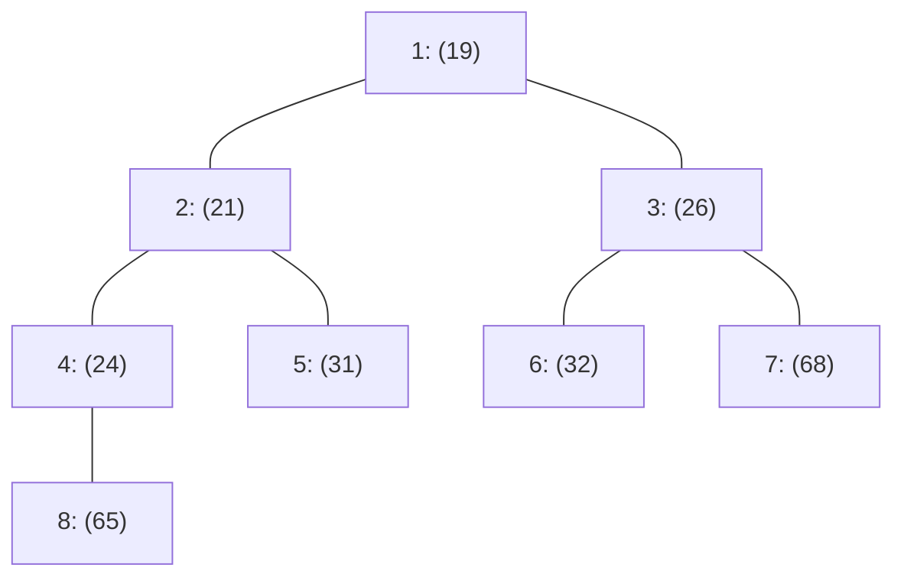

# 🎯 11.7 - รวมข้อสอบจริงที่อาจารย์พูดในห้องเรียน (All Classroom Leaked Exam Problems & Solutions)

> [!INFO]
> **ที่มาของเอกสารชุดนี้:**
> รวบรวมจาก **คำพูดจริงของ ดร.ประดิษฐ์ พิทักษ์เสถียรกุล** ที่อาจารย์พูดคำว่า *"อันนี้แหละครับที่ออกสอบปลายภาค"*, *"เตรียมดินสอปากกาจดไว้เลยนะ ออกสอบทรงนี้แน่นอน"*, และ *"บอกขนาดนี้แล้วถ้ายังทำไม่ได้ก็ไม่รู้จะพูดยังไงแล้ว"* จากไฟล์บันทึกเสียงสด (`20260902_*.aac`, `dsa20260909_*.aac`) พร้อม **หลักฐานภาพถ่ายบันทึกแชตหน้าจอสด 9 ภาพ** และ **เอกสารประกอบคำสอน/สไลด์ภาษาอังกฤษต้นฉบับ (Original English Slides & For Example Handouts)** โดยใส่ทั้งโจทย์ภาษาอังกฤษต้นฉบับ, เฉลยภาษาอังกฤษ, คำอธิบายภาษาไทย, และตาราง Trace อย่างละเอียดครบถ้วนทุกจุด

---

## 📸 สารบัญภาพหลักฐานข้อสอบที่เขียนกำกับไว้ (9 Exam Screenshots)

| ภาพถ่ายหลักฐาน | วันที่และเวลา | ข้อความกำกับบนภาพ (User Caption) | หัวข้อข้อสอบจริงที่ปรากฏบนจอ | ลิงก์หัวข้อย่อย |
| :---: | :---: | :--- | :--- | :--- |
|  | 26/8/69 10:25 | **"ออกสอบเขียน (มีการแก้ไข) คุณสมบัติ 3 ข้อ"** | คุณสมบัติของ Hash Table & Hash Function 3 ข้อ | [ข้อ 1.1](#11-ข้อสอบข้อเขียน-คุณสมบัติ-3-ประการของ-hash-function--hash-table) |
|  | 26/8/69 11:28 | **"ถามการชนกัน"** | ชุดตัวเลข Perfect Square กำลังสอง ถามการชน (16 ชนกับ 36 ที่ช่อง 6) | [ข้อ 1.2](#12-ข้อสอบข้อเขียน-การคำนวณการชนของเลขกำลังสอง-perfect-square-collision) |
|  | 26/8/69 11:35 | **"ออกสอบ final ข้อ 1"** | แทรก Keys `[89, 18, 49, 58, 69]` ลงตารางแฮชขนาด 10 (Linear Probing) | [ข้อ 1.3](#13-ข้อสอบปลายภาค-ข้อที่-1-ตัวเต็ม-final-exam-question-1) |
|  | 26/8/69 11:35 | **"ออกสอบ final ข้อ 1"** | สูตรมาตรฐาน Open Addressing: $h_i(x) = (\text{hash}(x) + F(i)) \bmod M$ | [ข้อ 1.3](#13-ข้อสอบปลายภาค-ข้อที่-1-ตัวเต็ม-final-exam-question-1) |
|  | 26/8/69 11:49 | **"ออกสอบข้อเขียน"** | นิยามและหลักการ Wrap around ใน Hashing (Mod TableSize อีกรอบ) | [ข้อ 1.4](#14-ข้อสอบข้อเขียน-นิยามหลักการ-wrap-around-ใน-hashing) |
|  | 26/8/69 11:59 | **"ชนกันกี่ครั้ง ใส่ในวงเล็บ"** | รูปแบบคำตอบข้อสอบ: ใส่การชนในวงเล็บ และวิธีทำ $h_0, h_1, h_2, h_3$ | [ข้อ 1.5](#15-รูปแบบคำตอบในข้อสอบ--กับดักเลข-58-ชนกี่ครั้ง-ใส่ในวงเล็บ) |
|  | 26/8/69 11:59 | **"ชนกันกี่ครั้ง ใส่ในวงเล็บ"** | กับดัก 58 ลงช่อง 1 ชนรวม 3 ครั้ง อย่าตอบ 6! | [ข้อ 1.5](#15-รูปแบบคำตอบในข้อสอบ--กับดักเลข-58-ชนกี่ครั้ง-ใส่ในวงเล็บ) |
|  | 2/9/69 09:54 | **"ข้อเขียน"** | Double Hashing: สูตร $\text{hash}_2(x) = R - (x \bmod R)$ และการเลือก $R=7$ | [ข้อ 1.6](#16-ข้อสอบข้อเขียน-สูตร-double-hashing-และการเลือกค่า-r) |
|  | 2/9/69 11:37 | **"ออกสอบเปลี่ยน array เป็น tree (มีการแก้ไข)"** | การแปลง Array เป็น Tree: สูตร $2i, 2i+1, \lfloor i/2 \rfloor$ ปัดเศษทิ้ง ($7/2=3$) | [ข้อ 2.1](#21-ข้อสอบออกเปลี่ยน-array-เป็น-tree) |

---

## 🔑 ข้อสอบข้อที่ 1: ตารางแฮชและการแก้การชน (Hashing & Open Addressing)

### 1.1 ข้อสอบข้อเขียน: คุณสมบัติ 3 ประการของ Hash Function & Hash Table


> **ข้อความเขียนกำกับ:** *"ออกสอบเขียน (มีการแก้ไข) คุณสมบัติ 3 ข้อ"* (วันที่ 26/8/69 เวลา 10:25 น.)

#### 🇬🇧 ข้อความและโจทย์ต้นฉบับภาษาอังกฤษบนสไลด์อาจารย์ (Original English Slide Text):
```text
Slide: Hashing - General Idea & An Ideal Hash Table
- Hashing: implementation of hash tables
- Hash table: an array of elements (Python uses datatype list)
- Fixed size TableSize
- Search is performed on a part of the item: key
- Each key is mapped into a number (ตำแหน่งในอะเรย์) in the range 0 to TableSize - 1
- Used as array index (ตัวชี้ตำแหน่งในอะเรย์)

Mapping by hash function (ในทางอุดมคติ):
1. Simple to compute
2. Ensure that any two distinct keys get different cells (เป็นไปไม่ได้ในความเป็นจริง - Impossible!)
3. How to perform insert, delete and find operations in O(1) time?

Considerations:
- Choose a hash function
- Decide what to do when two keys hash to the same value (Collision resolution)
- Decide on table size (TableSize should be prime)

Collision (การชนกัน):
- If when an element is inserted, it hashes to the same value as an already inserted element, there is collision.
- Collision resolution methods:
  1. Separate chaining
  2. Open addressing
```

#### 🇹🇭 เฉลยและคำอธิบายโดยละเอียดตามคำสอนในห้องเรียน:
1. **Simple to compute (คำนวณง่ายและรวดเร็ว):**
   - ฟังก์ชันแฮชต้องใช้การคำนวณพื้นฐานทางคณิตศาสตร์ที่ไม่ซับซ้อน เช่น การหาเศษส่วนตกค้าง (Modulo) หรือการบวกค่ารหัส ASCII เพื่อให้การค้นหา, แทรก, และลบทำงานได้ด้วยความเร็วเฉลี่ย $O(1)$
2. **Ensure that any two distinct keys get different cells (การกระจายตัวของคีย์ต่างกัน):**
   - ในทางอุดมคติ (Ideal) เราต้องการให้คีย์ที่แตกต่างกันถูกแปลงไปอยู่คนละช่องดัชนีกันเสมอ
   - **แต่ในความเป็นจริงเป็นไปไม่ได้ (Not always possible / Impossible):** เนื่องจากจำนวนคีย์ที่เป็นไปได้มีเป็นอนันต์ ($\infty$) แต่ขนาดของตาราง ($\text{TableSize}$) มีจำกัด จึงเกิดปรากฏการณ์ **Pigeonhole Principle** ทำให้การชนกัน (Collision) เป็นสิ่งที่หลีกเลี่ยงไม่ได้อย่างแน่นอน
3. **Collision Handling Mechanism (ต้องมีกลไกแก้การชนที่แน่นอน):**
   - เมื่อเกิดการชนกันขึ้น โปรแกรมจะต้องมีขั้นตอนวิธีในการหาที่อยู่ใหม่ให้กับคีย์นั้น เช่น:
     - **Separate Chaining:** แตกกิ่งออกเป็น Linked List ในช่องเดิม
     - **Open Addressing:** หาช่องว่างถัดไปภายในตารางเดิมด้วยสูตร $h_i(x) = (\text{hash}(x) + F(i)) \bmod \text{TableSize}$

---

### 1.2 ข้อสอบข้อเขียน: การคำนวณการชนของเลขกำลังสอง (Perfect Square Collision)


> **ข้อความเขียนกำกับ:** *"ถามการชนกัน"* (วันที่ 26/8/69 เวลา 11:28 น.)

#### 🇬🇧 โจทย์ภาษาอังกฤษต้นฉบับ (Original English Problem Statement):
```text
"Given an empty hash table with TableSize = 10, using the hash function:
hash(x) = x mod 10
Consider the sequence of perfect square numbers:
0, 1, 4, 9, 16, 25, 36, 49, 64, 81
Which pair of numbers causes the first collision in this table, and at which cell?"
```

#### 🇹🇭 เฉลยและวิธีทำอย่างละเอียด:
คำนวณหาค่าแฮชของเลขกำลังสองแต่ละตัวเรียงตามลำดับ:
- $0^2 = 0 \implies 0 \bmod 10 = \mathbf{0}$ (ช่อง 0 ว่าง $\rightarrow$ บรรจุลงช่อง 0)
- $1^2 = 1 \implies 1 \bmod 10 = \mathbf{1}$ (ช่อง 1 ว่าง $\rightarrow$ บรรจุลงช่อง 1)
- $2^2 = 4 \implies 4 \bmod 10 = \mathbf{4}$ (ช่อง 4 ว่าง $\rightarrow$ บรรจุลงช่อง 4)
- $3^2 = 9 \implies 9 \bmod 10 = \mathbf{9}$ (ช่อง 9 ว่าง $\rightarrow$ บรรจุลงช่อง 9)
- $4^2 = 16 \implies 16 \bmod 10 = \mathbf{6}$ (ช่อง 6 ว่าง $\rightarrow$ บรรจุลงช่อง 6)
- $5^2 = 25 \implies 25 \bmod 10 = \mathbf{5}$ (ช่อง 5 ว่าง $\rightarrow$ บรรจุลงช่อง 5)
- $6^2 = 36 \implies 36 \bmod 10 = \mathbf{6}$ $\rightarrow$ **เกิดการชนกัน (Collision) ทันที เพราะช่อง 6 มีเลข 16 ครอบครองอยู่แล้ว!**

> **💡 คำตอบที่ถูกต้อง:**  
> คู่ตัวเลขที่เกิดการชนกันคือ **16 และ 36** โดยเกิดการชนขึ้นที่ **ช่องดัชนี 6** (Collision at Cell 6)

---

### 1.3 ข้อสอบปลายภาค ข้อที่ 1 ตัวเต็ม (Final Exam Question 1)


> **ข้อความเขียนกำกับ:** *"ออกสอบ final ข้อ 1"* (วันที่ 26/8/69 เวลา 11:35 น.)

#### 🇬🇧 โจทย์ภาษาอังกฤษต้นฉบับบนสไลด์ข้อสอบ (Original English Slide Exam):
```text
Slide: Open Addressing & Linear Probing
If collision -> try an alternate cell
h0(x), h1(x), h2(x), ...
hi(x) = (hash(x) + F(i)) mod TableSize
F(0) = 0

Linear Probing:
F is a linear function of i (สมการเชิงเส้น ไม่มีเลขยกกำลัง)
F(i) = i

Exam Problem:
Insert keys {89, 18, 49, 58, 69} into an initially empty hash table of TableSize = 10.
Using Linear Probing:
hi(x) = (hash(x) + i) mod 10
Show all step-by-step probe calculations for each key.
```

#### 🇹🇭 เฉลยการคำนวณทีละตัวอย่างละเอียด:
1. **แทรก `89`:**
   - $h_0(89) = (89 \bmod 10 + 0) \bmod 10 = 9 \bmod 10 = \mathbf{9}$
   - ช่อง 9 ว่าง $\rightarrow$ บรรจุ 89 ที่ช่อง 9 *(ชน 0 ครั้ง)*
2. **แทรก `18`:**
   - $h_0(18) = (18 \bmod 10 + 0) \bmod 10 = 8 \bmod 10 = \mathbf{8}$
   - ช่อง 8 ว่าง $\rightarrow$ บรรจุ 18 ที่ช่อง 8 *(ชน 0 ครั้ง)*
3. **แทรก `49`:**
   - $h_0(49) = (49 \bmod 10 + 0) \bmod 10 = \mathbf{9}$ $\rightarrow$ ชนกับ 89 ที่ช่อง 9! *(ชนครั้งที่ 1)*
   - $h_1(49) = (9 + 1) \bmod 10 = 10 \bmod 10 = \mathbf{0}$ *(เกิด Wrap Around วนกลับไปช่องแรก)*
   - ช่อง 0 ว่าง $\rightarrow$ บรรจุ 49 ที่ช่อง 0 *(ชนรวม 1 ครั้ง)*

---

### 1.4 ข้อสอบข้อเขียน: นิยามหลักการ Wrap Around ใน Hashing


> **ข้อความเขียนกำกับ:** *"ออกสอบข้อเขียน"* (วันที่ 26/8/69 เวลา 11:49 น.)

#### 🇬🇧 นิยามภาษาอังกฤษต้นฉบับบนสไลด์อาจารย์ (Verbatim English Slide Definition):
```text
"Concept of Wrap around in Hashing is:
'When the key was mapped to the last index of hash table, it goes back to the first index of hash table by mod tablesize one more time.'"
```

#### 🇹🇭 คำแปลภาษาไทยและคำอธิบายกระดานดำของอาจารย์:
> *"หลักการ Wrap around ใน Hashing ก็คือ เมื่อการคำนวณตำแหน่งดัชนีหลุดเกินหรืออยู่ที่ตำแหน่งท้ายสุดของ Hash Table แล้ว ให้วนกลับมาเริ่มต้นตรวจสอบที่ตำแหน่งที่ 0 ใหม่ ซึ่งกลไกทางคณิตศาสตร์ที่ทำให้วนกลับมาได้ก็คือ การคำนวณ $\bmod \text{TableSize}$ อีกหนึ่งรอบนั่นเอง"*

---

### 1.5 รูปแบบคำตอบในข้อสอบ & กับดักเลข 58 (ชนกี่ครั้ง ใส่ในวงเล็บ)


> **ข้อความเขียนกำกับ:** *"ชนกันกี่ครั้ง ใส่ในวงเล็บ"* (วันที่ 26/8/69 เวลา 11:59 น.)

#### 🇬🇧 การคำนวณภาษาอังกฤษฉบับเต็มของคีย์ 58 (Detailed Probing Calculation for Key 58):
```text
Probing steps for Key 58:
Base hash: hash(58) = 58 mod 10 = 8
Formula: hi(58) = (8 + i) mod 10

i = 0: h0(58) = (8 + 0) mod 10 = 8 -> Collides with 18 at cell 8! (Collision #1)
i = 1: h1(58) = (8 + 1) mod 10 = 9 -> Collides with 89 at cell 9! (Collision #2)
i = 2: h2(58) = (8 + 2) mod 10 = 10 mod 10 = 0 -> Collides with 49 at cell 0! (Collision #3, Wrap Around)
i = 3: h3(58) = (8 + 3) mod 10 = 11 mod 10 = 1 -> Cell 1 is EMPTY! Placed at cell 1.

Conclusion for Key 58:
- Key 58 is stored in Cell 1.
- Number of collisions resolved = 3 collisions.
WARNING: NEVER answer Cell 6! Answering Cell 6 receives 0 points!
```

#### 🇬🇧 การคำนวณของคีย์ 69 (Detailed Probing Calculation for Key 69):
```text
Base hash: hash(69) = 69 mod 10 = 9
Formula: hi(69) = (9 + i) mod 10

i = 0: h0(69) = (9 + 0) mod 10 = 9 -> Collides with 89 at cell 9! (Collision #1)
i = 1: h1(69) = (9 + 1) mod 10 = 10 mod 10 = 0 -> Collides with 49 at cell 0! (Collision #2, Wrap Around)
i = 2: h2(69) = (9 + 2) mod 10 = 11 mod 10 = 1 -> Collides with 58 at cell 1! (Collision #3)
i = 3: h3(69) = (9 + 3) mod 10 = 12 mod 10 = 2 -> Cell 2 is EMPTY! Placed at cell 2.

Conclusion for Key 69:
- Key 69 is stored in Cell 2.
- Number of collisions resolved = 3 collisions.
```

#### 🎯 รูปแบบคำตอบในข้อสอบ (Format Required in Exam):
อาจารย์สั่งให้เขียนจำนวนครั้งการชนในวงเล็บต่อท้ายคีย์:
- **$89$**: ชน $0$ ครั้ง $\rightarrow \mathbf{89 \ (0)}$ ลงช่อง 9
- **$18$**: ชน $0$ ครั้ง $\rightarrow \mathbf{18 \ (0)}$ ลงช่อง 8
- **$49$**: ชน $1$ ครั้ง $\rightarrow \mathbf{49 \ (1)}$ ลงช่อง 0
- **$58$**: ชน $3$ ครั้ง $\rightarrow \mathbf{58 \ (3)}$ ลงช่อง 1
- **$69$**: ชน $3$ ครั้ง $\rightarrow \mathbf{69 \ (3)}$ ลงช่อง 2
- **ผลรวมการชนทั้งหมด:** $0 + 0 + 1 + 3 + 3 = \mathbf{7 \text{ ครั้ง}}$ (Total Collisions = 7)

> [!CAUTION]
> **กับดักได้ 0 คะแนนที่อาจารย์ย้ำในห้องเรียน:**
> 1. ใครตอบว่าเกิดการชนทั้งหมด **14 ครั้ง** $\rightarrow$ **ได้ 0 คะแนนทันที** (เพราะไปนับการเช็คช่องว่างของคีย์อื่นที่ไม่เกี่ยวข้อง)
> 2. ใครตอบว่าคีย์ 58 ลงที่ **ช่อง 6** $\rightarrow$ **ได้ 0 คะแนนทันที**

#### สภาพสุดท้ายของตารางแฮช (Final Hash Table Array):
```
Index:  [ 0 ]   [ 1 ]   [ 2 ]   [ 3 ]   [ 4 ]   [ 5 ]   [ 6 ]   [ 7 ]   [ 8 ]   [ 9 ]
Value:   49      58      69       -       -       -       -       -      18      89
```

---

### 1.6 ข้อสอบข้อเขียน: สูตร Double Hashing และการเลือกค่า $R$


> **ข้อความเขียนกำกับ:** *"ข้อเขียน"* (วันที่ 2/9/69 เวลา 09:54 น.)

#### 🇬🇧 ข้อความสไลด์ภาษาอังกฤษต้นฉบับ (Original English Slide Text):
```text
Slide: Double Hashing
- Use second hash function: F(i) = i * hash2(x)
- Poor example:
  hash1(x) = x mod 10
  hash2(x) = x mod 9
  TableSize = 10
  If x = 99 what happens? 99 mod 9 = 0 -> F(i) = i * 0 = 0 -> Infinite loop!
  RULE: hash2(x) != 0 for any x!

- Good choice:
  hash2(x) = R - (x mod R)
  R is a prime and R < TableSize.
  R must be the largest prime number strictly less than TableSize.

Questions asked in lecture:
- If TableSize is 10, what is R?
  Answer: R = 7 (Why not 8 or 9? Because 8 and 9 are NOT prime numbers!)
- If TableSize is 11, what is R?
  Answer: R = 7 (Why not 11? Because R must be strictly less than TableSize: R < TableSize!)
- If TableSize is 13, what is R?
  Answer: R = 11
```

#### 🇹🇭 เฉลยและคำอธิบายโดยละเอียด:
1. **สูตร Double Hashing มาตรฐาน:**
   $$h_i(x) = (\text{hash}_1(x) + i \cdot \text{hash}_2(x)) \bmod \text{TableSize}$$
   โดยมีฟังก์ชันแฮชที่สองคือ:
   $$\text{hash}_2(x) = R - (x \bmod R)$$
2. **ทำไมต้องมี $R - (\dots)$?**
   เพื่อรับประกันว่าผลลัพธ์ของ $\text{hash}_2(x)$ จะ **ไม่มีทางเป็น 0 เด็ดขาด ($hash_2(x) \ne 0$)** เพราะถ้าได้ 0 ค่าก้าวเดิน $i \cdot 0 = 0$ จะทำให้ติดลูปวนอยู่ที่ช่องเดิมตลอดกาล
3. **ตัวอย่างการคำนวณก้าวเดินจริงในห้องเรียน ($R=7$, $\text{TableSize}=10$):**
   - **Key 49:** $\text{hash}_2(49) = 7 - (49 \bmod 7) = 7 - 0 = \mathbf{7}$ (ก้าวทีละ 7 ช่อง)
     - ชนที่ 9 $\implies (9 + 1 \times 7) \bmod 10 = 16 \bmod 10 = \mathbf{6}$ (ลงช่อง 6)
   - **Key 58:** $\text{hash}_2(58) = 7 - (58 \bmod 7) = 7 - 2 = \mathbf{5}$ (ก้าวทีละ 5 ช่อง)
     - ชนที่ 8 $\implies (8 + 1 \times 5) \bmod 10 = 13 \bmod 10 = \mathbf{3}$ (ลงช่อง 3)
   - **Key 69:** $\text{hash}_2(69) = 7 - (69 \bmod 7) = 7 - 6 = \mathbf{1}$ (ก้าวทีละ 1 ช่อง)

---

## 🌲 ข้อสอบข้อที่ 2: Complete Binary Tree Node Count & 1D Array Mapping

### 2.1 ข้อสอบออกเปลี่ยน Array เป็น Tree


> **ข้อความเขียนกำกับ:** *"ออกสอบเปลี่ยน array เป็น tree (มีการแก้ไข)"* (วันที่ 2/9/69 เวลา 11:37 น.)

#### 🇬🇧 ข้อความสไลด์ภาษาอังกฤษต้นฉบับ (Original English Slide Text):
```text
Slide: Structure Property of Heaps
- Binary heap is a complete binary tree:
  completely filled except the bottom level which is filled from left to right.
- It is a regular structure so can be represented in an array!

Array implementation of complete binary tree:
For an element in position i:
- 2i is the left child
- 2i + 1 is the right child
- floor(i / 2) is the parent (ตัดเศษทิ้ง 7 / 2 = 3, Python use //)
Map tree to array implementation.
```

#### 🇹🇭 เฉลยและคำอธิบายโดยละเอียด:
สำหรับสมาชิกที่ตำแหน่งดัชนี $i$ ใดๆ ใน 1D Array ของ Complete Binary Tree:
- **Left Child (ลูกซ้าย):** อยู่ที่ดัชนี $\mathbf{2i}$
- **Right Child (ลูกขวา):** อยู่ที่ดัชนี $\mathbf{2i + 1}$
- **Parent (โหนดพ่อแม่):** อยู่ที่ดัชนี $\mathbf{\lfloor i / 2 \rfloor}$ (ในภาษา Python ใช้เครื่องหมายดับเบิลสแลช `i // 2`)
- **กฎการปัดเศษ (Truncate Fraction):**
  - สมมติหาพ่อแม่ของโหนดที่ตำแหน่ง $i = 7$:
    $$7 / 2 = 3.5 \implies \mathbf{\text{ตัดเศษทิ้ง ได้ตำแหน่ง } 3} \quad \text{(ห้ามปัดเศษขึ้นเป็น 4 เด็ดขาด!)}$$
- **ทำไมต้องเว้น Index 0 ไว้ (`self.array = [None] * (capacity + 1)`):**
  - เพื่อให้สมการคณิตศาสตร์ $2i$, $2i+1$, และ $i // 2$ ใช้งานได้ทันทีโดยไม่ต้องบวกลบ Offset ให้เสียเวลาใน CPU

---

### 2.2 ข้อสอบคำนวณโหนดที่ความสูง $H=10$ (โจทย์ภาษาอังกฤษตรงจากห้องเรียน)

#### 🇬🇧 โจทย์ภาษาอังกฤษต้นฉบับที่อาจารย์อ่านในห้องเรียน (Verbatim Classroom Exam):
```text
Question 2.2.1:
"How many minimum number of nodes of complete binary tree at the height 10?"

Question 2.2.2:
"How many maximum number of nodes of complete binary tree at the height 10?"
```

#### 🇹🇭 เฉลยและการแสดงวิธีทำอย่างละเอียด:
ตามคุณสมบัติ Structure Property ของ Complete Binary Tree ที่ความสูง $H$:
$$2^H \le \text{Number of Nodes} \le 2^{H+1} - 1$$

1. **จำนวนโหนดอย่างน้อยที่สุด (Minimum number of nodes) ที่ $H = 10$:**
   $$\text{Min} = 2^H = 2^{10} = \mathbf{1,024 \text{ โหนด}}$$
2. **จำนวนโหนดอย่างมากที่สุด (Maximum number of nodes) ที่ $H = 10$:**
   $$\text{Max} = 2^{H+1} - 1 = 2^{10+1} - 1 = 2^{11} - 1 = 2048 - 1 = \mathbf{2,047 \text{ โหนด}}$$

> [!CAUTION]
> **กฎเหล็กการตรวจข้อสอบของ ดร.ประดิษฐ์:**
> **ห้ามตอบติดรูปเลขยกกำลังเด็ดขาด!** หากตอบ $2^{10}$ หรือ $2^{11}-1$ จะได้ **0 คะแนน** ทันที!  
> ต้องคำนวณออกมาเป็นเลขจำนวนเต็ม **1,024** และ **2,047** เท่านั้น!

---

## ⚡ ข้อสอบข้อที่ 3 (10 คะแนนเต็ม!): Binary Heap Insert 14 & DeleteMin 3 ครั้งรวด!

### 3.1 โจทย์ข้อสอบภาษาอังกฤษต้นฉบับจากชีท For Example (Original English Handout):
```text
"If there is the exist BinaryHeap's instance variable myheap which has 10 elements as the Binary Tree following.
Write statements in main program to insert the instance variable myheap with input is 14 and write the outputs to array by using class BinaryHeap's methods that we learned only.

Write the steps for the insert() function when insert element 14 into the instance variable myheap.
In each round, consists of:
1) what are the values of the variable hole, and
2) what the comparison under the if-else condition that is checked.
Each iteration must write 2 things."
```

#### อาร์เรย์เริ่มต้นของ `myheap` (มีสมาชิก 10 ตัว, `currentSize = 10`):
```
Index:  [ 0 ]   [ 1 ]   [ 2 ]   [ 3 ]   [ 4 ]   [ 5 ]   [ 6 ]   [ 7 ]   [ 8 ]   [ 9 ]   [ 10 ]
Value:    -      13      21      16      24      31      19      68      65      26      32
```

---

### 3.2 เฉลยการแทรก $x=14$ ด้วย `insert(14)` (Percolate Up):

#### 1. คำสั่งใน Main Program:
```python
myheap.insert(14)
print(myheap.array[1 : myheap.currentSize + 1])
```

#### 2. การไล่โค้ดทีละรอบ (Step-by-step Trace):
- ขยาย `self.currentSize += 1` $\implies \text{currentSize} = \mathbf{11}$
- กำหนดตำแหน่งหลุมเริ่มต้น: `hole = 11`
- เข้าสู่ลูป `while hole > 1 and x < self.array[hole // 2]:`

| รอบที่ (Iteration) | ค่าตัวแปร `hole` | ดัชนี Parent (`hole // 2`) | ค่าใน Parent | การเปรียบเทียบเงื่อนไข | การกระทำ (Action) |
| :---: | :---: | :---: | :---: | :--- | :--- |
| **รอบที่ 1** | $11$ | $11 // 2 = 5$ | $31$ | $11 > 1$ (จริง) และ $14 < 31$ (**จริง**) | เลื่อน 31 ลงมาที่ช่อง 11 (`array[11] = 31`) แล้วขยับ `hole //= 2` $\implies \mathbf{hole = 5}$ |
| **รอบที่ 2** | $5$ | $5 // 2 = 2$ | $21$ | $5 > 1$ (จริง) และ $14 < 21$ (**จริง**) | เลื่อน 21 ลงมาที่ช่อง 5 (`array[5] = 21`) แล้วขยับ `hole //= 2` $\implies \mathbf{hole = 2}$ |
| **รอบที่ 3** | $2$ | $2 // 2 = 1$ | $13$ | $2 > 1$ (จริง) แต่ $14 < 13$ (**เท็จ!**) | **หลุดออกจากลูป while ทันที!** |

- เมื่อออกจากลูป ทำคำสั่ง `self.array[hole] = x` $\implies \mathbf{array[2] = 14}$

#### อาร์เรย์หลังแทรก 14 สำเร็จ:
```
Index:  [ 0 ]  [ 1 ]  [ 2 ]  [ 3 ]  [ 4 ]  [ 5 ]  [ 6 ]  [ 7 ]  [ 8 ]  [ 9 ]  [ 10 ]  [ 11 ]
Value:    -     13     14     16     24     21     19     68     65     26     32      31
```

---

### 3.3 เฉลยข้อสอบปลายภาคตัวจริง: ทำ `deleteMin()` ติดต่อกัน 3 ครั้งรวด! (7 คะแนน)

> [!IMPORTANT]
> **กฎไวยากรณ์การเรียกเมธอด:**  
> เมธอด `deleteMin()` **ไม่มีการรับพารามิเตอร์** (No Parameters) ใดๆ ทั้งสิ้น! ใครเขียน `myheap.deleteMin(13)` จะได้ **0 คะแนน** ทันที!

#### 🔴 DeleteMin ครั้งที่ 1 (ดึง Root 13 ออก):
```text
1. min_item = array[1] = 13
2. temp = array[currentSize] = array[11] = 31
3. currentSize ลดลงเหลือ 10
4. percolateDown เริ่มต้นที่ hole = 1:
   - รอบ 1: hole = 1, ลูกซ้าย child = 2 (ค่า 14), ลูกขวา child+1 = 3 (ค่า 16)
     เปรียบเทียบ 16 < 14 (เท็จ) -> เลือกลูกตัวน้อยกว่าคือ child = 2 (ค่า 14)
     เปรียบเทียบ array[child] < temp (14 < 31 จริง!) -> เลื่อน 14 ขึ้นช่อง 1, hole = 2
   - รอบ 2: hole = 2, ลูกซ้าย child = 4 (ค่า 24), ลูกขวา child+1 = 5 (ค่า 21)
     เปรียบเทียบ array[5] < array[4] (21 < 24 จริง!) -> child += 1 กลายเป็น 5
     เปรียบเทียบ array[child] < temp (21 < 31 จริง!) -> เลื่อน 21 ขึ้นช่อง 2, hole = 5
   - รอบ 3: hole = 5, ลูกซ้าย child = 10 (ค่า 32), ไม่มีลูกขวา (child == currentSize)
     เปรียบเทียบ array[child] < temp (32 < 31 เท็จ!) -> หยุดลูป (break)
5. บรรจุ temp ลงหลุม: array[hole] = temp -> array[5] = 31
```
**สถานะอาร์เรย์หลังจบ DeleteMin ครั้งที่ 1 (`currentSize = 10`):**
```
Index:  [ 0 ]   [ 1 ]   [ 2 ]   [ 3 ]   [ 4 ]   [ 5 ]   [ 6 ]   [ 7 ]   [ 8 ]   [ 9 ]   [ 10 ]
Value:    -      14      21      16      24      31      19      68      65      26      32
```

---

#### 🔴 DeleteMin ครั้งที่ 2 (ดึง Root 14 ออก):
```text
1. min_item = array[1] = 14
2. temp = array[currentSize] = array[10] = 32
3. currentSize ลดลงเหลือ 9
4. percolateDown เริ่มต้นที่ hole = 1:
   - รอบ 1: hole = 1, ลูกซ้าย child = 2 (ค่า 21), ลูกขวา child+1 = 3 (ค่า 16)
     เปรียบเทียบ array[3] < array[2] (16 < 21 จริง!) -> child += 1 กลายเป็น 3
     เปรียบเทียบ array[child] < temp (16 < 32 จริง!) -> เลื่อน 16 ขึ้นช่อง 1, hole = 3
   - รอบ 2: hole = 3, ลูกซ้าย child = 6 (ค่า 19), ลูกขวา child+1 = 7 (ค่า 68)
     เปรียบเทียบ 68 < 19 (เท็จ) -> เลือกลูกตัวน้อยกว่าคือ child = 6 (ค่า 19)
     เปรียบเทียบ array[child] < temp (19 < 32 จริง!) -> เลื่อน 19 ขึ้นช่อง 3, hole = 6
   - รอบ 3: hole = 6, ลูกซ้าย hole * 2 = 12 > currentSize (9) -> หลุดลูป
5. บรรจุ temp ลงหลุม: array[hole] = temp -> array[6] = 32
```
**สถานะอาร์เรย์หลังจบ DeleteMin ครั้งที่ 2 (`currentSize = 9`):**
```
Index:  [ 0 ]   [ 1 ]   [ 2 ]   [ 3 ]   [ 4 ]   [ 5 ]   [ 6 ]   [ 7 ]   [ 8 ]   [ 9 ]
Value:    -      16      21      19      24      31      32      68      65      26
```

---

#### 🔴 DeleteMin ครั้งที่ 3 (ดึง Root 16 ออก — คำตอบสุดท้ายของข้อสอบ!):
```text
1. min_item = array[1] = 16
2. temp = array[currentSize] = array[9] = 26
3. currentSize ลดลงเหลือ 8
4. percolateDown เริ่มต้นที่ hole = 1:
   - รอบ 1: hole = 1, ลูกซ้าย child = 2 (ค่า 21), ลูกขวา child+1 = 3 (ค่า 19)
     เปรียบเทียบ array[3] < array[2] (19 < 21 จริง!) -> child += 1 กลายเป็น 3
     เปรียบเทียบ array[child] < temp (19 < 26 จริง!) -> เลื่อน 19 ขึ้นช่อง 1, hole = 3
   - รอบ 2: hole = 3, ลูกซ้าย child = 6 (ค่า 32), ลูกขวา child+1 = 7 (ค่า 68)
     เปรียบเทียบ 68 < 32 (เท็จ) -> เลือกลูกตัวน้อยกว่าคือ child = 6 (ค่า 32)
     เปรียบเทียบ array[child] < temp (32 < 26 เท็จ!) -> หยุดลูปทันที (break)
5. บรรจุ temp ลงหลุม: array[hole] = temp -> array[3] = 26
```
**สถานะอาร์เรย์หลังจบ DeleteMin ครั้งที่ 3 (`currentSize = 8`):**
```
Index:  [ 0 ]   [ 1 ]   [ 2 ]   [ 3 ]   [ 4 ]   [ 5 ]   [ 6 ]   [ 7 ]   [ 8 ]
Value:    -      19      21      26      24      31      32      68      65
```

#### ผังต้นไม้ Complete Binary Tree สรุปหลังจบการลบ 3 ครั้ง:


---

## 🕸️ ข้อสอบข้อที่ 4: ทฤษฎีกราฟ, Complete Graph, และการคำนวณ Memory Waste (บรรยายสด 23/9/69)

### 4.1 ข้อสอบ Complete Graph คำนวณจำนวนเส้น (สูตร $E = \frac{V(V-1)}{2}$)
- **โจทย์ข้อสอบ:** กำหนด Undirected Complete Graph ที่มี 10 จุดยอด ($V = 10$) จงหาจำนวนเส้นเชื่อม (Edges) ทั้งหมด
- **วิธีทำ:**
  $$E = \frac{V(V-1)}{2} = \frac{10 \times (10 - 1)}{2} = \frac{10 \times 9}{2} = \mathbf{45}$$
- ⚠️ **กฎเหล็กตรวจข้อสอบ:** ต้องตอบเลขจำนวนเต็ม **`45`** หรือ **`45 เส้น`** เท่านั้น หากตอบติดสูตร เช่น `10*(10-1)/2` หรือ `90/2` จะถูกตัด **0 คะแนนทันที**

### 4.2 ข้อสอบจุดลวงการเขียน Path และหน่วยของความยาว
- **โจทย์ข้อสอบ:** จงเขียน Path จากจุด $A$ ไปยังจุด $C$
  - ❌ **ตอบได้ 0 คะแนน:** `$A \rightarrow B \rightarrow C$` (ห้ามใส่หัวลูกศรเด็ดขาด เพราะนิยาม Path คือ Sequence of vertices)
  - ✅ **ตอบได้เต็ม 100%:** **`$A, B, C$`** หรือ **`(A, B, C)`**
- **หน่วยของความยาว Path:** ตอบเป็นจำนวน **"เส้น" (Edges)** เช่น `2` หรือ `2 เส้น` ห้ามตอบหน่วยนิ้วหรือเซนติเมตร
- **โจทย์ลวงบน Null Graph ($V=\{\}, E=\{\}$):** ถาม Path จาก $A$ ไป $C$ ให้ตอบว่า **"ไม่มี Path จาก $A$ ไปยัง $C$ เนื่องจากไม่มีจุด $A$ และ $C$ อยู่ในกราฟนี้"**

### 4.3 ข้อสอบภาษาอังกฤษคำนวณ Memory Waste ของ Adjacency Matrix
> **English Exam Question:**
> *"What percentage of the memory space is used for entries with a value of 1, and what percentage is used for entries with a value of 0?"*

สำหรับกราฟ 7 จุดยอด 12 เส้นเชื่อม (ตาราง $7 \times 7 = 49$ ช่อง จากภาพกระดานจริง `IMG_20260923_110522`):
- ช่องที่มีค่าเป็น 1 (Edges ที่ใช้งาน): $\frac{12 \times 100}{49} = \mathbf{24.48\%}$
- ช่องที่มีค่าเป็น 0 (สูญเปล่า): $\frac{37 \times 100}{49} = 100 - 24.48 = \mathbf{75.51\%}$
- สรุป: Adjacency Matrix สิ้นเปลืองหน่วยความจำไปถึง **75.51%** จึงไม่เหมาะกับ Sparse Graph

### 4.4 ข้อสอบเปรียบเทียบ Matrix vs List (10 Vertices, 20 Edges)
- **Adjacency Matrix:** ใช้พื้นที่ $|V|^2 = 10^2 = \mathbf{100\text{ ช่อง}}$
- **Adjacency List:** ใช้พื้นที่ $|E| + |V| = 20 + 10 = \mathbf{30\text{ ช่อง}}$
- **อัตราการประหยัด:** Adjacency List ประหยัดหน่วยความจำได้ถึง **70%**!

---

## 🛑 ตารางสรุปจุดตัด 0 คะแนนในข้อสอบ (Zero-Score Traps Table)

| จุดตรวจข้อสอบ | คำตอบที่ได้ 0 คะแนน ❌ | คำตอบที่ได้คะแนนเต็ม 100% ✅ | เหตุผลทางทฤษฎีตามที่อาจารย์สอน |
| :--- | :--- | :--- | :--- |
| **การนับ Collision** | ตอบ 14 ครั้ง | ตอบ **7 ครั้ง** ($1 + 3 + 3$) | 49 ชน 1 ครั้ง, 58 ชน 3 ครั้ง, 69 ชน 3 ครั้ง |
| **ตำแหน่งเลข 58** | ตอบช่อง 6 | ตอบช่อง **1** | $h_3(58) = (8 + 3) \bmod 10 = 1$ |
| **การเลือก $R$ Double Hash** | ตอบ $R=8$ หรือ $R=9$ | ตอบ **$R = 7$** | $R$ ต้องเป็นจำนวนเฉพาะที่น้อยกว่า TableSize |
| **จำนวนโหนด $H=10$** | ตอบ $2^{10}$ หรือ $2^{11}-1$ | ตอบ **1,024** และ **2,047** โหนด | กฎเหล็กห้ามตอบติดเลขยกกำลัง ต้องตอบเลขเต็ม |
| **การหา Parent ของโหนด 7** | ปัดเศษขึ้นเป็นตำแหน่ง 4 | ตัดเศษทิ้ง ตอบตำแหน่ง **3** | $7 // 2 = 3$ ตัดเศษทศนิยมทิ้งเสมอ |
| **ช่องแรกของ Array Heap** | ใส่ Root ที่ Index 0 | **ช่อง Index 0 ต้องเว้นว่างไว้เสมอ** | เว้นช่อง 0 เพื่อให้สูตร $2i, 2i+1, i//2$ ถูกต้อง |
| **การเรียก DeleteMin ในโค้ด** | `myHeap.deleteMin(13)` | `myHeap.deleteMin()` (ไม่มีพารามิเตอร์) | เมธอด deleteMin ลบตัวรากเสมอ ไม่ต้องส่งค่า |
| **การเขียน Path ในข้อสอบ** | ตอบเป็นลูกศร `A -> B -> C` | ตอบเป็น Sequence **`A, B, C`** หรือ **`(A, B, C)`** | นิยามคือ Sequence of vertices ห้ามเขียนลูกศรเด็ดขาด |
| **คำนวณเส้น Complete Graph** | ตอบติดสูตร `10*(10-1)/2` หรือ `90/2` | ตอบเลขจำนวนเต็ม **45** หรือ **45 เส้น** | กฎเหล็กห้ามตอบติดสูตร ต้องคำนวณจนได้จำนวนเต็ม |
| **Path บนกราฟว่าง Null Graph**| ตอบ `A, C` หรือเว้นว่าง | ตอบ **"ไม่มี Path เพราะไม่มีจุด A และ C ในกราฟ"** | กราฟว่างไม่มีสมาชิก V ใดๆ เลย |
| **หน่วยของความยาว Path** | ตอบหน่วยไม้บรรทัด เช่น 2 นิ้ว, 5 ซม. | ตอบเป็นจำนวน **เส้น** หรือ **Edges** | ความยาว Path คือจำนวนเส้นเชื่อม ($N - 1$) |
