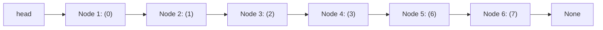
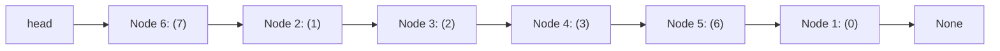

# 🔗 12.1 - Assignment 1: Singly Linked List (เรียงรหัสนักศึกษา & สลับพอยน์เตอร์ Node)

> [!NOTE]
> **ข้อมูลรายวิชาและการบ้าน**:
> - **วิชา**: 060243106 Data Structures and Algorithms (3 หน่วยกิต)
> - **อาจารย์ผู้สอน**: นายประดิษฐ์ พิทักษ์เสถียรกุล
> - **คณะ**: เทคโนโลยีและการจัดการอุตสาหกรรม มหาวิทยาลัยเทคโนโลยีพระจอมเกล้าพระนครเหนือ (มจพ. ปราจีนบุรี)
> - **สัดส่วนคะแนน**: การบ้าน (Assignments) 20 คะแนน จากคะแนนเก็บรวม 65 คะแนน (เกรดรวม 100 คะแนน)
> - **ไฟล์ต้นฉบับในโปรเจกต์**: [`New-Lectures/Assign 1 Linked List.pdf`](file:///C:/Project/python-data-structures-and-algorithms/New-Lectures/Assign%201%20Linked%20List.pdf), โฟลเดอร์ [`Lectures/Assignment 1 Linked List/`](file:///C:/Project/python-data-structures-and-algorithms/Lectures/Assignment%201%20Linked%20List/) และโค้ดส่งจริง [`Exams/LinkedList/612037.py`](file:///C:/Project/python-data-structures-and-algorithms/Exams/LinkedList/612037.py)

---

## 🎯 สรุปโจทย์คำถามและเฉลยคำตอบสำหรับส่งอาจารย์ (Official Exam Q&A Solutions Sheet)

> [!IMPORTANT]
> **สรุปคำถามและการตอบสำหรับส่งการบ้าน Assignment 1**:
> 
> | ลำดับ | คำถามในโจทย์ Assignment 1 | คำตอบที่ถูกต้องสำหรับเขียนส่ง (Official Answer) | คำเตือนจุดที่ได้ 0 คะแนน |
> | :---: | :---| :---| :---|
> | **ข้อ 1** | จงเขียนคำสั่งสร้าง `mylist` จากเลขท้าย 6 ตัวของรหัสนักศึกษา (`612037`) ให้เรียงลำดับ Ascending | ใช้ลำดับคำสั่ง: <br>1) `mylist.add(7)` $\to$ `[7]`<br>2) `mylist.add(6)` $\to$ `[6, 7]`<br>3) `mylist.add(3)` $\to$ `[3, 6, 7]`<br>4) `mylist.add(2)` $\to$ `[2, 3, 6, 7]`<br>5) `mylist.add(1)` $\to$ `[1, 2, 3, 6, 7]`<br>6) `mylist.add(0)` $\to$ `[0, 1, 2, 3, 6, 7]` | **ห้ามใช้ `.sort()`** และห้าม `add()` ตามลำดับปกติโดยไม่วางแผน เพราะการ `add()` จะแทรกที่หัวเสมอ |
> | **ข้อ 2** | จงเขียนคำสั่งสลับโหนดตำแหน่งที่ 1 (`node 0`) และโหนดตำแหน่งที่ 6 (`node 7`) โดยย้าย Pointer เท่านั้น | คำสั่งสลับอย่างถูกต้อง:<br>```python<br># จำโหนดหัวและตัวก่อนท้าย<br>first = mylist.head<br>curr = mylist.head<br>while curr.next.next != None: curr = curr.next<br>prev_last = curr; last = curr.next<br># สลับพอยน์เตอร์<br>last.next = first.next<br>prev_last.next = first<br>first.next = None<br>mylist.head = last<br>```<br>**ผลลัพธ์สุดท้าย:** `7 -> 1 -> 2 -> 3 -> 6 -> 0` | **ห้ามสลับ Data** เช่น `first.data, last.data = last.data, first.data` เด็ดขาด! อาจารย์ให้ 0 คะแนนทันที |

---

## 🎯 1. รายละเอียดโจทย์ Assignment 1 (ข้อกำหนดจากอาจารย์)

### 1.1 ข้อกำหนดโจทย์ต้นฉบับภาษาอังกฤษ (Original Assignment Brief)
> **Assign 1: Linked List**  
> 1. If no `LinkedList` instance has been created yet, write statements in the `main` program to create a `mylist` instance with the ordered inputs as the **last 6 digits of your student's id** produce the output that sort from small to large (ascending order) by using the `LinkedList` class and `Node` class we have learned.  
> 2. Then, swap node position 1 and 6 by changing the node pointers using the `LinkedList` and `Node` classes. **Do not use any methods that have not been taught in class. Do not change data in node. Modify pointers only, do not swap data.**  
> 3. Create file name with your the last 6 digits student's `id.py` (เช่น `612037.py`).
>
> **Example from Professor**:  
> If student's ID is `6706021 632032`  
> Then the last 6 digits are `632032` $\to$ Ordered inputs are `6, 3, 2, 0, 3, 2`  
> Desired sorted output: `0, 2, 2, 3, 3, 6`  
> *(Note: No problem with input 0 and duplicates 2, 2, 3, 3)*

### 1.2 สรุปเป้าหมาย 2 ขั้นตอนหลัก
1. **การสร้างและจัดเรียงข้อมูลนำเข้า (Data Insertion in Ascending Order)**:
   - นำเลขท้าย 6 ตัวของรหัสนักศึกษามาป้อนเข้าทีละตัว โดยสั่ง `add()` (แทรกหน้าสุด) หรือ `insert(item, pos)` (แทรกตามตำแหน่ง) ให้ผลลัพธ์ในลิสต์เรียงจากน้อยไปมาก
   - ห้ามใช้ฟังก์ชันโกง เช่น `.sort()` ต้องใช้ลำดับการเรียกคำสั่งของคลาสที่เรียนเท่านั้น
2. **การสลับตำแหน่งโหนดที่ 1 และโหนดที่ 6 ด้วยพอยน์เตอร์ (Pointer Swapping)**:
   - ต้องสลับตัวเชื่อมโยง (`next` และ `head`) เพื่อสลับโหนดตัวแรกและตัวที่หก
   - **ห้ามสลับค่าข้อมูล (Do not swap node.data)** ต้องย้ายโครงข่ายพอยน์เตอร์จริงในหน่วยความจำ

---

## 🔍 2. เฉลยการแก้ปัญหาและแนวคิด (Student Solution: รหัส 6806021612037)

นักศึกษา **Paphavin Thitichunhakun (รหัส 6806021612037)** เลขท้าย 6 หลักคือ `612037`  
ดังนั้นตัวเลขนำเข้า 6 ตัวคือ: `6, 1, 2, 0, 3, 7`  
ผลลัพธ์ที่ต้องการ (Ascending Sort): `0, 1, 2, 3, 6, 7`

### 2.1 ลำดับการเรียกคำสั่งเพื่อเรียงลำดับ

| ขั้นตอน | ตัวเลขที่ใส่ | คำสั่งที่ใช้ | ผลลัพธ์ใน LinkedList | คำอธิบายเหตุผล |
| :---: | :---: | :--- | :--- | :--- |
| **1** | `6` | `mylist.add(6)` | `[6]` | ใส่ตัวแรกสุดของลิสต์ |
| **2** | `1` | `mylist.add(1)` | `[1, 6]` | `1 < 6` ใช้ `add()` แทรกหัวแถว |
| **3** | `2` | `mylist.insert(2, 1)` | `[1, 2, 6]` | `2` อยู่ระหว่าง 1 กับ 6 แทรกที่ index `1` |
| **4** | `0` | `mylist.add(0)` | `[0, 1, 2, 6]` | `0` น้อยที่สุด แทรกหัวแถวด้วย `add()` |
| **5** | `3` | `mylist.insert(3, 3)` | `[0, 1, 2, 3, 6]` | `3` อยู่หลัง 2 แทรกที่ index `3` |
| **6** | `7` | `mylist.insert(7, 5)` | `[0, 1, 2, 3, 6, 7]` | `7` มากสุด แทรกท้ายสุดที่ index `5` |

```python
mylist = LinkedList()
mylist.add(6)
mylist.add(1)
mylist.insert(2, 1)
mylist.add(0)
mylist.insert(3, 3)
mylist.insert(7, 5)

print("Output small to large : ", end="")
mylist.getdata()  # ผลลัพธ์: 0 1 2 3 6 7
```

---

## 🔄 3. การสลับตำแหน่ง Node 1 และ Node 6 (Pointer Manipulation)

### 3.1 ไดอะแกรมก่อนและหลังสลับพอยน์เตอร์
ก่อนสลับ:


ขั้นตอนการสลับ (เปลี่ยนพอยน์เตอร์ 4 จุด):
1. ให้ `node6.set_next(node2)` (โหนด 6 ชี้ไปหาโหนด 2 แทนที่จะชี้ไปหา None)
2. ให้ `node5.set_next(node1)` (โหนด 5 ชี้ไปหาโหนด 1 แทนที่จะชี้ไปหาโหนด 6)
3. ให้ `node1.set_next(None)` (โหนด 1 กลายเป็นโหนดท้ายสุด ชี้ไปหา None)
4. ปรับหัวลิสต์ `mylist.head = node6` (โหนด 6 กลายเป็นหัวแถวใหม่)

หลังสลับ:


ผลลัพธ์หลังสลับ Node 1 และ 6: `7, 1, 2, 3, 6, 0`

---

## 💻 4. โค้ดส่งจริงของนักศึกษาฉบับสมบูรณ์ (`Exams/LinkedList/612037.py`)

```python
# 6806021612037 Paphavin Thitichunhakun
# วิชา 060243106 Data Structures and Algorithms

class Node:
    def __init__(self, init_data):
        self.data, self.next = init_data, None
    
    def get_data(self):
        return self.data

    def set_data(self, new_data):
        self.data = new_data

    def get_next(self):
        return self.next

    def set_next(self, new_next):
        self.next = new_next

class LinkedList:
    def __init__(self):
        self.head = None
    
    def add(self, item):
        temp = Node(item)
        temp.set_next(self.head)
        self.head = temp
    
    def search(self, item) -> bool:
        current = self.head
        found = False
        while current is not None and not found:
            if current.get_data() == item:
                found = True
            else:
                current = current.get_next()
        return found
    
    def remove(self, item):
        previous = None
        current = self.head
        found = False
        while current is not None and not found:
            if current.get_data() == item:
                found = True
            else:
                previous = current
                current = current.get_next()
        if not found:
            return
        elif previous is None:
            self.head = current.get_next()
        else:
            previous.set_next(current.get_next())

    def getdata(self):
        current = self.head
        if current is None:
            print("LinkedList is empty")
            return
        while current is not None:
            print(current.get_data(), end=" ")
            current = current.get_next()
        print()

    def insert(self, item, pos):
        if pos == 0:
            self.add(item)
            return
        previous = None
        current = self.head
        temp = Node(item)
        for _ in range(pos):
            if current is None:
                raise ValueError("Index out of range")
            previous = current
            current = current.get_next()
        previous.set_next(temp)
        temp.set_next(current)


if __name__ == "__main__":
    mylist = LinkedList()
    
    # 1. ป้อนเลขท้าย 6 ตัว (6, 1, 2, 0, 3, 7) ให้เรียงน้อยไปมาก
    mylist.add(6)
    mylist.add(1)
    mylist.insert(2, 1)
    mylist.add(0)
    mylist.insert(3, 3)
    mylist.insert(7, 5)
    
    print("Output small to large : ", end="")
    mylist.getdata()  # 0 1 2 3 6 7

    # 2. เข้าถึงตัวชี้โหนดตำแหน่ง 1 ถึง 6
    node1 = mylist.head
    node2 = node1.get_next()
    node3 = node2.get_next()
    node4 = node3.get_next()
    node5 = node4.get_next()
    node6 = node5.get_next()

    # 3. สลับ Pointer ระหว่าง Node 1 และ Node 6 (ห้ามสลับ data)
    node6.set_next(node2)
    node5.set_next(node1)
    node1.set_next(None)
    mylist.head = node6

    print("Output after swap     : ", end="")
    mylist.getdata()  # 7 1 2 3 6 0
```

---

## ⚠️ 5. กับดักและคำเตือนสำคัญของอาจารย์ (Teacher's Traps & Rules)

จากบันทึกประกาศในห้องเรียนของ อ.ประดิษฐ์ (ดูรูปใน `Lectures/Assignment 1 Linked List/Screenshot...`):

> [!CAUTION]
> ### 🚨 กับดักที่ 1: ห้ามใช้ `mylist.insert(item, 0)` เด็ดขาด! (ได้ 0 คะแนน)
> อาจารย์ระบุชัดเจน:
> *"คุณไม่สามารถเขียนประโยคคำสั่งว่า mylist.insert(1, 0) ผิดนะครับ สาเหตุเป็นเพราะว่า for i in range(pos): เมื่อ pos = 0 range(0) คือลิสต์ว่างเปล่า ทำให้ for loop ไม่ทำงานเลย ผมได้เขียน method add() สำหรับการ insert ข้อมูลเข้าไปที่ข้างหน้า Linkedlist ไว้แล้วตามเอกสารการสอน ใครใช้คำสั่ง insert(ข้อมูล, 0) จึงผิดทั้งหมด ตอนสอบเขียนมาจะได้ 0 คะแนน"*

> [!WARNING]
> ### ⚠️ กับดักที่ 2: ห้ามประกาศตัวแปรข้ามบรรทัด!
> ```python
> # ❌ ผิดไวยากรณ์ ได้ 0 คะแนน
> mylist = 
> LinkedList()
> 
> # ✅ ถูกต้อง ต้องเขียนในบรรทัดเดียวกัน
> mylist = LinkedList()
> ```
> อาจารย์ระบุ: *"ผมไม่เข้าใจนักศึกษาหลายคน ที่ประกาศตัวแปรคนละบรรทัดแบบนี้ ผิดนะครับ ต้องเขียนบรรทัดเดียวกันเรียกว่า 1 ประโยค หรือ 1 statement ตอนสอบเขียนแบบนี้ได้ 0 คะแนน บอกล่วงหน้าเลย"*

> [!IMPORTANT]
> ### ❗ กับดักที่ 3: ห้ามใช้ Method ที่ไม่ได้สอน
> - ห้ามใช้ `mylist.sort()` (ไม่มีในคลาสที่สอน)
> - ห้ามใช้ `mylist.display()` (ในคลาสใช้ชื่อ `getdata()`)
> - ห้ามสลับ `node1.data, node6.data = node6.data, node1.data` (โจทย์บังคับให้แก้ Pointer เท่านั้น)

---

## 📚 6. กรณีทำผิดส่งใหม่ (Assign 1.1 สำหรับนักศึกษาที่ทำผิดรอบแรก)

สำหรับนักศึกษาที่ส่งรอบแรกผิด อาจารย์ให้ทำโจทย์ใหม่โดยกำหนดให้ในลิสต์ **มีเลข 5 อยู่ก่อนแล้ว**  
ตัวอย่างนักศึกษารหัส `612615` (เลขท้าย 6 ตัว: 1, 1, 2, 5, 6, 6) และใน List เริ่มต้นมีเลข 5:
- `mylist.insert(6, 1)` $\to$ `[5, 6]`
- `mylist.add(1)` $\to$ `[1, 5, 6]`
- `mylist.insert(2, 1)` $\to$ `[1, 2, 5, 6]`
- `mylist.insert(6, 3)` $\to$ `[1, 2, 5, 6, 6]`
- `mylist.add(1)` $\to$ `[1, 1, 2, 5, 6, 6]`
- `mylist.insert(5, 3)` $\to$ `[1, 1, 2, 5, 5, 6, 6]`
- คำถาม: "สามารถใช้ method add() ซ้ำได้หรือไม่?" $\to$ **คำตอบ: ได้ (Yes)** เมื่อต้องการแทรกข้อมูลที่น้อยที่สุดไว้หน้าหัวลิสต์
