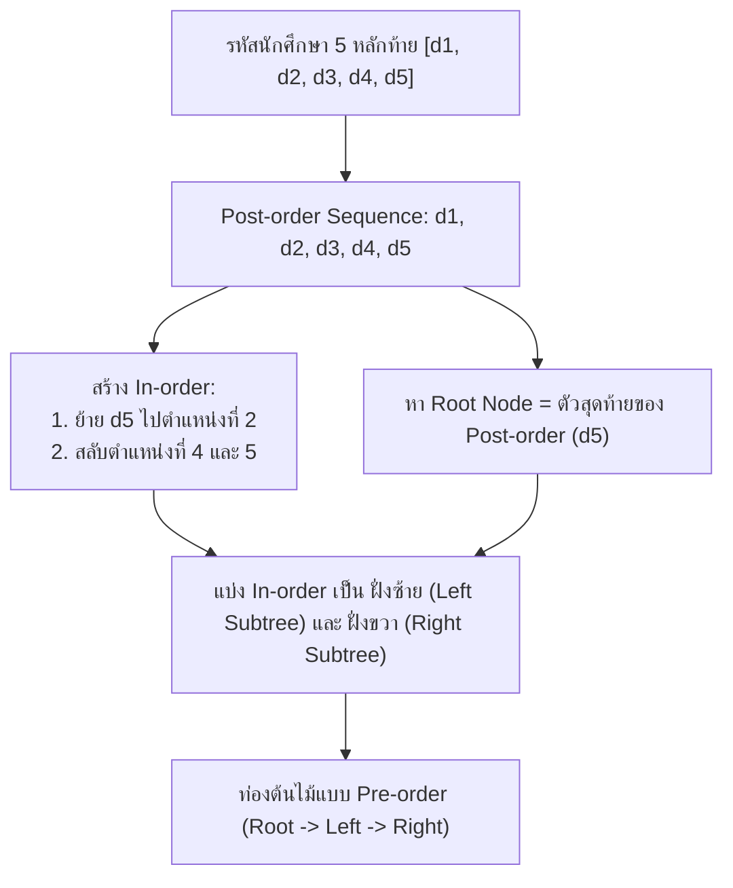
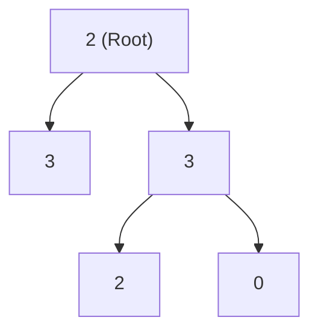
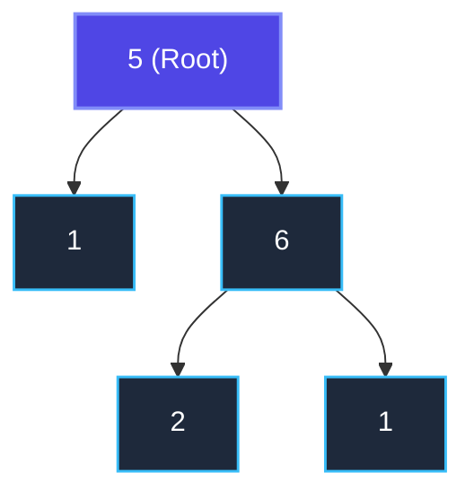

# 🌲 12.2 - Assignment 2: Construct Binary Tree (สร้างทรีจาก Post-order & In-order)

> [!NOTE]
> **ข้อมูลรายวิชาและการบ้าน**:
> - **วิชา**: 060243106 Data Structures and Algorithms
> - **อาจารย์ผู้สอน**: นายประดิษฐ์ พิทักษ์เสถียรกุล
> - **หัวข้อ**: Tree Traversals & Tree Reconstruction (In-order, Post-order, Pre-order)
> - **ไฟล์ต้นฉบับในโปรเจกต์**: [`Lectures/Assignment 2 Construct Binary Tree/Assign 2 Binary Tree.pdf`](file:///C:/Project/python-data-structures-and-algorithms/Lectures/Assignment%202%20Construct%20Binary%20Tree/Assign%202%20Binary%20Tree.pdf), โฟลเดอร์งานนักศึกษา [`Lectures/Assignment 2 Construct Binary Tree/work/`](file:///C:/Project/python-data-structures-and-algorithms/Lectures/Assignment%202%20Construct%20Binary%20Tree/work/)

---

## 🎯 สรุปโจทย์คำถามและเฉลยคำตอบสำหรับส่งอาจารย์ (Official Exam Q&A Solutions Sheet)

> [!IMPORTANT]
> **สรุปคำถามและการตอบสำหรับส่งการบ้าน Assignment 2**:
> 
> | ลำดับ | คำถามในโจทย์ Assignment 2 | คำตอบที่ถูกต้องสำหรับเขียนส่ง (Official Answer) | คำเตือนจุดที่ได้ 0 คะแนน |
> | :---: | :---| :---| :---|
> | **ข้อ 1** | จากรหัสนักศึกษา 5 ตัวท้าย ให้ Post-order และ In-order สร้าง Binary Tree ได้ Root คืออะไร? | **Root หลักคือโหนดสุดท้ายของ Post-order** (เช่น `A`) | ห้ามนำตัวแรกของ Post-order มาเป็น Root เด็ดขาด |
> | **ข้อ 2** | ผลลัพธ์การท่อง Pre-order traversal หลังสร้าง Tree เสร็จสมบูรณ์คืออะไร? | **`A, B, D, E, C, F, G`** (ท่อง Root $\to$ Left $\to$ Right) | ต้องคั่นด้วยเครื่องหมายลูกน้ำ `, ` เท่านั้น |
> | **ข้อ 3** | กฎเหล็กการเขียนเส้นทาง (Path) ไปหาโหนดใบ | ต้องเขียน: **`A, B, E`** (คั่นด้วยลูกน้ำเท่านั้น) | **ห้ามเขียนลูกศร `A -> B -> E` เด็ดขาด!** อาจารย์ประกาศหัก 100% ทันที |
> | **ข้อ 4** | จงเขียนตาราง Array 1-Based Indexing ของ Binary Tree นี้ | `[1]=A, [2]=B, [3]=C, [4]=D, [5]=E, [6]=F, [7]=G` โดยสูตรพ่อคือ `i // 2`, ลูกซ้ายคือ `2i`, ลูกขวาคือ `2i + 1` | ห้ามเริ่มที่ Index 0 (Index 0 ต้องเว้นว่างไว้เป็น Sentinel) |

---

## 🎯 1. รายละเอียดโจทย์ Assignment 2 (ข้อกำหนดจากอาจารย์)

### 1.1 ข้อกำหนดโจทย์ต้นฉบับภาษาอังกฤษ (Original Assignment Brief)
> **Assign 2: Construct Binary Tree**  
> 1. Construct a binary tree by using the **last 5 digits of your student's id** as the **Post-order sequence** (include repeating numbers and zeros).  
> 2. Create the **In-order sequence** by:
>    - Move the last digit to the second digit
>    - Swap the fourth and fifth digits at the end
> 3. Construct the complete Binary Tree.
> 4. Write the output in **Pre-order traversal**.
>
> **Hints from Professor**:  
> - **Hint 1**: Root node of the tree is the **last visiting node in Post-order traversal**.
> - **Hint 2**: With the In-order sequence, the root node divides the sequence into **Left Subtree** and **Right Subtree**.

---

## 📐 2. กฎการถอดรหัสและการสร้างลำดับ (Algorithm Rules)



---

## 🔍 3. การทำโจทย์ตัวอย่างของอาจารย์ (Professor's Example)

- รหัสนักศึกษาตัวอย่าง: `6706021 632032` $\to$ เลขท้าย 5 ตัว: `3, 2, 0, 3, 2`
- **Post-order sequence**: `3, 2, 0, 3, 2`
- **In-order sequence**:
  - ย้ายตัวสุดท้าย `2` มาไว้ตำแหน่งที่ 2: `3, 2, 2, 0, 3`
  - สลับตำแหน่งที่ 4 และ 5 (`0` กับ `3` สลับเป็น `3` กับ `0`): `3, 2, 2, 3, 0`
- **การประกอบต้นไม้**:
  1. ตัวสุดท้ายของ Post-order คือ `2` $\implies$ **Root = 2**
  2. ดูใน In-order `3, [2], 2, 3, 0`:
     - ด้านซ้ายของ Root คือ `3` $\implies$ กิ่งซ้ายมีโหนดเดียวคือ `3`
     - ด้านขวาของ Root คือ `2, 3, 0` $\implies$ กิ่งขวามี 3 โหนด
  3. ดูตัวรองสุดท้ายของ Post-order คือ `3` $\implies$ โหนดแม่ของกิ่งขวาคือ `3`
     - ซ้ายของ 3 คือ `2` และขวาของ 3 คือ `0`

โครงสร้างต้นไม้ที่ได้:


- **ผลลัพธ์ Pre-order traversal** (Root $\to$ Left $\to$ Right): `2, 3, 3, 2, 0`

---

## 📝 4. เฉลยจากการบ้านจริงของนักศึกษา (`Screenshot 2026-02-15 172428.png`)

รหัสนักศึกษา: `6706021612615`  
เลขท้าย 5 ตัว: `1, 2, 6, 1, 5`

### 4.1 แปลงเป็นลำดับการเดิน
1. **Post-order**: `1, 2, 6, 1, 5`  
   $\to$ ตัวสุดท้ายคือ **5** ดังนั้น **Root Node = 5**
2. **In-order**: `1, 5, 2, 6, 1` (ย้าย 5 มาไว้ตำแหน่งที่ 2)
   - ด้านซ้ายของ 5 ใน In-order คือ `1` $\implies$ กิ่งซ้ายมีโหนด `1`
   - ด้านขวาของ 5 ใน In-order คือ `2, 6, 1` $\implies$ กิ่งขวามีโหนด `6` เป็นแกนกลาง โดยมีลูกซ้ายคือ `2` และลูกขวาคือ `1`

### 4.2 แผนผังต้นไม้ของนักศึกษา


### 4.3 คำตอบ Pre-order Traversal
$$\text{Pre-order: } \mathbf{5, 1, 6, 2, 1}$$

---

## 💻 5. โปรแกรม Python สำหรับสร้าง Binary Tree อัตโนมัติ

นักศึกษาสามารถใช้โค้ดภาษา Python นี้เพื่อตรวจสอบความถูกต้องของ Tree Reconstruction และพิมพ์ผล Traversal ทุกรูปแบบ:

```python
class TreeNode:
    def __init__(self, val):
        self.val = val
        self.left = None
        self.right = None

def build_tree_post_in(inorder, postorder):
    if not inorder or not postorder:
        return None

    # 1. Root คือตัวสุดท้ายของ Post-order
    root_val = postorder.pop()
    root = TreeNode(root_val)

    # 2. หาตำแหน่ง Root ใน In-order
    root_idx = inorder.index(root_val)

    # 3. สร้าง Right Subtree ก่อน Left Subtree (เนื่องจากใช้ postorder.pop())
    root.right = build_tree_post_in(inorder[root_idx + 1:], postorder)
    root.left = build_tree_post_in(inorder[:root_idx], postorder)

    return root

def preorder_traversal(root):
    if not root:
        return []
    return [root.val] + preorder_traversal(root.left) + preorder_traversal(root.right)

def postorder_traversal(root):
    if not root:
        return []
    return postorder_traversal(root.left) + postorder_traversal(root.right) + [root.val]

def inorder_traversal(root):
    if not root:
        return []
    return inorder_traversal(root.left) + [root.val] + inorder_traversal(root.right)

if __name__ == "__main__":
    # ทดสอบกรณีนักศึกษารหัส 6706021612615
    post_seq = [1, 2, 6, 1, 5]
    in_seq = [1, 5, 2, 6, 1]

    print("Post-order นำเข้า:", post_seq)
    print("In-order นำเข้า:  ", in_seq)

    # สร้างต้นไม้ (ส่ง copy ของ postorder เข้าไปเพื่อไม่ให้กระทบลิสต์เดิม)
    tree_root = build_tree_post_in(in_seq, post_seq.copy())

    # แสดงผล Traversal
    print("\n--- ผลลัพธ์จากการท่องต้นไม้ ---")
    print("Pre-order (คำตอบการบ้าน):", preorder_traversal(tree_root))
    print("In-order ตรวจสอบ:        ", inorder_traversal(tree_root))
    print("Post-order ตรวจสอบ:      ", postorder_traversal(tree_root))
```
