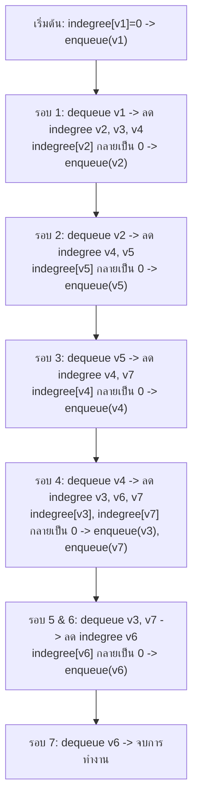

# 🗺️ 12.4 - Assignment 4: Graph, Topological Sort & Shortest Path

> [!NOTE]
> **ข้อมูลรายวิชาและการบ้าน**:
> - **วิชา**: 060243106 Data Structures and Algorithms
> - **อาจารย์ผู้สอน**: นายประดิษฐ์ พิทักษ์เสถียรกุล
> - **หัวข้อ**: Graph Representation, Topological Sort (Indegree Array & Queue), Unweighted Shortest Path (BFS)
> - **ไฟล์ต้นฉบับในโปรเจกต์**: [`Lectures/Assignment 4 Shortest Path/For Example Graph.pdf`](file:///C:/Project/python-data-structures-and-algorithms/Lectures/Assignment%204%20Shortest%20Path/For%20Example%20Graph.pdf), [`Lectures/Lecture 10 Graph/Topological sort.pdf`](file:///C:/Project/python-data-structures-and-algorithms/Lectures/Lecture%2010%20Graph/Topological%20sort.pdf)

---

## 🎯 สรุปโจทย์คำถามและเฉลยคำตอบสำหรับส่งอาจารย์ (Official Exam Q&A Solutions Sheet)

> [!IMPORTANT]
> **สรุปคำถามและการตอบสำหรับส่งการบ้าน Assignment 4**:
> 
> | ลำดับ | คำถามในโจทย์ Assignment 4 | คำตอบที่ถูกต้องสำหรับเขียนส่ง (Official Answer) | คำเตือนจุดที่ได้ 0 คะแนน |
> | :---: | :---| :---| :---|
> | **ข้อ 1** | กราฟ 7 จุดยอด 12 เส้นเชื่อม หากเก็บด้วย Adjacency Matrix 7x7 มีความสูญเปล่าหน่วยความจำกี่ %? | **ความสูญเปล่า = 75.51%** (หรือ $\approx 75.69\%$)<br>วิธีคำนวณ: ช่องทั้งหมด $7 \times 7 = 49$, ใช้จริง 12 ช่อง, ว่าง 37 ช่อง $\to (37/49) \times 100\% = 75.51\%$ | ต้องแสดงสูตรคำนวณและระบุว่าควรเปลี่ยนไปใช้ Adjacency List แทน |
> | **ข้อ 2** | ผลลัพธ์ BFS Shortest Path จาก $V_1$ ไปยัง $V_7$ คือเส้นทางใด มีระยะทางเท่าใด? | เส้นทางสั้นสุดคือ **`V1 -> V4 -> V7`** และระยะทางสั้นสุด $d_{V_7} = \mathbf{2}$ | ในตาราง $p_v$ ต้องใส่จุดยอดก่อนหน้าที่ทำให้เกิดระยะทางสั้นสุดเท่านั้น |
> | **ข้อ 3** | สรุปตารางสถานะสุดท้าย ($Known, d_v, p_v$) ของจุดยอดทุกตัว | $V_1(T, 0, 0), V_2(T, 1, V_1), V_3(T, 2, V_4), V_4(T, 1, V_1), V_5(T, 2, V_2), V_6(T, 2, V_4), V_7(T, 2, V_4)$ | ต้องระบุครบทั้ง 3 ค่าในตารางข้อสอบ |
> | **ข้อ 4** | In-degree ของจุดยอดในกราฟนี้มีค่าเท่าใดบ้าง? | $V_1: 1, V_2: 1, V_3: 1, V_4: 2, V_5: 2, V_6: 3, V_7: 2$ | ใน Topological Sort ต้องเลือกจุดยอดที่มี In-degree = 0 ก่อน |

---

## 🎯 1. รายละเอียดโจทย์ Assignment 4 (3 ส่วนสำคัญ)

โจทย์ Assignment 4 ของ อ.ประดิษฐ์ มีโครงสร้างกราฟ 7 จุดยอด ($v_1, v_2, v_3, v_4, v_5, v_6, v_7$) แบ่งการคำนวณออกเป็น 3 ส่วน:

1. **ส่วนที่ 1: Graph Representation & Memory Space Analysis**  
   - สร้าง Adjacency Matrix และคำนวณสัดส่วนพื้นที่หน่วยความจำที่สิ้นเปลือง
   - แปลงกราฟเป็น Adjacency List
2. **ส่วนที่ 2: Topological Sort (การเรียงลำดับเชิงทอพอโลยี)**  
   - สร้าง Indegree Array และจำลองการทำงานของ Queue ทีละรอบ
   - เขียนลำดับ Topological Ordering ที่ถูกต้อง
3. **ส่วนที่ 3: Unweighted Shortest Path**  
   - สร้างตารางประมวลผล: `Known`, `Dist (dv)`, `Path (pv)`, `Queue (q)`
   - ตอบระยะทางและเส้นทางสั้นสุดจาก $v_3 \to v_5$ และ $v_3 \to v_7$

---

## 📊 2. ส่วนที่ 1: Adjacency Matrix vs Adjacency List & Memory Waste

### 2.1 ตาราง Adjacency Matrix ($7 \times 7$)
| $u \backslash v$ | $v_1$ | $v_2$ | $v_3$ | $v_4$ | $v_5$ | $v_6$ | $v_7$ |
| :---: | :---: | :---: | :---: | :---: | :---: | :---: | :---: |
| **$v_1$** | 0 | 1 | 1 | 1 | 0 | 0 | 0 |
| **$v_2$** | 0 | 0 | 0 | 1 | 1 | 0 | 0 |
| **$v_3$** | 0 | 0 | 0 | 0 | 0 | 1 | 0 |
| **$v_4$** | 0 | 0 | 1 | 0 | 0 | 1 | 1 |
| **$v_5$** | 0 | 0 | 0 | 1 | 0 | 0 | 1 |
| **$v_6$** | 0 | 0 | 0 | 0 | 0 | 0 | 0 |
| **$v_7$** | 0 | 0 | 0 | 0 | 0 | 1 | 0 |

### 2.2 การคำนวณร้อยละการใช้งานหน่วยความจำ (Memory Analysis)
- ขนาดตารางทั้งหมด = $7 \times 7 = 49$ ช่อง
- ช่องที่มีค่าเป็น 1 (มี Edge เชื่อมโยงจริง) = **12 ช่อง**
- ช่องที่เป็น 0 (ไม่ได้เชื่อมต่อ / เสียพื้นที่เปล่า) = $49 - 12 = \mathbf{37}$ **ช่อง**

$$\text{เปอร์เซ็นต์ช่องที่มีค่าเป็น 1} = \frac{12}{49} \times 100 \approx \mathbf{24.48\%}$$
$$\text{เปอร์เซ็นต์ช่องที่เป็น 0 (สิ้นเปลือง)} = \frac{37}{49} \times 100 \approx \mathbf{75.52\%}$$

> [!WARNING]
> **สรุปที่อาจารย์เน้นย้ำ**: Adjacency Matrix มีการสูญเสียพื้นที่หน่วยความจำถึง **75.52%** สำหรับ Sparse Graph จึงนิยมแปลงเป็น **Adjacency List** เพื่อประหยัด Memory เหลือเพียง $O(|V| + |E|)$

---

## 🔢 3. ส่วนที่ 2: Topological Sort (Indegree Array & Queue Simulation)

### 3.1 Indegree Array เริ่มต้น
Indegree คือจำนวนลูกศร (Edge) ที่ชี้ **พุ่งเข้าหา** แต่ละ Vertex:
- $\text{indegree}[v_1] = 0$ (ไม่มีใครชี้เข้า $\implies$ เป็นจุดเริ่มต้นแรก)
- $\text{indegree}[v_2] = 1$ ($v_1$)
- $\text{indegree}[v_3] = 2$ ($v_1, v_4$)
- $\text{indegree}[v_4] = 3$ ($v_1, v_2, v_5$)
- $\text{indegree}[v_5] = 1$ ($v_2$)
- $\text{indegree}[v_6] = 3$ ($v_3, v_4, v_7$)
- $\text{indegree}[v_7] = 2$ ($v_4, v_5$)

### 3.2 ขั้นตอนการจำลอง Queue ทีละรอบ



### 3.3 ลำดับคำตอบ Topological Ordering
$$\text{Topological Sort Result: } \mathbf{v_1, v_2, v_5, v_4, v_3, v_7, v_6}$$

---

## ⚡ 4. ส่วนที่ 3: Unweighted Shortest Path (BFS Trace)

อัลกอริทึมค้นหาเส้นทางสั้นสุดบนกราฟที่ไม่ถ่วงน้ำหนัก ใช้หลักการ Breadth-First Search (BFS):
```python
if w.dist == INFINITY:
    w.dist = v.dist + 1
    w.path = v
    q.enqueue(w)
```

### 4.1 ตาราง Trace การประมวลผล (เมื่อหาจากจุดเริ่มต้น $v_3$)
| Vertex ($v$) | Known | Dist ($d_v$) | Path ($p_v$) | คิว ณ ขณะนั้น ($q$) |
| :---: | :---: | :---: | :---: | :--- |
| **$v_1$** | False | $\infty$ | $0$ | |
| **$v_2$** | False | $\infty$ | $0$ | |
| **$v_3$** | **True** | **0** | **0** | $[v_6]$ |
| **$v_4$** | False | $\infty$ | $0$ | |
| **$v_5$** | False | $\infty$ | $0$ | |
| **$v_6$** | **True** | **1** | $v_3$ | $[\ ]$ |
| **$v_7$** | False | $\infty$ | $0$ | |

*(หมายเหตุ: จาก $v_3$ เดินไปยัง $v_6$ ได้เพียงจุดเดียว เนื่องจาก $v_6$ ไม่มีลูกศรออกไปยังโหนดอื่น จึงไม่สามารถเดินทะลุไปยัง $v_5$ หรือ $v_7$ ได้ $\implies$ Length = $\infty$, No Path)*

### 4.2 การคำนวณกรณีเดินจากจุดยอด $v_4$ หรือ $v_1$
เมื่อเริ่มจาก **$v_4$**:
- $v_4 \to v_3$ (dist 1)
- $v_4 \to v_5$ (dist 1, path: $v_4 \to v_5$)
- $v_4 \to v_7$ (dist 1, path: $v_4 \to v_7$)
- $v_4 \to v_6$ (dist 1, path: $v_4 \to v_6$)

---

## 💻 5. โค้ดภาษา Python จำลองทั้งระบบ (Assignment 4 Solution)

```python
from collections import deque

class GraphAssignment4:
    def __init__(self):
        # สร้าง Adjacency List จากโจทย์อาจารย์
        self.adj = {
            'v1': ['v2', 'v3', 'v4'],
            'v2': ['v4', 'v5'],
            'v3': ['v6'],
            'v4': ['v3', 'v6', 'v7'],
            'v5': ['v4', 'v7'],
            'v6': [],
            'v7': ['v6']
        }

    def memory_analysis(self):
        total_cells = 7 * 7
        edges_count = sum(len(neighbors) for neighbors in self.adj.values())
        zero_cells = total_cells - edges_count
        p_ones = (edges_count / total_cells) * 100
        p_zeros = (zero_cells / total_cells) * 100
        return edges_count, zero_cells, p_ones, p_zeros

    def topological_sort(self):
        indegree = {v: 0 for v in self.adj}
        for u in self.adj:
            for w in self.adj[u]:
                indegree[w] += 1

        queue = deque([v for v in indegree if indegree[v] == 0])
        topo_order = []

        while queue:
            v = queue.popleft()
            topo_order.append(v)
            for w in self.adj[v]:
                indegree[w] -= 1
                if indegree[w] == 0:
                    queue.append(w)

        return topo_order

    def unweighted_shortest_path(self, start):
        dist = {v: float('inf') for v in self.adj}
        path = {v: None for v in self.adj}
        dist[start] = 0
        queue = deque([start])

        while queue:
            v = queue.popleft()
            for w in self.adj[v]:
                if dist[w] == float('inf'):
                    dist[w] = dist[v] + 1
                    path[w] = v
                    queue.append(w)

        return dist, path


if __name__ == "__main__":
    g = GraphAssignment4()

    print("=== 1. Memory Space Analysis ===")
    e, z, p1, p0 = g.memory_analysis()
    print(f"Total cells: 49 | Cells with 1: {e} ({p1:.2f}%) | Cells with 0: {z} ({p0:.2f}%)")

    print("\n=== 2. Topological Sort ===")
    print("Topological Ordering:", " -> ".join(g.topological_sort()))

    print("\n=== 3. Shortest Path จาก v4 ===")
    dist, path = g.unweighted_shortest_path('v4')
    for v in g.adj:
        print(f"v4 -> {v}: Distance = {dist[v]}, Previous = {path[v]}")
```
