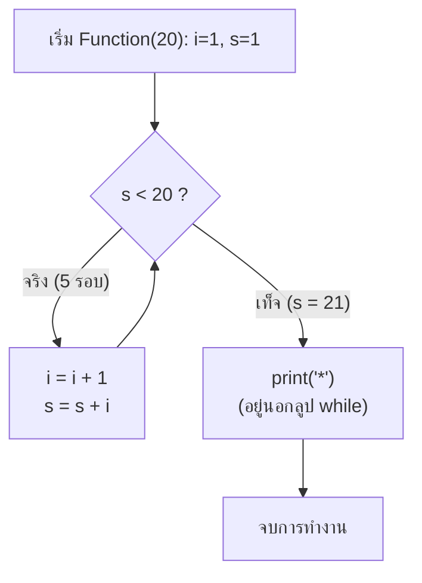

# 📝 12.6 - 0Exercises: แบบฝึกหัดในห้อง, เช็คชื่อ & กับดัก Indentation

> [!NOTE]
> **ข้อมูลรายวิชาและกิจกรรมในห้องเรียน**:
> - **วิชา**: 060243106 Data Structures and Algorithms
> - **อาจารย์ผู้สอน**: นายประดิษฐ์ พิทักษ์เสถียรกุล
> - **กิจกรรม**: งานเช็คชื่อเข้าเรียน (25 มิ.ย.) และแบบฝึกหัดทบทวนพื้นฐาน (0Exercises)
> - **ไฟล์ต้นฉบับในโปรเจกต์**: โฟลเดอร์ [`Lectures/0Exercises/`](file:///C:/Project/python-data-structures-and-algorithms/Lectures/0Exercises/), รูปภาพโจทย์ [`Note Exercises 00.png`](file:///C:/Project/python-data-structures-and-algorithms/Lectures/0Exercises/Note%20Exercises%2000.png), ลายมือตรวจและเฉลยอาจารย์ [`Screenshot 2026-02-15 170858.png`](file:///C:/Project/python-data-structures-and-algorithms/Lectures/Screenshot%202026-02-15%20170858.png), [`Screenshot 2026-02-15 170939.png`](file:///C:/Project/python-data-structures-and-algorithms/Lectures/Screenshot%202026-02-15%20170939.png)

---

## 🎯 สรุปโจทย์คำถามและเฉลยคำตอบสำหรับส่งอาจารย์ (Official Exam Q&A Solutions Sheet)

> [!IMPORTANT]
> **สรุปคำถามและการตอบสำหรับแบบฝึกหัด 0Exercises (เช็คชื่อ 25 มิ.ย.)**:
> 
> | ลำดับ | คำถามในโจทย์ 0Exercises | คำตอบที่ถูกต้องสำหรับเขียนส่ง (Official Answer) | คำเตือนจุดที่ได้ 0 คะแนน |
> | :---: | :---| :---| :---|
> | **ข้อ 1** | ในฟังก์ชัน `function(n)` ถ้าคำสั่ง `print("*")` เยื้องอยู่ในลูป `j` จะพิมพ์ดาวกี่ดวงเมื่อ $n=5$? Big-O คืออะไร? | **พิมพ์ดาวทั้งหมด 25 ดวง** ($5 \times 5 = 25$) ความซับซ้อนคือ **$O(N^2)$** | เกิดจากข้อผิดพลาด Indentation กด Tab เกิน 1 ครั้ง |
> | **ข้อ 2** | ถ้าแก้ให้ `print("*")` เยื้องออกมานอกลูป `j` จะพิมพ์ดาวกี่ดวงเมื่อ $n=5$? Big-O คืออะไร? | **พิมพ์ดาวเพียง 5 ดวง** เท่านั้น (พิมพ์เพียงรอบละ 1 ดวงตอนจบลูป $j$) ความซับซ้อนกลายเป็น **$O(N)$** | การเยื้องโค้ดเปลี่ยนความเร็วจาก $O(N^2)$ เป็น $O(N)$ ทันที |

---

## 🎯 1. กิจกรรมเช็คชื่อเข้าเรียน (25 มิ.ย.): กับดัก Indentation ของฟังก์ชัน Python

### 1.1 ตัวโจทย์จากอาจารย์ (`Note Exercises 00.png`)
> *"ให้ตอบคำถาม 2 คำถาม ในกระดาษ แล้วถ่ายรูปส่งในงาน ไม่มีคะแนน"*
>
> ```python
> def Function(n):
>     i = s = 1
>     while s < n:
>         i = i + 1
>         s = s + i
>     print("*")
> 
> Function(20)
> 
> # 1. What's the result of this program?
> # 2. How many times the command "print" running?
> ```

---

## 🔍 2. การวิเคราะห์เชิงลึก: ทำไมนักศึกษาส่วนใหญ่ถึงตอบผิด?

### 2.1 Trace การวนซ้ำของตัวแปร $s$ และ $i$
เมื่อเรียก `Function(20)` ค่าเริ่มต้น $i = 1, s = 1$:
- **รอบที่ 1**: $s = 1 < 20 \implies i = 1 + 1 = 2, \quad s = 1 + 2 = 3$
- **รอบที่ 2**: $s = 3 < 20 \implies i = 2 + 1 = 3, \quad s = 3 + 3 = 6$
- **รอบที่ 3**: $s = 6 < 20 \implies i = 3 + 1 = 4, \quad s = 6 + 4 = 10$
- **รอบที่ 4**: $s = 10 < 20 \implies i = 4 + 1 = 5, \quad s = 10 + 5 = 15$
- **รอบที่ 5**: $s = 15 < 20 \implies i = 5 + 1 = 6, \quad s = 15 + 6 = 21$
- **รอบที่ 6**: $s = 21 \not< 20 \implies$ **หลุดออกจากลูป while**



### 2.2 🚨 กับดักเรื่องการย่อหน้า (Indentation Trap)
- **สิ่งที่นักศึกษาคิด (ผิด)**: มองว่า `print("*")` อยู่ในลูป `while` จึงตอบว่าพิมพ์ `*` ทั้งหมด 5 ตัว และคำสั่ง `print` ทำงาน 5 ครั้ง
- **ความเป็นจริงในโค้ด (ถูกต้อง)**:
  บรรทัด `print("*")` ตรงแนวกับคำสั่ง `while` (ไม่ได้เยื้องเข้าไปใต้ `while`) หมายความว่า `print` **อยู่นอกลูป** และจะทำงานเพียง **ครั้งเดียว** หลังลูปทำงานเสร็จสิ้น!

### 2.3 เฉลยที่ถูกต้องตามเกณฑ์ของอาจารย์ (`Screenshot 2026-02-15 170939.png`)
> 1. **What's the result of this program?**  
>    👉 **Print 1 asterisk (`*`)**
>
> 2. **How many times the command "print" running?**  
>    👉 **The command Print works only once (1 time)**

---

## ⚡ 3. สรุป Special Cases ของ Stacks และ Queues (`Note Exercises 001 & 002.png`)

ในการเขียนคลาส Stack และ Queue อัลกอริทึมต้องมีฟังก์ชันดักจับสถานการณ์สุดโต่ง (Boundary Conditions) เสมอ:

### 3.1 Special Cases ของ Stack
```python
# 1. Stack is full, when push
def push(self, item):
    if self.size() >= self.limit:
        print("Stack Overflow, Cannot push", item)
    else:
        self.items.append(item)

# 2. Stack is empty, when pop or top
def pop(self):
    if self.is_empty():
        print("Stack Underflow")
    else:
        return self.items.pop()
```

### 3.2 Special Cases ของ Queue
```python
# 1. Queue is full, when enqueue
def enqueue(self, item):
    if self.size >= self.limit:
        print("Queue Overflow, Cannot enqueue", item)
    else:
        self.item.append(item)
        self.rear += 1
        self.size += 1

# 2. Queue is empty, when dequeue
def dequeue(self):
    if self.isempty():
        print("Queue Underflow")
    else:
        item = self.item.pop(0)
        self.rear -= 1
        self.size -= 1
        return item
```

---

## 📣 4. สารและคำแนะนำจาก อ.ประดิษฐ์ สู่การเตรียมสอบ Midterm & Final

จากประกาศห้องเรียนของอาจารย์ (ดูรูปใน `Lectures/Screenshot 2026-02-15 170858.png` และ `New-Lectures/Mid/exam.txt`):

> [!TIP]
> ### 💡 กฎเหล็ก 4 ข้อในการเรียนและการสอบวิชา DSA:
> 1. **อย่าคิดไปเอง ต้องลงมือพิมพ์โค้ดจริงใน Python**: ไวยากรณ์ใน Python มีความเคร่งครัดเรื่อง Indentation และ Class Methods นักศึกษาต้องทดลองรันโค้ดจริงก่อนส่ง ไม่จินตนาการเอาเอง
> 2. **เตรียมอุปกรณ์ให้พร้อม**: ในห้องสอบ อาจารย์อนุญาตให้วาด Tree ด้วยดินสอได้ แต่การเขียนบรรยายและโค้ดต้องใช้ปากกา
> 3. **เงื่อนไขข้อสอบกลางภาค (Midterm Exam Guidelines)**:
>    - คะแนนเต็ม 70 คะแนน หาร 2 เหลือ **35 คะแนน**
>    - **Open Book**: เปิดตำราและเอกสารได้
>    - คำถามเป็นภาษาอังกฤษ แต่อนุโลมให้ตอบเป็นภาษาไทยหรือภาษาอังกฤษได้
> 4. **ข้อสอบ 6 แนวหลักที่อาจารย์การันตีออกสอบ**:
>    1. *Linked List*: เขียนคำสั่งใน `main program` สลับพอยน์เตอร์
>    2. *Stack*: เขียนคำสั่งใน `main program`
>    3. *Binary Search Tree*: เขียนสเต็ป Recursive `current_node` กับ `value` และเงื่อนไข `if..else`
>    4. *Expression Tree*: ตาราง Stack เปล่าให้เขียนเครื่องหมายเข้าออก Stack ทีละตัว
>    5. *ทฤษฎีหลักการโครงสร้างข้อมูล*
>    6. *Python Output Tracing*: ให้โค้ดภาษา Python มา 1 ข้อ แล้วถามผลลัพธ์การทำงาน (เหมือนโจทย์เช็คชื่อข้อนี้!)
