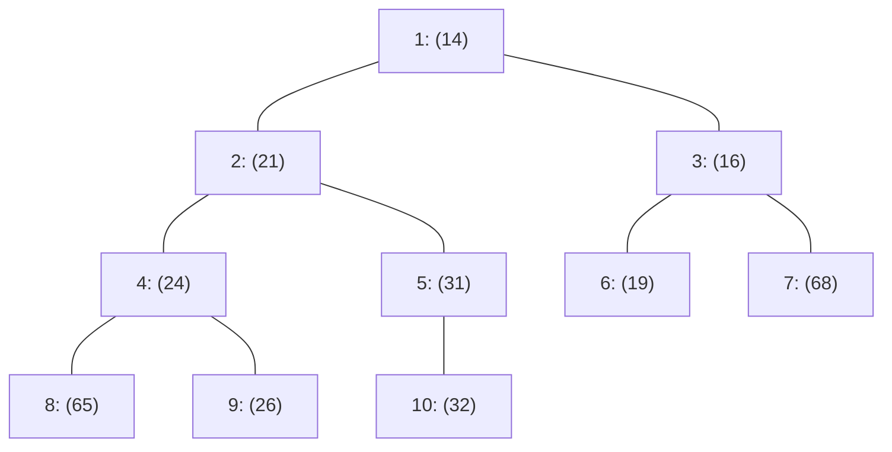

# 📋 12.7 - งานในห้องเรียนสด: Binary Heap DeleteMin (หน้า 283) & Hashing Collision Trace

> [!INFO]
> **ข้อมูลงานที่สั่งในห้องเรียนสด (Live In-Class Assignments):**
> - **วิชา:** Data Structures and Algorithms (วท.บ. คอมพิวเตอร์)
> - **ผู้สั่งงาน:** ดร.ประดิษฐ์ พิทักษ์เสถียรกุล
> - **หลักฐานภาพถ่าย:** [Screenshot_20260826-122139.jpg](../Wiki/assets/dsa-pic/Screenshot_20260826-122139.jpg), [IMG_20260909_115634_445.jpg](../Wiki/assets/dsa-pic/IMG_20260909_115634_445.jpg), [IMG_20260909_115719_307.jpg](../Wiki/assets/dsa-pic/IMG_20260909_115719_307.jpg)
> - **ประเภทงาน:** งานมอบหมายเดี่ยวทำในคาบเรียนและส่งผ่านระบบ Google Classroom ตามเวลากำหนด (In-Class Attendance Tasks)

---

## 🔺 ตอนที่ 1: งานในห้องเรียนวันที่ 9 กันยายน 2569 (Binary Heap DeleteMin)


### 1.1 ข้อกำหนดและเงื่อนไขการส่งงาน
- **แหล่งที่มาของโจทย์:** หนังสือ *Data Structures and Algorithm Analysis* (Mark Allen Weiss) **หน้าที่ 283 ข้อ 6.2(a) และ 6.3**
- **เวลาสั่งงาน:** 9 กันยายน 2569 เวลา 11:56 น.
- **กำหนดส่ง:** **ก่อนเที่ยงตรง (12:00 น.) ของวันเดียวกัน** (มีเวลาทำประมาณ 15-20 นาที)
- **สิ่งที่ต้องส่ง:** 
  1. รูปวาดโครงสร้าง **Complete Binary Tree** หลังการทำงาน
  2. ตัวเลขที่กรอกลงในช่องตาราง **1D Array** (เริ่มดัชนี 1 ช่อง 0 เว้นว่าง)

---

### 1.2 โจทย์ที่อาจารย์กำหนด
ให้อาร์เรย์เริ่มต้นของ Binary Min-Heap ที่ผ่านการแทรก $x=14$ มาแล้ว มีสมาชิกทั้งหมด 11 ตัว:
```
Index:  [ 0 ]  [ 1 ]  [ 2 ]  [ 3 ]  [ 4 ]  [ 5 ]  [ 6 ]  [ 7 ]  [ 8 ]  [ 9 ]  [ 10 ]  [ 11 ]
Value:    -     13     14     16     24     21     19     68     65     26     32      31
```
**คำสั่ง:** จงแสดงขั้นตอนการทำ `deleteMin()` จำนวน **1 ครั้ง** โดยแสดงการทำงานของตัวแปร `hole`, `temp`, การเลือกลูกตัวที่น้อยกว่า และผลลัพธ์สุดท้ายทั้งในรูป Tree และ Array

---

### 1.3 เฉลยขั้นตอนวิธีทำอย่างละเอียด (Step-by-step Solution)


#### ขั้นตอนที่ 1: เตรียมการลบ
1. ดึงข้อมูลที่น้อยที่สุดออกจากโหนดราก:
   $$\text{min\_item} = \text{array}[1] = 13$$
2. เก็บค่าของโหนดสุดท้ายไว้ในตัวแปรชั่วคราว:
   $$\text{temp} = \text{array}[11] = 31$$
3. ยุบขนาดของ Heap ลง 1 โหนด:
   $$\text{current\_size} = 11 - 1 = 10 \quad (\text{ช่องที่ 11 ถูกตัดทิ้ง})$$
4. เริ่มต้นตำแหน่งหลุมว่างที่โหนดราก:
   $$\text{hole} = 1$$

#### ขั้นตอนที่ 2: ดำเนินการ Percolate Down (ลอยตัวลง)
- **รอบที่ 1 ($\text{hole} = 1$):**
  - ลูกซ้ายคือดัชนี $2 \times 1 = 2$ (ค่า 14), ลูกขวาคือดัชนี 3 (ค่า 16)
  - เปรียบเทียบลูก: $14 < 16 \rightarrow$ เลือกลูกซ้าย ($\text{child} = 2$)
  - เปรียบเทียบกับ `temp`: $14 < 31$ (จริง)
  - เลื่อนค่า 14 ขึ้นมาแทนที่ราก: $\text{array}[1] = 14$
  - เลื่อนหลุมลงไปที่: $\text{hole} = 2$
- **รอบที่ 2 ($\text{hole} = 2$):**
  - ลูกซ้ายคือดัชนี $2 \times 2 = 4$ (ค่า 24), ลูกขวาคือดัชนี 5 (ค่า 21)
  - เปรียบเทียบลูก: $21 < 24 \rightarrow$ เลือกลูกขวา ($\text{child} = 5$)
  - เปรียบเทียบกับ `temp`: $21 < 31$ (จริง)
  - เลื่อนค่า 21 ขึ้นมาแทนที่หลุม: $\text{array}[2] = 21$
  - เลื่อนหลุมลงไปที่: $\text{hole} = 5$
- **รอบที่ 3 ($\text{hole} = 5$):**
  - ลูกซ้ายคือดัชนี $2 \times 5 = 10$ (ค่า 32)
  - เนื่องจาก $\text{child} == \text{current\_size}$ จึงไม่มีลูกขวา
  - เปรียบเทียบกับ `temp`: $32 < 31$ (**เท็จ!**)
  - หลุดออกจากลูปทันที!

#### ขั้นตอนที่ 3: วาง `temp` ลงในหลุม
$$\text{array}[\text{hole}] = \text{temp} \implies \mathbf{\text{array}[5] = 31}$$

---

### 1.4 ผลลัพธ์สุดท้ายสำหรับกรอกส่งงาน

#### 1. ตาราง Array 1 มิติ:
```
Index:  [ 0 ]  [ 1 ]  [ 2 ]  [ 3 ]  [ 4 ]  [ 5 ]  [ 6 ]  [ 7 ]  [ 8 ]  [ 9 ]  [ 10 ]
Value:    -     14     21     16     24     31     19     68     65     26     32
```

#### 2. ผังโครงสร้าง Complete Binary Tree:


---

## 🔑 ตอนที่ 2: งานในห้องเรียนวันที่ 26 สิงหาคม 2569 (Hashing Collision Trace)


### 2.1 ข้อกำหนดโจทย์
- **ขนาดตารางเริ่มต้น:** $\text{Table\_Size} = 10$ (ดัชนี 0 ถึง 9)
- **ชุดข้อมูล (Keys):** `89, 18, 49, 58, 69`
- **ฟังก์ชันแฮช:** $\text{hash}(x) = x \bmod 10$
- **วิธีแก้การชน:** Linear Probing โดยสูตร $h_i(x) = (\text{hash}(x) + i) \bmod 10$
- **คำสั่ง:** จงแสดงการคำนวณตำแหน่งและนับจำนวนครั้งที่เกิด Collision ของข้อมูลแต่ละตัว พร้อมตารางสถานะสุดท้าย

---

### 2.2 เฉลยการคำนวณทีละตัว

1. **แทรก 89:**
   - $\text{hash}(89) = 89 \bmod 10 = 9$ (ช่อง 9 ว่าง) $\rightarrow$ **ลงช่อง 9** (ชน 0 ครั้ง)
2. **แทรก 18:**
   - $\text{hash}(18) = 18 \bmod 10 = 8$ (ช่อง 8 ว่าง) $\rightarrow$ **ลงช่อง 8** (ชน 0 ครั้ง)
3. **แทรก 49:**
   - $\text{hash}(49) = 49 \bmod 10 = 9$ (ชนกับ 89! ครั้งที่ 1)
   - $i=1: (9 + 1) \bmod 10 = 0$ (ช่อง 0 ว่าง - Wrap Around) $\rightarrow$ **ลงช่อง 0** (ชน 1 ครั้ง)
4. **แทรก 58:**
   - $\text{hash}(58) = 58 \bmod 10 = 8$ (ชนกับ 18! ครั้งที่ 1)
   - $i=1: (8 + 1) \bmod 10 = 9$ (ชนกับ 89! ครั้งที่ 2)
   - $i=2: (8 + 2) \bmod 10 = 0$ (ชนกับ 49! ครั้งที่ 3)
   - $i=3: (8 + 3) \bmod 10 = 1$ (ช่อง 1 ว่าง) $\rightarrow$ **ลงช่อง 1** (ชน 3 ครั้ง)
5. **แทรก 69:**
   - $\text{hash}(69) = 69 \bmod 10 = 9$ (ชนกับ 89! ครั้งที่ 1)
   - $i=1: (9 + 1) \bmod 10 = 0$ (ชนกับ 49! ครั้งที่ 2)
   - $i=2: (9 + 2) \bmod 10 = 1$ (ชนกับ 58! ครั้งที่ 3)
   - $i=3: (9 + 3) \bmod 10 = 2$ (ช่อง 2 ว่าง) $\rightarrow$ **ลงช่อง 2** (ชน 3 ครั้ง)

### 2.3 ตารางสรุปผลลัพธ์และจำนวนครั้งที่เกิดการชน

| ข้อมูลที่ใส่ (Key) | ช่องที่ต้องการลง ($\text{hash}(x)$) | ช่องที่ได้ลงจริง | จำนวนครั้งที่ชน (Collisions) | ลำดับช่องที่ตรวจสอบก่อนลงได้ |
| :---: | :---: | :---: | :---: | :--- |
| **89** | 9 | **9** | 0 | 9 |
| **18** | 8 | **8** | 0 | 8 |
| **49** | 9 | **0** | **1** | 9 $\rightarrow$ 0 |
| **58** | 8 | **1** | **3** | 8 $\rightarrow$ 9 $\rightarrow$ 0 $\rightarrow$ 1 |
| **69** | 9 | **2** | **3** | 9 $\rightarrow$ 0 $\rightarrow$ 1 $\rightarrow$ 2 |
| **รวมทั้งสิ้น** | - | - | **7 ครั้ง** | *(คำเตือนอาจารย์: อย่าตอบ 14 ครั้ง)* |

#### ตารางแฮชสถานะสุดท้าย (Size = 10):
```
Index:  [ 0 ]   [ 1 ]   [ 2 ]   [ 3 ]   [ 4 ]   [ 5 ]   [ 6 ]   [ 7 ]   [ 8 ]   [ 9 ]
Value:   49      58      69       -       -       -       -       -      18      89
```

---

## ⚠️ สรุปจุดตัดคะแนนและกับดักที่ได้ 0 คะแนน (Zero Score Traps)
1. **งาน Binary Heap (9-9-69):**
   - ใส่ข้อมูลลงในช่อง Index 0 $\rightarrow$ **ได้ 0 คะแนนทันที** (ช่อง 0 ต้องเว้นว่าง)
   - เขียนเมธอดเรียกใช้มีอาร์กิวเมนต์ เช่น `myHeap.deleteMin(13)` $\rightarrow$ **ผิดหลักการ ADT ได้ 0 คะแนน**
   - ยุบขนาด Heap ผิด โดยตัดโหนดซ้ายแทนที่จะตัดโหนดขวาสุด $\rightarrow$ **ผิดกฎ Structure Property**
2. **งาน Hashing (26-8-69):**
   - ตอบว่า 58 ลงช่อง 6 เพราะคิดสูตรผิด $\rightarrow$ **ได้ 0 คะแนน** (58 ต้องลงช่อง 1)
   - ตอบผลรวมการชนเท่ากับ 14 ครั้ง โดยนับซ้ำช่องเดิมสองเท่า $\rightarrow$ **อาจารย์ตัดคะแนน** (คำตอบที่ถูกต้องคือ 7 ครั้ง)
