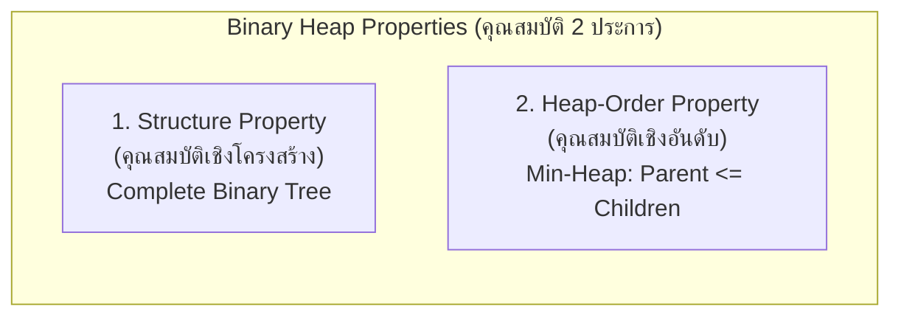

# ⚡ 14.2 - ถอดความบรรยายสด: บทที่ 8 Priority Queue & คุณสมบัติของ Binary Heap

> [!INFO]
> **ข้อมูลการบรรยายสดในห้องเรียน:**
> - **วิชา:** Data Structures and Algorithms (วท.บ. คอมพิวเตอร์)
> - **ผู้บรรยาย:** อาจารย์ประจำวิชา (ดร.ประดิษฐ์ พิทักษ์เสถียรกุล)
> - **ไฟล์เสียงต้นฉบับ:** `20260902_110748.aac`, `20260902_111515.aac`, `20260902_112213.aac` (จัดเก็บใน `C:\Project\Voice\Success\`)
> - **ไฟล์ข้อความถอดเสียงฉบับเต็ม:** `Transcripts/20260902_110748.txt`, `Transcripts/20260902_111515.txt`, `Transcripts/20260902_112213.txt`
> - **ภาพสไลด์และกระดานดำ:** ภาพจาก `Wiki/assets/dsa-pic/` (คาบเรียน 2 ก.ย. 2569 เวลา 11:07 - 11:26 น.)

---

## 🎮 Interactive Heap Studio (ทดลองรันสดในเว็บ)
ทดลองแทรกข้อมูลและสังเกตการลอยตัวขึ้น (Percolate Up) หรือการลอยตัวลง (Percolate Down) ได้ทันทีผ่านเครื่องมือจำลองในเว็บ:

<!-- dsa-studio: heap -->

---

## 🏛️ 1. บทนำสู่วิชาและนิยามของ "คิวลำดับความสำคัญ" (Queue vs Priority Queue)


### คำถอดความจากเสียงบรรยายสด (`20260902_110748.aac`):
> *"เปิดอยู่ใน Google Classroom แล้วนะครับ Priority Queue Lecture Note บทที่ 8...  
> บทที่ 8 Priority Queue นะครับ ภาษาอังกฤษเรียกสั้นๆ ว่า PQ...  
> ก่อนที่จะอธิบายภาษาอังกฤษ อธิบายภาษาไทยก่อน... คิว คืออะไร  
> คิว ภาษาอังกฤษเขียนว่า Q-U-E-U-E อย่างนี้นะครับ มี U-E สองที... ส่วนใหญ่ก็เรียกทับศัพท์ว่า คิว  
> คำว่าคิว ภาษาไทยแปลว่า **'แถวคอย'** เปิดพจนานุกรม Dictionary ก็แปลว่า คิว คือ แถวคอย  
> แล้วแถวอะไร คอยอะไร... หลักการของคิวก็คือ จะมีผู้ให้บริการและผู้มาขอใช้บริการ เช่น ร้านข้าวในโรงอาหาร... ผู้ให้บริการมีน้อย ผู้มาขอใช้บริการเยอะ ก็ต้องเข้าแถวรอคอยการให้บริการ... ใครมาก่อนก็ได้รับบริการก่อน ใครมาทีหลังก็ต้องไปต่อท้ายแถว ตามหลักการ FIFO ที่เราเรียนในบทที่ 3...  
> **แต่ มันมีคิวอยู่ประเภทหนึ่ง ที่เรากำลังจะเรียนในบทที่ 8 นี้ครับ: Priority Queue**  
> Priority แปลเป็นไทยว่า **มีสิทธิพิเศษอะไรบางอย่าง เช่น มาทีหลัง แต่ไม่ต้องไปต่อท้ายแถว แซงคิวได้!**  
> ยกตัวอย่างเช่น นักศึกษาเข้าแถวรอซื้อข้าว คณบดีเดินมา... 'อ้าว เชิญท่านคณบดีก่อนเลยครับ' แซงคิวได้... เขาเรียก Priority มีสิทธิพิเศษหรือเงื่อนไขอะไรบางอย่าง แซงคิวได้ ทำให้ไม่เป็นไปตามหลักการคิวปกติแล้ว..."*

---

## 🏢 2. ตัวอย่างในชีวิตจริงและในระบบปฏิบัติการคอมพิวเตอร์

### คำถอดความจากเสียงบรรยายสด (`20260902_111515.aac`):
> *"ตัวอย่างในชีวิตประจำวัน เช่น ร้านถ่ายเอกสาร...  
> ปกติไปถ่ายเอกสารที่ร้านถ่ายเอกสาร มาก่อนถ่ายก่อน มาทีหลังก็ต้องรอคอย ปรากฏว่านักศึกษาจะไปถ่ายบัตรประชาชนใบเดียว จะไปแนบคำร้อง ถ่ายแป๊บเดียวไม่ถึงนาที แต่คนข้างหน้าเอาหนังสือ Text Book มาถ่าย 700 หน้า... เจ๊บอกว่าถ้าตามคิวก็อีก 2 วัน คุณจะรอไหมล่ะ... เจ๊ก็แซงคิวให้คุณ ถ่ายบัตรประชาชนใบเดียวก่อน...  
> **ในระบบคอมพิวเตอร์และระบบปฏิบัติการ (Operating Systems):**  
> ในระบบปฏิบัติการคอมพิวเตอร์ก็เหมือนกัน งานอะไรที่ใช้เวลาน้อย เช่น การคลิกเมาส์ การกดคีย์บอร์ด หรือสัญญาณ Interrupt ระบบจะลัดคิวทำให้เราก่อน ไม่ให้เครื่องค้าง... ถ้า CPU ต้องรอรันโปรแกรมใหญ่ที่ทำงาน 3 ชั่วโมงก่อนตอบสนองการคลิกเมาส์ ผู้ใช้ก็จะคิดว่าคอมแฮงก์... นี่คือแนวคิดของ Priority Queue ในระบบ Scheduling..."*

### 2 โอเปอเรชันหลักของ Priority Queue ADT:
1. **`insert(x)`**: การแทรกข้อมูลเข้าคิว (เทียบเท่ากับ `enqueue` ในคิวปกติ แต่ข้อมูลจะถูกจัดเรียงตามลำดับความสำคัญ)
2. **`deleteMin()`**: การนำข้อมูลที่มีค่าน้อยที่สุด (สำคัญที่สุด) ออกจากคิว (เทียบเท่ากับ `dequeue` แต่จะคัดเลือก Root ออกเสมอ)

---

## ⛰️ 3. ที่มาของคำว่า "Heap" (รูปทรงกองดินกองทราย)

### คำบรรยายของอาจารย์:
> *"ทำไมฝรั่งถึงเรียกโครงสร้างนี้ว่า **Heap**...  
> คำว่า 'Heap' (H-E-A-P) เปิด Dictionary แปลว่า **'กองดิน กองทราย'**...  
> เวลาสิบล้อเทดินเททรายลงมาที่พื้น มันจะไหลลงมากองเป็นทรงสามเหลี่ยมเหมือน **'พีระมิด'**...  
> ข้างล่างจะกว้าง แผ่ออกไป... ข้างบนจะแคบเข้าหายอดแหลมเพียงจุดเดียว...  
> ซึ่งรูปทรงสามเหลี่ยมพีระมิดนี้ ตรงกับโครงสร้างข้อมูลต้นไม้ชนิดนี้พอดี! ยอดแหลมคือโหนด Root เพียงโหนดเดียว ส่วนฐานล่างสุดคือกิ่งก้านสาขาและโหนดใบที่แผ่ขยายออกไป... ฝรั่งจึงตั้งชื่อโครงสร้างข้อมูลนี้ว่า **Heap**...  
> ชนิดที่เราเรียนและนำมาใช้ทำ Priority Queue ในวิชานี้เรียกว่า **Binary Heap (ฮีปทวิภาค)**"*

```
           [ Root: Min Item ]          <- ยอดพีระมิด (จุดเดียว)
               /        \
           [Node]      [Node]          <- ชั้นกลาง
           /    \      /    \
        [Leaf][Leaf] [Leaf][Leaf]      <- ฐานพีระมิด (แผ่กว้าง)
```

---

## ⚖️ 4. สองคุณสมบัติหลักของ Binary Heap (The Two Invariants)

Binary Heap จะต้องรักษาคุณสมบัติสำคัญ 2 ประการอยู่ตลอดเวลา:



---

### 4.1 คุณสมบัติที่ 1: Structure Property (Complete Binary Tree)


### คำถอดความจากเสียงบรรยายสด (`20260902_112213.aac`):
> *"Structure Property ของ Heap ระบุว่า: **Binary Heap ต้องเป็น Complete Binary Tree**  
> Complete Binary Tree แปลว่าอะไร...  
> จดนะครับ: **คือ Binary Tree ที่เต็มหมดทุกชั้น ยกเว้นชั้นล่างสุด ที่เต็มหรือไม่เต็มก็ได้!**  
> **กฎการใส่และการลบข้อมูล (สำคัญมาก ต้องจด!):**  
> - **เวลาใส่ข้อมูล:** เราจะใส่ที่ชั้นล่างสุด ไล่จาก **'ซ้ายไปหาขวา'**  
> - **เวลาลบข้อมูล:** เราจะลบที่ชั้นล่างสุด ไล่จาก **'ขวาไปหาซ้าย'**  
> นี่คือหลักการสำคัญเลยนะครับ ท่านต้องจดนะครับ..."*

#### กฎเหล็ก Structure Property:
1. ทุกระดับความลึกตั้งแต่ Level $0, 1, 2, \dots, H-1$ ต้องมีโหนดบรรจุ **เต็มทุกตำแหน่ง ($2^{\text{level}}$ โหนด)**
2. ระดับชั้นล่างสุด (Level $H$) อาจจะเต็มหรือไม่เต็มก็ได้
3. หากชั้นล่างสุดไม่เต็ม **โหนดทั้งหมดจะต้องเรียงชิดซ้ายติดต่อกัน (Left to Right)** ห้ามมีช่องว่างกระโดดข้ามเด็ดขาด

---

### 4.2 คุณสมบัติที่ 2: Heap-Order Property (Min-Heap)


### กฎเกณฑ์ Heap-Order Property:
- สำหรับทุกโหนด $X$ ใน Binary Tree (ยกเว้นโหนดราก):
  $$\text{Key}(\text{Parent}(X)) \le \text{Key}(X)$$
- **ความหมาย:** ค่าของพ่อแม่ (Parent) จะต้องมีค่าน้อยกว่าหรือเท่ากับค่าของลูกๆ (Children) เสมอ
- **ผลลัพธ์สำคัญยิ่ง:** โหนดที่มีค่าน้อยที่สุดในระบบ จะอยู่ที่ **Root Node (โหนดราก)** เสมอ ทำให้ `findMin()` ทำงานได้เร็วระดับ $O(1)$!

#### ตัวอย่างการตรวจข้อสอบ (Valid vs Invalid Heap):
พิจารณาภาพสไลด์ [IMG_20260902_113121_541@-1402929343.jpg](assets/dsa-pic/IMG_20260902_113121_541@-1402929343.jpg) ที่อาจารย์นำมาเปรียบเทียบในห้อง:
- **ภาพซ้าย:** ทุกโหนดพ่อแม่มีค่าน้อยกว่าลูก ($13 \le 21, 13 \le 16, 21 \le 24, 21 \le 31$) $\rightarrow$ **เป็น Binary Min-Heap ที่ถูกต้อง**
- **ภาพขวา:** โหนดพ่อแม่มีค่า **21** แต่มีลูกซ้ายค่า **6** ซึ่ง $21 > 6$ (ผิดกฎ Heap-Order) $\rightarrow$ **ไม่เป็น Binary Heap (Invalid Heap)**

---

## 📊 5. สรุปเปรียบเทียบ FIFO Queue vs Priority Queue

| คุณสมบัติ (Feature) | Standard FIFO Queue | Priority Queue (Min-Heap) |
| :--- | :--- | :--- |
| **หลักการบริการ** | First-In, First-Out (มาก่อนได้ก่อน) | Priority Order (ค่าน้อยได้สิทธิบริการก่อน) |
| **การแทรกข้อมูล** | `enqueue(x)` ต่อท้ายแถว ($O(1)$) | `insert(x)` แทรกแล้วลอยตัวขึ้นสู่ผิวน้ำ ($O(\log N)$) |
| **การนำข้อมูลออก** | `dequeue()` ดึงหัวแถว ($O(1)$) | `deleteMin()` ดึงโหนดรากค่าน้อยสุด ($O(\log N)$) |
| **การดูข้อมูลหัวแถว** | `front()` / `peek()` ($O(1)$) | `findMin()` ดู Root Node ($O(1)$) |
| **โครงสร้างเบื้องหลัง** | Circular Array หรือ Singly Linked List | Complete Binary Tree บน 1D Array |

---

## 🎯 ประเด็นออกสอบและสรุปหัวใจสำคัญ (Key Exam Points)
1. **ความหมาย PQ:** คิวสิทธิพิเศษ แซงคิวได้ตามเงื่อนไข (Priority)
2. **ที่มาของชื่อ Heap:** ทรงกองดินกองทราย/พีระมิด ยอดแหลมมีโหนดเดียว ฐานแผ่กว้าง
3. **Complete Binary Tree:** เต็มทุกชั้น ยกเว้นชั้นล่างสุดที่ต้องเรียงชิดซ้าย
4. **ทิศทางการกระทำ:**
   - **เวลา Insert:** เติมที่ชั้นล่างสุดจาก **ซ้าย $\rightarrow$ ขวา**
   - **เวลา Delete:** ตัดโหนดที่ชั้นล่างสุดจาก **ขวา $\rightarrow$ ซ้าย**
5. **Heap-Order:** ค่าของ Parent ต้องน้อยกว่าหรือเท่ากับลูกเสมอ ($Parent \le Children$)
