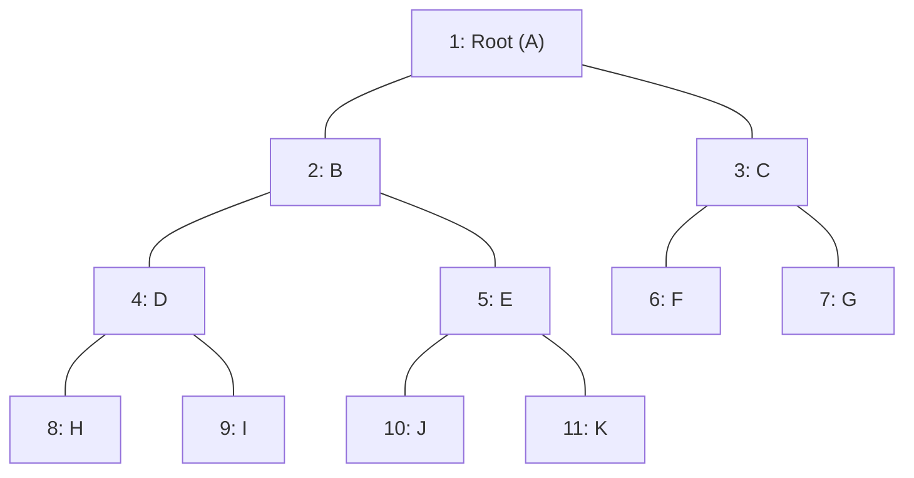

# 🎯 14.3 - เจาะลึกข้อสอบสด: คำนวณจำนวนโหนด Complete Binary Tree & แปลงเป็น 1D Array

> [!INFO]
> **ข้อมูลการบรรยายสดในห้องเรียน:**
> - **วิชา:** Data Structures and Algorithms (วท.บ. คอมพิวเตอร์)
> - **ผู้บรรยาย:** อาจารย์ประจำวิชา (ดร.ประดิษฐ์ พิทักษ์เสถียรกุล)
> - **ไฟล์เสียงต้นฉบับ:** `20260902_112628.aac`, `20260902_113741.aac`, `dsa20260909_092220.aac` (จัดเก็บใน `C:\Project\Voice\Success\`)
> - **ไฟล์ข้อความถอดเสียงฉบับเต็ม:** `Transcripts/20260902_112628.txt`, `Transcripts/20260902_113741.txt`, `Transcripts/dsa20260909_092220.txt`
> - **ภาพสไลด์และกระดานดำ:** ภาพจาก `Wiki/assets/dsa-pic/` (คาบเรียน 2 ก.ย. และ 7 ก.ย. 2569)

---

## 🏛️ 1. เจาะลึกข้อสอบข้อที่ 2: สูตรคำนวณช่วงจำนวนโหนดของ Complete Binary Tree


### คำถอดความจากเสียงบรรยายสดของอาจารย์ (`20260902_112628.aac`):
> *"คุณสมบัติที่สำคัญและก็ **ออกสอบเสมอเลยครับ!**  
> Heap ที่ความสูงเท่ากับ H จะมีจำนวนโหนด (Number of nodes) อยู่ระหว่าง...  
> $$2^H \quad \text{ถึง} \quad 2^{H+1} - 1 \text{ โหนด}$$  
> อ่านสูตรไม่รู้เรื่อง ผมจะคำนวณให้คุณดู...  
> ถ้า $H = 1$ จำนวนโหนดอย่างน้อยคือ $2^H = 2^1 = 2$ โหนด... อย่างมาก $2^{1+1} - 1 = 4 - 1 = 3$ โหนด แปลว่าจะมีจำนวนโหนดอย่างมากไม่เกิน 3 โหนด...  
> ถ้า $H = 2$ จำนวนโหนดอย่างน้อยคือ $2^2 = 4$ โหนด... อย่างมาก $2^{2+1} - 1 = 8 - 1 = 7$ โหนด...  
>  
> **แล้วเวลาออกสอบเป็นยังไง อ่า โจทก์มาเลยครับ เวลาสอบนะครับ ทรงนี้นะครับ:**  
> **'How many minimum number of nodes of complete binary tree at the height 10?'**  
> แปลเป็นไทยว่า จำนวนโหนดอย่างน้อยของ Complete Binary Tree ที่ความสูงเท่ากับ 10 ใช่ไหมครับ ไฮอะ...  
> ใครจะมาถามคุณนิดๆ หน่อยๆ เขาถามคุณเยอะๆ เลย!  
> นิสิตจะมานั่งวาดรูปไหมครับ ไม่ไหวหรอก ตายแน่!  
> ก็ใส่สูตรเลย!  
> **จำนวนโหนดอย่างน้อย ความสูงเท่ากับ 10 ก็คือ:**  
> $$2^H = 2^{10} = \mathbf{1,024 \text{ โหนด}}$$  
> ง่ายไหมครับ ไม่ถึงนาที คนที่ไม่รู้ไปวาดรูป ตาย นับก็นับไม่ถูก... 1,024 โหนด..."*

---

## ⚠️ 2. คำเตือนระดับข้อสอบปริญญาโท: ห้ามตอบติดเลขยกกำลัง!


### คำเตือนเรื่องการตรวจข้อสอบจากอาจารย์:
> *"อย่าเดี๋ยวนิสิตจะบอกว่า ไม่เคยเห็นเลยนะโจทย์ภาษาอังกฤษยังไง นี่ไง เขียนให้ดูแล้ว และบอกด้วยว่าออกสอบ!  
> คราวนี้ถ้าไปทำข้อสอบไม่ได้ ก็ไม่จดอะ...  
> แล้วนอกจากนี้ ถ้าเทอมโน้นถามอย่างน้อย เทอมนี้อาจจะถาม **'อย่างมาก' (Maximum)**  
> ความสูงเท่ากับ 10:  
> $$2^{H+1} - 1 = 2^{10+1} - 1 = 2^{11} - 1 = 2048 - 1 = \mathbf{2,047 \text{ โหนด}}$$  
> **เวลาตอบ อย่าติดในรูปเลขยกกำลังนะครับ! คุณจะต้องตอบเป็นตัวเลขจำนวนเต็มของโหนด ถ้าตอบมาเป็นเลขยกกำลังอย่างนี้ ไม่ได้คะแนน!**  
> เพราะไอ้เลขยกกำลังสองยกกำลังอะไรมันคำนวณไม่ยากเลยนะนิสิต คุณเรียนสายไอทีเนี่ย ไอ้ $2^{10} = 1024, 2^{11} = 2048$ ลบหนึ่งก็เหลือ 2047 โหนด...  
> **แล้วคุณเชื่อไหมว่า ไอ้โจทย์ข้อนี้เนี่ย มันออกสอบถึงระดับปริญญาโทเลยนะ! ไปสอบเข้า IT ปริญญาโท เป็นคำถามข้อนึงเลยในข้อสอบ ถามงี้เลย!**"*

---

## 📐 3. การพิสูจน์สูตรทางคณิตศาสตร์ (Mathematical Proof)

กำหนดให้ $H$ แทนความสูงของต้นไม้ (โดยนิยามต้นไม้ที่มีโหนดรากเพียงโหนดเดียวมีความสูง $H = 0$):

### 3.1 พิสูจน์จำนวนโหนดอย่างน้อย ($\text{Min Nodes} = 2^H$)
จำนวนโหนดจะน้อยที่สุดได้เมื่อ:
1. ทุกชั้นตั้งแต่ Level $0$ ถึง Level $H-1$ มีโหนดเต็มทุกตำแหน่ง
2. ในชั้นล่างสุด (Level $H$) มีโหนดบรรจุอยู่เพียง **1 โหนดทางซ้ายสุด**
$$\text{Min Nodes} = \left( \sum_{k=0}^{H-1} 2^k \right) + 1$$
ผลรวมอนุกรมเรขาคณิต $\sum_{k=0}^{H-1} 2^k = 2^H - 1$ ดังนั้น:
$$\text{Min Nodes} = (2^H - 1) + 1 = \mathbf{2^H}$$

### 3.2 พิสูจน์จำนวนโหนดอย่างมาก ($\text{Max Nodes} = 2^{H+1} - 1$)
จำนวนโหนดจะมากที่สุดได้เมื่อทุกชั้นตั้งแต่ Level $0$ ถึง Level $H$ มีโหนดบรรจุเต็มทุกตำแหน่ง (เป็น Perfect Binary Tree):
$$\text{Max Nodes} = \sum_{k=0}^{H} 2^k = \mathbf{2^{H+1} - 1}$$

### ตารางสรุปค่าเปรียบเทียบในแต่ละระดับความสูง:

| ความสูง ($H$) | ความสูงของชั้น | จำนวนโหนดอย่างน้อย ($2^H$) | จำนวนโหนดอย่างมาก ($2^{H+1}-1$) | หมายเหตุข้อสอบ |
| :---: | :---: | :---: | :---: | :--- |
| **0** | รากโหนดเดียว | $2^0 = 1$ | $2^1 - 1 = 1$ | ทรีมีเฉพาะโหนด Root |
| **1** | 2 ชั้น | $2^1 = 2$ | $2^2 - 1 = 3$ | รากมีลูกซ้าย 1 ตัว |
| **2** | 3 ชั้น | $2^2 = 4$ | $2^3 - 1 = 7$ | |
| **3** | 4 ชั้น | $2^3 = 8$ | $2^4 - 1 = 15$ | |
| **4** | 5 ชั้น | $2^4 = 16$ | $2^5 - 1 = 31$ | |
| **10** | 11 ชั้น | $2^{10} = \mathbf{1,024}$ | $2^{11} - 1 = \mathbf{2,047}$ | **โจทย์ตรงข้อสอบปลายภาค & สอบเข้า ป.โท! ห้ามตอบเลขยกกำลัง** |

---

## 🗄️ 4. สถาปัตยกรรมการแปลง Complete Binary Tree เป็น Array 1 มิติ


### คำถอดความจากเสียงบรรยายสด (`20260902_113741.aac` และ `dsa20260909_092220.aac`):
> *"โครงสร้าง Complete Binary Tree มีความพิเศษตรงที่ มันสามารถเขียนแทนด้วย Array 1 มิติได้...  
> แปลงรูป Binary Tree ที่เป็น Tree อย่างนี้นะครับ แปลงมาเป็น Array ได้...  
> **ซึ่งโปรแกรมนะครับ แล้วก็ข้อสอบ ออกเป็น Array ทั้งนั้น!**  
> ข้อสอบออกเป็น Array นะครับ ในข้อเนี้ย ออกเป็นข้อใหญ่ ข้อที่ 2 เอ่อ... เป็น Array ครับ แต่คุณต้องแทนค่ามันออกมาเป็น Tree ก็ได้เอง...  
> **สูตร 3 สูตรที่ต้องท่อง:**  
> **เงื่อนไขสำคัญ: Root ต้องเริ่มที่ตำแหน่ง Index 1 (Index 0 เว้นว่างไว้เสมอ)**  
> 1. $\mathbf{\text{Left Child ของโหนด } i = 2i}$  
> 2. $\mathbf{\text{Right Child ของโหนด } i = 2i + 1}$  
> 3. $\mathbf{\text{Parent ของโหนด } i = \lfloor i / 2 \rfloor}$ (หรือ `i // 2` ในภาษา Python)  
>  
> ดูตัวอย่าง D-Dog นะครับ:  
> D-Dog อยู่ที่ Index 4...  
> ลูกซ้ายของ D-Dog คือ $2i = 2 \times 4 = 8$ (ตรงกับโหนด H)  
> ลูกขวาของ D-Dog คือ $2i + 1 = 2 \times 4 + 1 = 9$ (ตรงกับโหนด I)  
> พ่อแม่ (Parent) ของโหนด J ที่ตำแหน่ง 10:  
> $\text{Parent} = 10 / 2 = 5$ (ตรงกับโหนด E)  
> **ระวังตรงนี้ให้ดี:**  
> สมมุติหา Parent ของโหนดตำแหน่งที่ 7:  
> $7 / 2 = 3.5$ ไม่มีตำแหน่ง 3.5 **ให้ตัดเศษทิ้ง!** ได้ตำแหน่ง 3 คือโหนด C  
> **ไม่ใช่ปัดเศษขึ้นนะ! นี่คือวิธีที่หลายคนเข้าใจผิด 7 หาร 2 ได้ 3.5 ปัดเป็น 4 ผิดทันที! ต้องตัดเศษทิ้งเอาเลขจำนวนเต็มหน้าจุดทศนิยมมาใช้ คือตำแหน่งที่ 3** ในภาษา Python ใช้เครื่องหมาย double slash `//`"*

---

## 🌲 5. แผนผังความสัมพันธ์ 1D Array กับ Binary Tree

```
ดัชนี Array:  [ 0 ]   [ 1 ]   [ 2 ]   [ 3 ]   [ 4 ]   [ 5 ]   [ 6 ]   [ 7 ]   [ 8 ]   [ 9 ]  [ 10 ]  [ 11 ]
ข้อมูลโหนด:    -      Root      B       C       D       E       F       G       H       I       J       K
```



### การตรวจสอบด้วยสูตร:
- **หาลูกของโหนด B (ดัชนี 2):**
  - ลูกซ้าย: $2 \times 2 = \mathbf{4}$ (โหนด D)
  - ลูกขวา: $2 \times 2 + 1 = \mathbf{5}$ (โหนด E)
- **หาลูกของโหนด C (ดัชนี 3):**
  - ลูกซ้าย: $2 \times 3 = \mathbf{6}$ (โหนด F)
  - ลูกขวา: $2 \times 3 + 1 = \mathbf{7}$ (โหนด G)
- **หาพ่อแม่ของโหนด K (ดัชนี 11):**
  - $\text{Parent} = 11 // 2 = \mathbf{5}$ (โหนด E)
- **หาพ่อแม่ของโหนด G (ดัชนี 7):**
  - $\text{Parent} = 7 // 2 = \mathbf{3}$ (โหนด C) — *ตัดเศษทิ้ง ห้ามปัดขึ้นเป็น 4!*

---

## 🚫 ทำไมต้องเว้น Index 0 ไว้เสมอ? (The Critical Zero Trap)

> [!CAUTION]
> **กับดักช่องที่ 0 ที่ทำให้นิสิตได้ 0 คะแนน:**  
> หากเราใส่ Root Node ไว้ที่ดัชนี 0:
> - ลูกซ้าย: $2 \times 0 = 0$ (วนกลับมาที่ตัวเดิม!)
> - ลูกขวา: $2 \times 0 + 1 = 1$
> - พ่อแม่: $0 / 2 = 0$
> สูตรทางคณิตศาสตร์ทั้งหมดจะพังทลายทันที!  
> ดังนั้น **ในภาษา Python จึงต้องสร้าง Array ขนาด `capacity + 1` และเว้นช่อง Index 0 ไว้เสมอ (ใส่เป็น `None` หรือขีด `-`)**
