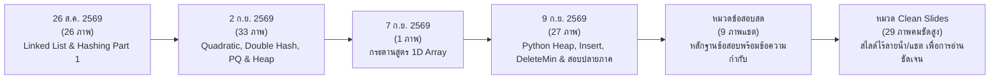

# 📸 14.5 - แคตตาล็อกภาพถ่ายสไลด์ กระดานเรียน และภาพหลักฐานข้อสอบฉบับสมบูรณ์ (Master Slides Catalog 125 Photos)

> [!INFO]
> **ข้อมูลคลังภาพถ่ายห้องเรียนสด:**
> - **ที่ตั้งไฟล์ภาพต้นฉบับ:** `Wiki/assets/dsa-pic/` (และ `C:\Project\Voice\DSA-pic\`)
> - **จำนวนภาพทั้งหมด:** **125 ภาพ** (87 ภาพถ่ายห้องเรียน + 9 ภาพบันทึกหลักฐานข้อสอบพร้อมข้อความกำกับ + 29 ภาพสไลด์คมชัดสูง Clean Full-Screen Captures)
> - **วิชา:** โครงสร้างข้อมูลและขั้นตอนวิธี (Data Structures and Algorithms)
> - **ผู้บรรยาย:** ดร.ประดิษฐ์ พิทักษ์เสถียรกุล
> - **การเชื่อมโยงบทความ:** สัมพันธ์กับบทเรียน [14.1](14.1%20-%20Classroom%20Lecture%20Hashing,%20Open%20Addressing%20&%20Rehashing.md), [14.2](14.2%20-%20Classroom%20Lecture%20Priority%20Queue%20&%20Binary%20Heap%20Properties.md), [14.3](14.3%20-%20Classroom%20Lecture%20Exam%20Focus%20Node%20Calculation%20&%201D%20Array.md), [14.4](14.4%20-%20Classroom%20Lecture%20Binary%20Heap%20Python%20Implementation%20&%20Final%20Exam%20Trace.md), [11.7](../11%20-%20คลังข้อสอบ%20&%20สรุปทบทวน%20(Exam%20Preparation%20&%20Practice)/11.7%20-%20รวมข้อสอบจริงที่อาจารย์พูดในห้องเรียน%20(All%20Classroom%20Leaked%20Exam%20Problems%20&%20Solutions).md), และงานในห้อง [12.7](../12%20-%20งานและการบ้านที่อาจารย์สั่ง%20(Assignments%20&%20Labs)/12.7%20-%20In-Class%20Assignment%20Binary%20Heap%20DeleteMin%20&%20Hashing%20Trace.md)

---

## 📅 สรุปสารบัญตามคาบเรียนและหมวดหมู่ (Session Timeline)

---

## 🏛️ หมวดที่ 1: คาบเรียนวันที่ 26 สิงหาคม 2569 (26 ภาพ + 1 สกรีนช็อต)
**หัวข้อ:** ทบทวน Linked List, แนะนำ Chapter 7 Hashing, Separate Chaining, Open Addressing, Linear Probing ($F(i)=i$) และการแทรก $89, 18, 49, 58$

| ลำดับ | ชื่อไฟล์ภาพ | เวลาถ่าย | หัวข้อเนื้อหาบนสไลด์ / กระดาน | ลิงก์บทเรียนที่เกี่ยวข้อง |
| :---: | :--- | :---: | :--- | :--- |
| 1 | `IMG_20260826_091737_550@2133355796.jpg` | 09:17:37 | Linked List Node Class & Reference Pointers | [บทที่ 3 Linked List](../03%20-%20บทที่%203%20Linked%20Lists/03.1%20-%20Linked%20Lists%20(Singly,%20Doubly,%20Circular).md) |
| 2 | `IMG_20260826_091948_162@1605881171.jpg` | 09:19:48 | Single Linked List Memory Structure | บทที่ 3 & Assignment 1 |
| 3 | `IMG_20260826_092434_544@165819026.jpg` | 09:24:34 | Pointer Swapping Logic (เขียนกระดาน) | Assignment 1 (12.1) |
| 4 | `IMG_20260826_092524_086@-1460806291.jpg` | 09:25:24 | Node Manipulation Diagrams | Assignment 1 (12.1) |
| 5 | `IMG_20260826_092718_848@-805686174.jpg` | 09:27:18 | Linking new node to head | บทที่ 3 Singly Linked List |
| 6 | `IMG_20260826_093016_700@1622654643.jpg` | 09:30:16 | VS Code Python Linked List Program | Assignment 1 (12.1) |
| 7 | `IMG_20260826_093052_952@1396484042.jpg` | 09:30:52 | Execution Output: Student list inserted | Assignment 1 (12.1) |
| 8 | `IMG_20260826_093203_709@-639026788.jpg` | 09:32:03 | Linked List Traversal & Print Method | บทที่ 3 Singly Linked List |
| 9 | `IMG_20260826_093359_987@623822966.jpg` | 09:33:59 | Python OOP Self Pointer in Node | บทที่ 2 & 3 |
| 10 | `IMG_20260826_101536_551@1080770344.jpg` | 10:15:36 | Whiteboard: Pointer Relinking Trace | บทที่ 3 & Assignment 1 |
| 11 | `IMG_20260826_102512_637@1078549838.jpg` | 10:25:12 | Whiteboard: Traversal while loop condition | บทที่ 3 Singly Linked List |
| 12 | `IMG_20260826_105404_780@868538722.jpg` | 10:54:04 | **สไลด์เปิดบทที่ 7: Hashing Concept & Hash Table** | [14.1 Classroom Hashing](14.1%20-%20Classroom%20Lecture%20Hashing,%20Open%20Addressing%20&%20Rehashing.md) |
| 13 | `IMG_20260826_105722_419@139930446.jpg` | 10:57:22 | Hash Function: ASCII Sum Modulo Table Size | 14.1 & Lab Hash |
| 14 | `IMG_20260826_110850_112@2055522502.jpg` | 11:08:50 | **สไลด์ Separate Chaining Definition** | 14.1 & บทที่ 6 Hashing |
| 15 | `IMG_20260826_110853_418@-698788718.jpg` | 11:08:53 | Separate Chaining Diagram | 14.1 & บทที่ 6 Hashing |
| 16 | `IMG_20260826_110910_371@-1304483386.jpg` | 11:09:10 | Hash Table with Linked Lists Buckets | 14.1 & บทที่ 6 Hashing |
| 17 | `IMG_20260826_112751_651@-1735638268.jpg` | 11:27:51 | **สไลด์ Open Addressing Definition & Philosophy** | 14.1 & บทที่ 6 Hashing |
| 18 | `IMG_20260826_113233_236@553663909.jpg` | 11:32:33 | **สูตรมาตรฐาน Open Addressing:** $h_i(x) = (\text{hash}(x) + F(i)) \bmod M$ | 14.1 (สูตรที่อาจารย์สั่งท่อง) |
| 19 | `IMG_20260826_113527_438@-1503705519.jpg` | 11:35:27 | **Linear Probing Formula: $F(i) = i$** | 14.1 (โจทย์หลักข้อสอบ) |
| 20 | `IMG_20260826_113735_636@93947504.jpg` | 11:37:35 | Inserting Keys into Hash Table (Size=10) | 14.1 & 12.7 In-class work |
| 21 | `IMG_20260826_114406_455@-1617669525.jpg` | 11:44:06 | Inserting Key 89 into Slot 9 | 14.1 & 12.7 In-class work |
| 22 | `IMG_20260826_114905_347@-1119323055.jpg` | 11:49:05 | Inserting Key 18, 49 (Collision at 9 $\rightarrow$ Slot 0) | 14.1 & 12.7 In-class work |
| 23 | `IMG_20260826_114913_731@1519949517.jpg` | 11:49:13 | Wrap Around mechanism to Slot 0 | 14.1 & 12.7 In-class work |
| 24 | `IMG_20260826_115743_436@1995501001.jpg` | 11:57:43 | Inserting Key 58 (Collisions at 8, 9, 0 $\rightarrow$ Slot 1) | 14.1 & 12.7 In-class work |
| 25 | `IMG_20260826_115844_081@-725424099.jpg` | 11:58:44 | Step calculation for Key 58 | 14.1 & 12.7 In-class work |
| 26 | `IMG_20260826_120134_783@145435942.jpg` | 12:01:34 | **สรุปการใส่ 58: คำเตือนอาจารย์ห้ามตอบช่อง 6** | 14.1 (จุดดักคะแนน 0) |
| 27 | `Screenshot_20260826-122139.jpg` | 12:21:39 | หน้าจอส่งงาน In-Class Assignment 26-8-69 | [12.7 In-Class Work](../12%20-%20งานและการบ้านที่อาจารย์สั่ง%20(Assignments%20&%20Labs)/12.7%20-%20In-Class%20Assignment%20Binary%20Heap%20DeleteMin%20&%20Hashing%20Trace.md) |

---

## 🧮 หมวดที่ 2: คาบเรียนวันที่ 2 กันยายน 2569 (33 ภาพ)
**หัวข้อ:** สรุปการชน Linear Probing (7 ครั้ง), Primary Clustering, Quadratic Probing ($F(i)=i^2$), Secondary Clustering, Double Hashing ($R=7$), Rehashing (ขยาย 7 เป็น 17), Priority Queue & Binary Heap (Complete Binary Tree, $H=10 \rightarrow 1024, 2047$, 1D Array Formulas)

| ลำดับ | ชื่อไฟล์ภาพ | เวลาถ่าย | หัวข้อเนื้อหาบนสไลด์ / กระดาน | ลิงก์บทเรียนที่เกี่ยวข้อง |
| :---: | :--- | :---: | :--- | :--- |
| 28 | `IMG_20260902_092629_264@644218902.jpg` | 09:26:29 | **สไลด์สรุปผลการชน: 7 ครั้ง (ไม่ใช่ 14 ครั้ง)** | [14.1 Classroom Hashing](14.1%20-%20Classroom%20Lecture%20Hashing,%20Open%20Addressing%20&%20Rehashing.md) |
| 29 | `IMG_20260902_092646_039@-477689225.jpg` | 09:26:46 | Detailed Collision Breakdown: 49(1), 58(3), 69(3) | 14.1 & 12.7 In-class work |
| 30 | `IMG_20260902_092757_185@1043314096.jpg` | 09:27:57 | **สไลด์ปัญหา Primary Clustering (การเกาะกลุ่มก้อน)** | 14.1 Classroom Hashing |
| 31 | `IMG_20260902_093139_293@1056574251.jpg` | 09:31:39 | Primary Clustering Diagram & Long Search Penalty | 14.1 Classroom Hashing |
| 32 | `IMG_20260902_093717_092@1096805742.jpg` | 09:37:17 | **สไลด์ Quadratic Probing: $F(i) = i^2$** | 14.1 Classroom Hashing |
| 33 | `IMG_20260902_093914_136@-650278024.jpg` | 09:39:14 | Quadratic Probing Jump Sequence: $+1, +4, +9, \dots$ | 14.1 Classroom Hashing |
| 34 | `IMG_20260902_094247_191@1917750309.jpg` | 09:42:47 | Quadratic Probing Trace: Key 49, 58 | 14.1 Classroom Hashing |
| 35 | `IMG_20260902_094335_574@-1162186226.jpg` | 09:43:35 | Inserting 58: Collision at 8, 9 $\rightarrow$ Jump 4 to Slot 2 | 14.1 Classroom Hashing |
| 36 | `IMG_20260902_094445_787@-1349244014.jpg` | 09:44:45 | Inserting 69: Collisions at 9, 0, 3 $\rightarrow$ Slot 8 | 14.1 Classroom Hashing |
| 37 | `IMG_20260902_094545_816@1834948026.jpg` | 09:45:45 | Hash Table Final State under Quadratic Probing | 14.1 Classroom Hashing |
| 38 | `IMG_20260902_094605_421@1593014805.jpg` | 09:46:05 | สรุปผล Quadratic Probing Collision Count | 14.1 Classroom Hashing |
| 39 | `IMG_20260902_094852_732@836004370.jpg` | 09:48:52 | **สไลด์ Secondary Clustering Definition** | 14.1 Classroom Hashing |
| 40 | `IMG_20260902_094919_250@-29312171.jpg` | 09:49:19 | Secondary Clustering Diagram (วงแหวนคลื่นกระเพื่อม) | 14.1 Classroom Hashing |
| 41 | `IMG_20260902_095414_770@1141739885.jpg` | 09:54:14 | **สไลด์ Double Hashing Formula:** $F(i) = i \cdot \text{hash}_2(x)$ | 14.1 Classroom Hashing |
| 42 | `IMG_20260902_095759_372@-440739025.jpg` | 09:57:59 | $\text{hash}_2(x) = R - (x \bmod R)$ สูตรที่อาจารย์ย้ำ | 14.1 Classroom Hashing |
| 43 | `IMG_20260902_100918_307@-147264869.jpg` | 10:09:18 | Choosing Prime $R < \text{Table\_Size} \implies R=7$ | 14.1 Classroom Hashing |
| 44 | `IMG_20260902_101006_187@1239959174.jpg` | 10:10:06 | Double Hashing Step Size Calculation | 14.1 Classroom Hashing |
| 45 | `IMG_20260902_101723_409@420928213.jpg` | 10:17:23 | Calculating Double Hash for 49 ($R=7 \rightarrow \text{Step}=7$) | 14.1 Classroom Hashing |
| 46 | `IMG_20260902_102011_819@-956099729.jpg` | 10:20:11 | Double Hash Trace: 58 (Step=5), 69 (Step=1) | 14.1 Classroom Hashing |
| 47 | `IMG_20260902_105026_745@-2018013112.jpg` | 10:50:26 | **สไลด์ Rehashing: Load Factor $> 70\%$** | 14.1 Classroom Hashing |
| 48 | `IMG_20260902_105118_748@1359345263.jpg` | 10:51:18 | Rehashing Table Expansion: Size 7 $\rightarrow 2 \times 7 = 14 \rightarrow 17$ | 14.1 Classroom Hashing |
| 49 | `IMG_20260902_105444_648@1721264842.jpg` | 10:54:44 | **ลำดับการอ่าน Rehash: บนลงล่าง (6, 15, 24, 13)** | 14.1 Classroom Hashing |
| 50 | `IMG_20260902_105456_288@-1230688413.jpg` | 10:54:56 | Rehash Modulo 17 Mapping | 14.1 Classroom Hashing |
| 51 | `IMG_20260902_105651_861@884045729.jpg` | 10:56:51 | Rehashing Final Table State (Size 17) | 14.1 Classroom Hashing |
| 52 | `IMG_20260902_110434_333@-1716796054.jpg` | 11:04:34 | Rehashing Summary & Complexity Analysis | 14.1 Classroom Hashing |
| 53 | `IMG_20260902_112203_525@1985525037.jpg` | 11:22:03 | **สไลด์เปิดบทที่ 8: Priority Queue & Binary Heap** | [14.2 Priority Queue](14.2%20-%20Classroom%20Lecture%20Priority%20Queue%20&%20Binary%20Heap%20Properties.md) |
| 54 | `IMG_20260902_112442_392@2130616190.jpg` | 11:24:42 | **สไลด์ข้อสอบ: ช่วงโหนด $2^H \le N \le 2^{H+1}-1$** | [14.3 Node Calculation](14.3%20-%20Classroom%20Lecture%20Exam%20Focus%20Node%20Calculation%20&%201D%20Array.md) |
| 55 | `IMG_20260902_112504_139@-140540400.jpg` | 11:25:04 | Calculation of Max Nodes at Height $H=10$ | 14.3 Node Calculation |
| 56 | `IMG_20260902_112525_396@-397010168.jpg` | 11:25:25 | **เฉลยข้อสอบตรง $H=10$: Min=1024, Max=2047 (ห้ามตอบยกกำลัง)** | 14.3 (จุดออกสอบตรง 100%) |
| 57 | `IMG_20260902_113121_541@-1402929343.jpg` | 11:31:21 | **Heap-Order Property (Parent $\le$ Children) & ข้อสอบตรวจความถูกต้อง** | 14.2 Priority Queue |
| 58 | `IMG_20260902_113308_947@-815528554.jpg` | 11:33:08 | **Structure Property (Complete Binary Tree ซ้ายไปขวา)** | 14.2 Priority Queue |
| 59 | `IMG_20260902_113705_690@-811833240.jpg` | 11:37:05 | **สูตรแปลง Complete Binary Tree เป็น 1D Array ($2i, 2i+1, i//2$)** | 14.3 Node Calculation |
| 60 | `IMG_20260902_113705_690@-811833240 (1).jpg` | 11:37:05 | สำเนาสูตร 1D Array Mapping | 14.3 Node Calculation |

---

## 📝 หมวดที่ 3: คาบเรียนวันที่ 7 กันยายน 2569 (1 ภาพ)
**หัวข้อ:** ภาพกระดานดำเน้นย้ำความสัมพันธ์ 1D Array และการตัดเศษทิ้ง

| ลำดับ | ชื่อไฟล์ภาพ | เวลาถ่าย | หัวข้อเนื้อหาบนสไลด์ / กระดาน | ลิงก์บทเรียนที่เกี่ยวข้อง |
| :---: | :--- | :---: | :--- | :--- |
| 61 | `IMG_20260907_153633_628.jpg` | 15:36:33 | **ภาพกระดานดำ: สูตร $2i, 2i+1, \lfloor i/2 \rfloor$ และคำเตือนห้ามปัดเศษขึ้น** | [14.3 Node Calculation](14.3%20-%20Classroom%20Lecture%20Exam%20Focus%20Node%20Calculation%20&%201D%20Array.md) |

---

## 🏆 หมวดที่ 4: คาบเรียนวันที่ 9 กันยายน 2569 (26 ภาพ)
**หัวข้อ:** ไล่โค้ด Python Binary Heap, การแทรก 14 (Percolate Up), การลบ DeleteMin (Percolate Down), การบ้านหนังสือหน้า 283 ส่งเที่ยงตรง และเฉลยข้อสอบปลายภาค DeleteMin 3 ครั้ง

| ลำดับ | ชื่อไฟล์ภาพ | เวลาถ่าย | หัวข้อเนื้อหาบนสไลด์ / กระดาน | ลิงก์บทเรียนที่เกี่ยวข้อง |
| :---: | :--- | :---: | :--- | :--- |
| 62 | `IMG_20260909_092253_743.jpg` | 09:22:53 | คลาส `BinaryHeap` ไฟล์ `BinaryHeap.py` | [14.4 Python Heap & Exam](14.4%20-%20Classroom%20Lecture%20Binary%20Heap%20Python%20Implementation%20&%20Final%20Exam%20Trace.md) |
| 63 | `IMG_20260909_093428_019.jpg` | 09:34:28 | Constructor `__init__` และ `self.current_size = 0` | 14.4 Python Heap & Exam |
| 64 | `IMG_20260909_093653_400.jpg` | 09:36:53 | **`self.array = [None] * (capacity + 1)` ทำไมต้องบวกหนึ่ง** | 14.4 Python Heap & Exam |
| 65 | `IMG_20260909_094140_669.jpg` | 09:41:40 | **สไลด์โจทย์ข้อสอบ: แทรก 14 ลงใน Heap 10 สมาชิก** | 14.4 Python Heap & Exam |
| 66 | `IMG_20260909_094609_602.jpg` | 09:46:09 | คำสั่งใน main: `myHeap.insert(14)` | 14.4 Python Heap & Exam |
| 67 | `IMG_20260909_094650_241.jpg` | 09:46:50 | Percolate Up: `hole = 11`, เปรียบเทียบ $14 < 31$ | 14.4 Python Heap & Exam |
| 68 | `IMG_20260909_095220_028.jpg` | 09:52:20 | เลื่อน 31 ลงมาที่ช่อง 11, หลุมขยับไป `hole = 5` | 14.4 Python Heap & Exam |
| 69 | `IMG_20260909_095230_776.jpg` | 09:52:30 | เปรียบเทียบ $14 < \text{array}[2] = 21$ (จริง) | 14.4 Python Heap & Exam |
| 70 | `IMG_20260909_095252_904.jpg` | 09:52:52 | เลื่อน 21 ลงมาที่ช่อง 5, หลุมขยับไป `hole = 2` | 14.4 Python Heap & Exam |
| 71 | `IMG_20260909_095703_930.jpg` | 09:57:03 | เปรียบเทียบ $14 < \text{array}[1] = 13$ (เท็จ!) หลุดลูป | 14.4 Python Heap & Exam |
| 72 | `IMG_20260909_095921_967.jpg` | 09:59:21 | นำ 14 บรรจุลงช่อง 2: `array[2] = 14` | 14.4 Python Heap & Exam |
| 73 | `IMG_20260909_100405_540.jpg` | 10:04:05 | สไลด์สรุปสถานะ Array ทั้ง 11 ตัวหลังแทรก 14 | 14.4 Python Heap & Exam |
| 74 | `IMG_20260909_103928_646.jpg` | 10:39:28 | **สไลด์เปิดหัวข้อ deleteMin และการลอยตัวลง** | 14.4 Python Heap & Exam |
| 75 | `IMG_20260909_105808_621.jpg` | 10:58:08 | การดึง Root (13) ออก และเก็บตัวท้ายสุด (31) ใน `temp` | 14.4 Python Heap & Exam |
| 76 | `IMG_20260909_110346_714.jpg` | 11:03:46 | การยุบขนาด `current_size = 10` (ตัดช่อง 11 ทิ้ง) | 14.4 Python Heap & Exam |
| 77 | `IMG_20260909_110520_920.jpg` | 11:05:20 | ซอร์สโค้ดเมธอด `deleteMin` และ `_percolate_down` | 14.4 Python Heap & Exam |
| 78 | `IMG_20260909_110606_048.jpg` | 11:06:06 | Percolate Down: เริ่มที่ `hole = 1`, `temp = 31` | 14.4 Python Heap & Exam |
| 79 | `IMG_20260909_110840_256.jpg` | 11:08:40 | เลือกลูกตัวน้อยกว่าระหว่างช่อง 2 (14) กับช่อง 3 (16) $\rightarrow 14$ | 14.4 Python Heap & Exam |
| 80 | `IMG_20260909_111753_071.jpg` | 11:17:53 | เลื่อน 14 ขึ้นแทนราก, หลุมขยับไป `hole = 2` | 14.4 Python Heap & Exam |
| 81 | `IMG_20260909_112446_491.jpg` | 11:24:46 | เลือกลูกตัวน้อยกว่าระหว่างช่อง 4 (24) กับช่อง 5 (21) $\rightarrow 21$ | 14.4 Python Heap & Exam |
| 82 | `IMG_20260909_112559_040.jpg` | 11:25:59 | เลื่อน 21 ขึ้นแทนช่อง 2, หลุมขยับไป `hole = 5` | 14.4 Python Heap & Exam |
| 83 | `IMG_20260909_113011_426.jpg` | 11:30:11 | เปรียบเทียบช่อง 10 (32) กับ 31 ($32 < 31$ เท็จ) $\rightarrow$ หยุดลูป | 14.4 Python Heap & Exam |
| 84 | `IMG_20260909_113245_489.jpg` | 11:32:45 | บรรจุ `temp = 31` ลงที่ `array[5]` | 14.4 Python Heap & Exam |
| 85 | `IMG_20260909_113431_184.jpg` | 11:34:31 | ผลลัพธ์อาร์เรย์หลังทำ deleteMin 1 ครั้งสมบูรณ์ | 14.4 Python Heap & Exam |
| 86 | `IMG_20260909_115634_445.jpg` | 11:56:34 | **สไลด์สั่งการบ้านหน้า 283 ส่งในระบบก่อน 12:00 น.** | [12.7 In-Class Work](../12%20-%20งานและการบ้านที่อาจารย์สั่ง%20(Assignments%20&%20Labs)/12.7%20-%20In-Class%20Assignment%20Binary%20Heap%20DeleteMin%20&%20Hashing%20Trace.md) |
| 87 | `IMG_20260909_115719_307.jpg` | 11:57:19 | **เผยข้อสอบปลายภาคจริง: DeleteMin 3 ครั้งติดต่อกัน!** | 14.4 Python Heap & Exam |

---

## 🎯 หมวดที่ 5: ภาพบันทึกหลักฐานข้อสอบพร้อมข้อความกำกับจากห้องเรียน (9 ภาพสกรีนช็อต)
**หัวข้อ:** ภาพบันทึกหน้าจอแชตสดขณะเรียนที่มีการพิมพ์ข้อความกำกับชัดเจนว่าเป็นข้อสอบ ทั้งข้อเขียน ปลายภาค และจุดดักคะแนนศูนย์ที่อาจารย์ย้ำ

| ลำดับ | ชื่อไฟล์ภาพ | วันที่และเวลา | ข้อความเขียนกำกับบนภาพ (User Caption) | หัวข้อข้อสอบจริงที่ปรากฏบนจอ | ลิงก์ข้อสอบและเฉลยละเอียด |
| :---: | :--- | :---: | :--- | :--- | :--- |
| 88 | `Screenshot 2026-09-09 011621.png` | 26/8/69 10:25 | **"ออกสอบเขียน (มีการแก้ไข) คุณสมบัติ 3 ข้อ"** | คุณสมบัติของ Hash Function & Hash Table 3 ประการ (Simple, Distinct Cells, Collision Handling) | [11.7 ข้อ 1.1](../11%20-%20คลังข้อสอบ%20&%20สรุปทบทวน%20(Exam%20Preparation%20&%20Practice)/11.7%20-%20รวมข้อสอบจริงที่อาจารย์พูดในห้องเรียน%20(All%20Classroom%20Leaked%20Exam%20Problems%20&%20Solutions).md#11-ข้อสอบข้อเขียน-คุณสมบัติ-3-ประการของ-hash-function--hash-table) |
| 89 | `Screenshot 2026-09-09 011649.png` | 26/8/69 11:28 | **"ถามการชนกัน"** | ชุดตัวเลข Perfect Square กำลังสอง (0, 1, 4, 9, 16, 25, 36...) ถามการชน (16 ชนกับ 36 ที่ช่อง 6) | [11.7 ข้อ 1.2](../11%20-%20คลังข้อสอบ%20&%20สรุปทบทวน%20(Exam%20Preparation%20&%20Practice)/11.7%20-%20รวมข้อสอบจริงที่อาจารย์พูดในห้องเรียน%20(All%20Classroom%20Leaked%20Exam%20Problems%20&%20Solutions).md#12-ข้อสอบข้อเขียน-การคำนวณการชนของเลขกำลังสอง-perfect-square-collision) |
| 90 | `Screenshot 2026-09-09 011658.png` | 26/8/69 11:35 | **"ออกสอบ final ข้อ 1"** | แทรก Keys `89, 18, 49, 58, 69` ลงตารางแฮชขนาด 10 (Linear Probing) | [11.7 ข้อ 1.3](../11%20-%20คลังข้อสอบ%20&%20สรุปทบทวน%20(Exam%20Preparation%20&%20Practice)/11.7%20-%20รวมข้อสอบจริงที่อาจารย์พูดในห้องเรียน%20(All%20Classroom%20Leaked%20Exam%20Problems%20&%20Solutions).md#13-ข้อสอบปลายภาค-ข้อที่-1-ตัวเต็ม-final-exam-question-1) |
| 91 | `Screenshot 2026-09-09 011707.png` | 26/8/69 11:35 | **"ออกสอบ final ข้อ 1"** | สูตรมาตรฐาน Open Addressing: $h_i(x) = (\text{hash}(x) + F(i)) \bmod M$ | [11.7 ข้อ 1.3](../11%20-%20คลังข้อสอบ%20&%20สรุปทบทวน%20(Exam%20Preparation%20&%20Practice)/11.7%20-%20รวมข้อสอบจริงที่อาจารย์พูดในห้องเรียน%20(All%20Classroom%20Leaked%20Exam%20Problems%20&%20Solutions).md#13-ข้อสอบปลายภาค-ข้อที่-1-ตัวเต็ม-final-exam-question-1) |
| 92 | `Screenshot 2026-09-09 011713.png` | 26/8/69 11:49 | **"ออกสอบข้อเขียน"** | นิยามและหลักการ Wrap Around ใน Hashing (mod TableSize อีกรอบเพื่อวนกลับหัว) | [11.7 ข้อ 1.4](../11%20-%20คลังข้อสอบ%20&%20สรุปทบทวน%20(Exam%20Preparation%20&%20Practice)/11.7%20-%20รวมข้อสอบจริงที่อาจารย์พูดในห้องเรียน%20(All%20Classroom%20Leaked%20Exam%20Problems%20&%20Solutions).md#14-ข้อสอบข้อเขียน-นิยามหลักการ-wrap-around-ใน-hashing) |
| 93 | `Screenshot 2026-09-09 011723.png` | 26/8/69 11:59 | **"ชนกันกี่ครั้ง ใส่ในวงเล็บ"** | รูปแบบคำตอบข้อสอบ: ใส่จำนวนครั้งที่ชนในวงเล็บ และวิธีทำ $h_0, h_1, h_2, h_3$ | [11.7 ข้อ 1.5](../11%20-%20คลังข้อสอบ%20&%20สรุปทบทวน%20(Exam%20Preparation%20&%20Practice)/11.7%20-%20รวมข้อสอบจริงที่อาจารย์พูดในห้องเรียน%20(All%20Classroom%20Leaked%20Exam%20Problems%20&%20Solutions).md#15-รูปแบบคำตอบในข้อสอบ--กับดักเลข-58-ชนกี่ครั้ง-ใส่ในวงเล็บ) |
| 94 | `Screenshot 2026-09-09 011727.png` | 26/8/69 11:59 | **"ชนกันกี่ครั้ง ใส่ในวงเล็บ"** | กับดัก 58 ลงช่อง 1 ชนรวม 3 ครั้ง (ห้ามตอบช่อง 6 เด็ดขาด ได้ 0 ทันที) | [11.7 ข้อ 1.5](../11%20-%20คลังข้อสอบ%20&%20สรุปทบทวน%20(Exam%20Preparation%20&%20Practice)/11.7%20-%20รวมข้อสอบจริงที่อาจารย์พูดในห้องเรียน%20(All%20Classroom%20Leaked%20Exam%20Problems%20&%20Solutions).md#15-รูปแบบคำตอบในข้อสอบ--กับดักเลข-58-ชนกี่ครั้ง-ใส่ในวงเล็บ) |
| 95 | `Screenshot 2026-09-09 011738.png` | 2/9/69 09:54 | **"ข้อเขียน"** | Double Hashing: สูตร $\text{hash}_2(x) = R - (x \bmod R)$ และเหตุผลที่เลือก $R=7$ | [11.7 ข้อ 1.6](../11%20-%20คลังข้อสอบ%20&%20สรุปทบทวน%20(Exam%20Preparation%20&%20Practice)/11.7%20-%20รวมข้อสอบจริงที่อาจารย์พูดในห้องเรียน%20(All%20Classroom%20Leaked%20Exam%20Problems%20&%20Solutions).md#16-ข้อสอบข้อเขียน-สูตร-double-hashing-และการเลือกค่า-r) |
| 96 | `Screenshot 2026-09-09 011759.png` | 2/9/69 11:37 | **"ออกสอบเปลี่ยน array เป็น tree (มีการแก้ไข)"** | การแปลง Array เป็น Tree: สูตร $2i, 2i+1, \lfloor i/2 \rfloor$ ปัดเศษทิ้ง ($7/2=3$) | [11.7 ข้อ 2.2](../11%20-%20คลังข้อสอบ%20&%20สรุปทบทวน%20(Exam%20Preparation%20&%20Practice)/11.7%20-%20รวมข้อสอบจริงที่อาจารย์พูดในห้องเรียน%20(All%20Classroom%20Leaked%20Exam%20Problems%20&%20Solutions).md#22-ข้อสอบแปลง-complete-binary-tree-เป็น-1d-array-และการปัดเศษทิ้ง) |

---

## 🌟 หมวดที่ 6: ภาพสไลด์คมชัดสูง Clean Projector Captures (29 ภาพ)
**หัวข้อ:** ภาพถ่ายสไลด์โปรเจกเตอร์ฉบับคมชัดพิเศษแบบเต็มจอ ไร้ลายน้ำและแถบแชตบดบังเนื้อหา เพื่อการอ่านตัวเลข ดัชนี และสมการคณิตศาสตร์ได้อย่างแม่นยำ 100%

| ลำดับ | ชื่อไฟล์ภาพ | วันที่และเวลา | หัวข้อเนื้อหาบนสไลด์คมชัด | ลิงก์บทเรียนที่เกี่ยวข้อง |
| :---: | :--- | :---: | :--- | :--- |
| 97 | `IMG_20260826_102512_637.jpg` | 26/8/69 10:25:12 | Traversing Linked List โค้ด Python ฉบับคมชัดเต็มจอ | [14.1](14.1%20-%20Classroom%20Lecture%20Hashing,%20Open%20Addressing%20&%20Rehashing.md) / [บทที่ 3](../03%20-%20บทที่%203%20Linked%20Lists/03.1%20-%20Linked%20Lists%20(Singly,%20Doubly,%20Circular).md) |
| 98 | `IMG_20260826_112751_651.jpg` | 26/8/69 11:27:51 | นิยามและแนวคิด Open Addressing ไม่พึ่งพอยน์เตอร์ | [14.1](14.1%20-%20Classroom%20Lecture%20Hashing,%20Open%20Addressing%20&%20Rehashing.md) |
| 99 | `IMG_20260826_113233_236.jpg` | 26/8/69 11:32:33 | สูตรมาตรฐาน Open Addressing: $h_i(x) = (\text{hash}(x) + F(i)) \bmod M$ | [14.1](14.1%20-%20Classroom%20Lecture%20Hashing,%20Open%20Addressing%20&%20Rehashing.md) |
| 100 | `IMG_20260826_113527_438.jpg` | 26/8/69 11:35:27 | สูตร Linear Probing: $F(i) = i$ ขยับทีละ 1 ช่องเมื่อชน | [14.1](14.1%20-%20Classroom%20Lecture%20Hashing,%20Open%20Addressing%20&%20Rehashing.md) |
| 101 | `IMG_20260826_114905_347.jpg` | 26/8/69 11:49:05 | การแทรก Key 18 ลงช่อง 8 และแทรก 49 ชนช่อง 9 วนลงช่อง 0 | [14.1](14.1%20-%20Classroom%20Lecture%20Hashing,%20Open%20Addressing%20&%20Rehashing.md) |
| 102 | `IMG_20260826_114913_731.jpg` | 26/8/69 11:49:13 | กลไก Wrap Around: วนจากท้ายตารางกลับมาหัวตารางด้วย Modulo | [14.1](14.1%20-%20Classroom%20Lecture%20Hashing,%20Open%20Addressing%20&%20Rehashing.md) |
| 103 | `IMG_20260826_115743_436.jpg` | 26/8/69 11:57:43 | การแทรก Key 58: ชนช่อง 8, 9, 0 จนได้ลงช่อง 1 | [14.1](14.1%20-%20Classroom%20Lecture%20Hashing,%20Open%20Addressing%20&%20Rehashing.md) |
| 104 | `IMG_20260826_115844_081.jpg` | 26/8/69 11:58:44 | วิธีทำละเอียดการหาช่องลงของ 58: คำนวณ $h_0, h_1, h_2, h_3$ | [14.1](14.1%20-%20Classroom%20Lecture%20Hashing,%20Open%20Addressing%20&%20Rehashing.md) |
| 105 | `IMG_20260826_120134_783.jpg` | 26/8/69 12:01:34 | สรุปผล Key 58 ได้ช่อง 1 และคำเตือนห้ามตอบช่อง 6 | [14.1](14.1%20-%20Classroom%20Lecture%20Hashing,%20Open%20Addressing%20&%20Rehashing.md) |
| 106 | `IMG_20260902_092629_264.jpg` | 2/9/69 09:26:29 | สรุปผลการแทรกคีย์ Linear Probing ชนรวม 7 ครั้ง (ไม่ใช่ 14) | [14.1](14.1%20-%20Classroom%20Lecture%20Hashing,%20Open%20Addressing%20&%20Rehashing.md) |
| 107 | `IMG_20260902_092646_039.jpg` | 2/9/69 09:26:46 | รายละเอียดการชนรายตัว: 49(1), 58(3), 69(3) | [14.1](14.1%20-%20Classroom%20Lecture%20Hashing,%20Open%20Addressing%20&%20Rehashing.md) |
| 108 | `IMG_20260902_092757_185.jpg` | 2/9/69 09:27:57 | สไลด์ปัญหา Primary Clustering (การจับกลุ่มก้อน) ใน Linear Probing | [14.1](14.1%20-%20Classroom%20Lecture%20Hashing,%20Open%20Addressing%20&%20Rehashing.md) |
| 109 | `IMG_20260902_093139_293.jpg` | 2/9/69 09:31:39 | แผนผังแสดงการสะสมกลุ่มก้อน Primary Clustering | [14.1](14.1%20-%20Classroom%20Lecture%20Hashing,%20Open%20Addressing%20&%20Rehashing.md) |
| 110 | `IMG_20260902_093717_092.jpg` | 2/9/69 09:37:17 | สูตร Quadratic Probing: $F(i) = i^2$ เพื่อแก้ปัญหาก้อนชิดกัน | [14.1](14.1%20-%20Classroom%20Lecture%20Hashing,%20Open%20Addressing%20&%20Rehashing.md) |
| 111 | `IMG_20260902_093914_136.jpg` | 2/9/69 09:39:14 | ลำดับการก้าวกระโดดแบบยกกำลังสอง: $+1, +4, +9, +16, \dots$ | [14.1](14.1%20-%20Classroom%20Lecture%20Hashing,%20Open%20Addressing%20&%20Rehashing.md) |
| 112 | `IMG_20260902_094247_191.jpg` | 2/9/69 09:42:47 | การทดลองแทรกคีย์ 49 และ 58 ใน Quadratic Probing | [14.1](14.1%20-%20Classroom%20Lecture%20Hashing,%20Open%20Addressing%20&%20Rehashing.md) |
| 113 | `IMG_20260902_094335_574.jpg` | 2/9/69 09:43:35 | คีย์ 58 กระโดด $1^2 \rightarrow 2^2$ ลงช่อง 2 ใน Quadratic Probing | [14.1](14.1%20-%20Classroom%20Lecture%20Hashing,%20Open%20Addressing%20&%20Rehashing.md) |
| 114 | `IMG_20260902_094445_787.jpg` | 2/9/69 09:44:45 | คีย์ 69 กระโดดลงช่อง 8 ใน Quadratic Probing | [14.1](14.1%20-%20Classroom%20Lecture%20Hashing,%20Open%20Addressing%20&%20Rehashing.md) |
| 115 | `IMG_20260902_094545_816.jpg` | 2/9/69 09:45:45 | ตารางสรุปสถานะเมื่อแทรกครบ 5 ตัวด้วย Quadratic Probing | [14.1](14.1%20-%20Classroom%20Lecture%20Hashing,%20Open%20Addressing%20&%20Rehashing.md) |
| 116 | `IMG_20260902_094605_421.jpg` | 2/9/69 09:46:05 | สรุปผลเปรียบเทียบการชน Quadratic vs Linear | [14.1](14.1%20-%20Classroom%20Lecture%20Hashing,%20Open%20Addressing%20&%20Rehashing.md) |
| 117 | `IMG_20260902_094852_732.jpg` | 2/9/69 09:48:52 | นิยามปัญหา Secondary Clustering (การชนตามรอยเดียวกัน) | [14.1](14.1%20-%20Classroom%20Lecture%20Hashing,%20Open%20Addressing%20&%20Rehashing.md) |
| 118 | `IMG_20260902_094919_250.jpg` | 2/9/69 09:49:19 | ผังรูปคลื่นแสดงการชนทับรอยใน Secondary Clustering | [14.1](14.1%20-%20Classroom%20Lecture%20Hashing,%20Open%20Addressing%20&%20Rehashing.md) |
| 119 | `IMG_20260902_095414_770.jpg` | 2/9/69 09:54:14 | สูตร Double Hashing: $F(i) = i \cdot \text{hash}_2(x)$ | [14.1](14.1%20-%20Classroom%20Lecture%20Hashing,%20Open%20Addressing%20&%20Rehashing.md) |
| 120 | `IMG_20260902_095759_372.jpg` | 2/9/69 09:57:59 | สูตรแฮชที่สอง $\text{hash}_2(x) = R - (x \bmod R)$ ป้องกันค่า 0 | [14.1](14.1%20-%20Classroom%20Lecture%20Hashing,%20Open%20Addressing%20&%20Rehashing.md) |
| 121 | `IMG_20260902_100918_307.jpg` | 2/9/69 10:09:18 | การเลือกค่า $R$ เป็นจำนวนเฉพาะที่น้อยกว่า TableSize ($R=7$) | [14.1](14.1%20-%20Classroom%20Lecture%20Hashing,%20Open%20Addressing%20&%20Rehashing.md) |
| 122 | `IMG_20260902_101006_187.jpg` | 2/9/69 10:10:06 | ตัวอย่างการคำนวณ Step Size ของแต่ละ Key ใน Double Hashing | [14.1](14.1%20-%20Classroom%20Lecture%20Hashing,%20Open%20Addressing%20&%20Rehashing.md) |
| 123 | `IMG_20260902_101723_409.jpg` | 2/9/69 10:17:23 | Double Hashing Trace: Key 49 ก้าวทีละ 7 ช่อง | [14.1](14.1%20-%20Classroom%20Lecture%20Hashing,%20Open%20Addressing%20&%20Rehashing.md) |
| 124 | `IMG_20260902_102011_819.jpg` | 2/9/69 10:20:11 | Double Hashing Trace: Key 58 (ก้าว 5) และ 69 (ก้าว 1) | [14.1](14.1%20-%20Classroom%20Lecture%20Hashing,%20Open%20Addressing%20&%20Rehashing.md) |
| 125 | `IMG_20260902_113705_690.jpg` | 2/9/69 11:37:05 | สไลด์สูตรความสัมพันธ์ Complete Binary Tree สู่ 1D Array ($2i, 2i+1, \lfloor i/2 \rfloor$) | [14.3](14.3%20-%20Classroom%20Lecture%20Exam%20Focus%20Node%20Calculation%20&%201D%20Array.md) |

---

## 💡 คำแนะนำในการค้นหาและการใช้งานภาพถ่าย
1. หากต้องการอ่านคำบรรยายสดประกอบภาพแต่ละภาพ ให้คลิกลิงก์ไปยังบทความ [14.1](14.1%20-%20Classroom%20Lecture%20Hashing,%20Open%20Addressing%20&%20Rehashing.md), [14.2](14.2%20-%20Classroom%20Lecture%20Priority%20Queue%20&%20Binary%20Heap%20Properties.md), [14.3](14.3%20-%20Classroom%20Lecture%20Exam%20Focus%20Node%20Calculation%20&%201D%20Array.md), [14.4](14.4%20-%20Classroom%20Lecture%20Binary%20Heap%20Python%20Implementation%20&%20Final%20Exam%20Trace.md), หรือ [11.7](../11%20-%20คลังข้อสอบ%20&%20สรุปทบทวน%20(Exam%20Preparation%20&%20Practice)/11.7%20-%20รวมข้อสอบจริงที่อาจารย์พูดในห้องเรียน%20(All%20Classroom%20Leaked%20Exam%20Problems%20&%20Solutions).md)
2. ทุกไฟล์ภาพถูกจัดเก็บอยู่ใน `Wiki/assets/dsa-pic/` ทำให้สามารถเปิดดูได้แบบ Offline 100% โดยไม่ต้องใช้อินเทอร์เน็ต

