# 🧠 LLM Knowledge Base Master Index (คลังความรู้เรื่อง Large Language Models)

> [!NOTE]
> คลังความรู้นี้ถูกจัดทำขึ้นสำหรับการศึกษาวิจัยและการเตรียมตัวสอบเกี่ยวกับ **Large Language Models (LLMs)** อย่างลึกซึ้ง ครอบคลุมตั้งแต่พื้นฐานสถาปัตยกรรม (Architecture) กระบวนการเทรน (Training Pipeline) การปรับปรุงความเร็ว (Optimization & Inference) เทคนิคการประยุกต์ใช้งาน (RAG & Agents) ไปจนถึงการวัดผล ความปลอดภัย และโจทย์ข้อสอบพร้อมเฉลยละเอียด

---

## 🗺️ LLM Knowledge Map (แผนผังเชื่อมโยงเนื้อหา)

```mermaid
graph TD
    Root["🧠 Large Language Models (LLMs)"] --> M1["01 - Foundations & Architecture"]
    Root --> M2["02 - Model Training Pipeline"]
    Root --> M3["03 - Inference & Optimization"]
    Root --> M4["04 - Advanced Frameworks"]
    Root --> M5["05 - Evaluation & Security"]

    M1 --> M1_1["[[01.1 - Introduction to LLMs & NLP History]]"]
    M1 --> M1_2["[[01.2 - Tokenization & Embeddings]]"]
    M1 --> M1_3["[[01.3 - Transformer Architecture Overview]]"]
    M1 --> M1_4["[[01.4 - Self-Attention & Multi-Head Attention]]"]
    M1 --> M1_5["[[01.5 - Positional Encoding & LayerNorm]]"]

    M2 --> M2_1["[[02.1 - Pre-training & Loss Functions]]"]
    M2 --> M2_2["[[02.2 - Supervised Fine-Tuning (SFT)]]"]
    M2 --> M2_3["[[02.3 - Alignment (RLHF, DPO, PPO, GRPO)]]"]
    M2 --> M2_4["[[02.4 - Parameter-Efficient Fine-Tuning (LoRA, QLoRA, Prefix Tuning)]]"]

    M3 --> M3_1["[[03.1 - Decoding Strategies (Greedy, Sampling, Top-k, Top-p, Temperature)]]"]
    M3 --> M3_2["[[03.2 - Quantization (GGUF, AWQ, GPTQ, INT8, INT4)]]"]
    M3 --> M3_3["[[03.3 - KV Cache, FlashAttention & Speculative Decoding]]"]

    M4 --> M4_1["[[04.1 - Prompt Engineering & In-Context Learning]]"]
    M4 --> M4_2["[[04.2 - Retrieval-Augmented Generation (RAG)]]"]
    M4 --> M4_3["[[04.3 - Agentic AI, Function Calling & Tool Use]]"]
    M4 --> M4_4["[[04.4 - Mixture of Experts (MoE)]]"]

    M5 --> M5_1["[[05.1 - Evaluation Metrics & Benchmarks (MMLU, GSM8K, BLEU, ROUGE)]]"]
    M5 --> M5_2["[[05.2 - LLM Security, Safety & Guardrails (Prompt Injection, Jailbreak)]]"]
    M5 --> M5_3["[[05.3 - Exam Preparation Guide & Q&A Examples]]"]
```

---

## 📚 รายละเอียดโครงสร้างหมวดหมู่ใน Obsidian Wiki

### 🏛️ Module 01: Foundations & Architecture (พื้นฐานและสถาปัตยกรรม)
- [[01.1 - Introduction to LLMs & NLP History]]: วิวัฒนาการจาก RNN/LSTM ถึง Transformer และ Scaling Laws (Kaplan vs Chinchilla)
- [[01.2 - Tokenization & Embeddings]]: อัลกอริทึม BPE, WordPiece, SentencePiece และการแปลง Text เป็น Vector
- [[01.3 - Transformer Architecture Overview]]: Encoder-Decoder vs Encoder-Only vs Decoder-Only (GPT, Llama)
- [[01.4 - Self-Attention & Multi-Head Attention]]: สมการคณิตศาสตร์ Scaled Dot-Product Attention, MHA, MQA และ GQA
- [[01.5 - Positional Encoding & LayerNorm]]: Sinusoidal, RoPE, ALiBi และ LayerNorm vs RMSNorm

### ⚙️ Module 02: Model Training Pipeline (กระบวนการเทรนโมเดล)
- [[02.1 - Pre-training & Loss Functions]]: Causal Language Modeling (CLM), Cross-Entropy Loss และ Distributed Training (ZeRO, TP, PP)
- [[02.2 - Supervised Fine-Tuning (SFT)]]: Instruction Tuning, รูปแบบชุดข้อมูล (Alpaca, ShareGPT, ChatML) และ Loss Masking
- [[02.3 - Alignment (RLHF, DPO, PPO, GRPO)]]: การปรับโมเดลตามความต้องการมนุษย์ (Reward Model, PPO, DPO, GRPO)
- [[02.4 - Parameter-Efficient Fine-Tuning (LoRA, QLoRA, Prefix Tuning)]]: LoRA ($W_0 + BA$), QLoRA (NF4, Double Quantization)

### 🚀 Module 03: Inference, Acceleration & Optimization (การเร่งความเร็วและการสุ่มคำตอบ)
- [[03.1 - Decoding Strategies (Greedy, Sampling, Top-k, Top-p, Temperature)]]: การคำนวณการสุ่มคำตอบ (Temperature, Top-k, Nucleus Top-p)
- [[03.2 - Quantization (GGUF, AWQ, GPTQ, INT8, INT4)]]: PTQ vs QAT, FP16 ถึง INT4, GGUF, AWQ, GPTQ
- [[03.3 - KV Cache, FlashAttention & Speculative Decoding]]: การจัดการหน่วยความจำ VRAM, KV Cache, FlashAttention v1-v3 และ Speculative Decoding

### 💡 Module 04: Advanced Frameworks & Paradigms (เฟรมเวิร์กขั้นสูงและโมเดลประยุกต์)
- [[04.1 - Prompt Engineering & In-Context Learning]]: Zero-shot, Few-shot, Chain-of-Thought (CoT), Tree-of-Thoughts (ToT), ReAct
- [[04.2 - Retrieval-Augmented Generation (RAG)]]: Naive, Advanced & Modular RAG, Chunking, Vector DB, Reranking, Self-RAG
- [[04.3 - Agentic AI, Function Calling & Tool Use]]: สถาปัตยกรรม AI Agent, Function Calling, ReAct Loop และ Multi-Agent System
- [[04.4 - Mixture of Experts (MoE)]]: Sparse MoE, Router/Gating Network, Expert Capacity และ DeepSeek-V2/V3 MoE Architecture

### 📝 Module 05: Evaluation, Security & Exam Practice (การวัดผล ความปลอดภัย และคลังข้อสอบ)
- [[05.1 - Evaluation Metrics & Benchmarks (MMLU, GSM8K, BLEU, ROUGE)]]: วัดผลด้วย BLEU, ROUGE, Perplexity, Benchmarks (MMLU, GSM8K) และ LLM-as-a-Judge
- [[05.2 - LLM Security, Safety & Guardrails (Prompt Injection, Jailbreak)]]: Prompt Injection, Jailbreak (DAN), Data Poisoning และ Guardrails Frameworks
- [[05.3 - Exam Preparation Guide & Q&A Examples]]: **ตะลุยโจทย์ข้อสอบ 25 ข้อ** พร้อมคำนวณมิติเมทริกซ์ VRAM และการพิสูจน์สูตรคณิตศาสตร์แบบละเอียด

---

> [!TIP]
> **คำแนะนำในการใช้งาน Obsidian**:
> คุณสามารถกด `Ctrl + Click` หรือ `Cmd + Click` ที่ลิงก์ `[[ชื่อหน้า]]` เพื่อเปิดหน้าโน้ตย่อยขึ้นมาอ่านหรือแก้ไขได้อย่างรวดเร็ว!
