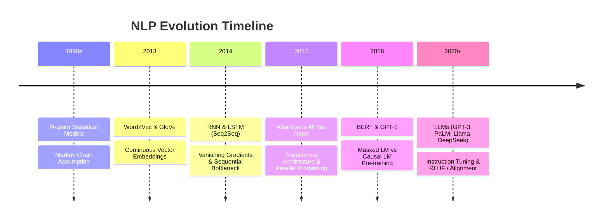
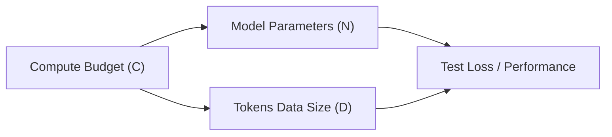

# 📜 01.1 - Introduction to LLMs & NLP History

> [!NOTE]
> หัวข้อนี้อธิบายประวัติความเป็นมาของประมวลผลภาษาธรรมชาติ (NLP) วิวัฒนาการจากโมเดลสถิติ (N-gram) สู่โมเดลโครงข่ายประสาทลำดับ (RNN/LSTM) สู่สถาปัตยกรรมปฏิวัติวงการอย่าง **Transformer** และกฎการขยายขนาดโมเดล (**Scaling Laws**)

---

## 🏛️ 1. วิวัฒนาการของเทคโนโลยี NLP (Evolution of NLP)

การประมวลผลภาษาธรรมชาติต้องผ่านการปรับเปลี่ยนสถาปัตยกรรมหลายยุคสมัยเพื่อแก้ปัญหาขีดจำกัดทางเทคโนโลยี:

### 1.1 N-gram & Rule-based Models (ยุคเริ่มต้น)
- อิงจากหลักสถิติความถี่ของคำในคลังข้อมูล (Corpus)
- ใช้สมมติฐาน **Markov Property**: ความน่าจะเป็นของคำถัดไปขึ้นอยู่กับ $N-1$ คำก่อนหน้าเท่านั้น
- **ข้อจำกัดใหญ่**: เกิดปัญหา **Sparsity Issue** (หากไม่เคยพบวลีนั้นในคลังข้อมูล ความน่าจะเป็นจะเป็น 0) และไม่สามารถจับบริบทระยะยาว (Long-range Dependencies) ได้

### 1.2 Recurrent Neural Networks (RNN) & LSTM (ยุคประมวลผลลำดับ)
- นำ Hidden State ($h_t$) มาใช้ส่งผ่านข้อมูลจาก timestep ก่อนหน้า:
  $$h_t = \tanh(W_{hh} h_{t-1} + W_{xh} x_t + b_h)$$
- **ปัญหาสำคัญ**:
  1. **Vanishing / Exploding Gradients**: เมื่อลำดับคำยาวมาก Gradient ที่ย้อนกลับมาในขั้นตอน Backpropagation Through Time (BPTT) จะเป็น 0 หรือระเบิดเป็น Inf
  2. **Sequential Bottleneck**: ไม่สามารถประมวลผลคำพร้อมกันแบบขนาน (Parallelization) ได้ เนื่องจาก $h_t$ จำเป็นต้องรอคำนวณ $h_{t-1}$ ให้เสร็จก่อนเสมอ ทำให้การประมวลผลช้าบน GPU

---

## ⚡ 2. จุดเปลี่ยนสำคัญ: Attention Mechanism & Transformer

ในปี 2017 ทีมงาน Google Research ได้เสนอ 논문 *"Attention Is All You Need"* ซึ่งปลดล็อกข้อจำกัดของ RNN ทั้งหมด:

1. **ประมวลผลแบบขนาน (Massive Parallelization)**: ตัด RNN hidden loop ออกทั้งหมด สามารถป้อนทุกโทเคนเข้าโมเดลพร้อมกันได้
2. **จับบริบทระยะยาวแบบตรง (Direct Long-Range Context)**: ระยะห่างทางโครงสร้างระหว่างคำทุกคำในลำดับมีค่าเป็น $\mathcal{O}(1)$ จากเทคนิค [[01.4 - Self-Attention & Multi-Head Attention|Self-Attention]]

---

## 📈 3. กฎการขยายขนาดโมเดล (LLM Scaling Laws)

หนึ่งในความรู้ที่นิยมออกสอบอย่างมากคือความสัมพันธ์ระหว่าง **ขนาดโมเดล ($N$)**, **ปริมาณข้อมูล ($D$)** และ **งบประมาณการคำนวณ ($C$)**

### 3.1 Kaplan Scaling Law (OpenAI, 2020)
- เสนอว่า **ขนาดของโมเดล ($N$)** มีผลต่อประสิทธิภาพมากกว่าปริมาณข้อมูล ($D$)
- สรุปว่าหากเพิ่มงบประมาณการคำนวณ $C \approx 6ND$ ควรเน้นเพิ่ม $N$ ในอัตราส่วนที่สูงกว่า $D$

### 3.2 Chinchilla Scaling Law (DeepMind, 2022)
- DeepMind (Hoffmann et al.) พิสูจน์ว่าโมเดลส่วนใหญ่ในยุคแรก (รวมถึง GPT-3 175B) เป็นโมเดลประเภท **Over-parameterized / Under-trained** (โมเดลใหญ่เกินไปแต่เทรนด้วยโทเคนน้อยเกินไป)
- **กฎ Chinchilla Optimal Ratio**:
  > **โมเดลต้องการปริมาณข้อมูล $D$ และขนาดโมเดล $N$ เติบโตไปพร้อมกันในสัดส่วนเท่ากัน (Compute-Optimal)**
  >
  > สำหรับโมเดลขนาด $N$ พารามิเตอร์ ควรเทรนด้วยข้อมูลประมาณ **$20 \times N$ tokens**

>[!EXAMPLE]
> **เปรียบเทียบตามหลัก Chinchilla**:
> - โมเดล **7 Billion parameters** ควรถูกเทรนด้วยข้อมูลอย่างน้อย: $7 \times 10^9 \times 20 = 140 \text{ Billion tokens}$
> - โมเดล **Llama-3 8B** เทรนด้วย $15 \text{ Trillion tokens}$ ($> 1800 \times N$) เพื่อให้ได้ประสิทธิภาพสูงสุดในขั้นตอน Inference

---

## 🎯 4. ปรากฏการณ์ความสามารถแฝง (Emergent Abilities)

เมื่อโมเดลภาษาถูกขยายขนาดเกินจุดวิกฤต (Critical Threshold ~ $10^{22} - 10^{23}$ FLOPs) จะเกิดความสามารถใหม่ที่โมเดลขนาดเล็กไม่สามารถทำได้เลย เรียกว่า **Emergent Abilities**:

1. **In-Context Learning (ICL)**: การเรียนรู้จากตัวอย่างใน Prompt โดยไม่ต้องอัปเดตน้ำหนัก
2. **Chain-of-Thought (CoT) Reasoning**: การคิดวิเคราะห์ปัญหาซับซ้อนตามลำดับขั้นตอน
3. **Instruction Following**: การปฏิบัติตามคำสั่งของมนุษย์อย่างเที่ยงตรง

---

## 🔗 ลิงก์เชื่อมโยงใน Obsidian Wiki
- ถัดไป: [[01.2 - Tokenization & Embeddings]]
- สถาปัตยกรรมหลัก: [[01.3 - Transformer Architecture Overview]]
- กลับหน้าหลัก: [[Index]]
