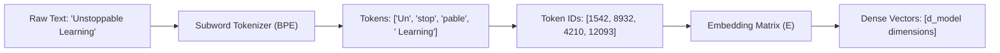
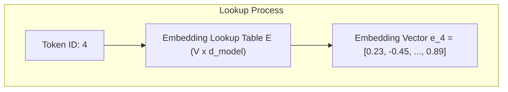

# 🔤 01.2 - Tokenization & Embeddings

> [!NOTE]
> คอมพิวเตอร์ไม่สามารถประมวลผลข้อความตัวอักษรโดยตรงได้ ขั้นตอนแรกสุดของ LLM คือการแปลงข้อความ (Text) ให้กลายเป็นตัวเลข (Token IDs) และแปลงต่อเป็น Dense Vector (Embedding) เพื่อป้อนเข้าสู่โครงข่ายประสาท

---

## ✂️ 1. กระบวนการ Tokenization (จาก ข้อความ สู่ ตัวเลข)

**Tokenization** คือกระบวนการแบ่งข้อความออกเป็นหน่วยย่อยเรียกว่า **Token** ซึ่งอาจเป็นคำเต็ม (Word), ชิ้นส่วนคำ (Subword), หรือตัวอักษร (Character)

### 1.1 ประเภทของ Tokenization

1. **Word-level Tokenization**:
   - แบ่งตามคำ (เว้นวรรค)
   - **ข้อเสีย**: ปัญหา Out-Of-Vocabulary (OOV) สูงมากหากเจอคำใหม่ และขนาด Vocabulary ($V$) จะใหญ่เกินไป
2. **Character-level Tokenization**:
   - แบ่งระดับตัวอักษร (A-Z, ก-ฮ)
   - **ข้อเสีย**: ขนาด Vocabulary เล็ก แต่ความยาวลำดับ (Sequence Length) จะยาวมาก ทำให้คำนวณ Attention ช้า $\mathcal{O}(N^2)$
3. **Subword Tokenization (นิยมที่สุดในปัจจุบัน)**:
   - แบ่งคำออกเป็นชิ้นส่วนย่อยที่พบบ่อย (เช่น `unfortunate` $\to$ `un` + `fortunate`)
   - แก้ไขปัญหา OOV ได้ 100% เพราะคำที่ไม่รู้จักจะถูกซอยย่อยลงไปถึงระดับ Character

---

## ⚙️ 2. อัลกอริทึม Subword Tokenization ที่ต้องจำสำหรับสอบ

### 2.1 Byte-Pair Encoding (BPE) (ใช้ใน GPT-2, GPT-4, Llama)
- **หลักการทำงาน**:
  1. เริ่มต้นแยกทุกคำเป็นตัวอักษรเดี่ยว (Characters)
  2. นับความถี่ของคู่ตัวอักษร (Byte Pairs) ที่อยู่ติดกันทั้งหมดในคลังข้อมูล
  3. รวมคู่คำที่พบบ่อยที่สุด (Most Frequent Pair) เข้าเป็น Token ใหม่
  4. ทำซ้ำขั้นตอนจนกว่าขนาด Vocabulary จะครบตามที่กำหนด (เช่น $V = 32,000$ หรือ $100,000$)

>[!EXAMPLE]
> **ตัวอย่างข้อสอบ BPE Step-by-Step**:
> สมมติ คลังข้อมูลมีคำว่า: `"hug" (5 ครั้ง), "pug" (1 ครั้ง), "hugs" (2 ครั้ง)`
> 
> - **สเต็ป 1**: Vocabulary เริ่มต้น = `h, u, g, p, s`
> - **สเต็ป 2**: นับคู่ติดกัน: `(u, g)` พบ $5 + 1 + 2 = 8$ ครั้ง $\to$ **รวม `u` + `g` $\to$ `ug`**
> - **สเต็ป 3**: Vocabulary ใหม่ = `h, u, g, p, s, ug`
> - **สเต็ป 4**: นับคู่ติดกัน: `(h, ug)` พบ $5 + 2 = 7$ ครั้ง $\to$ **รวม `h` + `ug` $\to$ `hug`**

### 2.2 WordPiece (ใช้ใน BERT)
- คล้าย BPE แต่เกณฑ์การรวมคู่คำอิงจาก **Maximum Likelihood Estimate** แทนความถี่ล้วนๆ โดยเลือกคู่คำที่เพิ่ม Likelihood ของ Language Model สูงสุด:
  $$\text{Score}(A, B) = \frac{\text{Count}(AB)}{\text{Count}(A) \times \text{Count}(B)}$$

### 2.3 SentencePiece & Byte-level BPE
- **SentencePiece**: รักษาช่องว่าง (Spaces) ให้กลายเป็นสัญลักษณ์พิเศษ (เช่น `_`) ช่วยให้ทำ Tokenization กับภาษาที่ไม่ใช้ช่องว่างแบ่งคำ เช่น ภาษาไทย ภาษาจีน ภาษาญี่ปุ่น ได้โดยไม่ต้องมี Pre-segmentation
- **Byte-level BPE (BBPE)**: มองข้อความในระดับ Raw Bytes (0-255) สามารถจัดการได้ทุกภาษาและสัญลักษณ์พิเศษโดยไม่เกิดปัญหา `<UNK>` (Unknown Token)

---

## 📐 3. Token Embeddings & Linear Head Matrix

เมื่อได้ Token ID (เลขจำนวนเต็ม $i \in [0, V-1]$) โมเดลจะแปลง ID ให้กลายเป็น Dense Vector ผ่าน **Embedding Matrix** $E \in \mathbb{R}^{V \times d_{\text{model}}}$

### 3.1 Weight Tying (LM Head Sharing)
- ในหลายสถาปัตยกรรม (เช่น GPT-2, PaLM) เมทริกซ์ **Input Embedding Layer ($E$)** และ **Output LM Head Linear Layer ($W_{\text{out}}$)** จะใช้เมทริกซ์น้ำหนักร่วมกัน (Shared Weights) โดย $W_{\text{out}} = E^T$
- **ประโยชน์**: ประหยัดหน่วยความจำ VRAM มหาศาล เนื่องจากไม่ต้องเก็บพารามิเตอร์ขนาด $V \times d_{\text{model}}$ สองชุด

---

## 🔗 ลิงก์เชื่อมโยงใน Obsidian Wiki
- ก่อนหน้า: [[01.1 - Introduction to LLMs & NLP History]]
- ถัดไป: [[01.3 - Transformer Architecture Overview]]
- ระบบตำแหน่งคำ: [[01.5 - Positional Encoding & LayerNorm]]
