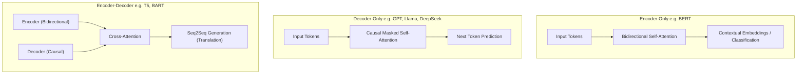
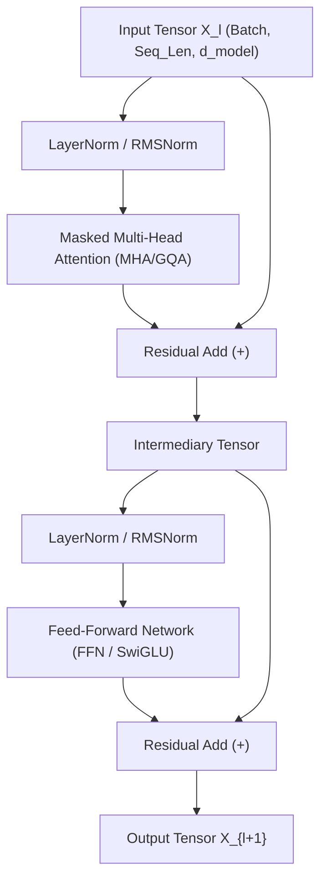

# 🏗️ 01.3 - Transformer Architecture Overview

> [!NOTE]
> โครงสร้างหลักของ Transformer คือหัวใจของ LLM ยุคใหม่ทั้งหมด บทนี้อธิบายสถาปัตยกรรม 3 รูปแบบหลัก (Encoder-Decoder, Encoder-Only, Decoder-Only), Feed-Forward Networks (FFN), Residual Connections และโครงสร้างภายในบล็อก

---

## 🏛️ 1. เปรียบเทียบ 3 สถาปัตยกรรม Transformer หลัก (Must-Know for Exams)

| คุณลักษณะ | Encoder-Only | Decoder-Only | Encoder-Decoder |
| :--- | :--- | :--- | :--- |
| **ตัวอย่างโมเดล** | BERT, RoBERTa, DeBERTa | GPT-3/4, Llama-1/2/3, DeepSeek, Mistral | T5, BART, Whisper |
| **กลไก Attention** | Bidirectional (มองเห็นคำซ้าย-ขวาได้หมด) | Causal / Masked (มองเห็นเฉพาะคำในอดีตและปัจจุบัน) | Encoder: Bidirectional Decoder: Masked + Cross Attention |
| **งานที่เหมาะสม** | Text Classification, Named Entity Recognition, Sentence Embeddings | Autoregressive Generation, Chatbots, Code Generation | Machine Translation, Text Summarization |
| **เป้าหมายการเทรน** | Masked Language Modeling (MLM) | Causal Language Modeling (CLM) / Next Token Prediction | Span Corruption, Seq2Seq Loss |

---

## 🧩 2. โครงสร้างภายในของ Decoder-Only Transformer Block

โมเดล LLM ยุคปัจจุบัน 99% เป็นสถาปัตยกรรม **Decoder-Only** ซึ่งประกอบด้วยโครงสร้างย่อยต่อกันเป็นชั้นๆ (Layers):

### 2.1 Causal Attention Masking (การบล็อกคำอนาคต)
- Decoder ต้องป้องกันไม่ให้โมเดล **"แอบมองคำตอบล่วงหน้า"** (Cheating) ในระหว่างการเทรน
- ปรับแต่ง Attention Matrix ด้วย Mask Matrix $M$ โดยแทนค่าคำในอนาคตด้วย $-\infty$:
  $$\text{Masked Attention}(Q, K, V) = \text{softmax}\left(\frac{QK^T}{\sqrt{d_k}} + M\right)V$$
  โดยที่ $M_{i,j} = 0$ หาก $j \le i$ และ $M_{i,j} = -\infty$ หาก $j > i$

---

## ⚡ 3. Feed-Forward Networks (FFN / MLP Layer)

หลังผ่านกลไก Self-Attention ข้อมูลจะถูกป้อนเข้าสู่ **Feed-Forward Network (FFN)** เพื่อประมวลผล Non-linear Transformation

### 3.1 Standard FFN (ReLU / GELU)
$$FFN(x) = \max(0, x W_1 + b_1) W_2 + b_2$$
- โดยทั่วไปจะขยายมิติจาก $d_{\text{model}}$ ขึ้นไป $4 \times d_{\text{model}}$ (เรียกว่า $d_{ff}$) แล้วลดมิติกลับมาที่ $d_{\text{model}}$

### 3.2 SwiGLU Activation (ใช้ใน Llama, PaLM, Mistral)
LLM ยุคใหม่เปลี่ยนมาใช้ **SwiGLU** (Swish-Gated Linear Unit) ซึ่งให้ประสิทธิภาพสูงกว่า GELU อย่างชัดเจน:
$$\text{SwiGLU}(x) = \left( \text{Swish}_{1}(x W_g) \odot x W_1 \right) W_2$$
โดยที่ $\text{Swish}_1(x) = x \cdot \sigma(x)$

---

## 🔄 4. Residual Connection (การเชื่อมต่อแบบข้าม)

- การเพิ่ม Residual Add: $x_{l+1} = x_l + F(x_l)$
- **ความสำคัญอย่างยิ่ง**:
  1. ป้องกันปัญหา **Gradient Vanishing** ช่วยให้สามารถซ้อน Layer โมเดลได้สูงนับร้อยชั้น (เช่น Llama-3 70B มี 80 Layers)
  2. ช่วยให้ Gradient สามารถไหลย้อนกลับจาก Layer สุดท้ายไปยัง Layer แรกๆ ได้โดยตรงผ่านทางด่วน (Identity Highway)

---

## 🔗 ลิงก์เชื่อมโยงใน Obsidian Wiki
- ก่อนหน้า: [[01.2 - Tokenization & Embeddings]]
- กลไก Self-Attention: [[01.4 - Self-Attention & Multi-Head Attention]]
- Positional Encoding & LayerNorm: [[01.5 - Positional Encoding & LayerNorm]]
- ถัดไป (การประยุกต์ MoE): [[04.4 - Mixture of Experts (MoE)]]
