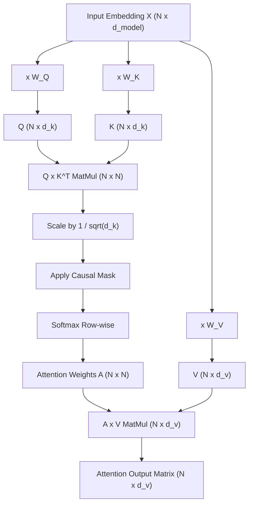
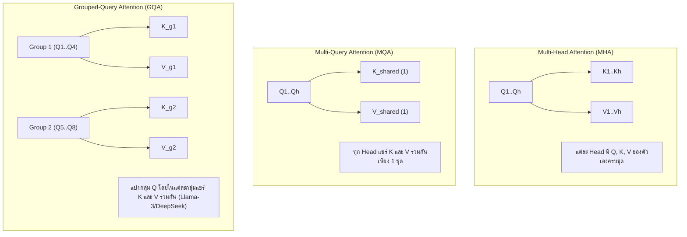

# 🧠 01.4 - Self-Attention & Multi-Head Attention

> [!NOTE]
> กลไก **Self-Attention** คือหัวใจสำคัญสูงสุดของ Transformer บทนี้อธิบายการคำนวณเมทริกซ์ $Q, K, V$ อย่างเป็นขั้นตอน มิติต่างๆ การพิสูจน์ทางคณิตศาสตร์ และวิวัฒนาการจาก MHA $\to$ MQA $\to$ GQA เพื่อลดภาระหน่วยความจำ

---

## 📐 1. Scaled Dot-Product Attention (สูตรและการคำนวณมิติ)

กลไก Attention คำนวณความสัมพันธ์ระหว่างทุกคู่โทเคนผ่าน 3 Vectors หลัก:
- **Query ($Q$)**: "สิ่งที่คำกำลังตามหา" ($Q = X \cdot W_Q$)
- **Key ($K$)**: "ดรรชนีระบุตัวตนของคำในลำดับ" ($K = X \cdot W_K$)
- **Value ($V$)**: "สาระสำคัญ/เนื้อหาของคำนั้น" ($V = X \cdot W_V$)

$$\text{Attention}(Q, K, V) = \text{softmax}\left(\frac{QK^T}{\sqrt{d_k}}\right)V$$

---

## 🧮 2. มิติของเมทริกซ์ที่ต้องตรวจสอบในห้องสอบ (Matrix Dimensions Check)

สมมติ:
- $N$ = Sequence Length (จำนวนโทเคน)
- $d_{\text{model}}$ = Hidden Dimension ขนาดโมเดล
- $d_k = d_v = d_{\text{model}} / h$ (เมื่อ $h$ คือจำนวน Head)

| เมทริกซ์ | มิติ (Shape) | ความหมาย |
| :--- | :--- | :--- |
| **$X$** | $(N, d_{\text{model}})$ | โทเคนอินพุต |
| **$W_Q, W_K, W_V$** | $(d_{\text{model}}, d_k)$ | เมทริกซ์น้ำหนัก projection |
| **$Q, K, V$** | $(N, d_k)$ | เมทริกซ์ Query, Key, Value |
| **$QK^T$** | $(N, N)$ | **Attention Scores Matrix** (วัดความสัมพันธ์คู่ต่อคู่) |
| **$\text{softmax}\left(\frac{QK^T}{\sqrt{d_k}}\right)$** | $(N, N)$ | **Attention Weights Matrix** (ผลรวมแต่ละแถว $= 1.0$) |
| **Output** | $(N, d_v)$ | ผลลัพธ์รวมของ Attention 1 Head |

>[!MATH]
> **เหตุใดต้องหารด้วย $\sqrt{d_k}$? (Scaling Factor Derivation)**:
> หากองค์ประกอบของ $q$ และ $k$ เป็นตัวแปรสุ่มสเกลาร์ที่มีเฉลี่ย $0$ และความแปรปรวน $1$
> ผลคูณ Scalar Product $q \cdot k = \sum_{i=1}^{d_k} q_i k_i$ จะมีค่าเฉลี่ยเป็น $0$ และ **ความแปรปรวนเท่ากับ $d_k$**
> หาก $d_k$ มีขนาดใหญ่มาก ค่าผลคูณจะกว้างมาก ส่งผลให้ Softmax ไปตกในเขต Gradient แบนราบ (Saturated Region) เกิดปัญหา **Vanishing Gradients** การหารด้วย $\sqrt{d_k}$ ช่วยปรับความแปรปรวนกลับมาเท่ากับ $1$ พอดี

---

## 🔀 3. วิวัฒนาการจาก MHA สู่ MQA และ GQA

เมื่อโมเดลประมวลผล Context ยาวมากๆ การเก็บบันทึก Key และ Value ใน VRAM ([[03.3 - KV Cache, FlashAttention & Speculative Decoding|KV Cache]]) จะกลายเป็น Bottleneck สำคัญ จึงเกิดสถาปัตยกรรม Attention 3 รูปแบบ:

| สถาปัตยกรรม Attention | จำนวน Key/Value Heads ($h_{kv}$) | ขนาด KV Cache Relative | คุณภาพโมเดล | ความเร็ว Inference |
| :--- | :--- | :--- | :--- | :--- |
| **MHA (Multi-Head)** | เท่ากับ Query Heads ($h_{kv} = h_q$) | 100% (ใหญ่ที่สุด) | สูงที่สุด (Baseline) | ช้าสุดเมื่อ Context ยาว |
| **MQA (Multi-Query)** | มีเพียง 1 ชุด ($h_{kv} = 1$) | ลดลงเหลือ $1/h_q$ (~1-2%) | ดร็อปลงเล็กน้อย | เร็วที่สุด |
| **GQA (Grouped-Query)** | มี $G$ กลุ่ม ($1 < h_{kv} < h_q$) | ลดลงเหลือ $G / h_q$ (~12-25%) | **ใกล้เคียง MHA 99%** | **เร็วมาก ( Sweet Spot )** |

---

## 🔗 ลิงก์เชื่อมโยงใน Obsidian Wiki
- ก่อนหน้า: [[01.3 - Transformer Architecture Overview]]
- ถัดไป: [[01.5 - Positional Encoding & LayerNorm]]
- ผลกระทบต่อ VRAM: [[03.3 - KV Cache, FlashAttention & Speculative Decoding]]
