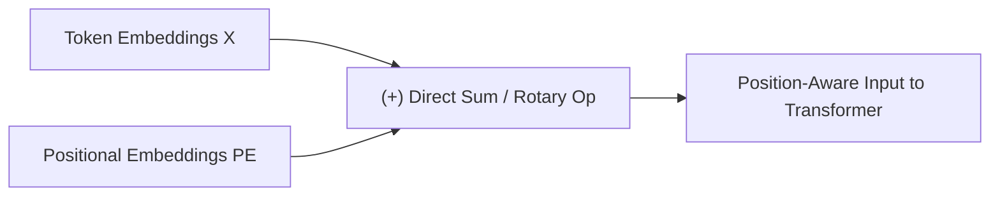
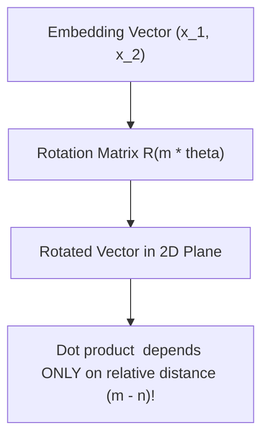
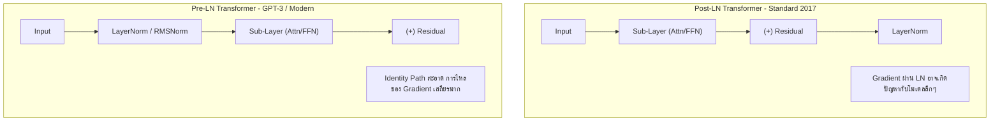

# 📍 01.5 - Positional Encoding & LayerNorm

> [!NOTE]
> กลไก Self-Attention ไม่มีลำดับก่อนหลังอยู่ในตัว (Permutation Invariant) โมเดลจึงต้องใส่ **Positional Encoding** เพื่อบอกลำดับคำ นอกจากนี้ระบบนอร์มัลไลเซชันอย่าง **LayerNorm** และ **RMSNorm** ยังเป็นตัวช่วยควบคุมการเสถียรของ Gradient ในโมเดลระดับหลายหมื่นล้านพารามิเตอร์

---

## 📍 1. Positional Encoding (การระบุตำแหน่งของโทเคน)

หากปราศจาก Positional Encoding ประโยค *"Dog bites man"* และ *"Man bites dog"* จะมีผลลัพธ์ Attention Matrix เหมือนกันทุกประการ!

### 1.1 Absolute Sinusoidal Positional Encoding (Original Transformer 2017)
ใช้ฟังก์ชันคลื่น Sine และ Cosine ที่ความถี่ต่างกัน:
$$PE_{(pos, 2i)} = \sin\left(\frac{pos}{10000^{2i/d_{\text{model}}}}\right)$$
$$PE_{(pos, 2i+1)} = \cos\left(\frac{pos}{10000^{2i/d_{\text{model}}}}\right)$$
- **ข้อดี**: ไม่ต้องเพิ่มพารามิเตอร์เทรน คำนวณตำแหน่งขยายออกไปได้
- **ข้อเสีย**: เมื่อ Context ยาวกว่าที่เคยเทรนมา โมเดลจะทำงานผิดพลาด

### 1.2 Rotary Position Embedding (RoPE) (ใช้ใน Llama, PaLM, Mistral, DeepSeek)
- **หลักการ**: แทนที่จะนำ Positional Vector มาบวกเข้าตรงๆ RoPE จะทำการ **หมุน (Rotate)** เวกเตอร์ Query และ Key ในมิติ Complex 2D Plane ตามมุมที่แปรผันตามตำแหน่ง $m$:

$$\mathbf{R}_{\Theta, m}^{d} \mathbf{x}_m$$

- **จุดเด่นที่เป็นข้อสอบบ่อย**:
  - ผลคูณ Inner Product $q_m^T k_n$ หลังการหมุน จะขึ้นอยู่กับ **ระยะห่างสัมพัทธ์ (Relative Distance $m - n$)** โดยตรง
  - รองรับการขยาย Context Window ผ่านเทคนิค **RoPE Scaling / YaRN** (Yet Another RoPE Extension)

### 1.3 ALiBi (Attention with Linear Biases)
- ไม่บวกอะไรใน Embedding แต่เพิ่ม Bias ลบเป็นสัดส่วนตามระยะห่างใน Attention Score Matrix โดยตรง:
  $$A_{i,j} = \frac{q_i k_j^T}{\sqrt{d_k}} - m \cdot |i - j|$$
- **ข้อดี**: Extrapolate ไปยัง Context ยาวๆ ได้โดยไม่ต้อง Re-train

---

## ⚖️ 2. Layer Normalization (Pre-LN vs Post-LN & RMSNorm)

การทำ Normalization ช่วยปรับสเกลค่า Hidden States ให้มี Variance คงที่ ป้องกันปัญหา Floating Point Overflow/Underflow

### 2.1 Standard LayerNorm (LN)
$$LN(x) = \frac{x - \mu}{\sigma} \odot \gamma + \beta$$
โดยที่ $\mu$ คือค่าเฉลี่ย (Mean) และ $\sigma$ คือส่วนเบี่ยงเบนมาตรฐาน (Standard Deviation)

### 2.2 RMSNorm (Root Mean Square Normalization) (ใช้ใน Llama)
- เสนอโดย Zhang & Sennrich (2019) สังเกตว่าความเสถียรของ LayerNorm มาจากการสเกลด้วย Variance ไม่ได้มาจาก Mean
- **RMSNorm ตัดการคำนวณ Mean ($\mu$) และ Bias ($\beta$) ออกทั้งหมด**:
  $$\text{RMSNorm}(x) = \frac{x}{\text{RMS}(x)} \odot \gamma \quad \text{โดยที่} \quad \text{RMS}(x) = \sqrt{\frac{1}{d} \sum_{i=1}^{d} x_i^2 + \epsilon}$$
- **ผลลัพธ์**: คำนวณไวกว่า Standard LayerNorm 10-50% โดยคงประสิทธิภาพของโมเดลไว้ได้เท่าเดิม

---

## 🔗 ลิงก์เชื่อมโยงใน Obsidian Wiki
- ก่อนหน้า: [[01.4 - Self-Attention & Multi-Head Attention]]
- สถาปัตยกรรมรวม: [[01.3 - Transformer Architecture Overview]]
- ถัดไป (เข้าสู่ Module 02): [[02.1 - Pre-training & Loss Functions]]
