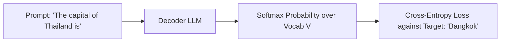
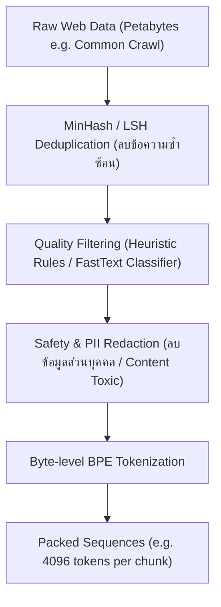
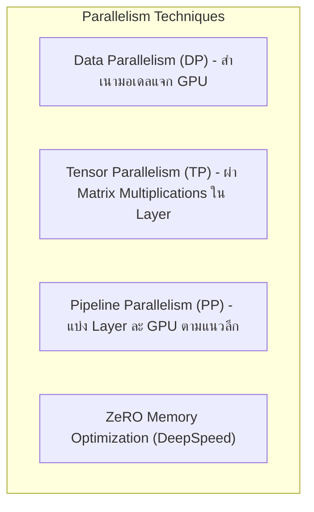

# 🏋️ 02.1 - Pre-training & Loss Functions

> [!NOTE]
> **Pre-training** คือขั้นตอนที่ใช้ทรัพยากรคำนวณสูงที่สุดในการสร้าง LLM (มากกว่า 90-95% ของงบประมาณทั้งหมด) เป็นการให้โมเดลเรียนรู้โครงสร้างภาษาและ ความรู้ทั่วไปจากข้อมูลดิบขนาดหลาย Trillion Tokens แบบ Self-Supervised Learning

---

## 🔄 1. เป้าหมายการเรียนรู้และ Loss Function (Next Token Prediction)

โมเดลภาษาแบบ Decoder-Only ใช้เป้าหมาย **Causal Language Modeling (CLM)** หรือ **Next Token Prediction**

### 1.1 Cross-Entropy Loss Formula
$$\mathcal{L}_{\text{CLM}}(\theta) = -\sum_{t=1}^{N} \log P(x_t \mid x_1, x_2, \dots, x_{t-1}; \theta)$$

โดยที่:
- $N$ คือจำนวนโทเคนทั้งหมดในลำดับ
- $P(x_t \mid x_{<t})$ คือความน่าจะเป็นที่โมเดลทายโทเคน $x_t$ ถูกต้องจาก Softmax
- เป้าหมายของการเทรนคือการปรับแต่ง พารามิเตอร์ $\theta$ เพื่อลดค่า $\mathcal{L}$ ให้ต่ำที่สุด

---

## 🧹 2. กระบวนการเตรียมคลังข้อมูล (Data Pipeline for Pre-training)

คุณภาพของข้อมูลมีความสำคัญยิ่งกว่าขนาดข้อมูล (Garbage in, Garbage out)

---

## 🌐 3. การประมวลผลขนานขนาดใหญ่ (Distributed Training Paradigms)

เนื่องจาก LLM มีขนาดใหญ่เกินกว่าจะยัดลงใน GPU เพียงตัวเดียวได้ จึงต้องใช้เทคนิคการประมวลผลขนาน (Distributed Parallelism):

### 3.1 Data Parallelism (DP)
- สำเนาน้ำหนักโมเดลไว้ในทุก GPU แต่ละ GPU ประมวลผล Batch ข้อมูลต่างกัน
- ทำการหาเฉลี่ย Gradient ผ่าน `AllReduce`
- **ข้อจำกัด**: โมเดลต้องมีขนาดเล็กพอที่จะลงใน 1 GPU ได้

### 3.2 Tensor Parallelism (TP) (Megatron-LM Style)
- ตัดแบ่งเมทริกซ์น้ำหนัก $W$ ใน Self-Attention / FFN ออกเป็นส่วนๆ ตามแนวคอลัมน์ (Column Parallel) หรือแนวแถว (Row Parallel) กระจายไปในหลาย GPU ภายใน Node เดียวกัน (อาศัย NVLink ความเร็วสูง)

### 3.3 Pipeline Parallelism (PP)
- ตัดแบ่ง Layer โมเดลตามแนวลึก (เช่น Layers 1-20 อยู่ GPU 0, Layers 21-40 อยู่ GPU 1)
- ใช้เทคนิค **Micro-batching** เพื่อลดปัญหา GPU Bubble (ช่วงเวลาที่ GPU นั่งรอข้อมูล)

### 3.4 ZeRO (Zero Redundancy Optimizer - DeepSpeed)
ช่วยลดหน่วยความจำซ้ำซ้อนใน Data Parallelism แบ่งเป็น 3 Stage:
- **ZeRO-Stage 1**: แบ่ง Optimizer States (เช่น Adam $m, v$) ข้าม GPU (ประหยัด VRAM 4x)
- **ZeRO-Stage 2**: แบ่ง Gradients ข้าม GPU (ประหยัด VRAM 8x)
- **ZeRO-Stage 3**: แบ่ง Model Parameters ข้าม GPU (สามารถเทรนโมเดลระดับแสนล้านบน GPU ทั่วไปได้)

---

## 🔗 ลิงก์เชื่อมโยงใน Obsidian Wiki
- ก่อนหน้า: [[01.5 - Positional Encoding & LayerNorm]]
- ขั้นตอนถัดไป: [[02.2 - Supervised Fine-Tuning (SFT)]]
- การสุ่มคำตอบ: [[03.1 - Decoding Strategies (Greedy, Sampling, Top-k, Top-p, Temperature)]]
