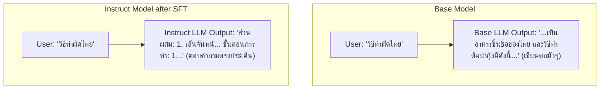
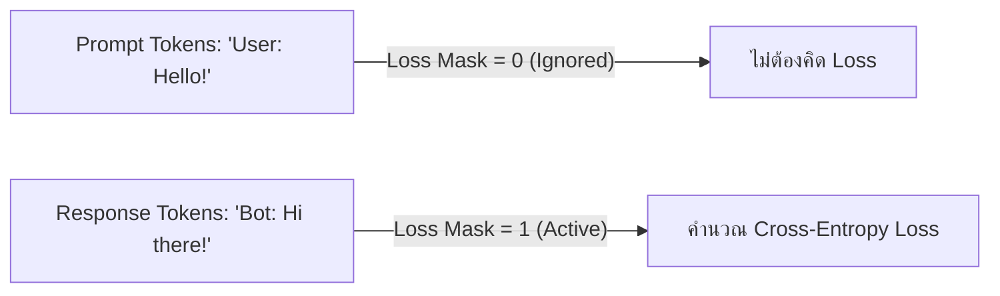

# 🎯 02.2 - Supervised Fine-Tuning (SFT)

> [!NOTE]
> หลังผ่านขั้นตอน [[02.1 - Pre-training & Loss Functions|Pre-training]] โมเดลจะกลายเป็น **Base Model** ซึ่งทำได้เพียงเติมคำให้สมบูรณ์ (Text Infill) แต่ยังไม่คุยตอบโต้เหมือนแชตบอต ขั้นตอน **Supervised Fine-Tuning (SFT)** หรือ **Instruction Tuning** คือการปรับพฤติกรรมโมเดลให้อยู่อินรูปแบบผู้ช่วยตอบคำถาม (Instruction Follower)

---

## 🔄 1. ความแตกต่างระหว่าง Base Model และ Instruct / Chat Model



---

## 📝 2. รูปแบบชุดข้อมูล Instruction Tuning (Dataset Formats)

ชุดข้อมูล SFT ประกอบด้วยคู่ **(Instruction / Prompt, Target Response)** โดยนิยมจัดฟอร์แมตตามเทมเพลตมาตรฐาน:

### 2.1 ChatML Format (OpenAI Standard)
```json
[
  {"role": "system", "content": "You are a helpful and polite AI Assistant."},
  {"role": "user", "content": "ช่วยสรุปกฎ Chinchilla Scaling Law ให้หน่อย"},
  {"role": "assistant", "content": "กฎ Chinchilla Scaling Law ระบุว่าอัตราส่วนระหว่าง..."}
]
```

### 2.2 Alpaca Template Format
```text
Below is an instruction that describes a task. Write a response that appropriately completes the request.

### Instruction:
ช่วยอธิบายวิธีคำนวณ Self-Attention Matrix

### Response:
การคำนวณ Self-Attention Matrix มีขั้นตอนดังนี้...
```

---

## 🙈 3. กลไก Loss Masking ใน SFT (Prompt Loss Masking)

หนึ่งในจุดที่นิยมออกสอบคือ **การคิด Loss เฉพาะในส่วนคำตอบของ Assistant เท่านั้น (Response Tokens)**



$$\mathcal{L}_{\text{SFT}} = -\frac{1}{\sum M_i} \sum_{i=1}^{N} M_i \cdot \log P(x_i \mid x_{<i})$$

โดยที่ $M_i = 0$ สำหรับส่วน Prompt/Instruction และ $M_i = 1$ สำหรับส่วนสัญลักษณ์คำตอบของ Assistant

> [!IMPORTANT]
> **ทำไมต้องใส่ Loss Masking?**:
> เพื่อป้องกันไม่ให้โมเดลเสียเวลาและพลังงานในการเรียนรู้การท่องจำภาษาของผู้ใช้ (User Prompts) แต่ให้มุ่งเน้นการปรับปรุงคำตอบของตัวโมเดลเอง (Assistant Responses) เท่านั้น

---

## 🔗 ลิงก์เชื่อมโยงใน Obsidian Wiki
- ก่อนหน้า: [[02.1 - Pre-training & Loss Functions]]
- ขั้นตอนถัดไป (Alignment): [[02.3 - Alignment (RLHF, DPO, PPO, GRPO)]]
- เทคนิคประหยัด VRAM: [[02.4 - Parameter-Efficient Fine-Tuning (LoRA, QLoRA, Prefix Tuning)]]
