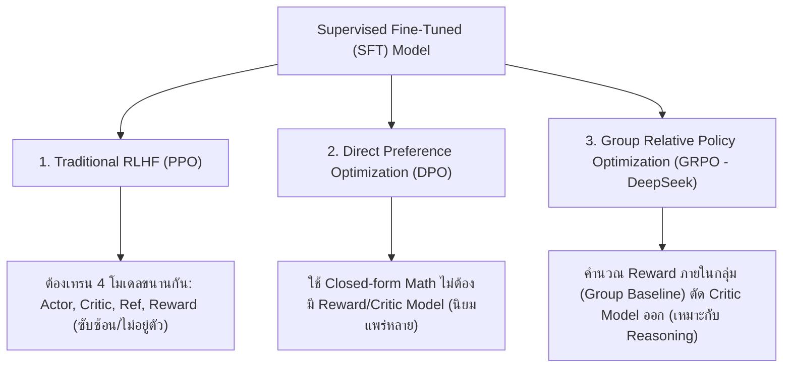
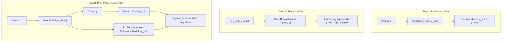
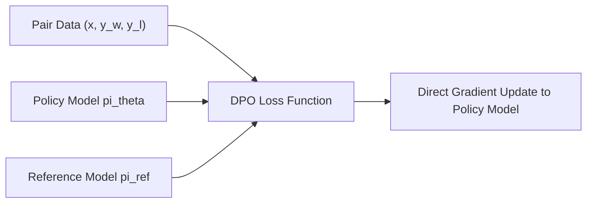
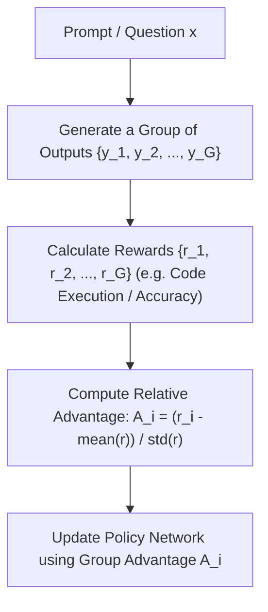

# ⚖️ 02.3 - Alignment (RLHF, DPO, PPO, GRPO)

> [!NOTE]
> แม้โมเดลจะผ่าน [[02.2 - Supervised Fine-Tuning (SFT)|SFT]] แล้ว โมเดลก็อาจยังสร้างคำตอบที่มีอคติ (Bias), เป็นอันตราย (Toxic), หรือสร้างข้อมูลเท็จ (Hallucination) ขั้นตอน **Alignment** คือการปรับแต่งพฤติกรรมโมเดลให้สอดคล้องกับหลัก **HHH (Helpful, Honest, Harmless)**

---

## 🧭 1. ภาพรวมวิวัฒนาการเทคนิค Alignment

---

## 🥇 2. Traditional RLHF with PPO (3-Step Pipeline)

กระบวนการแบบดั้งเดิมของ InstructGPT / ChatGPT (OpenAI):

### 2.1 Reward Model Loss Function
$$\mathcal{L}_{RM}(\phi) = -\mathbb{E}_{(x, y_w, y_l)} \left[ \log \sigma \left( r_\phi(x, y_w) - r_\phi(x, y_l) \right) \right]$$

### 2.2 Objective Function with KL Penalty
เพื่อป้องกันโมเดล **Reward Hacking** (โมเดลหลอกเอาคะแนน Reward สูงๆ โดยสร้างคำอักขระประหลาดๆ) จึงต้องเพิ่มข้อบังคับ **KL-Divergence Constraint** ไม่ให้เบี่ยงเบนจากโมเดลอ้างอิง ($\pi_{\text{ref}}$) มากเกินไป:

$$\text{objective}(\theta) = \mathbb{E}_{(x,y)} [ r_\phi(x,y) ] - \beta \, \mathbb{D}_{\text{KL}}\left( \pi_\theta(y \mid x) \parallel \pi_{\text{ref}}(y \mid x) \right)$$

---

## ⚡ 3. Direct Preference Optimization (DPO)

เสนอโดย Rafailov et al. (2023) พิสูจน์ทางคณิตศาสตร์ว่า **สามารถแปลงปัญหา RLHF ให้อยู่ในรูป Implicit Reward ได้โดยตรง** โดยไม่ต้องเทรน Reward Model หรือใช้ PPO อีกต่อไป!

### 3.1 DPO Loss Function (สูตรออกสอบยอดฮิต!)
$$\mathcal{L}_{\text{DPO}}(\theta; \pi_{\text{ref}}) = -\mathbb{E}_{(x, y_w, y_l)} \left[ \log \sigma \left( \beta \log \frac{\pi_\theta(y_w \mid x)}{\pi_{\text{ref}}(y_w \mid x)} - \beta \log \frac{\pi_\theta(y_l \mid x)}{\pi_{\text{ref}}(y_l \mid x)} \right) \right]$$

- **ข้อดีของ DPO**:
  1. ไม่ต้องเทรน Reward Model แยกต่างหาก
  2. ไม่ต้องใช้ Critic Network ใน PPO (ประหยัด VRAM หายไปเกินครึ่ง)
  3. กระบวนการเทรนเสถียรเหมือนการสุ่มแบบ Supervised Loss Normal (ไม่ล้มเหลวหลุด Convergence ง่ายเหมือน PPO)

---

## 🐉 4. Group Relative Policy Optimization (GRPO)

เสนอใน **DeepSeekMath** และใช้ในการสร้างโมเดลยอดฮิตอย่าง **DeepSeek-R1-Zero / DeepSeek-R1**:

- **จุดเด่นสำคัญของ GRPO**:
  - **ตัด Critic Network ออก**: แทนที่จะต้องใช้โมเดล Critic ขนาดใหญ่มาประเมิน Baseline Value แบบ PPO GRPO ใช้ **ค่าเฉลี่ยของกลุ่มคำตอบ ($G$ outputs)** เป็น Baseline แทน!
  - เหมาะอย่างยิ่งสำหรับการเทรน **Reasoning Models** ที่มี Rule-based Verifier (เช่น ตรวจคำตอบคณิตศาสตร์ หรือรัน Unit Test โค้ดคอมพิวเตอร์)

---

## 🔗 ลิงก์เชื่อมโยงใน Obsidian Wiki
- ก่อนหน้า: [[02.2 - Supervised Fine-Tuning (SFT)]]
- เทคนิค Fine-tuning ประหยัดหน่วยความจำ: [[02.4 - Parameter-Efficient Fine-Tuning (LoRA, QLoRA, Prefix Tuning)]]
- การประเมินผล: [[05.1 - Evaluation Metrics & Benchmarks (MMLU, GSM8K, BLEU, ROUGE)]]
