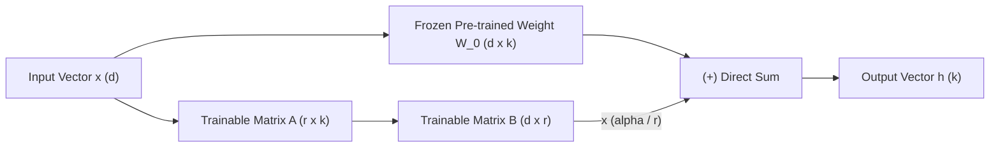
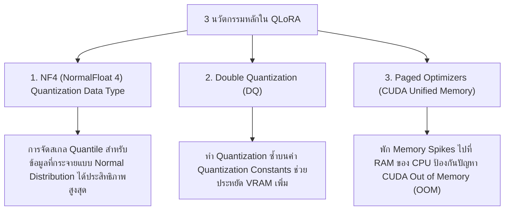

# 🧪 02.4 - Parameter-Efficient Fine-Tuning (LoRA, QLoRA, Prefix Tuning)

> [!NOTE]
> การทำ Full Fine-Tuning โมเดลขนาด 70B พารามิเตอร์ ต้องใช้หน่วยความจำ VRAM มหาศาลเกิน 1,000 GB (รวม Optimizer States และ Gradients) เทคนิค **PEFT (Parameter-Efficient Fine-Tuning)** ช่วยให้เราเทรนพารามิเตอร์เพียง **0.01% - 1%** แต่ได้ประสิทธิภาพใกล้เคียง 100%

---

## 🎨 1. Low-Rank Adaptation (LoRA)

เสนอโดย Hu et al. (Microsoft, 2021) อิงจากข้อเท็จจริงที่ว่า การเปลี่ยนแปลงของค่าน้ำหนักระหว่างการปรับแต่ง ($\Delta W$) มี **Intrinsic Rank** ที่ต่ำมาก

### 1.1 คณิตศาสตร์ของ LoRA (สูตรคำนวณออกสอบบ่อย!)
$$h = W_0 x + \Delta W x = W_0 x + \frac{\alpha}{r} (B \cdot A) x$$

โดยที่:
- $W_0 \in \mathbb{R}^{d \times k}$ คือน้ำหนักดั้งเดิม (ถูก **Freeze** ห้ามอัปเดต)
- $A \in \mathbb{R}^{r \times k}$ สุ่มค่าด้วย Gaussian Distribution
- $B \in \mathbb{R}^{d \times r}$ เริ่มต้นค่าด้วย **0 ล้วน** (ทำให้ช่วงเริ่มเทรน $\Delta W = 0$ พอดี)
- $r \ll \min(d, k)$ คือค่า Rank (เช่น $r = 8, 16, 64$)
- $\alpha$ คือ Scaling Constant (มักตั้งไว้เท่ากับ $r$ หรือ $2r$)

>[!EXAMPLE]
> **เปรียบเทียบการคำนวณจำนวนพารามิเตอร์ (ข้อสอบคำนวณ)**:
> สมมติ Layer มีมิติ $d = 4096, k = 4096$:
> - **Full Fine-Tuning**: ต้องเทรนพารามิเตอร์ $4096 \times 4096 = 16,777,216$ ตัว
> - **LoRA (เมื่อเลือก Rank $r = 8$)**:
>   - $A$: $8 \times 4096 = 32,768$ ตัว
>   - $B$: $4096 \times 8 = 32,768$ ตัว
>   - **รวม**: $32,768 + 32,768 = 65,536$ ตัว!
> 
> **สรุป**: LoRA ลดจำนวนพารามิเตอร์ที่ต้องเทรนลงถึง **256 เท่า (ลดลง 99.61%)**!

---

## 💎 2. QLoRA (Quantized LoRA)

เสนอโดย Dettmers et al. (2023) ช่วยให้สามารถ Fine-tune โมเดล 65B บน GPU ผู้บริโภคใบเดียว (เช่น RTX 3090 / 4090 24GB) ได้!

---

## 🔀 3. เปรียบเทียบเทคนิค PEFT รูปแบบต่างๆ

| เทคนิค PEFT | กลไกหลัก | ข้อดี | ข้อเสีย |
| :--- | :--- | :--- | :--- |
| **LoRA** | เพิ่ม Low-rank Matrices $A, B$ ขนานกับ Weight หลัก | **ไร้ Inference Latency** (สามารถ Merge น้ำหนักกลับเข้า $W_0$ ได้) | ต้องเลือก Layer ที่จะแปะ (นิยมแปะ Query/Value) |
| **Prefix Tuning** | เติม Continuous Virtual Vectors หน้า $K, V$ ทุก Layer | ไม่ต้องแตะน้ำหนักโมเดลหลัก | ลด Context Window ที่ใช้งานได้จริง |
| **Prompt Tuning** | เติม Virtual Tokens หน้า Input Embedding Layer เดียว | เรียบง่ายมาก | ต้องใช้โมเดลขนาดใหญ่มากๆ (10B+) ถึงจะเห็นผลดี |
| **Adapters** | แทรก Sequential Bottleneck Layer หลัง FFN/Attention | แยกส่วนโมเดลได้ชัดเจน | เพิ่ม Inference Latency (ช้าลงเพราะมี Layer เพิ่ม) |

---

## 🔗 ลิงก์เชื่อมโยงใน Obsidian Wiki
- ก่อนหน้า: [[02.3 - Alignment (RLHF, DPO, PPO, GRPO)]]
- การควอนไทซ์: [[03.2 - Quantization (GGUF, AWQ, GPTQ, INT8, INT4)]]
- กลับหน้าหลัก: [[Index]]
